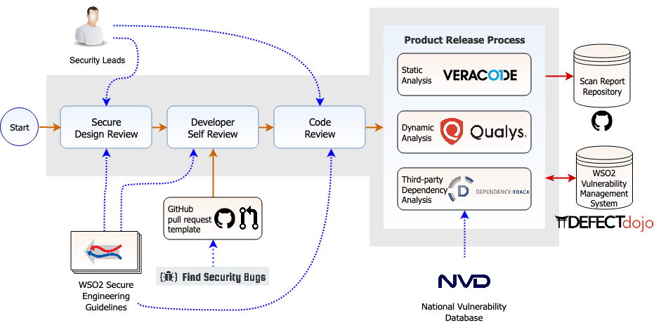
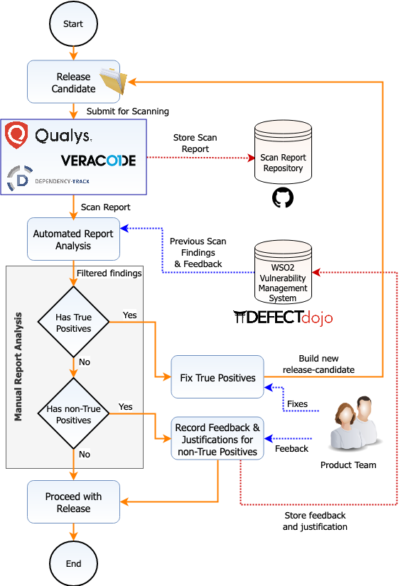

# Introduction
WSO2 Open Banking delivers comprehensive technology and strategic consultancy to help you execute standards-compliant, 
commercially successful open banking initiatives. Open Banking is a core enabler of digital transformation. Banks can 
become more agile in their internal and external functionalities such as working with external stakeholders, responding 
to consumer behaviour and their changing expectations. With Open Banking, banks can build new services to respond to 
these changes and gain a definite competitive advantage in the market. 

WSO2 Open Banking helps the banks to realize this opportunity by delivering them the required technology and the 
knowledge on how to utilize that technology to achieve goals. 

## WSO2 Open Banking Accelerator 

WSO2 Open Banking Accelerator speeds up the open banking journey for a bank. It reduces the complexity of configuring 
and implementing basic open banking features such as client registration (TPP onboarding), Strong Customer 
Authentication, and consent management.

## Standards

WSO2 Open Banking adheres to the following standards:

**GDPR**

The General Data Protection Regulation (GDPR) is a legal framework formalized in the European Union (EU) in 2016 
and comes into effect from 28, May 2018. This law is centred on user consent and gives importance to user privacy. 
GDPR effectively replaces the previously used EU Data Protection Directive (DPD). 
This is applicable to any individual living in the EU and considers the following two aspects:

  * Processing of personal data belonging to an individual living in the EU
  * Free movement of personal data belonging to an individual living in the EU within the region

**PSD2**

PSD2 is the revised Payment Service Directive legislation administered by the European Commission and mandated in 2009. 
PSD2 requires Europe’s banks to give regulated third-party providers (TPPs) access to customers’ account information 
and payment initiation with the customers’ permission and consent.

**CDR**

The Australian Government introduced the Consumer Data Right (CDR) to give consumers more control over their data. 
CDR provides customers and small businesses a choice about how they share their data with third parties and sets 
standards for a whole industry about what data should be made available safely. In doing so, CDR encourages competition 
between service providers, leading to better prices for customers and more innovative products and services.

**FAPI**

Financial-grade API (FAPI) is an industry-led specification of JSON data schemas, security and privacy protocols to 
support use cases in the financial industry and other industries that require higher security. FAPI uses OAuth 2.0 and 
OpenID Connect (OIDC) as its base and defines additional technical requirements. WSO2 Open Banking accelerates secure 
open banking with FAPI.

**ISO/IEC 27001 Information Security Management**

ISO/IEC 27001 is the internationally recognised specification for an Information Security Management System (ISMS), 
and it is one of the most popular standards for information security. WSO2 adheres to this standard and its 
best-practice approach helps us to manage the information security by addressing people, processes and technology.

## WSO2 Secure Software Development Process

Security is not an afterthought at WSO2. It's an integral part of each phase in the development life cycle. This 
ensures that the security vulnerabilities are identified and mitigated as early as possible.

[WSO2 Secure Engineering Guidelines](https://wso2.com/technical-reports/wso2-secure-engineering-guidelines) provide the 
overall security guidance during design, development, and code review phases. A group of security leads review designs 
of new features and review the code to make sure that the engineers are adhering to the guidelines set forth. 
Some security checks are further enforced when engineers commit the code to the WSO2 maintained code repositories. 

Furthermore, before a product release, there are mandatory security scans that look at the security of the release 
candidate in different perspectives. All the security findings are securely stored into a centralized system for future 
reference. 

The following topics further explain, each individual phase of this overall process, carried out in order to produce secure 
software.

## Release Process

A release candidate goes through three types of security checks to make sure that the product is in a secure state.

### Static Code Analysis

Static Code Analysis identifies possible vulnerabilities within source code, by using techniques such as [Taint Analysis 
and Data Flow Analysis](https://www.owasp.org/index.php/Static_Code_Analysis). Apart from the 
[Find Security Bugs](https://find-sec-bugs.github.io/) 
Spotbugs plugin which is used at the development phase, WSO2 uses 
[Veracode](https://www.veracode.com/products/binary-static-analysis-sast) commercial static analyzer for this purpose.

Please note that the security issues relevant to the third-party dependencies are covered separately with the 
Third Party Dependency Analysis effort. Therefore, the source code of the third-party dependencies is excluded from the 
static code analysis.

### Dynamic Analysis 

Dynamic Analysis looks for software vulnerabilities when the code is in operation mode. The analysis is performed when 
the application is running.

WSO2 uses [Qualys Web Application Scanner (Qualys WAS)](https://www.qualys.com/apps/web-app-scanning/) for dynamic 
security scanning.

### Third-Party Dependency Analysis

Security vulnerabilities identified in the third-party dependencies may affect the security of the product. 
WSO2 prevents such security impacts that could occur due to third party dependencies at a few stages.  

It is essential to make sure third party dependencies with known security vulnerabilities are not introduced newly. 
Therefore, with any "third party dependency approval request," it is essential to attach 
[OWASP Dependency-Check report](https://www.owasp.org/index.php/OWASP_Dependency_Check), 
adhering to the 
[Introducing New External Dependencies](https://wso2.com/technical-reports/wso2-secure-engineering-guidelines#A291) 
section of the "WSO2 Secure Coding Guidelines". 

New security vulnerabilities related third party dependencies may get identified and fixed in any given time. 
Therefore, it is essential to continuously monitor different sources to identify if a new vulnerability has been 
identified or fixed. 

WSO2 uses [OWASP Dependency Track](https://www.owasp.org/index.php/OWASP_Dependency_Track_Project) for this purpose 
with product versions released after Q1 2020. The [National Vulnerability Database (NVD)](https://nvd.nist.gov/vuln) 
is queried for third-party dependency issues and alerts will be generated if a new issue has been identified. It is 
required to update the dependency or add a mitigation comment explaining why the relevant 
vulnerability is not an application to the product.

### Mandatory checks during releases

To request a security scan (Veracode, Qualys or Dependency Track), product teams create a JIRA in the internal 
security JIRA project, attach the related product pack, and send an email notification to 
<security-leads-group@wso2.com>, with a reference to the corresponding JIRA. 

Even though security scans can be scheduled at any time, based on the requests from the product teams, it is mandatory 
to perform all three scan types (static scan, dynamic scan, third-party dependency scan) before a product release. 
This involves:

   * Get the version to be released scanned using the scanner. 
   * Prepare feedback report for any "false positive", "not a threat", "not applicable" or "already mitigated" 
    findings. The feedback should include:
     * Comment on why the issue is categorized as such.
     * Details about the use case of the relevant logic.
     * Details about the impact of the reported issue. 
   * Fix all "true positive" issues identified.
   * Rescan the product before the release vote, if complex changes have occurred between the initial security 
    scan and the actual release vote, preventing manual verification of security fixes.
    
If any of the aforementioned items are not complete, Platform Security Team will downvote the release, preventing the 
product from getting released.
