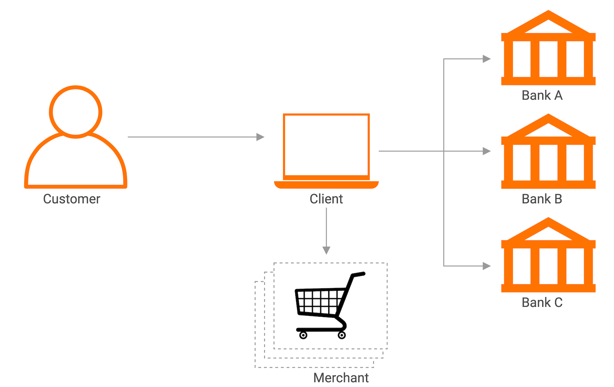
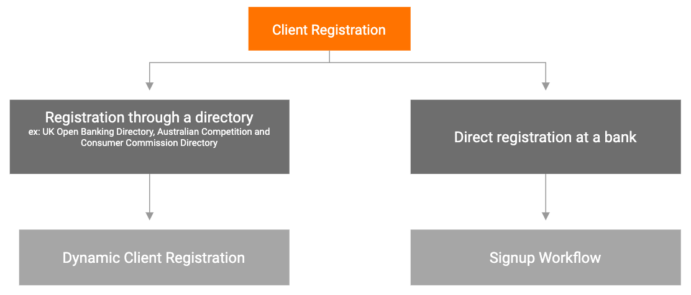

### Open banking

Open banking is a mechanism that enables financial institutions to securely, and with the consumer’s consent, expose 
data and services (e.g., account information, payment initiation) via standardized APIs to authorised third parties.
These third parties, including app developers and other financial institutions, are in turn able to build new financial 
services offerings for consumers using the data and services made available through open banking APIs.
Open banking gives consumers more control over their data, offers greater financial transparency, a more equal chance of 
success for all financial service providers, and importantly, more innovative services for customers to match their 
current requirements.
------------------------------------------------------------------------
### Open banking regulations

There are regulations enforced by different regions to meet the open banking compliance:

- Payment Service Directives by Europe Union
- Consumer Data Right by Australia
- Fintech Law by Mexico

<strong>Payment Service Directives</strong>

The Payment Services Directives provide legislatives to the open banking frameworks in Europe. 
It is administered by the European Commission (Directorate General Internal Market) to regulate payment services and 
payment service providers throughout the European Union and European Economic Area (EEA).
There are two versions of Payment Service Directives:

<strong>Payment Service Directive 1 (PSD1)</strong>

Open banking started with European Parliament passing PSD version 1 in 2007. It  focused mainly on promoting payments 
online and mobile apps.

<strong>Payment Service Directive 2 (PSD2)</strong>

PSD2 was released in 2015. It introduced the requirement for the European banks to give regulated third-party providers 
(TPPs) access to customers’ account information and payment initiation with the customers’ consent.

<strong>Consumer Data Right (CDR)</strong>
A right provided by law under the Treasury Laws Amendment (Consumer Data Right) Act 2019 to give Australians greater 
control over their data. It empowers consumers to choose to share their data with Accredited Data Recipients only for 
the purposes that they have authorised.

CDR: 
- Provides consumers and small businesses choices to decide how their data should be shared with third parties 
(Data Recipients)
- Governs the standards defined by Data61 for banking, telco, energy, and other industries about what data should be 
made available safely
- Encourages competition between Data Recipients due to the data that is made accessible via open APIs. As a result, 
Data Recipients are enabled and incentivised to provide more innovative products and services to consumers at better 
prices.

CDR will be rolled out sector-by-sector, starting with the banking sector. 

------------------------------------------------------------------------
###Other regulations

<strong>CPS 234</strong>
Cross-industry Prudential Standards (CPS) 234 is a mandatory regulation issued by the Australian Prudential Regulatory 
Authority (APRA). The APRA regulated entities and the information assets managed by them and associated third parties 
should comply with CPS 234. WSO2 Open Banking is not an APRA regulated entity, but the solution can be categorized as a 
third-party provider that provides information assets to regulated entities.
 
<strong>GDPR</strong>
The General Data Protection Regulation (GDPR) is a new legal framework formalized in the European Union (EU) in 2016 and 
comes into effect from 28, May 2018. GDPR effectively replaces the previously used EU Data Protection Directive (DPD). 
GDPR is applicable to any individual living in the EU and considers the following two aspects:
Processing of personal data belonging to an individual living in the EU
Free movement of personal data belonging to an individual living in the EU within the region.
If you are new to GDPR, we recommend that you take a look at our tutorial series on Creating a Winning GDPR Strategy.

- Part 1 - [Introduction to GDPR](https://wso2.com/library/article/2017/12/introduction-to-gdpr/)
- Part 2 - [7 Steps for GDPR Compliance](https://wso2.com/library/article/2017/12/7-steps-for-gdpr-compliance/)
- Part 3 - [Identity and Access Management to the Rescue](https://wso2.com/library/article/2018/2/identity-and-access-management-to-the-rescue/)
- Part 4 - [GDPR Compliant Consent Design](https://wso2.com/library/articles/2018/03/creating-a-winning-gdpr-strategypart-4-gdpr-compliant-consent-design/)

For more resources on GDPR, see the white papers, case studies, solution briefs, webinars, and talks published on our 
[WSO2 GDPR homepage](https://wso2.com/solutions/regulatory-compliance/gdpr/). You can also find the original GDPR legal 
text [here](http://eur-lex.europa.eu/legal-content/en/TXT/?uri=CELEX%3A32016R0679).

------------------------------------------------------------------------
###Open banking specifications
Similar to regulations introduced in different regions, there are specifications to describe the implementation 
guidelines for the open banking requirements such as TPP Onboarding/ Client Registration, Strong Customer Authentication/ 
Consumer Authentication, reporting, API analytics, consent management, and API security etc. Following are a list of 
open banking specifications that have already emerged:

- The Open Banking Implementation Entity of the UK
- The Berlin Group NextGenPSD2 XS2A standard of Europe
- The Consumer Data Standards of Australia
- API Playbook in Singapore
- Open API Framework in Hong Kong
- Open API Standards in Nigeria

------------------------------------------------------------------------
###Stakeholders in open banking 
There are four stakeholders in an open banking environment. 

- Customer
- Client
- Bank
- Merchant

<strong>Customer</strong>

An end user who makes use of a payment service in the capacity of either a payer, payee, or both.

<table>
<thead>
<tr class="header">
<th>Term used in Europe </th>
<th>Term used in Australia</th>
</tr>
</thead>
<tbody>
<tr class="odd">
<td>Payment Service User (PSU)</td>
<td>Consumer</td>
</tr>
</tbody>
</table>

<strong>Client</strong>

An entity can create third-party applications to facilitate banking services exposed via Bank APIs. A TPP can either 
play the role of a Payment Initiation Service Provider (PISP)/  Account Information Service Provider (AISP)/ 
Payment Instrument Issuing Service Provider (PIISP) or a combination of those roles.

<table>
<thead>
<tr class="header">
<th>Term used in Europe </th>
<th>Term used in Australia</th>
</tr>
</thead>
<tbody>
<tr class="odd">
<td>Third-Party Provider (TPP)</td>
<td>Data Recipient</td>
</tr>
</tbody>
</table>

A TPP can be categorised as follows according to the service they provide:

<table>
<thead>
<tr class="header">
<th>TPP Type </th>
<th>Description</th>
</tr>
</thead>
<tbody>
<tr class="odd">
<td>Account Information Service Provider (AISP)</td>
<td>Provides an online service by sharing information on payment accounts held by a payment service user with payment 
service providers.</td>
</tr>
<tr class="odd">
<td>Payment Initiation Service Provider(PISP)</td>
<td>Provides an online service to initiate a payment order at the request of the payment service user with respect to a 
payment account held at another payment service provider.</td>
</tr>
<tr class="odd">
<td>Payment Instrument Issuing Service Provider (PIISP)</td>
<td>Verifies the coverage of a given payment amount of the PSU's account. Examples of PIISPs are the banks and credit 
card issuers that are obligated to verify whether the given payment amount can be covered by the PSU's account through 
APIs.</td>
</tr>
<tr class="odd">
<td>Card-Based Payment Instrument Issuer (CBPII)</td>
<td>Issues payment instruments based on cards. Those cards can be used to initiate a payment transaction between an 
ASPSP and another PSP.</td>
</tbody>
</table>

<strong>Bank</strong>

An entity  that provides and maintains a payment account for a payer. Examples of ASPSPs are banks and credit card 
issuers. The ASPSPs are obligated to grant access to the account and transaction data on their customers’ payment 
accounts through APIs.
 
<table>
<thead>
<tr class="header">
<th>Term used in Europe </th>
<th>Term used in Australia</th>
</tr>
</thead>
<tbody>
<tr class="odd">
<td>Account Servicing Payment Service Provider (ASPSP)</td>
<td>Data Holder</td>
</tr>
</tbody>
</table>

------------------------------------------------------------------------
###Client registration 
Client Registration is the process ensuring that a client is trusted before consuming the banking APIs. This is achieved
by registering the client with a bank. The clients go through an in-depth verification during this process to make sure 
that the financial data and the applications are secured. This can be a manual or an automated process. Also known as 
TPP On boarding in European terminology.

There are two main methods for client registration:

------------------------------------------------------------------------
###Fintech
Fintech is another name for financial technology. It is often used to refer to a business that offers new and innovative 
financial services using software and modern technology. Fintechs thrive to offer various financial services like money 
transfers, payments, and lending in fast and easy ways to 
keep up with the requirements of the modern-day, tech-savvy, digitally advanced customers. Due to this reason, Fintechs 
have become quite a competitive challenge to banks that have more rigid, process-oriented structures.

------------------------------------------------------------------------
###Open Data
Data that is freely available and can be used, reused, and distributed freely by any party is known as “Open Data”. Just 
like movements such as open-source, there is no copyright, patent, or any other methods of control over open data. 
At most, the user is required to attribute and/or adhere to share-alike licensing. 

------------------------------------------------------------------------
###WSO2 Open Banking
WSO2 Open Banking is a solution made up of software and services that helps banks quickly secure regulatory compliance 
and enable extensive consumer-centric open banking business use cases.
WSO2 Open Banking comprises the API Management, Identity and Access Management, Analytics, and optional Enterprise 
Integration capabilities in a componentized architecture. The solution provides API templates, third-party provider 
onboarding or client registration, Strong Customer Authentication, consent management, agile integration to core banking 
systems, and a developer portal. In addition WSO2 Open Banking offers consultancy services on enabling banks to 
effectively use the technological capabilities of the solution to enable commercial open banking use cases.

For key concepts on Identity and Access Management domain, see [WSO2 Identity and Access Management](https://is.docs.wso2.com/en/latest/get-started/single-sign-on-and-identity-federation/) 
and for key concepts on API Management domain, see [API Management documentation](https://apim.docs.wso2.com/en/next/get-started/key-concepts/).

------------------------------------------------------------------------------------------------------------------------------------------------
###WSO2 Open Banking Accelerator
WSO2 Open Banking Accelerator speeds up the open banking journey for a bank. It reduces the complexity configuring and  
implementing the core open banking components such as TPP On boarding/ Client registration, Strong Customer 
Authentication/ Consumer Authentication, and consent management.

