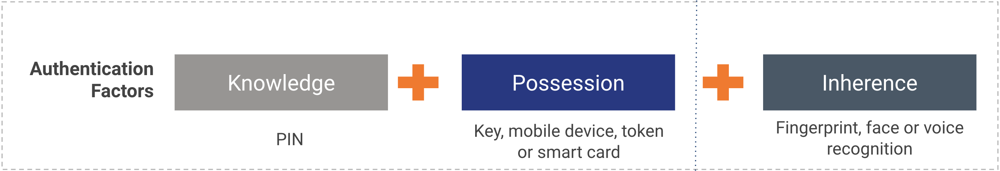
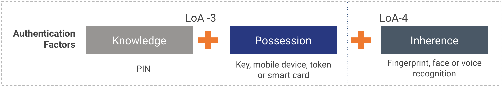
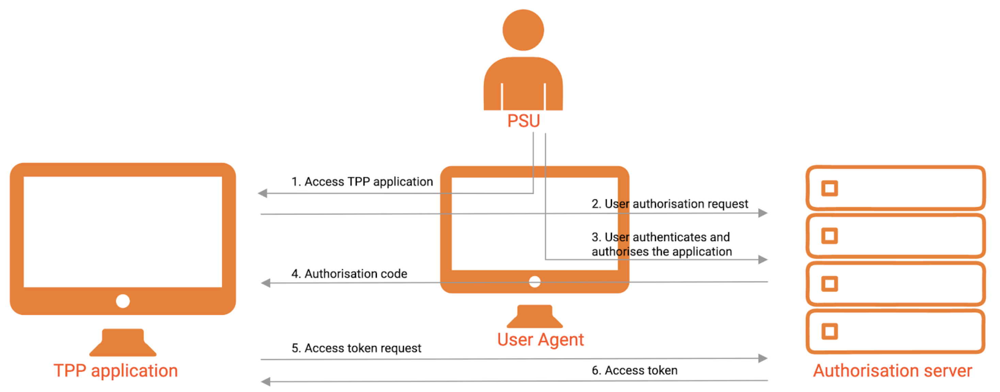
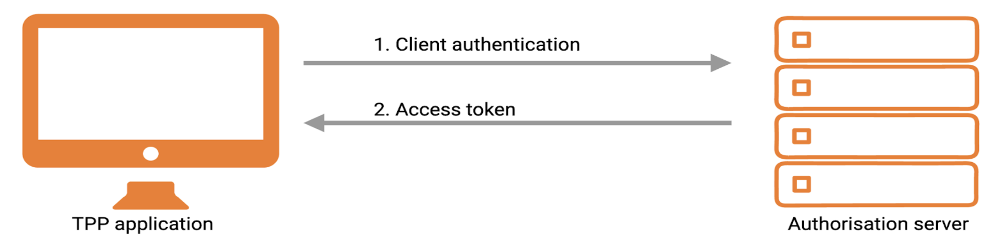

Security refers to the means through which computer systems are protected from damage and disruption without being 
compromised to risks and vulnerabilities. WSO2 Open Banking implements security at the application level and transport 
level and this page describes the application and transport layer security concepts along with their functionality.

###Application-level security
Application layer is the closest layer to the customer, which also is the most vulnerable for attacks on integrity and 
non-repudiation of data. Application-level security helps to determine the user who can access an application/its data 
and the tasks they can perform.

####Encryption
Encryption is the process of translating/encoding data/messages (plaintext) using an algorithm (cipher) into a secret 
code (ciphertext) that can only be accessed by authorised entities with a secret key or a password.

####Strong Customer Authentication (SCA)
is the process of verifying the identity of a user when initiating a payment or accessing banking information via a 
third-party application. SCA minimises fraudulent activities by preventing identity theft. According to Regulatory 
Technical Standards (RTS) of European Banking Authority, SCA requires to authenticate the user using 2 out of following 
3 authentication factors:

- Knowledge factor: This is something the user knows. For example, password, PIN, and security question.
- Ownership factor: This is something the user has. For example, ATM card, identity card, mobile phone, and security token.
- Inherence factor: This is something the user is/does. For example, biometrics.  

####Consumer Authentication
is the term used in the Australia's Consumer Data Standards (CDS). According to CDS, Consumer Authentication 
requirements are as follows:

- Requires to follow the redirect approach.
- Uses One Time Password (OTP) in Identifier -First authentication flow. 
- Does not use the existing passwords to sign in.
- Levels of Assurance (LoA) of 3 need to be established.

####Authorisation
Authorisation is the process, where an entity is granted permission to access another entity such as data, resources, 
and system. In general, authorisation takes place subsequent to authentication. WSO2 Open Banking uses role-based access 
control (RBAC) and scopes to implement authorisation:

- <strong>Role-based Access Control</strong>
is a type of access control that restricts access to authorised users based on their role.

- <strong>Scopes</strong>
enable fine-grained access control to API resources based on user roles. When a user invokes
the API, the user's OAuth2 bearer token cannot grant access to any API resource beyond its associated
scopes. 

####Access Tokens
An access token is a simple string that is passed as an HTTP header of a request. For example, 
`Authorisation: Bearer NtBQkXoKElu0H1a1fQ0DWfo6IX4a`. 

WSO2 Open Banking supports two types of access tokens for authentication:

- <strong>Application access tokens</strong>

These tokens identify and authenticate an entire application. Thus, you can invoke all the APIs associated with an 
application using a single application access token.

- <strong>User access tokens</strong>

These tokens identify the end-user of an application. For example, the end-user of a mobile application deployed on a different 
device. 

####Grant Types
Access tokens grant access to protected API resources. The level of access granted by each access token is determined 
by the method (known as grant type) used to generate the access token. There are several grant types used in WSO2 Open 
Banking:

- <strong>Authorisation Code Grant</strong>

The client initiates the flow by directing the resource owner's user-agent to the authorisation endpoint (you can use 
the /authorise endpoint for the authorisation code grant type of OAuth 2.0). It includes the client identifier, 
response_type, requested scope, and a redirection URI to which the authorisation server sends the user-agent back after 
granting access. The authorisation server authenticates the resource owner (via the user-agent) and establishes whether 
the resource owner granted or denied the client's access request. Assuming the resource owner grants access, the 
authorisation server then redirects the user-agent back to the client using the redirection URI provided earlier. 
The redirection URI includes an authorisation code. 

The client then requests an access token from the authorisation server's token endpoint by including the authorisation 
code received in the previous step. When making the request, the client authenticates with the authorisation server. It 
then includes the redirection URI used to obtain the authorisation code for verification. The authorisation server 
authenticates the client, validates the authorisation code, and ensures that the redirection URI matches the URI used to 
redirect the client from the Authorise endpoint in the previous response. If valid, the authorisation server responds 
back with an access token and, optionally, a refresh token.

Instead of requesting authorisation directly from the resource owner (resource owner's credentials), in this grant type, 
the client directs the resource owner to an authorisation server. The authorisation server works as an intermediary 
between the client and resource owner to issue an authorisation code, authenticate the resource owner and obtain 
authorisation. As this is a redirection-based flow, the client must be capable of interacting with the resource owner's 
user-agent (typically a Web browser) and receiving incoming requests (via redirection) from the authorisation server.
	
- <strong>Client Credentials Grant</strong>

Client credentials can be used when the authorisation scope is limited to the protected resources belonging to	the 
client. Client credentials are used as an authorisation grant when the client requests access to protected resources 
based on an authorisation previously arranged with the authorisation server. The client application requests an access 
token from the authorisation server, authenticating the request with its client key and client secret. If the client is 
successfully authenticated, an access token is returned. 

- <strong>Refresh Token Grant</strong>

Refresh tokens are used to get a new user access token from the authentication server in order to access a specific 
resource. The most common use case is generating a refresh token when the user access token is expired. With this grant 
type, the refresh token acts as credentials that are issued to the client by the authorisation server. Issuing a refresh 
token is optional. If the authorisation server issues a refresh token, it is included when issuing an access token. 
Refresh tokens are issued for all other grant types other than the implicit grant as recommended by the OAuth 2.0 
specification.  

------------------------------------------------------------------------
###Transport-level Security
Transport Layer Security (TLS) is a protocol used to secure communication over the internet. It authenticates only the 
server while Mutual TLS (MTLS)  authenticates both the server and the client. TLS ensures the integrity and privacy 
between two communicating applications over the internet. MTLS ensures that traffic is secured and trusted in both 
directions between a client and a server.

####Mutual-Transport-level Security
In order to utilize TLS to authenticate the client, the TLS connection between the client and the authorisation 
server must be established or re-established with mutual X.509 certificate authentication. 

MTLS is used to check if:

- The message context contains the transport certificate, which makes sure the MTLS handshake is successful at the 
gateway.
- The transport certificate bounds with both the application and user access tokens when invoking the APIs.

####Certificates
A certificate (also known as an SSL certificate or digital certificate) is an encryption tool issued by a trusted 
certification authority (CA) that encrypts data transmitted between a client and a server. Certificates are used for 
public-key encryption in Public Key Infrastructure (PKI). In WSO2 Open Banking a client must forward a certificate to the 
bank so that when the client sends an application access token request, the bank can verify the authenticity of the 
request using the shared certificate. A keystore is a repository that contains multiple certificates. 

------------------------------------------------------------------------
####Electronic Identification and Trust Services (eIDAS)
eIDAS regulation provides unique identity schemas for individuals and businesses to access the publicly available online 
services in Europe. eIDAS regulation came into effect in 2016.

Among electronic Identification (eID) solutions, PSD2 specification recommends Qualified Website Authentication 
Certificate (QWAC) and Qualified Certificates for Electronic Seals (QSealC) to secure the transport layer and 
application layer with the client.

