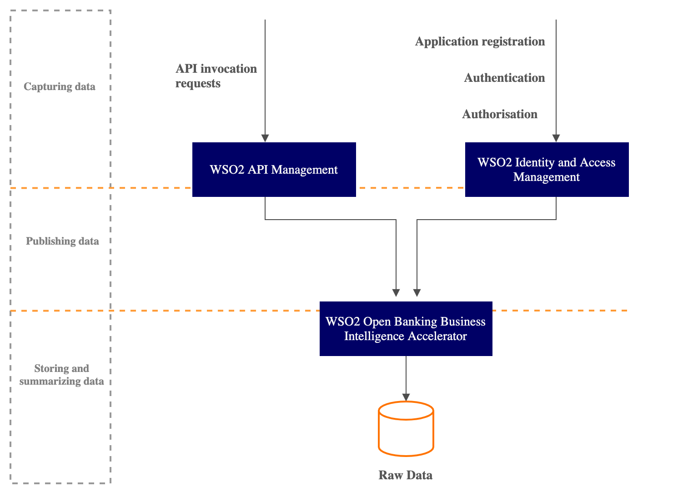

###Introduction
Data Publishing allows open banking authorities to view processed data in a published form. See the following diagram to 
understand how WSO2 Open Banking Accelerator has implemented data publishing. 

WSO2 Open Banking Business Intelligence accelerates the data publishing functions on top of the base product, WSO2 Streaming Integrator and 
captures the following types of data from WSO2 Open Banking Identity Server and WSO2 Open Banking API Management instances.

- **Performance and availability** : Understands and monitors the availability and performance of the supported APIs.
- **Adoption** :  Identifies the effectiveness of how a bank adopted open banking to their legacy systems.
- **Data** : The efficacy of the open banking standards as a part of ongoing standards management activity.

WSO2 Open Banking Identity Server and WSO2 Open Banking API Manager send the captured data to WSO2 Open Banking Business 
Intelligence. **Thrift** is the standard protocol for data publishing although WSO2 Open Banking Business Intelligence supports 
other protocols such as HTTP, gRPC, or any other data publishing protocol.

WSO2 Streaming Integrator stores the published data in a database, so that you can create a Siddhi Application to summarize 
the data. Let’s see the common data elements that WSO2 Open Banking Identity Server publishes to WSO2 Open Banking Business 
Intelligence:

| Publishable Data | Description |Example|
|---------|---------|---------|
|`timestamp : long`|The timestamp parameter of the publishing function.|`1613327314`|
|`authenticationApproach: String`|Approach used for the authentication.|`redirect`|
|`userId: String`|ID of the user|`anne@gold.com / admin@wso2.com`|
|`authenticationStatus: String`|Authentication status.|`AuthenticationSuccessful`, `AuthenticationFailed`, `AuthenticationAttempted`|
|`authenticationStep : String`|The type of authentication step as enabled in the WSO2 Identity and Access management console.|`BasicAuthenticator`,`SMSOTP`|

Following are the data elements that WSO2 API Manager publishes to WSO2 Open Banking Business Intelligence:

| Publishable Data | Description |Example|
|---------|---------|---------|
|`http_method : String`|The HTTP method to use during the endpoint invocation.|`/POST`|
|`client_user_agent : String`|Client device of the user.|`curl/7.68.0`|
|`elected_resource : String`|API endpoint.|`/account-access-consents`|
|`api_name : String`|API name of the elected resource.|`AccountAndTransactionAPI`|
|`api_spec_version : String`|Version of the API.|`v3.1`|
|`client_id : String`|Client identifier of the subject|`n0RYVfh4wOa81cze657hIw0EhEa`|
|`Consent_id : String`|Identifier for a consent initiation request.|`ffd2e946-acd0-49c9-9d45-d5983781f4b5`|
|`errors : ArrayList<OpenBankingExecutorError>`|Error data that publishes when executing a fault sequence.|`{`|
|||`Status_Code: Executing default 'fault' sequence`|
|||`Error_Code: 101505`|
|||`Error_Message: Connection closed`|
|||`}`|
|`timestamp :  long`|The timestamp parameter of the publishing function.|`1560832453`|
|`status_code : String`|Status code of the consent.|`200`|
|`messageId : String`|The status message responded to the status code.|`Ok`|
|`response_payload_size : int`|Size of the response payload.|`76`|

###Data Summarization:
You can write a summarization script for the data stored using Siddhi queries. For more information, see [Summarizing Data](https://ei.docs.wso2.com/en/latest/streaming-integrator/guides/summarizing-data/). 