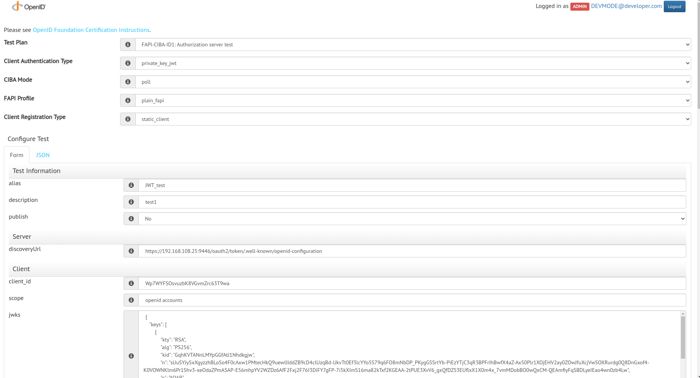
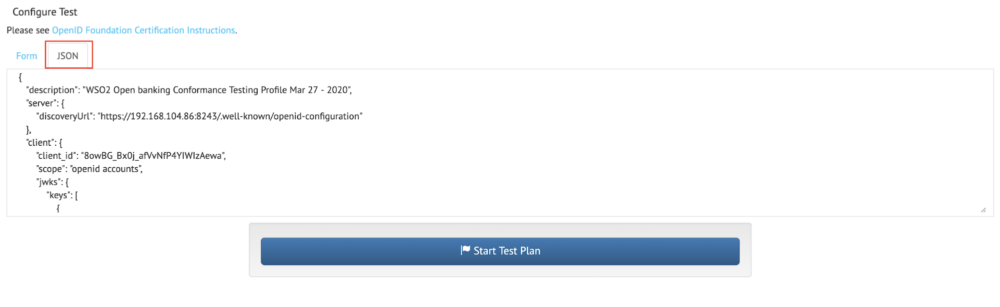
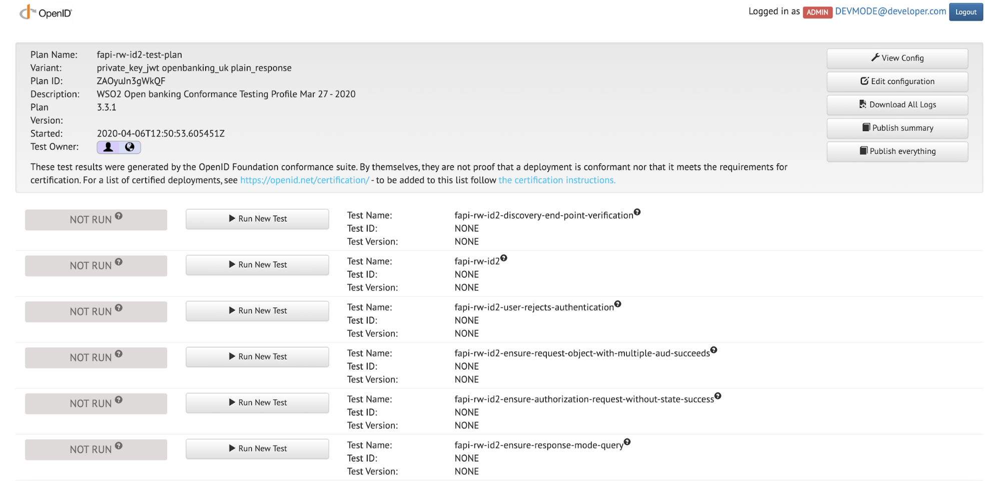

!!! note
    WSO2 Open Banking 3.0.0 supports OpenID Conformance Suite v4.1.43. 

The OpenID conformance suite consists of security standards that are defined by the OpenID Foundation (OIDF). It 
maximizes the security of the APIs, providing robust data flow in Open Banking. An advantage of using OIDF security 
standards is that the Account Servicing Payment Service Provider (ASPSP) can attest affiliated payment service 
providers through a self-certification process.

WSO2 Open Banking complies with conformance suites that can be configured by the ASPSP. The following 
configurations guide you to set up the WSO2 Open Banking Accelerator according to the **OpenID Conformance Suite : 
CIBA profile**.

## Configure certificates

To run this conformance suite, you need 2 different signing, transport certificates and corresponding 
Software Statement Assertions (SSAs).

!!! note
    Generate new keystores and exchange certificates by following the 
    [Exchanging certificates](../install-and-setup/setting-up-servers.md#exchanging-the-certificates) documentation.

## Configure Transport Layer Security (TLS) Parameters

1. Open the `<APIM_HOME>/repository/conf/deployment.toml` file.
2. Add the following configurations:

    ``` toml
    [transport.https.sslHostConfig.properties]
    ciphers="TLS_DHE_RSA_WITH_AES_128_GCM_SHA256,TLS_ECDHE_RSA_WITH_AES_128_GCM_SHA256,TLS_DHE_RSA_WITH_AES_256_GCM_SHA384,TLS_ECDHE_RSA_WITH_AES_256_GCM_SHA384"
    ```

3. Add the `PreferredCiphers` configurations under the `[transport.passthru_https.listener.parameters]` tag:

    ``` toml
    [transport.passthru_https.listener.parameters]
    PreferredCiphers = "TLS_DHE_RSA_WITH_AES_128_GCM_SHA256,TLS_ECDHE_RSA_WITH_AES_128_GCM_SHA256,TLS_DHE_RSA_WITH_AES_256_GCM_SHA384,TLS_ECDHE_RSA_WITH_AES_256_GCM_SHA384"
    ```

4. Restart the API Manager.

## Configure applications

The conformance suite has to run from the perspective of 2 clients. Therefore, two applications are required. Follow the
steps and create applications:

1. Create 2 applications using [Dynamic Client Registration](../learn/dynamic-client-registration-try-out.md) under
   the same API Consumer/Third Party Provider (TPP).

    !!! note
        For the application certificate, use the client certificates (public key) signed by the root CA/Issuer 
        CA (prior acquired or generated). For example, `tpp.com.crt`.

2. Generate production keys and take note of the consumer key and secret.

## Configure well-known endpoint 

1. Download and extract the [well-known-config-resources.zip](../assets/attachments/well-known-config-resources.zip).
2. Go to the `well-known-config-resources` directory.
3. Copy the `auth.server.info-1.0-SNAPSHOT.jar` file into the `<IS_HOME>/repository/components/lib` directory.
4. Copy the `openid-configuration.json` file into the `<IS_HOME>/repository/conf/identity` directory. 
5. Update the values in `openid-configuration.json` according to your requirement. 
6. Update the `keystore.json` file with the authorization server keys and client application keys generated for 
   [both applications](#configure-applications).
7. Copy the `keystore.json` file into the `<IS_HOME>/repository/conf/identity` directory.
8. Open the `<IS_HOME>repository/resources/conf/templates/repository/conf/tomcat/web.xml.j2` file and register the 
   following servlets. Add the following elements before the `</webapp>` tag.

    ``` xml
    <servlet>
           <servlet-name>Discovery</servlet-name>
           <servlet-class>auth.server.info.Discovery</servlet-class>
       </servlet>
     
       <servlet-mapping>
           <servlet-name>Discovery</servlet-name>
           <url-pattern>/token/.well-known/openid-configuration</url-pattern>
       </servlet-mapping>
     
       <servlet>
           <servlet-name>Keystore</servlet-name>
           <servlet-class>auth.server.info.Keystore</servlet-class>
       </servlet>
     
       <servlet-mapping>
           <servlet-name>Keystore</servlet-name>
           <url-pattern>/token/keystore</url-pattern>
       </servlet-mapping>
    ```
   
9. Restart the Identity Server and API Manager.
10. Go to the following links and see the changes:

    ``` 
    https://<IS_HOST>:9446/token/.well-known/openid-configuration
    ```
    
    ``` 
    https://<IS_HOST>:9446/token/keystore
    ```

## Set up CIBA automated approval endpoint

The conformance suite requires a custom endpoint to mock the user approval process in the CIBA flow. To achieve this, a
simple flask server can be used. 

!!! tip
    A sample implementation is available
    <a href="../../assets/attachments/automated-endpoint.zip" download>here</a>.

## Run the conformance suite

The conformance suite requires configuration in the form of a JSON document with two application details; resource and 
certificate files.

!!! tip "Before you begin:"
    [Set up the CIBA flow](../learn/ciba-set-up-flow.md)

### Configure conformance suite

This section describes how to build the conformance suite to identify the configuration and application settings.

1. Download the sample JSON configuration file available <a href="../../assets/attachments/ciba-conformance-config.json" download>here</a>.

    - The `kid` value should be the specific kid value of the corresponding signing certificate in the JWKS.
    - The `ciba_approval_endpoint` value should be the custom endpoint configured in the 
      [Set up CIBA automated approval endpoint](##set-up-ciba-automated-approval-endpoint) section.

2. Fill in the following values in the `Server` section:

    | Key | Value |
    |-----|-------|
    | discoveryURL | `https://<IS_HOST>:9446/token/.well-known/openid-configuration` |

3. Configure the resource section with the following parameters.

    | Key | Value |
    |-----|-------|
    | resourceUrl | Accounts API resource URL as displayed in the API Publisher. <br/> For example `https://192.168.8.181:8243/open-banking/v3.1/aisp/accounts/abc` |

4. Configure the `client` and `mtls` sections as follows:

    !!! note
        The `client` and `mtls` tags correspond to the first application, while `client2` and `mtls2` correspond  
        to the second application.

   1. Fill in the following parameters of `client` and `client2`:

       | Key | Value |
       |-----|-------|
       | client_id | The client ID of the application |
       | scope | `openid accounts` |
       | jwks.keys | The respective signing JWK set. This can be generated online using an online tool |
       | hint_type | `login_hint`| 
       | hint_value | `admin@wso2.com`|

   2. Fill in the following parameters of `mtls` and `mtls2`:
   
       | Key | Value |
       |-----|-------|
       | cert |	Content of the `.pem` file of the transport certificate |
       | key | Content of `.key` file of the transport certificate |
       | ca | Content of `rootCA.crt` file of the transport certificate |

### Start the suite locally

!!! info
    For more information on starting the suite locally, go to 
    [OpenID Foundation conformance-suite build and run](https://gitlab.com/openid/conformance-suite/-/wikis/Developers/Build-&-Run).

1. Clone <https://gitlab.com/openid/conformance-suite> using the command below and build the latest version.
   If you encounter a permission denied error during cloning, use HTTP cloning instead of SSH.

    ```
     git clone https://gitlab.com/openid/conformance-suite.git
    ```

2. Stop all the running docker containers and ensure a clean state. The following command shows the container status. 

    ```
    docker ps
    ```
   
3. Execute the following commands to remove any local files.

    ```
    git clean -x -f -d
    ```
    
    ``` 
    git reset --hard HEAD
    ```
   
4. Run without installing JDK and Maven.

    ```
    MAVEN_CACHE=./m2 docker-compose -f builder-compose.yml run builder
    ```
   
    !!! note "If you have a local Java development environment:"
  
        ```
        mvn clean package
        ```

5. Execute the following commands to build the docker image.

    ```
    docker-compose build
    ```
   
6. Start the docker container.

    ```
    docker-compose up
    ```
   
7. The conformance suite is now locally available at `https://localhost:8443/`.

8. When running both the WSO2 Open Banking and the conformance suite locally, use the host machine's IP for Docker.
   For example: `docker.for.mac.localhost`

### Start the suite online

!!! info
    If you're running WSO2 Open Banking in a local setup you are not able to use the online suite.

- Go to <https://www.certification.openid.net/> and start the conformance suite online.

### Run tests

1. Download the sample JSON configuration file 
   available <a href="../../assets/attachments/sample_full_tests.json" download>here</a>.
2. Update the values according to the [applications you created](#configure-applications).
3. Use an online tool and convert the private key (tpp.com.key) to a JWK. Use this JWK to update the value of the **keys** 
   array element in the JSON configuration.
4. Log in to the test suite.
5. Select the Open Banking test plan and client authentication type as follows:
    - Test plan: `FAPI-CIBA-ID1: Authorization server test`
    - Client Authentication Type `private_key_jwt` or `mtls`
    - CIBA Mode: `poll`
    - FAPI Profile: `plain_fapi`
    - Client Registration Type: `static_client`
    
6. Copy the content in the modified JSON configuration file and paste it into the **JSON** tab. 
7. Click **Start Test Plan**.
8. Run each given test in sequence. 
9. Refer to <https://openid.net/certification/instructions/> for more information.


