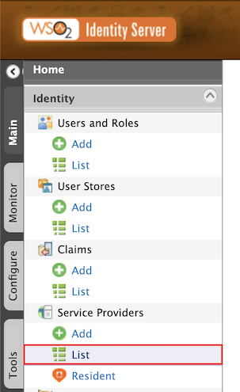
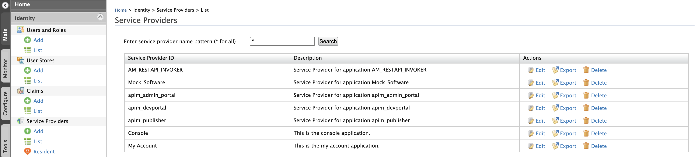
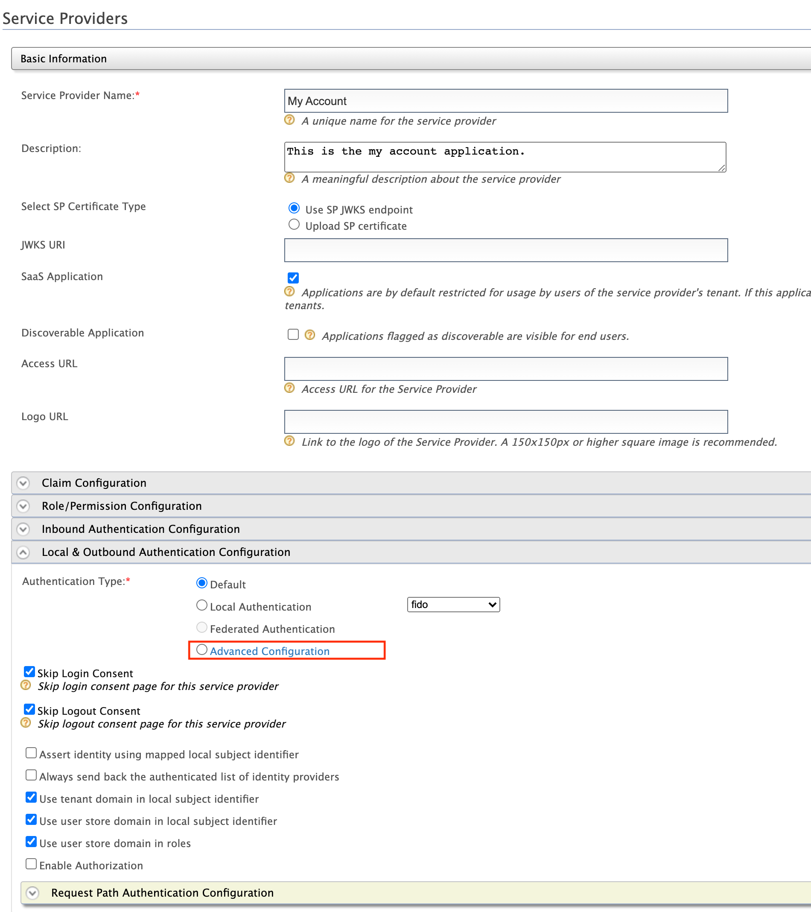

WSO2 Open Banking Intelligence captures data elements in the authentication flow for data publishing. This document explains 
how you can extend the authentication flow in order to publish the data elements according to your open banking standard 
in two methods:

1. Using a script
2. Writing a custom method

###Using a script

1. Sign in to the Management Console of WSO2 Identity Server.
2. In the **Main** tab, click **Identity** -> **Service Providers** -> **List**. 
3. Select the Service Provider from the list and click **Edit**. 
4. Select **Local & Outbound Authentication Configuration**  and click **Advanced Configuration**. 
5. Add necessary authentication steps and include a script based authentication function. See the sample function given 
below. This function publishes data on:
    - a user attempting authentication.
    - whether the authentication is successful or failed.
    ```
    var psuChannel = 'Online Banking';
    
    var onLoginRequest = function(context) {
        publishAuthData(context, "AuthenticationAttempted", {'psuChannel': psuChannel});
        executeStep(1, {
            onSuccess: function (context) {
                Log.info("Authentication Successful");
                publishAuthData(context, "AuthenticationSuccessful", {'psuChannel': psuChannel});
            },
            onFail: function (context) {
                Log.info("Authentication Failed");
                publishAuthData(context, "AuthenticationFailed", {'psuChannel': psuChannel});
            }
        });
    };
    ```
According to the sample function,
    - Data is published when authentication is attempted even if it fails.
    - `executeStep` denotes the authentication step. According to the example, it is the first authentication step.
    - `publishAuthData` is the function that publishes the data elements from the authentication flow.
  
###Writing a method
1. To implement custom data publishing, extend the following `DefaultAuthDataPublisher` class:
```java
com.wso2.openbanking.accelerator.authentication.data.publisher.extension.DefaultAuthDataPublisher
```
    - By default, `DefaultAuthDataPublisher` returns an empty map of data. To send additional data when authentication 
    happens, override the `getAdditionalData` method.
    
####getAdditionalData method
  
- The `JSAuthenticationContext` parameter contains a large amount of authentication related data. These data can be obtained by following 
    the common format below:
```java
context.getWrapped(). < getmethods >
```
- The `authenticationStatus` parameter depends on the values passed by the adaptive authentication script.
- For example,

```java
@Override
public Map < String, Object > getAdditionalData(JsAuthenticationContext context, String authenticationStatus) {

  HashMap < String, Object > newMap = new HashMap < String, Object > (); <
  Declaring necessary variables >

    if (“AuthenticationAttempted”.equals(authenticationStatus)) {

      // Retrieves some data from context object 

      // Manipulate data as necessary 
    } else {

      // Retrieves some data from context object 

      // Manipulate data as necessary 
    }
  // Append new data to HashMap < String, Object >

  return newMap;
}
```
2. Open `<IS_HOME>/repository/conf/deployment.toml` and add the classes that you extended to enable data publishing for 
the authentication flow. See the sample given below:
```toml
[open_banking.data_publishing]
auth_data_publisher = "<FQN of the extended class>"
```
3. Locate the following configuration in `<IS_HOME>/repository/conf/deployment.toml`:
```toml
[[open_banking.data_publishing.thrift.stream]]
name="AuthenticationInputStream"
```
4. Configure the additional data elements you added under the above-mentioned configuration. Set the priority for each 
element to publish data. See the sample given below: 
```toml
[[open_banking.data_publishing.thrift.stream.attributes]]
name="timestamp"
priority=6
required=true
type="long"
```

   - The property, `required` is treated as `false` if not explicitly mentioned.
   - The property, `type` is treated as `string` if not explicitly mentioned.