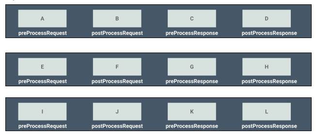

## Writing a custom Gateway Executor

The WSO2 Open Banking Accelerator contains extension points known as Open Banking Executors that can validate and 
manipulate API requests. The executors can mediate and enforce different policies based on regulatory and other 
requirements. You can use the executors to perform the following: 

- Intercept requests and responses before and after API authentication 
- Modify request/response headers and payloads
- Configure custom error messages
- Add custom attributes. For example, data reporting  

For the executors, you can configure context attributes (for example, consent ID) provided by swagger definitions. 
These context attributes are shared through a particular request/response flow. You can also define the order of 
execution by the flow. 

To build your own executor, implement the following interface:

``` java
com.wso2.finance.openbanking.accelerator.gateway.executor.core.OpenBankingGatewayExecutor
```

!!! note
    The `com.wso2.finance.openbanking.accelerator.gateway-3.0.0.jar` JAR file inside the 
    `<IS_HOME>/repository/components/dropins` directory contains all the Java implementations related to gateway 
    executors.
    
Implement the interface methods according to your requirements:

### preProcessRequest method

This method handles the requests before API Authentication.

``` java
public void preProcessRequest(OBAPIRequestContext obapiRequestContext);
```

### postProcessRequest method

This method handles the requests after API Authentication.

``` java
public void postProcessRequest(OBAPIRequestContext obapiRequestContext);
```

### preProcessResponse method

This method handles the responses before API Authentication.

``` java
public void preProcessResponse(OBAPIResponseContext obapiResponseContext);
```

###postProcessResponse method

This method handles the responses after API Authentication.

``` java
public void postProcessResponse(OBAPIResponseContext obapiResponseContext);
```

Use the above methods and the context attributes to implement the necessary logics. However, you can ignore 
implementing any method and not return anything. Once implemented, build a JAR file for the project. 

##Configuring a custom executor

1. Place the above-created JAR file in the `<APIM_HOME>/repository/components/lib` directory. 

    !!! note
        If it’s an OSGI JAR file, place it in the `<APIM_HOME>/repository/components/lib` directory.

2. Open the `<APIM_HOME>/repository/conf/deployment.toml` file.

    1. Find the `open_banking.gateway.openbanking_gateway_executors.type` tags and add/modify them according to the 
       type of your consent. For example, `Payments`.
    2. Add the Fully Qualified Name (FQN) of the executor under the 
    `open_banking.gateway.openbanking_gateway_executors.type.executors` tag as shown below:
    
    ``` xml
    [[open_banking.gateway.openbanking_gateway_executors.type]]
    name = "Payments"
   
    [[open_banking.gateway.openbanking_gateway_executors.type.executors]]
    name = "com.wso2.finance.openbanking.accelerator.gateway.executor.impl.api.resource.access.validation.APIResourceAccessValidationExecutor"
    priority = 1
   
    [[open_banking.gateway.openbanking_gateway_executors.type.executors]]
    name = "com.wso2.finance.openbanking.accelerator.gateway.executor.impl.consent.ConsentEnforcementExecutor"
    priority = 2
   
    [[open_banking.gateway.openbanking_gateway_executors.type.executors]]
    name = "com.wso2.finance.openbanking.accelerator.gateway.executor.impl.error.handler.OBDefaultErrorHandler"
    priority = 1000
    ```

    ??? tip "Click here to see the order of execution..."
        
        - If only one set of executors are configured for an API flow, the order of execution is as follows:
         
        - If there is more than one set of executors for an API flow, given below is the order they get executed: 
          For example, if there are 3 sets:
          
        - The order is: A -> E -> I -> B-> F -> J -> C -> G -> K -> D -> H -> L
    
    !!! note
    
        - The default Request Router only reads the `Default` tag in `<APIM_HOME>/repository/conf/deployment.toml`. 
        
        - If you haven’t already configured a custom Request Router make sure to configure it. 
            1. Open the `<APIM_HOME>/repository/conf/deployment.toml` file.
            2. Follow the given sample configurations and configure your router. 
               ``` xml
               [[open_banking.gateway.openbanking_gateway_executors.type]]
               name = "Accounts"
               [[open_banking.gateway.openbanking_gateway_executors.type.executors]]
               name = "com.wso2.finance.openbanking.accelerator.gateway.executor.impl.api.resource.access.validation.APIResourceAccessValidationExecutor"
               priority = 1
               [[open_banking.gateway.openbanking_gateway_executors.type.executors]]
               name = "com.wso2.finance.openbanking.accelerator.gateway.executor.dcr.DCRExecutor"
               priority = 2
               [[open_banking.gateway.openbanking_gateway_executors.type.executors]]
               name = "com.wso2.finance.openbanking.accelerator.gateway.executor.impl.error.handler.OBDefaultErrorHandler"
               priority = 1000
               ```
           
        - For more information, see [Configuring a custom Request Router](custom-request-router.md) 
        
3. Save the above configurations and restart the API Manager server. 

4. Publish and invoke an API of your choice to ensure that the customer executor is running.

    !!! tip 
        Enable logs for that particular executor class to inspect if the executor is running successfully. 