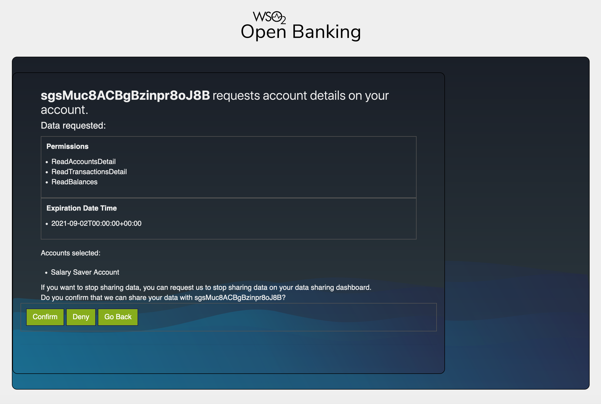
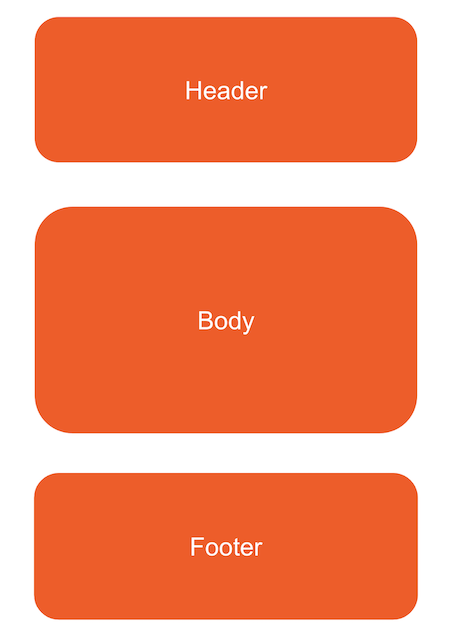

During the [consent authorization process](../learn/consent-authorization-intro.md), an API consumer requests the banking 
information that the API consumer application needs to access. Then, the bank redirects the bank user to a webpage where 
it displays the banking information that the API consumer application needs to access. This is known as the **consent page**. 
WSO2 Open Banking Accelerator contains a default consent page, which can be customized to display consent details according 
to your requirements. The following topics explain the page structure and extension points where you can customize.

##Customize the theme of the consent page
The consent page displays the banking information that the API consumer application needs to access. 
Below is the consent page designed for the sample Account Information Service API available in WSO2 Open Banking Accelerator:


If the bank wishes to customize the theme of the existing consent page, they can modify the files in the following 
directories: 

| Requirement | Path to the relevant file |
|---------|---------    |
|Change the style sheet|`<IS_HOME>/repository/deployment/server/webapps/ob#authenticationendpoint/css`|
|Change the images|`<IS_HOME>/repository/deployment/server/webapps/ob#authenticationendpoint/images`|
|Change the existing JavaScript files|`<IS_HOME>/repository/deployment/server/webapps/ob#authenticationendpoint/js`|
|Change the default font|`<IS_HOME>/repository/deployment/server/webapps/ob#authenticationendpoint/fonts`|

##Customize the layout of the consent page
The consent page works with two main Servlets. 

- `OBConsentServlet` retrieves the consent data from the consent service and shows the account selection details. 
- `OBConsentConfirmServlet` shows the permission details and writes to the consent service if the user approves the consent. 

An extension is provided for you to implement the JSP implementations of these servlets. Give below are the 
methods that can be extended:

Implement the methods from the following class:
```java
com.wso2.openbanking.accelerator.consent.extensions.authservlet.model.OBAuthServletInterface
```

Given below are the methods that can be extended:

###updateRequestAttribute method 
This method returns the data that needs to be accessed in the JSP of `OBConsentServlet` as a map. You can retrieve data 
from the request, consent service response, and `resourceBundle` to create the map. Given below is the method signature:
```java
Map < String, Object > updateRequestAttribute(HttpServletRequest request,
  JSONObject dataSet, ResourceBundle resourceBundle);
```

###updateSessionAttribute method
This method returns the data that needs to be accessed in the session of the JSP of `OBConsentServlet` as a map. You can 
retrieve data from the request, consent service response, and `resourceBundle` to create the map. Given below is the method 
signature:
```java
Map < String, Object > updateSessionAttribute(HttpServletRequest request,
  JSONObject dataSet, ResourceBundle resourceBundle);
```

###updateConsentData method
This method returns the data that needs to be persisted as a part of the consent implementation. You can retrieve data 
from the request. Given below is the method signature:
```java
 Map<String, Object> updateConsentData(HttpServletRequest request);
```

###updateConsentMetaData method 
This method returns the data that needs to be persisted. You can retrieve data from the request. Given below is the method 
signature:
```java
Map<String, String> updateConsentMetaData(HttpServletRequest request);
```

###getJSPPath method
This method returns the JSP that you want to show while `OBConsentServlet` is invoked. This is the JSP responsible for 
showing consent data to the bank customers. The information you want to pass from `updateRequestAttribute` will be eventually 
shown in this custom JSP you have implemented. 

The authentication endpoint in WSO2 Open Banking Accelerator allows the bank to customize the layout of the consent page. 
The consent page is designed in a servlet that consists of three main JSP pages as shown in the diagram below: 



You can also make changes to the relevant JSP pages and customize according to the open banking requirement. To customize 
the layout of the authentication endpoint, locate the JSP pages in the following locations:

| Requirement | Path to the relevant file |
|---------|---------    |
|Header|`<IS_HOME>/repository/deployment/server/webapps/ob#authenticationendpoint/includes/consent_top.jsp`|
|Body| Varies according to your implementation.|
|Footer|`<IS_HOME>/repository/deployment/server/webapps/ob#authenticationendpoint/includes/consent_bottom.jsp`|

## Configuration               
If you want to add a custom implementation for `OBAuthServletInterface`, you can configure it as follows:

1. Open the `<IS_HOME>/repository/conf/deployment.toml` file.
2. Follow the given sample and configure your custom `OBAuthServletInterface` implementation.

   ``` toml
   [open_banking.identity.authentication_webapp]
   servlet_extension = "com.wso2.openbanking.accelerator.consent.extensions.authservlet.impl.OBDefaultAuthServletImpl"
   ```
