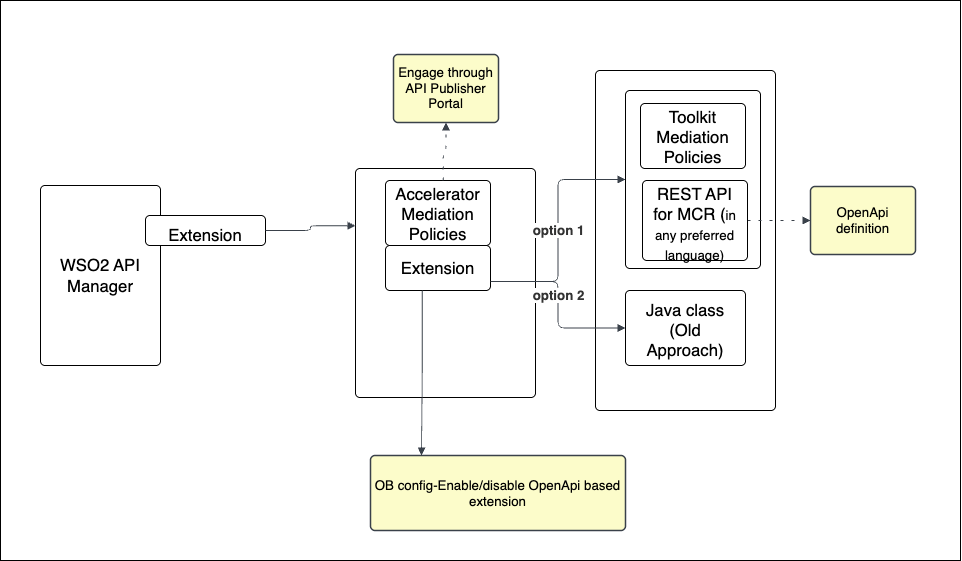

The WSO2 Financial Services AM COmponent supports two approaches for extending and implementing its functionalities, as illustrated in the image below.

 

## API Policies

With the release of Open Banking 4.0, Open Banking-specific API Manager runtime enforcements have been transitioned to standard WSO2 API Manager mediation policies, enabling API developers to configure them directly through the API Publisher GUI.

- [Creata an API Policy](../learn/create-policies.md)
- [Engage an API Policy to API](../learn/engage-policies.md)
- [Inbuilt Gateway Enforcements](../learn/inbuilt-policies.md)

### OpenAPI based extensions

With the release of Open Banking 4.0, it has introduced OpenAPI based extensions such that the toolkit developer can 
implement Open Banking specification requirements in their preferred programming language. And the custom developed 
extensions can be deployed externally and tested seperatly without restarting the WSO2 servers.The OpenAPI extension 
can be found from [here](../references/accelerator-extensions-api.md).

  - [Developer Guide](openapi-extensions-developer-guide-am.md)
  - [OpenAPI based extensions for Manual Client Registration](openapi-extensions-mcr.md)

## Java based extensions (Old approach)

- [Open Banking Gateway](open-banking-gateway.md)
- [Open Banking Event Executor](custom-event-executor.md)
- [Data Publishing](authentication-flow-for-data-publishing.md)

