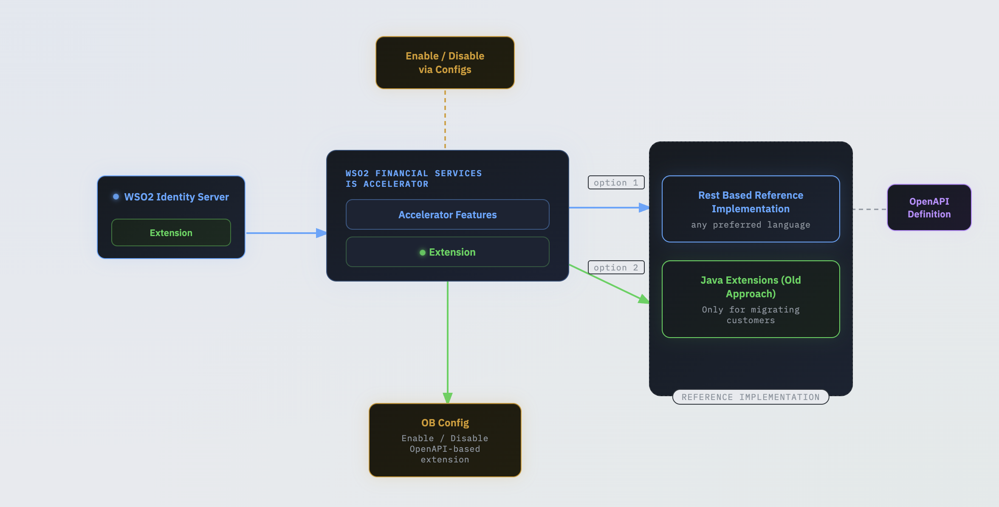

The WSO2 Financial Services IS Accelerator supports two approaches for extending and implementing its functionalities, as illustrated in the image below.

 

### OpenAPI based extensions

With the release of Open Banking 4.0, it has introduced OpenAPI based extensions such that the toolkit developer can 
implement Open Banking specification requirements in their preferred programming language. And the custom developed 
extensions can be deployed externally and tested separately without restarting the WSO2 servers. The OpenAPI extension 
can be found from [here](../references/accelerator-extensions-api.md).

  - [Developer Guide](openapi/openapi-extensions-developer-guide.md)
  - [OpenAPI based extensions for Dynamic Client Registration](openapi/openapi-extensions-dcr.md)
  - [OpenAPI based extensions for Consent Management](openapi/openapi-consent-management-manage.md)
  - [OpenAPI based extensions for Token Flow](openapi/openapi-token-flow.md)
  - [OpenAPI based extensions for Authorization Flow](openapi/openapi-authorization-flow.md)

### Java based extensions (Old approach)

   - [Open Banking Service Activator](java/service-activator.md)
   - [Consent Management](java/consent-management-manage.md)
   - [Token Flow Customization](java/jwt-access-tokens.md)
   - [Authentication Flow](java/customize-authentication-steps.md)
   - [Authorization Flow](java/keyid-provider.md)
   - [Mobile Application for CIBA](java/mobile-application-for-ciba.md)
   - [Application Property Validation](java/application-property-validation.md)
   - [Dynamic Client Registration](java/application-management-listener.md)
   - [Event Notification](java/custom-event-notification.md)
  

