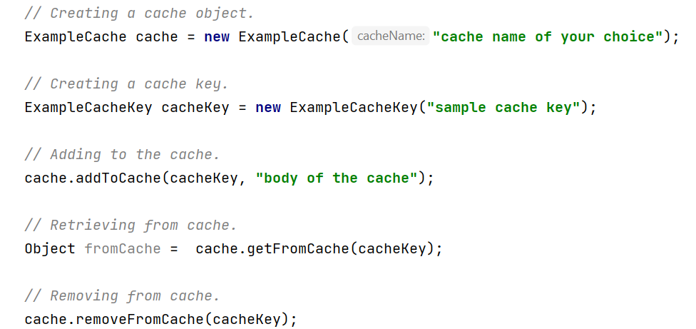

## Writing a custom Open Banking Distributed Cache Key

WSO2 Open Banking Distributed Cache is a caching service that creates a clustered cache among one or more WSO2 API 
Manager or Identity Server instances. The Open Banking Distributed Cache Key contains an extension. 
According to your requirements, you can extend and override the methods in the `OpenBankingDistributedCacheKey` class 
to implement a distributed cache according to your open banking requirements.

To achieve the above, extend the following class.
``` java
com.wso2.openbanking.accelerator.common.distributed.caching.OpenBankingDistributedCacheKey
```

To extend the capabilities according to your requirements, override relevant methods of this class.
Given below is a brief description of each method.

### OpenBankingDistributedCacheKey method
This method is the public constructor for this class.

``` java
public OpenBankingDistributedCacheKey(String cacheKey) {
    setCacheKey(cacheKey);
}
```

### Retrieve OpenBankingDistributedCacheKey method

This method lets you retrieve an instance of an `OpenBankingDistributedCacheKey`.

``` java
public static OpenBankingDistributedCacheKey of(String cacheKey) {
    return new OpenBankingDistributedCacheKey(cacheKey);
}
```

### setCacheKey method

This method lets you assign a value to (setter) the cache key string.


``` java
public void setCacheKey(String cacheKey) {
    this.cacheKey = cacheKey;
}
```

### getCacheKey method

This method lets you retrieve (getter) the cache key string.

``` java
public String getCacheKey() {
    return this.cacheKey;
}
```

### equals method

This method checks if the passed object is an `OpenBankingDistributedCacheKey` object. 
Given below is the method signature:

``` java
public boolean equals(Object o) {
}
```
### hashCode method

This method returns the hashcode value for the `OpenBankingDistributedCacheKey` object.

``` java
public int hashCode() {
    return Objects.hash(getCacheKey());
}
```

## Writing a custom Open Banking Distributed Cache

In order to create a custom distribute cache, you need to extend the `OpenBankingDistributedCache` class as well.
The Fully Qualified Name (FQN) of this class is as follows:

``` java
com.wso2.openbanking.accelerator.common.distributed.caching.OpenBankingDistributedCache
```

To extend the capabilities according to your requirements, override relevant methods of this class.
Given below is a brief description of each method.

### OpenBankingDistributedCache method

This method lets you initialize a unique name for the cache.

``` java
public OpenBankingDistributedCache(String cacheName) {
}
```

### getFromCache method

This method lets you retrieve a cache based on the cache key.

``` java
public V getFromCache(K key) {
}
```

### addToCache method

This method lets you add an object to the cache in key-value format. Use the `key` parameter to set the cache key
and the `value` parameter to set the object that needs to be cached.

``` java
public void addToCache(K key, V value) {
}
```

### removeFromCache method

This method lets you remove a cache based on the cache key.

``` java
public void removeFromCache(K key) {
}
```

### isEmpty method

This method lets you check whether the cache is empty. If the cache is empty, the return value is `true`, otherwise,
the boolean value `false` is returned.

``` java
public boolean isEmpty() {
}
```

### getCacheTimeToLiveMinutes method

This method lets you retrieve the cache expiry time in minutes upon modification.

``` java
public abstract int getCacheTimeToLiveMinutes();
```

## Creating cache

 1. Extend the `OpenBankingDistributedCache` class.
 2. Generify the extended `OpenBankingDistributedCache` class with the previously
    created `OpenBankingDistributedCacheKey` class and preferred object for the cache value.
 3. Implement abstract methods from the super class.
 4. Create a constructor with the super constructor.
 5. Create the `int cacheTimeToLiveMinutes` variable.
 6. Override the getter method and create a setter method. Initialize the `cacheTimeToLive`  in the constructor.
 
## Using custom cache

1. Creating a cache object 
    - A cache object can be created using the cache class created above. 
    - The cache name has to be passed as a String parameter to the constructor.
2. Creating a cache key object
    - A cache key object can be created using the cache key class above.
    - The value of the cache key has passed as a String parameter to the constructor.
3. Adding to cache
    - Use the `addToCache` method to add a cache entry.
    - Pass the cache key and the value to be cached as parameters.
4. Retrieving from cache
    - Use the `getFromCache` method to retrieve a cache entry.
    - Pass the cache key as a parameter.
5. Removing a cache
    - Use the `removeFromCache` method to remove a cache.
    - Pass the cache key as a parameter.

Given below is a sample usage of the cache:



## Configuring a custom Open Banking Distributed Cache Key

1. Once implemented, build JAR files for your projects.
2. Place the above-created JAR files in the relevant `lib` directory of the base product:
     - `<APIM_HOME>/repository/components/lib`
     - `<IS_HOME>/repository/components/lib`
3. Configure the `deployment.toml` file of the instance based on your caching requirements.
   For more information, see [Distributed Cache Configurations](../learn/distributed-caching.md#wso2-open-banking-distributed-cache).
