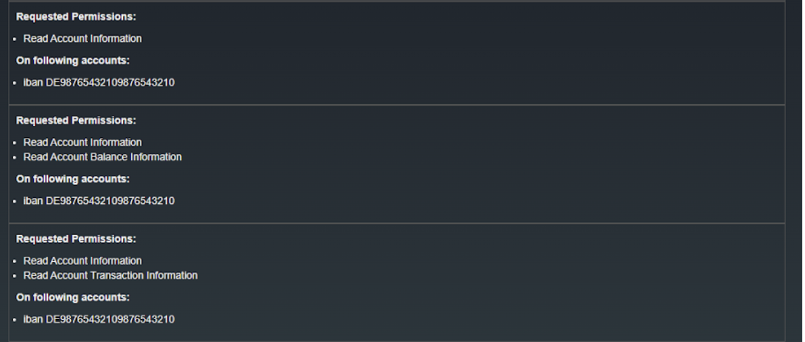
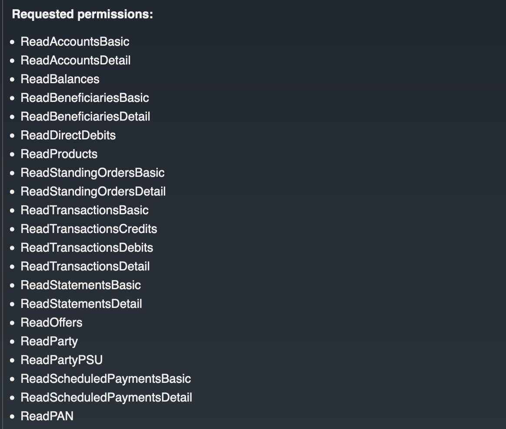
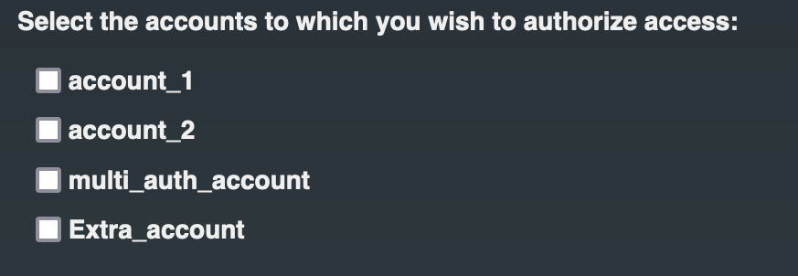
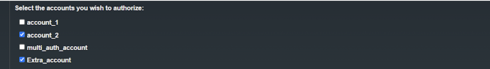

During the [consent authorization process](../learn/consent-authorization-intro.md), an API consumer requests the banking information that the API consumer application needs to access. Then, the bank redirects the bank user to a webpage where it displays the banking information that the API consumer application needs to access. This is known as the **Consent Grant Page**. WSO2 Open Banking Accelerator contains a default consent page, which can be customized to display consent details according to your requirements. The following topics explain the page structure and extension points where you can customize the consent page furthermore.

## Customizing the layout of the consent grant screen

The [Populate Consent Authorization Screen extension](../develop/openapi-consent-management-authorize.md) provides the flexibility to customize the consent grant screen in alignment with the UX guidelines defined by Open Banking specifications. Based on the response payload returned by this extension, the Accelerator dynamically adjusts the layout of the consent grant screen. This section explains the different consent screen layouts that correspond to various response configurations.

??? tip "Click here to see the response of the Populate Consent Authorization Screen extension."
    ```
    {
        "data": {
            "consentData": {
                "type": "accounts",
                "basicConsentData": {
                    "Expiration Date Time": ["2025-06-02T12:14:23.061411600+05:30"],
                    "Debtor Account": [
                        "Scheme Name : UK.OBIE.IBAN",
                        "Identification : 1234",
                        "Name : Account1",
                        "Secondary Identification : Account1"
                    ]
                },
                "permissions": [
                    {
                        "uid": "694cc9e8-49ad-45e8-953e-1c0bac16a4e3",
                        "displayValues" : [ "Read Account Information" ],
                        "initiatedAccounts" : [ 
                            {
                                "accountId" : "DE98765432109876543210",
                                "displayName" : "iban DE98765432109876543210",
                                "refType" : "iban"
                            } 
                        ]
                    }, 
                    {
                        "uid": "d0e93e29-9fb9-4585-aa18-e682453a28b7",
                        "displayValues" : [ "Read Account Information", "Read Account Balance Information" ],
                        "initiatedAccounts" : [ 
                            {
                                "accountId" : "9876-543-210",
                                "displayName" : "SavingsAccount",
                                "refType" : "iban"
                            } 
                        ]
                    }, 
                    {
                        "uid": "af8f5f53-fc3d-4611-a7d1-d0e356fdcada",
                        "displayValues" : [ "Read Account Information", "Read Account Transaction Information" ],
                        "initiatedAccounts" : [ 
                            {
                                "accountId" : "7654-321-098",
                                "displayName" : "MultiCurrencyAccount",
                                "refType" : "iban"
                            } 
                        ]
                    }
                ],
                "initiatedAccountsForConsent": [
                    {
                        "displayName": "SavingsAccount",
                        "accountId": "1234-567-987"
                    }
                ],
                "allowMultipleAccounts": true,
                "isReauthorization": true,
                "consentMetadata" : {}
            },
            "consumerData": {
                "accounts": [
                    {
                        "displayName": "CurrentAccount",
                        "accountId": "1234-567-987",
                        "selected": false
                    },
                    {
                        "displayName": "SavingsAccount",
                        "accountId": "6870-172-890",
                        "selected": false
                    }
                ]
            }
        },
        "status": "SUCCESS",
        "responseId": "request-uuid"
    }   
    ```

The response of the Populate Consent Authorization Screen extension consists of two main objects:

1. Consent Data
2. Consumer Data

### Consent Data

`consentData` encompasses all consent related data derived from the consent initiation request that needs to be sent for populating the consent authorization page. This includes:

- Consent type
- Basic consent details
- Requested permissions
- Accounts linked to each requested permission
- Accounts linked to the complete requested consent
- Whether multiple account selection is allowed
- Whether this is a re-authorization of a previously authorized consent
- Additional metadata for the consent persistence step (not shown on the page)

The table below describes the data elements included in the `consentData` object.

#### Consent Type

`type` refers to the type of the consent being authorized (e.g., accounts, confirmation of funds, payments).

#### Basic Consent Details

`basicConsentData` includes separate lists of consent-related information to display on the consent page. These details will be displayed in the following format:


??? tip "Click here to see the payload structure for the above format."
    ```
    "basicConsentData": {
        "Expiration Date Time": ["2025-06-02T12:14:23.061411600+05:30"],
        "Debtor Account": [
            "Scheme Name : UK.OBIE.IBAN",
            "Identification : 1234",
            "Name : Account1",
            "Secondary Identification : Account1"
        ]
    }
    ```

#### Requested Permissions

`permissions` object includes permissions to be displayed in the consent grant page. Each permission can have `initiatedAccounts`, a list of accounts to which each of the permissions are requested at consent initiation.

If the `permissions` object contains `initiatedAccounts`, the `RequestedPermission` section would look like below:



??? tip "Click here to see the payload structure for the above format."
    ```
    "permissions" : [ 
        {
            "uid": "694cc9e8-49ad-45e8-953e-1c0bac16a4e3",
            "displayValues" : [ "Read Account Information" ],
            "initiatedAccounts" : [ 
                {
                    "accountId" : "DE98765432109876543210",
                    "displayName" : "iban DE98765432109876543210",
                    "refType" : "iban"
                } 
            ]
        }, 
        {
            "uid": "d0e93e29-9fb9-4585-aa18-e682453a28b7",
            "displayValues" : [ "Read Account Information", "Read Account Balance Information" ],
            "initiatedAccounts" : [ 
                {
                    "accountId" : "DE98765432109876543210",
                    "displayName" : "iban DE98765432109876543210",
                    "refType" : "iban"
                } 
            ]
        }, 
        {
            "uid": "af8f5f53-fc3d-4611-a7d1-d0e356fdcada",
            "displayValues" : [ "Read Account Information", "Read Account Transaction Information" ],
            "initiatedAccounts" : [ 
                {
                    "accountId" : "DE98765432109876543210",
                    "displayName" : "iban DE98765432109876543210",
                    "refType" : "iban"
                } 
            ]
        } 
    ]
    ```

If the `permissions` object does not contain `initiatedAccounts`, the `RequestedPermission` section would look like this:



??? tip "Click here to see the payload structure for the above format."
    ```
    "permissions" : [ 
        {
            "uid": "694cc9e8-49ad-45e8-953e-1c0bac16a4e3",
            "displayValues" : [ "Read Account Information" ],
            "initiatedAccounts" : []
        }, 
        {
            "uid": "d0e93e29-9fb9-4585-aa18-e682453a28b7",
            "displayValues" : [ "Read Account Information", "Read Account Balance Information" ],
            "initiatedAccounts" : []
        }, 
        {
            "uid": "af8f5f53-fc3d-4611-a7d1-d0e356fdcada",
            "displayValues" : [ "Read Account Information", "Read Account Transaction Information" ],
            "initiatedAccounts" : []
        } 
    ]
    ```

!!! note
    - If a permission has no `initiatedAccounts` and the consent has no `initiatedAccountsForConsent`, a selectable list of consumer accounts are displayed under that permission. If no consumer accounts are added to the payload either, an error would be displayed in place.
    - All account objects (in `initiatedAccounts`, `initiatedAccountsForConsent`, and `consumer accounts`) support additional properties (in addition to the only required property `displayName`) that would not be displayed or pushed to the consent grant page. But any additional property added to this response will be returned to the `persist-authorized-consent` endpoint.

#### Initiated Accounts for Consent

`initiatedAccountsForConsent` are accounts linked to the entire consent. If permissions are specified, these accounts are shown under each permission. If no permissions are specified, they are shown for the entire consent. Initiated accounts for consent will be displayed in the following format: 


!!! note
    If both `initiatedAccountsForConsent` and `initiatedAccounts` for a permission are defined, `initiatedAccountsForConsent` replaces the permission's `initiatedAccounts`.

#### Allow Multiple Account Selection

`allowMultipleAccounts` boolean parameter decides whether multiple accounts are allowed per permission/consent. If `true`, a list of account checkboxes are displayed. If `false`, a select is displayed instead. The default value is `false`.

If `allowMultipleAccounts` is `true`, the accounts selection will be as follows:



If `allowMultipleAccounts` is `false`, the accounts selection will be as follows:


#### Is Reauthorization

`isReauthorization` indicates whether the authorization is for a consent that has already been authorized. For re-authorization requests, following content will be displayed.


#### Consent Metadata

`consentMetadata` contains additional data hidden from the PSU but sent to the `persist-authorized-consent` endpoint for use by the service extension.

### Consumer Data

The `consumerData` object contains all consumer-related information retrieved from the banking backend. This includes the accounts the user can access, which are available for selection when neither `initiatedAccountsForConsent` nor `initiatedAccounts` for a permission are provided.

#### Consumer Accounts

`accounts` object under the `consumerData` object represents the bank accounts belonging to the user. `accounts` include an optional `selected` property, set to either `true` or `false`. If `true`, the account will be pre-selected when displayed, before any user action.



??? tip "Click here to see the consumer accounts object."
    ```
    "accounts" : [ 
        {
            "displayName" : "account_1",
            "accountId" : "30080012343456",
            "selected" : false
        }, 
        {
            "displayName" : "account_2",
            "accountId" : "30080098763459",
            "selected" : true
        }, 
        {
            "displayName" : "multi_auth_account",
            "accountId" : "30080098971337",
            "selected" : false
        }, 
        {
            "displayName" : "Extra_account",
            "accountId" : "650-000 N1232",
            "selected" : true
        } 
    ]
    ```

## Customize the theme of the consent page

The consent page displays the banking information that the API consumer application needs to access. Below is the consent page designed for the sample Account Information Service API available in WSO2 Open Banking Accelerator:


If the bank wishes to customize the theme of the existing consent page, they can modify the files in the following directories: 

| Requirement | Path to the relevant file |
|-------------|---------------------------|
|Change the style sheet|`<IS_HOME>/repository/deployment/server/webapps/ob#authenticationendpoint/css`|
|Change the images|`<IS_HOME>/repository/deployment/server/webapps/ob#authenticationendpoint/images`|
|Change the existing JavaScript files|`<IS_HOME>/repository/deployment/server/webapps/ob#authenticationendpoint/js`|
|Change the default font|`<IS_HOME>/repository/deployment/server/webapps/ob#authenticationendpoint/fonts`|
