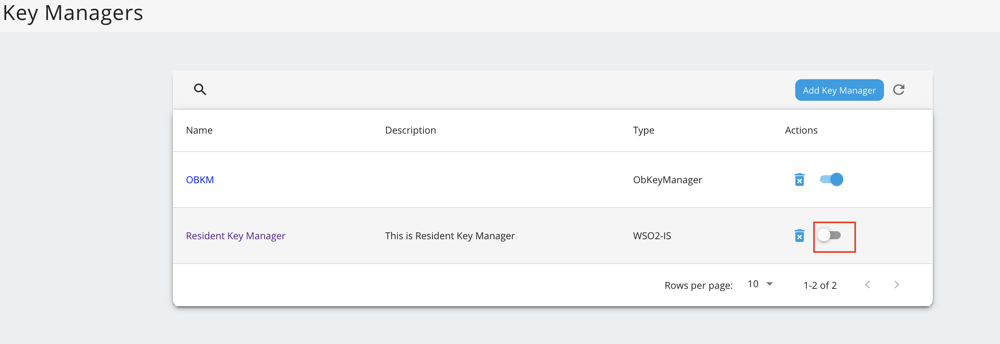

## Configure WSO2 IS 7.x as a Key Manager

1. Sign in to the Admin Portal of API Manager at <https://localhost:9443/admin>.

2. Go to **Key Managers** on the left main menu. 
    

3. Configure [WSO2 IS 7.x as a keymanager](https://apim.docs.wso2.com/en/latest/administer/key-managers/configure-wso2is7-connector/). Enable role creation in WSO2 Identity Server 7.
    
4. Go to the list of Key Managers and select **Resident Key Manager**. 
    

5. Disable the Resident Key Manager.
    