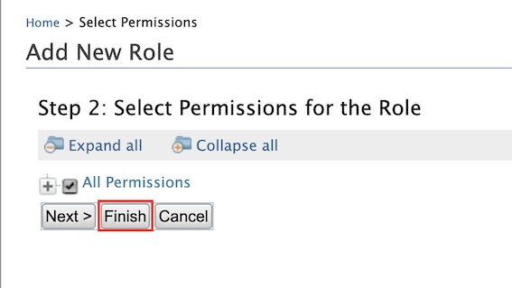
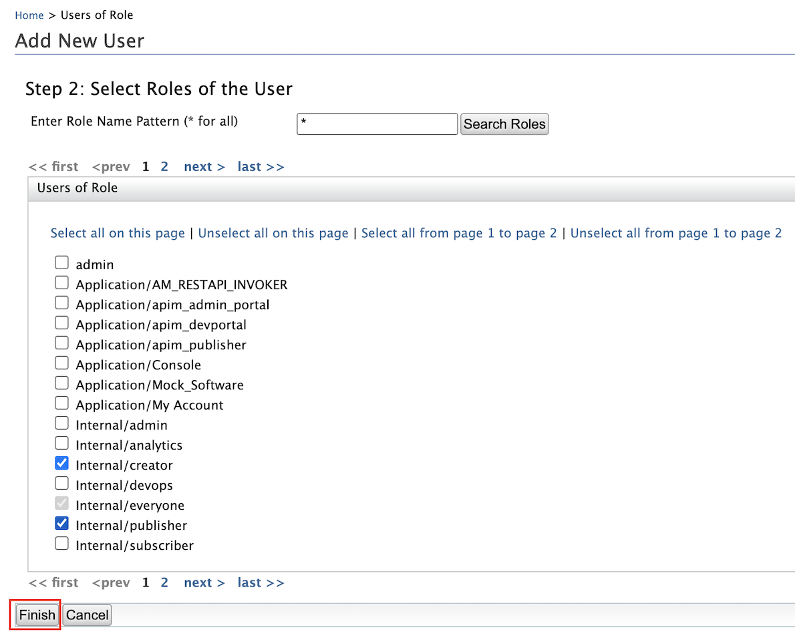

 Now you have started the servers, let’s create the users and define their permissions and  roles.
 
 1. Sign in to the Management Console of WSO2 Identity Server at [https://localhost:9446/carbon](https://localhost:9446/carbon)
 2. Use the default super admin credentials as follows:
    - Username: admin@wso2.com
    - Password: wso2123
    
    !!!note
        The above login credentials are for testing purposes only. It is recommended to change the login credentials in 
        a production environment.
    
 3. Go to the Main tab on the left top corner and select **Identity** -> **Users and Roles** -> **Add**. 
 4. Click **Add New Role**.
 5. Create the following user roles:   
  
    | Domain | Role| Permissions|
    |--------|--------|--------|
    |Internal|approveRole|Admin permissions|
    |Internal|CustomerCareOfficerRole|No permissions required.|
 
 6. Click **Finish**. 
 
    
 
 7. Go to the Main tab on the left top corner and select **Identity** -> **Users and Roles** -> **Add**.
 8. Click **Add New User**.
 9. Create the following users:
 
    | Domain | User| Permissions|
    |--------|--------|--------|
    |Primary|mark@gold.com|Internal/creator, Internal/publisher|
    |Primary|ann@gold.com|Internal/CustomerCareOfficer|
    |Primary|tom@gold.com|Internal/approverRole|
    
 10.Click **Finish**. 
 
 
 
