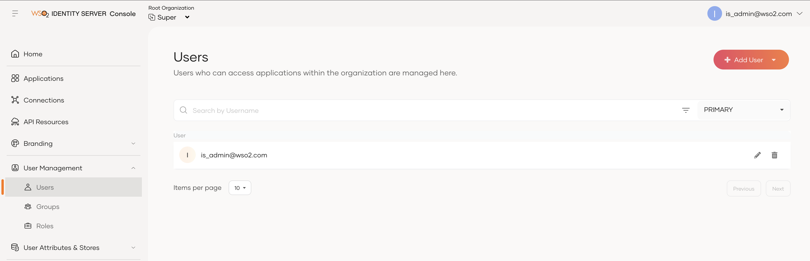
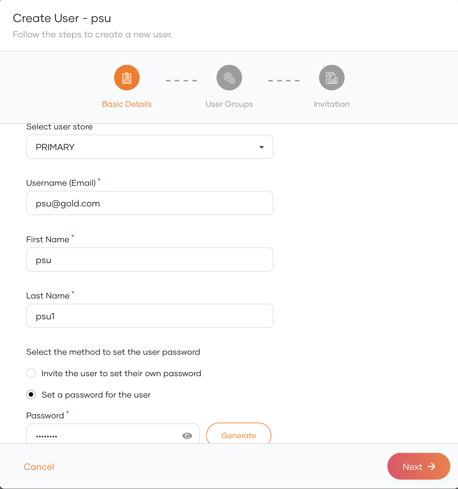
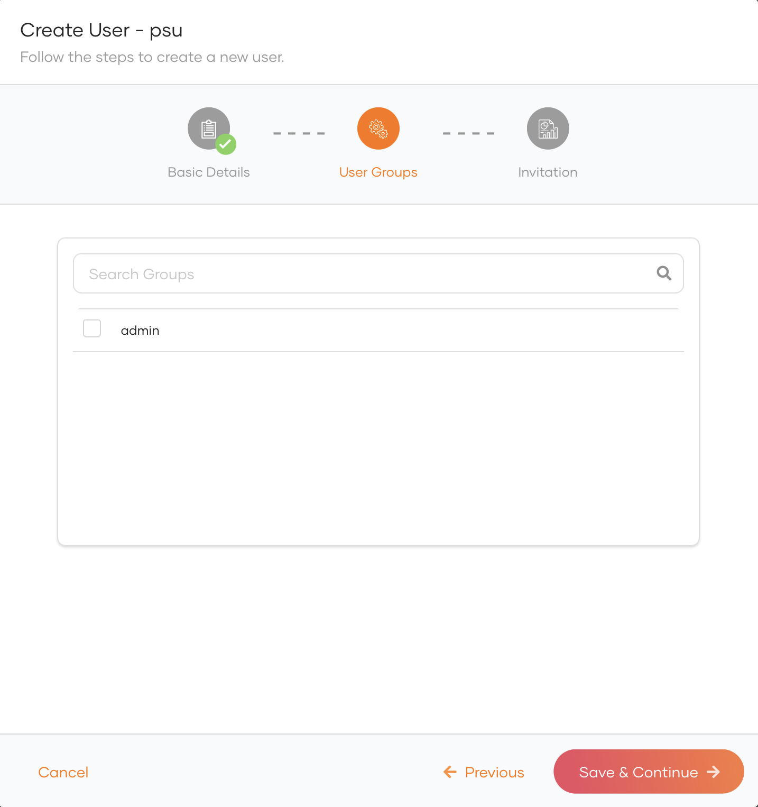
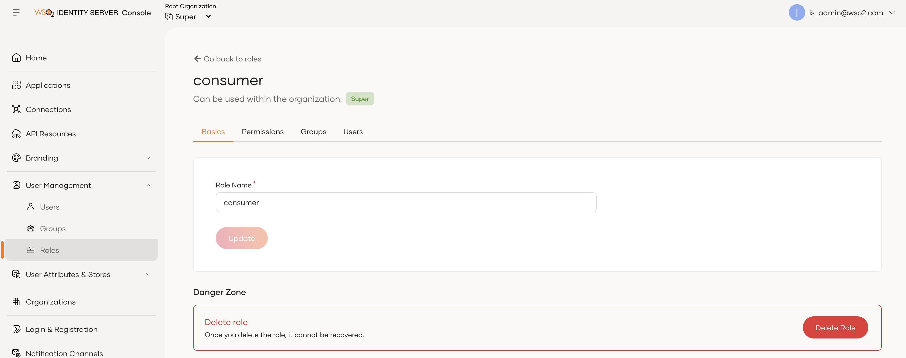
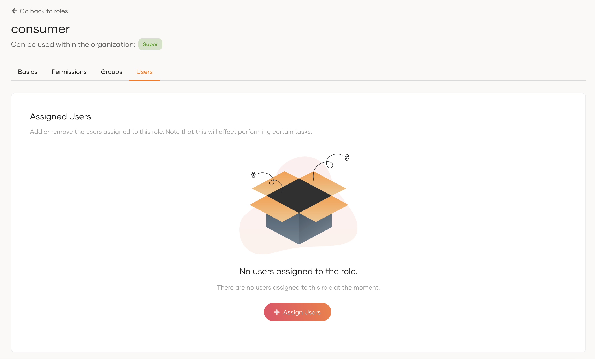
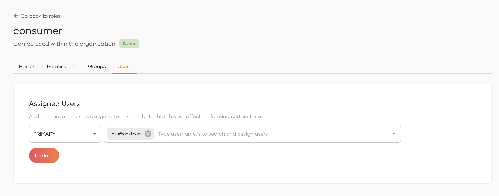

Now you have started the servers, let’s create the API resources, users and define their permissions and roles.
 
## Sign in to the Identity Server
 
1. Sign in to the Management Console of WSO2 Identity Server at [https://localhost:9446/console](https://localhost:9446/console)

2. Use the default super admin credentials as follows:
    - Username: is_admin@wso2.com
    - Password: wso2123
    
    !!!note
        The above login credentials are for testing purposes only. It is recommended to change the login credentials in 
        a production environment.
 
## Create new users

1. Go to the **User Management** tab in the left pane and select **Users**.
   

2. Click **Add User** --> **Single User**.
3. Enter the basic details of the user and set a password. Select `PRIMARY` user store.

    

4. Click **Next**.

    !!!note 
           Select the admin group, If you want to add the user to the admin group. Otherwise, continue without selecting the Admin group.

5. Click **Save and Continue**.
    

6. Click **Close**.

## Assign roles to the user
1. Go to the **User Management** tab in the left pane and select **Roles**.
   

2. Click on the **consumer** role.
    

3. Go to **Users** tab.
4. Click **Assign Users**.
    

5. Click **Assign User** drop-down --> select user from the drop-down.
    

6. Click **Update**.

