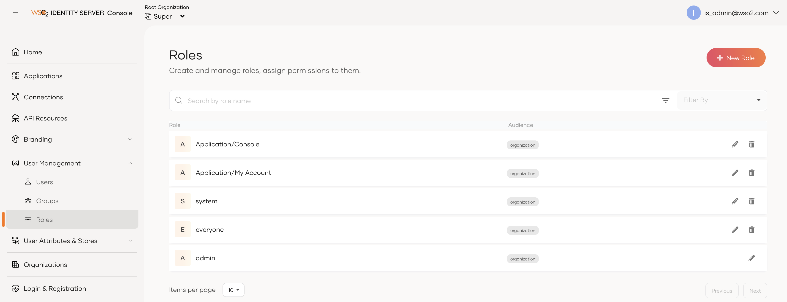
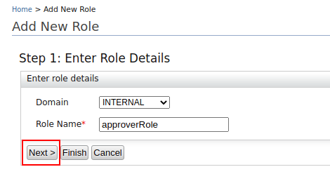
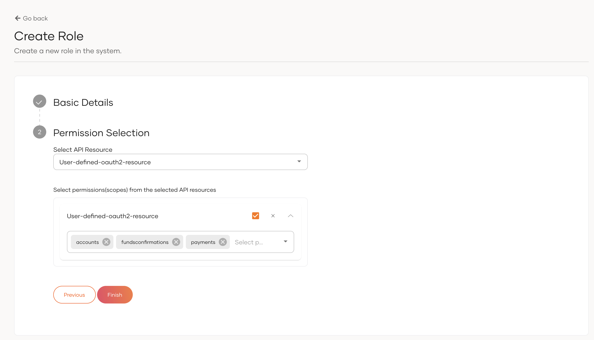
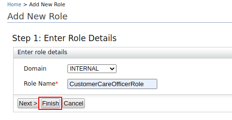
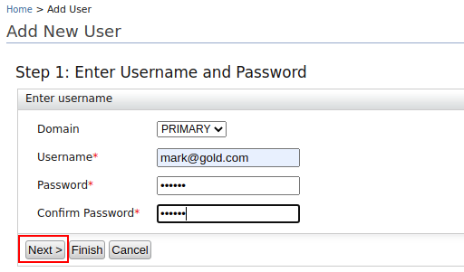
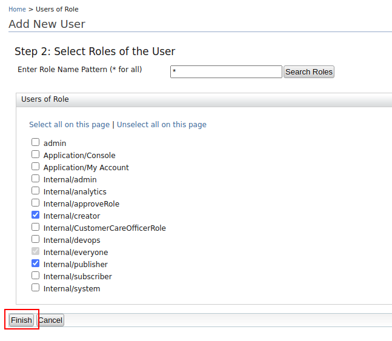

Now you have started the servers, let’s create the users and define their permissions and  roles.
 
## Sign in to the Identity Server
 
1. Sign in to the Management Console of WSO2 Identity Server at [https://localhost:9446/carbon](https://localhost:9446/carbon)

2. Use the default super admin credentials as follows:
    - Username: admin@wso2.com
    - Password: wso2123
    
    !!!note
        The above login credentials are for testing purposes only. It is recommended to change the login credentials in 
        a production environment.
   
## Create new user roles

1. Go to the Main tab on the left top corner and select **Identity** -> **Users and Roles** -> **Add**. 
2. Click **Add New Role**.
3. Create the following user roles:   
  
    | Domain | Role| Permissions | Description |
    |--------|--------|--------|---------------|
    |Internal|approverRole|Admin permissions| To approve applications when you register applications using the signup workflow. |
    |Internal|CustomerCareOfficerRole|No permissions required | To log in to the Consent Manager portal as a customer care officer. |
    
    i. Creating **approverRole**:
    
      - Select the **INTERNAL** domain and enter the role name as **approverRole**:
      
        
      
      - Click **Next >**.
      
      - Select the check box next to **Admin Permissions**.
      
        
            
      - Scroll down and click **Finish**.
      
    ii. Creating **CustomerCareOfficerRole**:
    
      - Select the **INTERNAL** domain and enter the role name as **CustomerCareOfficerRole**:
      
        
      
      - Click **Finish**.
 
## Create new users and assign roles

1. Go to the Main tab on the left top corner and select **Identity** -> **Users and Roles** -> **Add**.
2. Click **Add New User**.
3. Create the following users:
 
    | Domain | User| Permissions|
    |--------|--------|--------|
    |Primary|mark@gold.com|Internal/creator, Internal/publisher|
    |Primary|ann@gold.com|Internal/CustomerCareOfficer|
    |Primary|tom@gold.com|Internal/approverRole|

    i. Enter user details and click **Next >**. 
    
    
    
    ii. Select user roles for each user as per the table above: 
    
    
        
    iii. Click **Finish**.
 