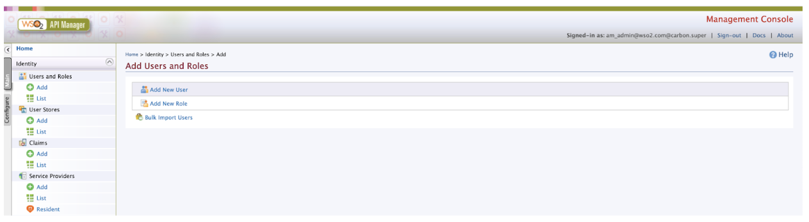
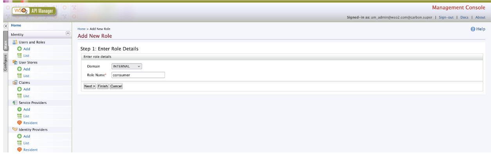
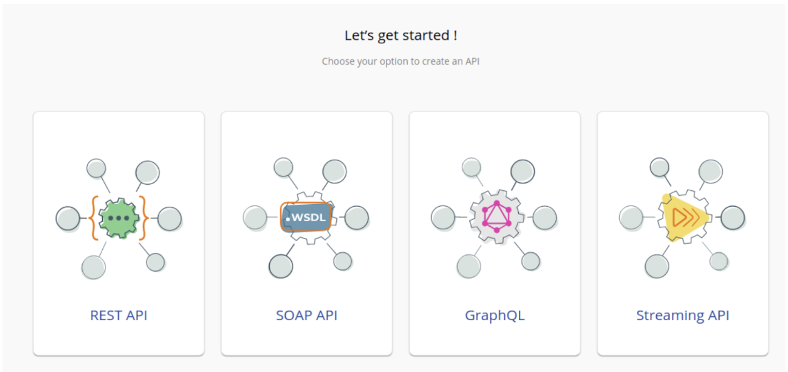
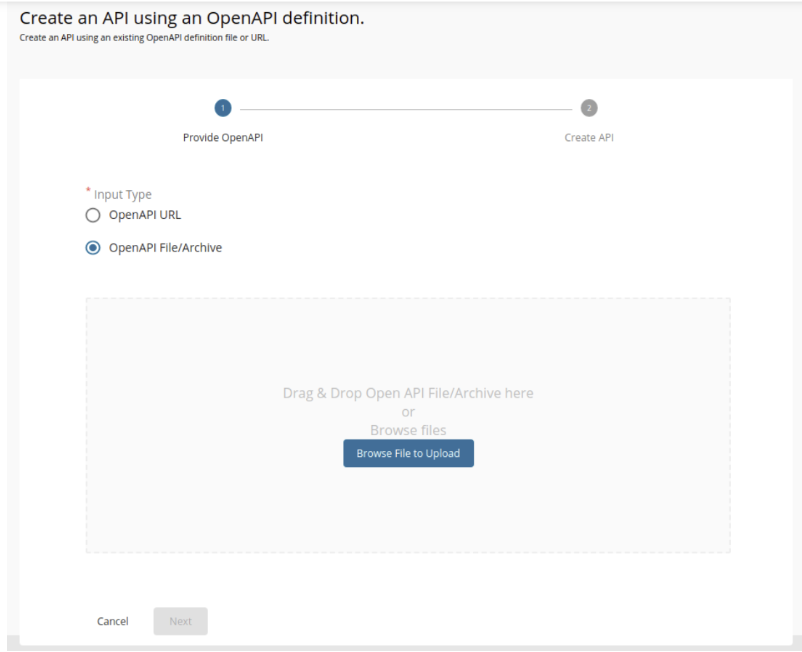
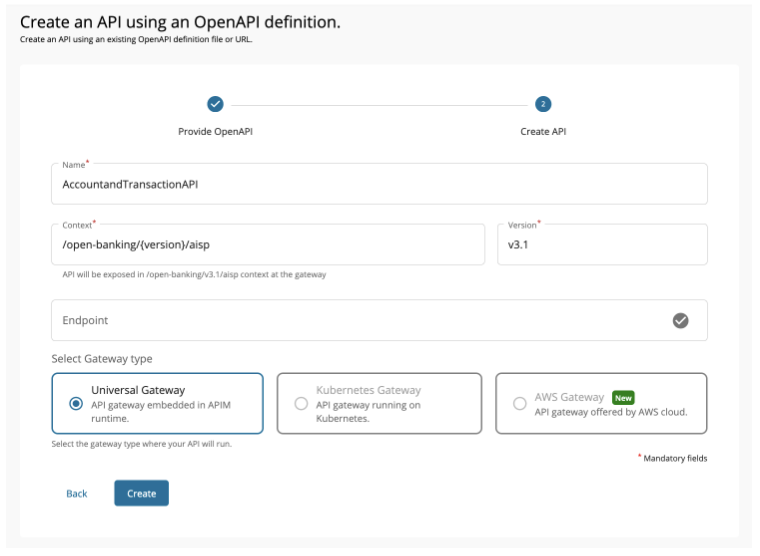
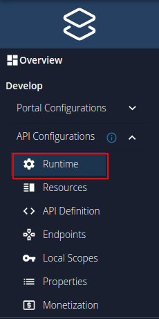
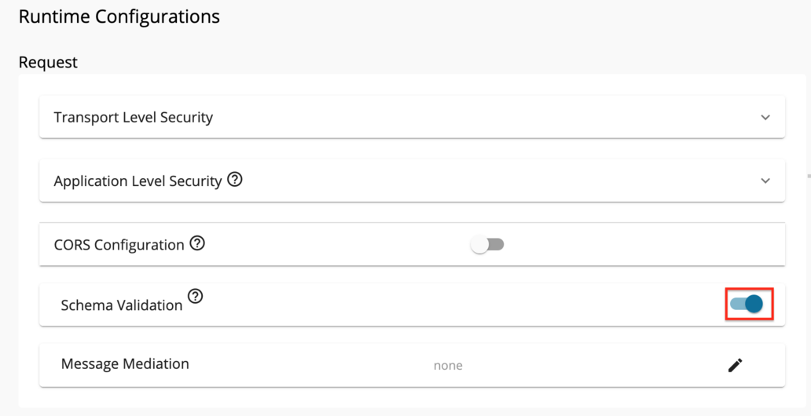
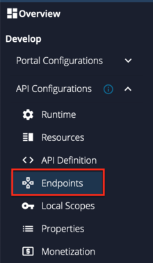
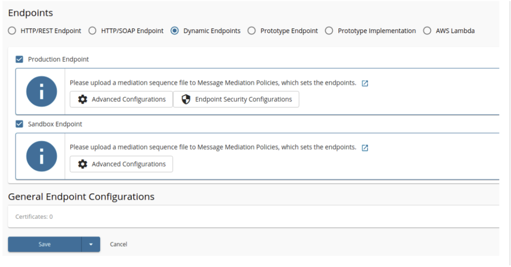

This page explains how to deploy an Open Banking API.

Before publishing the APIs, need to create the consumer role in WSO2 API Manager. 

## Create Consumer Role APIM Console

1. Goto APIM Carbon Console:  `https://<APIM_HOSTNAME>:9443/carbon`

2. Log into APIM Carbon Console using APIM admin username and password.

3. Click on Main Tab → Users and Roles → Add

4. Click on Add New Role.
    

5. Enter role Details:
          

      | Domain   | Role Name |
      | -------- | --------- |
      | INTERNAL | consumer  |

6. Click on Finish.

## Publish Accounts API

1. Sign in to the API Publisher Portal at `https://<APIM_HOSTNAME>:9443/publisher`. 

2. In the homepage, go to REST API and select Import Open API. <br/>
    

3. Select OpenAPI File/Archive. <br/>
    

4. Click Browse File to Upload and select [account-info-swagger.yaml](https://github.com/wso2/financial-services-accelerator/blob/4.0.0/financial-services-accelerator/accelerators/fs-apim/repository/resources/apis/Accounts/account-info-swagger.yaml).  

5. Click Next.

6. Set the Context value as follows:
    ```
    /open-banking/{version}/aisp
    ```

7. Leave the Endpoint field empty as it is, Select the Gateway Type and click Create.<br/>
    

8. Select Subscriptions from the left menu pane and uncheck all subscription plans.<br/>
    

9. Click Save.

10. Go to Runtime using the left menu pane. <br/>
    

11. Toggle the Schema Validation button to enable Schema Validation for all APIs except for the Dynamic Client Registration API.<br/>
    

12. Add [JWT claim based access validation](https://apim.docs.wso2.com/en/latest/design/api-policies/regular-gateway-policies/jwt-claim-based-access-validator/).

    Use aut as the Access verification claim name and value from below.

    | Token Type               | Claim Value      |
    | ------------------------ | ---------------  |
    | Client Credentials Grant | APPLICATION      |
    |Authorization Code Grant  | APPLICATION_USER |

13. Go to Endpoints using the left menu pane.<br/>
    

14. Select the endpoint types; `Dynamic Endpoints` and click Save.  <br/>
    

15. Create and engage the required [Inbuilt Gateway Enforcements](../learn/inbuilt-policies.md)
    - Refer the [Introduction to Policies](../learn/policies.md) for more details on Policies.
    - Refer the [Create Policies](../learn/create-policies.md) for create new Policies.
    - Refer the [Engage Policies](../learn/engage-policies.md) to learn how to engage policies to an API.

16. Select the API Gateway type, in this scenario, it is Default.

17. Click Deploy.

18. Go to Overview using the left menu pane.<br/>
    

19. click Publish. <br/>
    

Follow the same steps to publish Payments and COF API. Refer the below table for the OpenAPI files and context values of Payments and COF APIs.

| API Name               | OpenAPI File                                                                                                                                                                                                                           | Context Value                 |
|------------------------|----------------------------------------------------------------------------------------------------------------------------------------------------------------------------------------------------------------------------------------|-------------------------------|
| PaymentInitiationAPI   | [payment-initiation-openapi.yaml](https://github.com/wso2/financial-services-accelerator/blob/4.0.0/financial-services-accelerator/accelerators/fs-apim/repository/resources/apis/Payments/payment-initiation-openapi.yaml)            | /open-banking/{version}/pisp  |
| ConfirmationOfFundsAPI | [funds-confirmation-openapi.yaml](https://github.com/wso2/financial-services-accelerator/blob/4.0.0/financial-services-accelerator/accelerators/fs-apim/repository/resources/apis/ConfirmationOfFunds/funds-confirmation-openapi.yaml) | /open-banking/{version}/cbpii |

Once you deploy the APIs an API resource will be created along with the role mentioned in the swagger on the Identity Server side.

