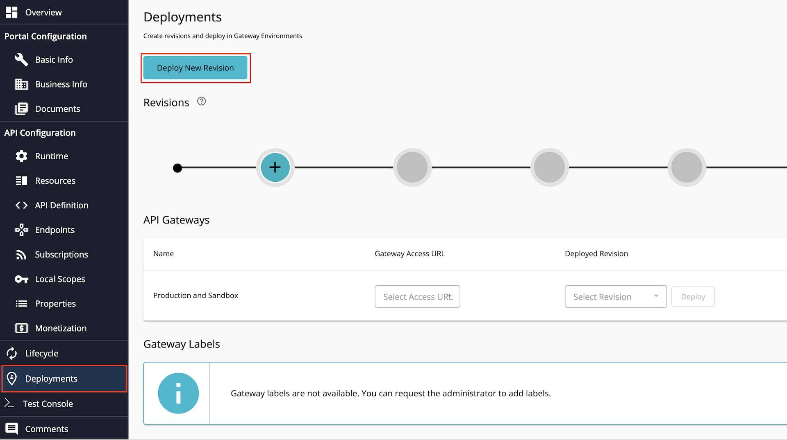
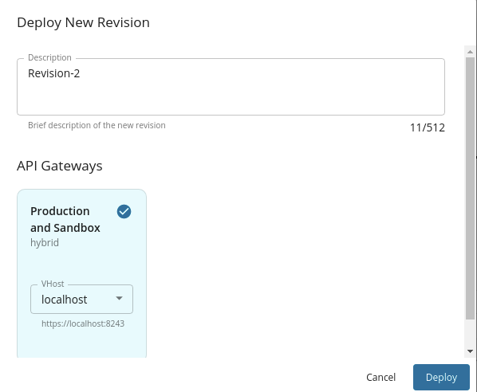

This page explains how to onboard API consumers using the Dynamic Client Registration API. 

### Step 1: Deploy the Dynamic Client Registration(DCR) API

1. Sign in to the API Publisher Portal at [https://localhost:9443/publisher](https://localhost:9443/publisher) with `creator/publisher` 
privileges. 

2. In the homepage, go to **REST API** and select **Import Open API**.

3. Select **OpenAPI File/Archive**. 

4. Click **Browse File to Upload** and select the `<APIM_HOME>/<OB_APIM_ACCELERATOR_HOME>/repository/resources/apis/
DynamicClientRegistration/dcr-swagger.yaml` file.

5. Click **Next**.

6. Set the value for **Endpoint** as follows:
```
https://localhost:9446/api/openbanking/dynamic-client-registration
```
    

7. Click **Create**. 

8. Select **Subscriptions** from the left menu pane and set the business plan to **Unlimited: Allows unlimited requests**. 

9. Click **Save**.

10. Go to **Deployments** using the left menu pane and click **Deploy New Revision**. 

11.Provide a description for the new revision.

12.Select the API Gateway type, in this scenario, it is **Production and Sandbox**.

13.Select the host as `localhost` from the dropdown list. 

14.Click **Deploy**.

15.Go to **Overview** using the left menu pane. 

   
 
16.Click **Publish**. 

  

17.The deployed DCR API is now available in the Developer Portal at [https://localhost:9443/devportal](https://localhost:9443/devportal).

18.Upload the root and issuer certificates found [here](https://openbanking.atlassian.net/wiki/spaces/DZ/pages/252018873/OB+Root+and+Issuing+Certificates+for+Sandbox) 
to the client trust stores in `<APIM_HOME>/repository/resources/security/client-truststore.jks` and 
`<IS_HOME>/repository/resources/security/client-truststore.jks` using the following command:

  ```
  keytool -import -alias <alias> -file <certificate_location> -storetype JKS -keystore <truststore_location> -storepass wso2carbon
  ```

19.Restart the Identity Server and API Manager instances. 

### Step 2: Configure IS as Key Manager

 1. Sign in to the Admin Portal of API Manager at <https://localhost:9443/admin>.
 2. Go to **Key Managers** on the left main menu. 
 3. Click **Add New Key Manager** and configure Key Manager. 
    
    ??? tip "Click here to see the full list of configurations..."
        | Configuration       | Description                           | Value                    |
        | -------------       |-------------                          | -----                    |
        | Name                | The name of the authorization server. | OBKM                     |
        | Display Name        | A name to display on the UI.          | OBKM                     |
        | Description         | The name of the authorization server. | (Optional)               |
        | Key Manager Type    | The type of the Key Manager to be selected. | Select `ObKeyManager` |
        |Well-known-url      | The well-known URL of the authorization server (Key Manager).| `https://<IS_HOST>:9446/oauth2/token/.well-known/openid-configuration` |
        | Issuer              | The issuer that consumes or validates access tokens.         | `https://<IS_HOST>:9446/oauth2/token` |
        |**Key Manager Endpoints**                                                                |
        | Client Registration Endpoint | The endpoint that verifies the identity and obtain profile information of the end-user based on the authentication performed by an authorization server.  |  `https://<IS_HOST>:9446/keymanager-operations/dcr/register`| 
        | Introspection Endpoint | The endpoint that allows authorized protected resources to query the authorization server to determine the set of metadata for a given token that was presented to them by an OAuth Client. | `https://<IS_HOST>:9446/oauth2/introspect` |
        | Token Endpoint      | The endpoint that issues the access tokens. | `https://<IS_HOST>:9446/oauth2/token` |
        | Revoke Endpoint     | The endpoint that revokes the access tokens.| `https://<IS_HOST>:9446/oauth2/revoke` |
        | Userinfo Endpoint   | The endpoint that allows clients to verify the identity of the end-user based on the authentication performed by an authorization server, as well as to obtain basic profile information about the end-user. | `https://<IS_HOST>:9446/oauth2/userinfo?schema=openid` |
        | Authorize Endpoint  | The endpoint used to obtain an authorization grant from the resource owner via the user-agent redirection. | `https://<IS_HOST>:9446/oauth2/authorize` |
        | Scope Management Endpoint | The endpoint used to manage the scopes. | `https://<IS_HOST>:9446/api/identity/oauth2/v1.0/scopes` |
        | **Connector Configurations**                        |
        | Username            | The username of an admin user who is authorized to connect to the authorization server. |  |
        | Password            | The password corresponding to the latter mentioned admin user who is authorized to connect to the authorization server. | |
        | **Claim URIs**      |   
        | Consumer Key Claim URI | The claim URI for the consumer key.  | (Optional)  |
        | Scopes Claim URI | The claim URI for the scopes | (Optional) | 
        | Grant Types | The supported grant types. Add multiple grant types by adding a grant type press Enter. | (Optional) |
        | **Certificates** | 
        | PEM | Either copy and paste the certificate in PEM format or upload the PEM file. | (Optional) |
        | JWKS | The JSON Web Key Set (JWKS) endpoint is a read-only endpoint. This URL returns the Identity Server's public key set in JSON web key set format. This contains the signing key(s) the Relying Party (RP) uses to validate signatures from the Identity Server. | `https://<IS_HOST>:9446/oauth2/jwks` |
        | **Advanced Configurations** |
        | Token Generation | This enables token generation via the authorization server. | (Mandatory) |
        | Out Of Band Provisioning | This enables the provisioning of Auth clients that have been created without the use of the Developer Portal, such as previously created Auth clients. | (Mandatory) |
        | Oauth App Creation | This enables the creation of Auth clients. | (Mandatory) |
        | **Token Validation Method** | The method used to validate the JWT signature. |
        | Self Validate JWT | The kid value is used to validate the JWT token signature. If the kid value is not present, `gateway_certificate_alias` will be used. | (Mandatory) |
        | Use introspect | The JWKS endpoint is used to validate the JWT token signature. | - |
        | Token Handling Options | This provides a way to validate the token for this particular authorization server. This is mandatory if the Token Validation Method is introspect.| (Optional) |
        | REFERENCE | The tokens that match a specific regular expression (regEx) are validated. e.g., <code>[0-9a-fA-F]{8}-[0-9a-fA-F]{4}-[1-5][0-9a-fA-F]{3}-[89abAB][0-9a-fA-F]{3}-[0-9a-fA-F]{12}</code> | (Optional) |
        | JWT | The tokens that match a specific JWT are validated. | Select this icon |
        | CUSTOM | The tokens that match a custom pattern are validated. | (Optional) |
        | **Claim Mappings** | Local and remote claim mapping. | (Optional) |
    

3. Go to the list of Key Managers and select **Resident Key Manager**. 

4. Locate **Connector Configurations** and provide a username and a password for a user with super admin credentials.

5. Click **Update**.

6. Disable the Resident Key Manager. 

### Step 3: Register an application
The API allows the API consumer to request the bank to register a new application. The process is as follows:

- The API consumer sends a registration request including a Software Statement Assertion (SSA) as a claim in the payload. 
This SSA contains API consumer's metadata. A sample request looks as follows:

```
curl -X POST https://localhost:8243/open-banking/0.1/register \
 -H 'Content-Type: application/jwt' \
 --cert <PUBLIC_KEY_FILE_PATH> --key <PRIVATE_KEY_FILE_PATH> \
 -d 'eyJ0eXAiOiJKV1QiLCJhbGciOiJQUzI1NiIsImtpZCI6IldfVGNuUVZjSEF5MjBxOHpDTWNkQnlyb290dyJ9.eyJpc3MiOiJ5a05PZ1dkMlJnbnVvTFJSeVdCa2FZIiwiaWF0IjoxNTcxODA4MTY3LCJleHAiOjIxNDc0ODM2NDYsImp0aSI6IjM3NzQ3Y2QxYzEwNTQ1Njk5Zjc1NGFkZjI4YjczZTMxIiwiYXVkIjoiaHR0cHM6Ly9zZWN1cmUuYXBpLmRhdGFob2xkZXIuY29tL2lzc3VlciIsInJlZGlyZWN0X3VyaXMiOlsiaHR0cHM6Ly93d3cubW9ja2NvbXBhbnkuY29tLmF1L3JlZGlyZWN0cy9yZWRpcmVjdDEiLCJodHRwczovL3d3dy5tb2NrY29tcGFueS5jb20uYXUvcmVkaXJlY3RzL3JlZGlyZWN0MiJdLCJ0b2tlbl9lbmRwb2ludF9hdXRoX3NpZ25pbmdfYWxnIjoiUFMyNTYiLCJ0b2tlbl9lbmRwb2ludF9hdXRoX21ldGhvZCI6InByaXZhdGVfa2V5X2p3dCIsImdyYW50X3R5cGVzIjpbImNsaWVudF9jcmVkZW50aWFscyIsImF1dGhvcml6YXRpb25fY29kZSIsInJlZnJlc2hfdG9rZW4iLCJ1cm46aWV0ZjpwYXJhbXM6b2F1dGg6Z3JhbnQtdHlwZTpqd3QtYmVhcmVyIl0sInJlc3BvbnNlX3R5cGVzIjpbImNvZGUgaWRfdG9rZW4iXSwiYXBwbGljYXRpb25fdHlwZSI6IndlYiIsImlkX3Rva2VuX3NpZ25lZF9yZXNwb25zZV9hbGciOiJQUzI1NiIsImlkX3Rva2VuX2VuY3J5cHRlZF9yZXNwb25zZV9hbGciOiJSU0EtT0FFUCIsImlkX3Rva2VuX2VuY3J5cHRlZF9yZXNwb25zZV9lbmMiOiJBMjU2R0NNIiwicmVxdWVzdF9vYmplY3Rfc2lnbmluZ19hbGciOiJQUzI1NiIsInNjb3BlIjoiYWNjb3VudHMiLCJzb2Z0d2FyZV9zdGF0ZW1lbnQiOiJleUpoYkdjaU9pSlFVekkxTmlJc0ltdHBaQ0k2SWxkZlZHTnVVVlpqU0VGNU1qQnhPSHBEVFdOa1FubHliMjkwZHlJc0luUjVjQ0k2SWtwWFZDSjkuZXlKcGMzTWlPaUpQY0dWdVFtRnVhMmx1WnlCTWRHUWlMQ0pwWVhRaU9qRTJNVFUxTXpZeE9UY3NJbXAwYVNJNklqRXpaalV3Tm1JM1ltSTFOR05pWVNJc0luTnZablIzWVhKbFgyVnVkbWx5YjI1dFpXNTBJam9pYzJGdVpHSnZlQ0lzSW5OdlpuUjNZWEpsWDIxdlpHVWlPaUpVWlhOMElpd2ljMjltZEhkaGNtVmZhV1FpT2lKNWEwNVBaMWRrTWxKbmJuVnZURkpTZVZkQ2EyRlpJaXdpYzI5bWRIZGhjbVZmWTJ4cFpXNTBYMmxrSWpvaWVXdE9UMmRYWkRKU1oyNTFiMHhTVW5sWFFtdGhXU0lzSW5OdlpuUjNZWEpsWDJOc2FXVnVkRjl1WVcxbElqb2lUMEpYUVVNaUxDSnpiMlowZDJGeVpWOWpiR2xsYm5SZlpHVnpZM0pwY0hScGIyNGlPaUpQUWxkQlF5SXNJbk52Wm5SM1lYSmxYM1psY25OcGIyNGlPakVzSW5OdlpuUjNZWEpsWDJOc2FXVnVkRjkxY21raU9pSm9kSFJ3Y3pvdkwzZDNkeTVoYldGNmIyNHVZMjl0TDNCdmJHbGplU0lzSW5OdlpuUjNZWEpsWDNKbFpHbHlaV04wWDNWeWFYTWlPbHNpYUhSMGNITTZMeTkzZDNjdVlXMWhlbTl1TG1OdmJTOXdiMnhwWTNraVhTd2ljMjltZEhkaGNtVmZjbTlzWlhNaU9sc2lRVWxUVUNJc0lsQkpVMUFpWFN3aWIzSm5ZVzVwYzJGMGFXOXVYMk52YlhCbGRHVnVkRjloZFhSb2IzSnBkSGxmWTJ4aGFXMXpJanA3SW1GMWRHaHZjbWwwZVY5cFpDSTZJazlDUjBKU0lpd2ljbVZuYVhOMGNtRjBhVzl1WDJsa0lqb2lWVzVyYm05M2JqQXdNVFU0TURBd01ERklVVkZ5V2tGQldDSXNJbk4wWVhSMWN5STZJa0ZqZEdsMlpTSXNJbUYxZEdodmNtbHpZWFJwYjI1eklqcGJleUp0WlcxaVpYSmZjM1JoZEdVaU9pSkhRaUlzSW5KdmJHVnpJanBiSWtGSlUxQWlMQ0pRU1ZOUUlpd2lRMEpRU1VraVhYMHNleUp0WlcxaVpYSmZjM1JoZEdVaU9pSkpSU0lzSW5KdmJHVnpJanBiSWtGSlUxQWlMQ0pRU1ZOUUlpd2lRMEpRU1VraVhYMHNleUp0WlcxaVpYSmZjM1JoZEdVaU9pSk9UQ0lzSW5KdmJHVnpJanBiSWtGSlUxQWlMQ0pRU1ZOUUlpd2lRMEpRU1VraVhYMWRmU3dpYzI5bWRIZGhjbVZmYkc5bmIxOTFjbWtpT2lKb2RIUndjem92TDNkM2R5NWhiV0Y2YjI0dVkyOXRMM0J2YkdsamVTSXNJbTl5WjE5emRHRjBkWE1pT2lKQlkzUnBkbVVpTENKdmNtZGZhV1FpT2lJd01ERTFPREF3TURBeFNGRlJjbHBCUVZnaUxDSnZjbWRmYm1GdFpTSTZJbGRUVHpJZ0tGVkxLU0JNU1UxSlZFVkVJaXdpYjNKblgyTnZiblJoWTNSeklqcGJleUp1WVcxbElqb2lWR1ZqYUc1cFkyRnNJaXdpWlcxaGFXd2lPaUp6WVdOb2FXNXBjMEIzYzI4eUxtTnZiU0lzSW5Cb2IyNWxJam9pS3prME56YzBNamMwTXpjMElpd2lkSGx3WlNJNklsUmxZMmh1YVdOaGJDSjlMSHNpYm1GdFpTSTZJa0oxYzJsdVpYTnpJaXdpWlcxaGFXd2lPaUp6WVdOb2FXNXBjMEIzYzI4eUxtTnZiU0lzSW5Cb2IyNWxJam9pS3prME56YzBNamMwTXpjMElpd2lkSGx3WlNJNklrSjFjMmx1WlhOekluMWRMQ0p2Y21kZmFuZHJjMTlsYm1Sd2IybHVkQ0k2SW1oMGRIQnpPaTh2YTJWNWMzUnZjbVV1YjNCbGJtSmhibXRwYm1kMFpYTjBMbTl5Wnk1MWF5OHdNREUxT0RBd01EQXhTRkZSY2xwQlFWZ3ZNREF4TlRnd01EQXdNVWhSVVhKYVFVRllMbXAzYTNNaUxDSnZjbWRmYW5kcmMxOXlaWFp2YTJWa1gyVnVaSEJ2YVc1MElqb2lhSFIwY0hNNkx5OXJaWGx6ZEc5eVpTNXZjR1Z1WW1GdWEybHVaM1JsYzNRdWIzSm5MblZyTHpBd01UVTRNREF3TURGSVVWRnlXa0ZCV0M5eVpYWnZhMlZrTHpBd01UVTRNREF3TURGSVVWRnlXa0ZCV0M1cWQydHpJaXdpYzI5bWRIZGhjbVZmYW5kcmMxOWxibVJ3YjJsdWRDSTZJbWgwZEhCek9pOHZhMlY1YzNSdmNtVXViM0JsYm1KaGJtdHBibWQwWlhOMExtOXlaeTUxYXk4d01ERTFPREF3TURBeFNGRlJjbHBCUVZndmVXdE9UMmRYWkRKU1oyNTFiMHhTVW5sWFFtdGhXUzVxZDJ0eklpd2ljMjltZEhkaGNtVmZhbmRyYzE5eVpYWnZhMlZrWDJWdVpIQnZhVzUwSWpvaWFIUjBjSE02THk5clpYbHpkRzl5WlM1dmNHVnVZbUZ1YTJsdVozUmxjM1F1YjNKbkxuVnJMekF3TVRVNE1EQXdNREZJVVZGeVdrRkJXQzl5WlhadmEyVmtMM2xyVGs5blYyUXlVbWR1ZFc5TVVsSjVWMEpyWVZrdWFuZHJjeUlzSW5OdlpuUjNZWEpsWDNCdmJHbGplVjkxY21raU9pSm9kSFJ3Y3pvdkwzZDNkeTVoYldGNmIyNHVZMjl0TDNCdmJHbGplU0lzSW5OdlpuUjNZWEpsWDNSdmMxOTFjbWtpT2lKb2RIUndjem92TDNkM2R5NWhiV0Y2YjI0dVkyOXRMM0J2YkdsamVTSXNJbk52Wm5SM1lYSmxYMjl1WDJKbGFHRnNabDl2Wmw5dmNtY2lPaUpYVTA4eUluMC5XclhXMFQxZzF2QXFvRTdiM1l4elR2cGZjbnl5cEdDdUVaUGlnQ0lEMFB1azZSQmR1UnN6QjNFb3pKY05NXy11VFk1Y1dNZEZvZDQ3SFR1S0ctRU1QVENaX2FBd3k5dVhGakhNQ3A4REJqek14S25oZEVTVEFFMGxVb2dlMWNoUE05Q29IX3N0WnBvaktKOERQNVlHeEdMSU1xUVc3OVhwVl9EUjBoXzd4aVctaGFtM3VjS3lpUmdaZ25wTEd1c204aFpjRUZDbFlPZ3JvdWkwQkMtNHJLZlZJdHZSY2s2RDRicXFiZlJQVURlbVhZdWxDSnROY18yZ1U3d1NYY2RqV0ZPaV9oWU9LYnRiTjRaOGhqYWF1aEtTcUp4N1RoX2pRdmRnUnIza3B0VzRwQ1VFenpfRUMtOThOZlJ5cVVXQzZYR3N2bGpYWHgydFFIWEtyc3cyUkEifQ.g5jLX2zX9lAB-4MbJuHCISb_RkSos5GMP-pclzTQNuoOFIrrbvrcJbnNDuUuP-U3JI-Gn9CTXvNSeW9Ha0Vb0dW_Jn98svw8ebrOIPbtkxCik16cboIt-5kQdcnKNEHQRRAvsdm2uVZhRH1acdPB5nFd9v0QlgdNjJWDkVMlikBpIN3flRrv0K9BpujhptniuAqH8K91tlF2RxYEh3-AYvfDb3NR4q8SuNidO9M4SkRnWsQC1-Vg8xfJcaiNHfi72sMo8aKGpN-jhc-4jRvChsq0mULSoigVhTT17FvI5ltEVhZ_99uwBp4_LmWUxnK_YX_egNUz7zyx11dFyIpPng' 
```
The payload is a signed JWT. Its format looks as follows:
```
{
  "typ": "JWT",
  "alg": "PS256",
  "kid": "W_TcnQVcHAy20q8zCMcdByrootw"
}
{
  "iss": "ykNOgWd2RgnuoLRRyWBkaY",
  "iat": 1571808167,
  "exp": 2147483646,
  "jti": "37747cd1c10545699f754adf28b73e31",
  "aud": "https://secure.api.dataholder.com/issuer",
  "redirect_uris": [
    "https://www.mockcompany.com.au/redirects/redirect1",
    "https://www.mockcompany.com.au/redirects/redirect2"
  ],
  "token_endpoint_auth_signing_alg": "PS256",
  "token_endpoint_auth_method": "private_key_jwt",
  "grant_types": [
    "client_credentials",
    "authorization_code",
    "refresh_token",
    "urn:ietf:params:oauth:grant-type:jwt-bearer"
  ],
  "response_types": [
    "code id_token"
  ],
  "application_type": "web",
  "id_token_signed_response_alg": "PS256",
  "id_token_encrypted_response_alg": "RSA-OAEP",
  "id_token_encrypted_response_enc": "A256GCM",
  "request_object_signing_alg": "PS256",
  "scope": "accounts",
  "software_statement": "eyJhbGciOiJQUzI1NiIsImtpZCI6IldfVGNuUVZjSEF5MjBxOHpDTWNkQnlyb290dyIsInR5cCI6IkpXVCJ9.eyJpc3MiOiJPcGVuQmFua2luZyBMdGQiLCJpYXQiOjE2MTU1MzYxOTcsImp0aSI6IjEzZjUwNmI3YmI1NGNiYSIsInNvZnR3YXJlX2Vudmlyb25tZW50Ijoic2FuZGJveCIsInNvZnR3YXJlX21vZGUiOiJUZXN0Iiwic29mdHdhcmVfaWQiOiJ5a05PZ1dkMlJnbnVvTFJSeVdCa2FZIiwic29mdHdhcmVfY2xpZW50X2lkIjoieWtOT2dXZDJSZ251b0xSUnlXQmthWSIsInNvZnR3YXJlX2NsaWVudF9uYW1lIjoiT0JXQUMiLCJzb2Z0d2FyZV9jbGllbnRfZGVzY3JpcHRpb24iOiJPQldBQyIsInNvZnR3YXJlX3ZlcnNpb24iOjEsInNvZnR3YXJlX2NsaWVudF91cmkiOiJodHRwczovL3d3dy5hbWF6b24uY29tL3BvbGljeSIsInNvZnR3YXJlX3JlZGlyZWN0X3VyaXMiOlsiaHR0cHM6Ly93d3cuYW1hem9uLmNvbS9wb2xpY3kiXSwic29mdHdhcmVfcm9sZXMiOlsiQUlTUCIsIlBJU1AiXSwib3JnYW5pc2F0aW9uX2NvbXBldGVudF9hdXRob3JpdHlfY2xhaW1zIjp7ImF1dGhvcml0eV9pZCI6Ik9CR0JSIiwicmVnaXN0cmF0aW9uX2lkIjoiVW5rbm93bjAwMTU4MDAwMDFIUVFyWkFBWCIsInN0YXR1cyI6IkFjdGl2ZSIsImF1dGhvcmlzYXRpb25zIjpbeyJtZW1iZXJfc3RhdGUiOiJHQiIsInJvbGVzIjpbIkFJU1AiLCJQSVNQIiwiQ0JQSUkiXX0seyJtZW1iZXJfc3RhdGUiOiJJRSIsInJvbGVzIjpbIkFJU1AiLCJQSVNQIiwiQ0JQSUkiXX0seyJtZW1iZXJfc3RhdGUiOiJOTCIsInJvbGVzIjpbIkFJU1AiLCJQSVNQIiwiQ0JQSUkiXX1dfSwic29mdHdhcmVfbG9nb191cmkiOiJodHRwczovL3d3dy5hbWF6b24uY29tL3BvbGljeSIsIm9yZ19zdGF0dXMiOiJBY3RpdmUiLCJvcmdfaWQiOiIwMDE1ODAwMDAxSFFRclpBQVgiLCJvcmdfbmFtZSI6IldTTzIgKFVLKSBMSU1JVEVEIiwib3JnX2NvbnRhY3RzIjpbeyJuYW1lIjoiVGVjaG5pY2FsIiwiZW1haWwiOiJzYWNoaW5pc0B3c28yLmNvbSIsInBob25lIjoiKzk0Nzc0Mjc0Mzc0IiwidHlwZSI6IlRlY2huaWNhbCJ9LHsibmFtZSI6IkJ1c2luZXNzIiwiZW1haWwiOiJzYWNoaW5pc0B3c28yLmNvbSIsInBob25lIjoiKzk0Nzc0Mjc0Mzc0IiwidHlwZSI6IkJ1c2luZXNzIn1dLCJvcmdfandrc19lbmRwb2ludCI6Imh0dHBzOi8va2V5c3RvcmUub3BlbmJhbmtpbmd0ZXN0Lm9yZy51ay8wMDE1ODAwMDAxSFFRclpBQVgvMDAxNTgwMDAwMUhRUXJaQUFYLmp3a3MiLCJvcmdfandrc19yZXZva2VkX2VuZHBvaW50IjoiaHR0cHM6Ly9rZXlzdG9yZS5vcGVuYmFua2luZ3Rlc3Qub3JnLnVrLzAwMTU4MDAwMDFIUVFyWkFBWC9yZXZva2VkLzAwMTU4MDAwMDFIUVFyWkFBWC5qd2tzIiwic29mdHdhcmVfandrc19lbmRwb2ludCI6Imh0dHBzOi8va2V5c3RvcmUub3BlbmJhbmtpbmd0ZXN0Lm9yZy51ay8wMDE1ODAwMDAxSFFRclpBQVgveWtOT2dXZDJSZ251b0xSUnlXQmthWS5qd2tzIiwic29mdHdhcmVfandrc19yZXZva2VkX2VuZHBvaW50IjoiaHR0cHM6Ly9rZXlzdG9yZS5vcGVuYmFua2luZ3Rlc3Qub3JnLnVrLzAwMTU4MDAwMDFIUVFyWkFBWC9yZXZva2VkL3lrTk9nV2QyUmdudW9MUlJ5V0JrYVkuandrcyIsInNvZnR3YXJlX3BvbGljeV91cmkiOiJodHRwczovL3d3dy5hbWF6b24uY29tL3BvbGljeSIsInNvZnR3YXJlX3Rvc191cmkiOiJodHRwczovL3d3dy5hbWF6b24uY29tL3BvbGljeSIsInNvZnR3YXJlX29uX2JlaGFsZl9vZl9vcmciOiJXU08yIn0.WrXW0T1g1vAqoE7b3YxzTvpfcnyypGCuEZPigCID0Puk6RBduRszB3EozJcNM_-uTY5cWMdFod47HTuKG-EMPTCZ_aAwy9uXFjHMCp8DBjzMxKnhdESTAE0lUoge1chPM9CoH_stZpojKJ8DP5YGxGLIMqQW79XpV_DR0h_7xiW-ham3ucKyiRgZgnpLGusm8hZcEFClYOgroui0BC-4rKfVItvRck6D4bqqbfRPUDemXYulCJtNc_2gU7wSXcdjWFOi_hYOKbtbN4Z8hjaauhKSqJx7Th_jQvdgRr3kptW4pCUEzz_EC-98NfRyqUWC6XGsvljXXx2tQHXKrsw2RA"
}
```

The format of the SSA:
```
{
  "alg": "PS256",
  "kid": "W_TcnQVcHAy20q8zCMcdByrootw",
  "typ": "JWT"
}
{
  "iss": "OpenBanking Ltd",
  "iat": 1615536197,
  "jti": "13f506b7bb54cba",
  "software_environment": "sandbox",
  "software_mode": "Test",
  "software_id": "ykNOgWd2RgnuoLRRyWBkaY",
  "software_client_id": "ykNOgWd2RgnuoLRRyWBkaY",
  "software_client_name": "OBWAC",
  "software_client_description": "OBWAC",
  "software_version": 1,
  "software_client_uri": "https://www.amazon.com/policy",
  "software_redirect_uris": [
    "https://www.amazon.com/policy"
  ],
  "software_roles": [
    "AISP",
    "PISP"
  ],
  "organisation_competent_authority_claims": {
    "authority_id": "OBGBR",
    "registration_id": "Unknown0015800001HQQrZAAX",
    "status": "Active",
    "authorisations": [
      {
        "member_state": "GB",
        "roles": [
          "AISP",
          "PISP",
          "CBPII"
        ]
      },
      {
        "member_state": "IE",
        "roles": [
          "AISP",
          "PISP",
          "CBPII"
        ]
      },
      {
        "member_state": "NL",
        "roles": [
          "AISP",
          "PISP",
          "CBPII"
        ]
      }
    ]
  },
  "software_logo_uri": "https://www.amazon.com/policy",
  "org_status": "Active",
  "org_id": "0015800001HQQrZAAX",
  "org_name": "WSO2 (UK) LIMITED",
  "org_contacts": [
    {
      "name": "Technical",
      "email": "sachinis@wso2.com",
      "phone": "+94774274374",
      "type": "Technical"
    },
    {
      "name": "Business",
      "email": "sachinis@wso2.com",
      "phone": "+94774274374",
      "type": "Business"
    }
  ],
  "org_jwks_endpoint": "https://keystore.openbankingtest.org.uk/0015800001HQQrZAAX/0015800001HQQrZAAX.jwks",
  "org_jwks_revoked_endpoint": "https://keystore.openbankingtest.org.uk/0015800001HQQrZAAX/revoked/0015800001HQQrZAAX.jwks",
  "software_jwks_endpoint": "https://keystore.openbankingtest.org.uk/0015800001HQQrZAAX/ykNOgWd2RgnuoLRRyWBkaY.jwks",
  "software_jwks_revoked_endpoint": "https://keystore.openbankingtest.org.uk/0015800001HQQrZAAX/revoked/ykNOgWd2RgnuoLRRyWBkaY.jwks",
  "software_policy_uri": "https://www.amazon.com/policy",
  "software_tos_uri": "https://www.amazon.com/policy",
  "software_on_behalf_of_org": "WSO2"
}
```
!!! note 
    If you change the payload, use the following certificates to sign the JWT and SSA:
    
    - [signing certificate](../../assets/attachments/signing_certificate.pem)
    - [private keys](../../assets/attachments/signing_key.key)

- The bank registers the application using the metadata sent in the SSA.

- If an application is successfully created, the bank responds with a JSON payload describing the API consumer that the application was created. 
The API consumer can then use the identifier (`Client ID`) to access customers' financial data on the bank's resource server. A sample response is 
given below:
```
{
   "client_id":"R9TbvP9BX4PRYw6T06XuJcdOzdYa",
   "client_id_issued_at":"1628194846",
   "redirect_uris":[
      "https://www.mockcompany.com.au/redirects/redirect1",
      "https://www.mockcompany.com.au/redirects/redirect2"
   ],
   "grant_types":[
      "client_credentials",
      "authorization_code",
      "refresh_token",
      "urn:ietf:params:oauth:grant-type:jwt-bearer"
   ],
   "response_types":[
      "code id_token"
   ],
   "application_type":"web",
   "id_token_signed_response_alg":"PS256",
   "request_object_signing_alg":"PS256",
   "scope":"accounts",
   "software_id":"ykNOgWd2RgnuoLRRyWBkaY",
   "token_endpoint_auth_method":"private_key_jwt",
   "software_statement":"eyJhbGciOiJQUzI1NiIsImtpZCI6IldfVGNuUVZjSEF5MjBxOHpDTWNkQnlyb290dyIsInR5cCI6IkpXVCJ9.eyJpc3MiOiJPcGVuQmFua2luZyBMdGQiLCJpYXQiOjE2MTU1MzYxOTcsImp0aSI6IjEzZjUwNmI3YmI1NGNiYSIsInNvZnR3YXJlX2Vudmlyb25tZW50Ijoic2FuZGJveCIsInNvZnR3YXJlX21vZGUiOiJUZXN0Iiwic29mdHdhcmVfaWQiOiJ5a05PZ1dkMlJnbnVvTFJSeVdCa2FZIiwic29mdHdhcmVfY2xpZW50X2lkIjoieWtOT2dXZDJSZ251b0xSUnlXQmthWSIsInNvZnR3YXJlX2NsaWVudF9uYW1lIjoiT0JXQUMiLCJzb2Z0d2FyZV9jbGllbnRfZGVzY3JpcHRpb24iOiJPQldBQyIsInNvZnR3YXJlX3ZlcnNpb24iOjEsInNvZnR3YXJlX2NsaWVudF91cmkiOiJodHRwczovL3d3dy5hbWF6b24uY29tL3BvbGljeSIsInNvZnR3YXJlX3JlZGlyZWN0X3VyaXMiOlsiaHR0cHM6Ly93d3cuYW1hem9uLmNvbS9wb2xpY3kiXSwic29mdHdhcmVfcm9sZXMiOlsiQUlTUCIsIlBJU1AiXSwib3JnYW5pc2F0aW9uX2NvbXBldGVudF9hdXRob3JpdHlfY2xhaW1zIjp7ImF1dGhvcml0eV9pZCI6Ik9CR0JSIiwicmVnaXN0cmF0aW9uX2lkIjoiVW5rbm93bjAwMTU4MDAwMDFIUVFyWkFBWCIsInN0YXR1cyI6IkFjdGl2ZSIsImF1dGhvcmlzYXRpb25zIjpbeyJtZW1iZXJfc3RhdGUiOiJHQiIsInJvbGVzIjpbIkFJU1AiLCJQSVNQIiwiQ0JQSUkiXX0seyJtZW1iZXJfc3RhdGUiOiJJRSIsInJvbGVzIjpbIkFJU1AiLCJQSVNQIiwiQ0JQSUkiXX0seyJtZW1iZXJfc3RhdGUiOiJOTCIsInJvbGVzIjpbIkFJU1AiLCJQSVNQIiwiQ0JQSUkiXX1dfSwic29mdHdhcmVfbG9nb191cmkiOiJodHRwczovL3d3dy5hbWF6b24uY29tL3BvbGljeSIsIm9yZ19zdGF0dXMiOiJBY3RpdmUiLCJvcmdfaWQiOiIwMDE1ODAwMDAxSFFRclpBQVgiLCJvcmdfbmFtZSI6IldTTzIgKFVLKSBMSU1JVEVEIiwib3JnX2NvbnRhY3RzIjpbeyJuYW1lIjoiVGVjaG5pY2FsIiwiZW1haWwiOiJzYWNoaW5pc0B3c28yLmNvbSIsInBob25lIjoiKzk0Nzc0Mjc0Mzc0IiwidHlwZSI6IlRlY2huaWNhbCJ9LHsibmFtZSI6IkJ1c2luZXNzIiwiZW1haWwiOiJzYWNoaW5pc0B3c28yLmNvbSIsInBob25lIjoiKzk0Nzc0Mjc0Mzc0IiwidHlwZSI6IkJ1c2luZXNzIn1dLCJvcmdfandrc19lbmRwb2ludCI6Imh0dHBzOi8va2V5c3RvcmUub3BlbmJhbmtpbmd0ZXN0Lm9yZy51ay8wMDE1ODAwMDAxSFFRclpBQVgvMDAxNTgwMDAwMUhRUXJaQUFYLmp3a3MiLCJvcmdfandrc19yZXZva2VkX2VuZHBvaW50IjoiaHR0cHM6Ly9rZXlzdG9yZS5vcGVuYmFua2luZ3Rlc3Qub3JnLnVrLzAwMTU4MDAwMDFIUVFyWkFBWC9yZXZva2VkLzAwMTU4MDAwMDFIUVFyWkFBWC5qd2tzIiwic29mdHdhcmVfandrc19lbmRwb2ludCI6Imh0dHBzOi8va2V5c3RvcmUub3BlbmJhbmtpbmd0ZXN0Lm9yZy51ay8wMDE1ODAwMDAxSFFRclpBQVgveWtOT2dXZDJSZ251b0xSUnlXQmthWS5qd2tzIiwic29mdHdhcmVfandrc19yZXZva2VkX2VuZHBvaW50IjoiaHR0cHM6Ly9rZXlzdG9yZS5vcGVuYmFua2luZ3Rlc3Qub3JnLnVrLzAwMTU4MDAwMDFIUVFyWkFBWC9yZXZva2VkL3lrTk9nV2QyUmdudW9MUlJ5V0JrYVkuandrcyIsInNvZnR3YXJlX3BvbGljeV91cmkiOiJodHRwczovL3d3dy5hbWF6b24uY29tL3BvbGljeSIsInNvZnR3YXJlX3Rvc191cmkiOiJodHRwczovL3d3dy5hbWF6b24uY29tL3BvbGljeSIsInNvZnR3YXJlX29uX2JlaGFsZl9vZl9vcmciOiJXU08yIn0.WrXW0T1g1vAqoE7b3YxzTvpfcnyypGCuEZPigCID0Puk6RBduRszB3EozJcNM_-uTY5cWMdFod47HTuKG-EMPTCZ_aAwy9uXFjHMCp8DBjzMxKnhdESTAE0lUoge1chPM9CoH_stZpojKJ8DP5YGxGLIMqQW79XpV_DR0h_7xiW-ham3ucKyiRgZgnpLGusm8hZcEFClYOgroui0BC-4rKfVItvRck6D4bqqbfRPUDemXYulCJtNc_2gU7wSXcdjWFOi_hYOKbtbN4Z8hjaauhKSqJx7Th_jQvdgRr3kptW4pCUEzz_EC-98NfRyqUWC6XGsvljXXx2tQHXKrsw2RA"
}

```
