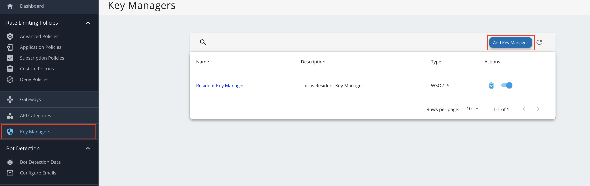
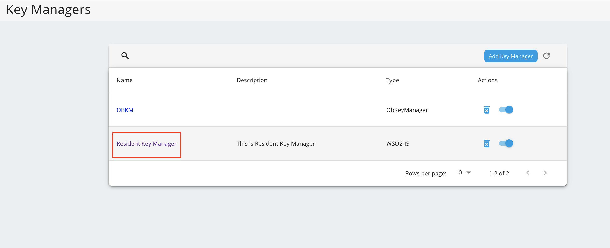
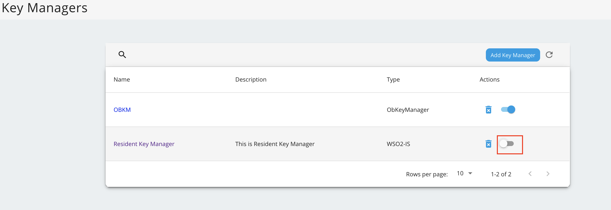

WSO2 Open Banking Accelerator contains TOML-based configurations. All the server-level configurations of the 
API Manager instance can be applied using a single configuration file, which is the `deployment.toml` file. 

## Configuring deployment.toml

Follow the steps below to configure the `deployment.toml` file and set up the default open banking flow for WSO2 API 
Manager.

!!! tip
    If you want to customize and learn more about TOML configurations, see 
    [API Manager Configuration Catalog for open banking](../references/config-catalog-apim.md).

1. Replace the `deployment.toml` file as explained in the 
[Setting up the servers](setting-up-servers.md#copying-the-deploymenttoml) section.
 
2. Open the `<APIM_HOME>/repository/conf/deployment.toml` file.

3. Set the hostname of the API Manager:

    ``` toml
    [server]
    hostname = "<APIM_HOST>" 
    ```

4. Update the datasource configurations with your database properties, such as the username, password, JDBC URL for the 
database server, and the JDBC driver. 

    - Given below are sample configurations for a MySQL database. For other DBMS types and more information, 
    see [Setting up databases](setting-up-databases.md).
   
    ```toml tab='shared_db'
    [database.shared_db]
    url = "jdbc:mysql://localhost:3306/openbank_govdb?autoReconnect=true&amp;useSSL=false"
    username = "root"
    password = "root"
    driver = "com.mysql.jdbc.Driver"
    ```
    
    ```toml tab='apim_db'
    [database.apim_db]
    url = "jdbc:mysql://localhost:3306/openbank_apimgtdb?autoReconnect=true&amp;useSSL=false"
    username = "root"
    password = "root"
    driver = "com.mysql.jdbc.Driver"
    ```
    
    ```toml tab='config'
    [database.config]
    url = "jdbc:mysql://localhost:3306/openbank_am_configdb?autoReconnect=true&amp;useSSL=false"
    username = "root"
    password = "root"
    driver = "com.mysql.jdbc.Driver"
    ```
    
    ```toml tab='WSO2UM_DB'
    [[datasource]]
    id="WSO2UM_DB"
    url = "jdbc:mysql://localhost:3306/openbank_userdb?autoReconnect=true&amp;useSSL=false"
    username = "root"
    password = "root"
    driver = "com.mysql.jdbc.Driver"
    ```

5. Update the following configurations with the hostname of the Identity Server.  
   
    ``` toml
    [apim.key_manager]
    service_url = "https://<IS_HOST>:9446${carbon.context}services/"
    ```
   
    ``` toml
    [apim.key_manager.configuration]
    ServerURL = "https://<IS_HOST>:9446${carbon.context}services/"
    ```
   
    ``` toml
    [open_banking.dcr]
    #jwks_endpoint_name = ""
    #app_name_claim = " "
    token_endpoint = https://<APIM_HOST>:9443/oauth2/token
    ```

6. Add the following and configure the hostname of the Identity Server.  

    ``` toml
    [open_banking.gateway.consent.validation]
    endpoint = "https://<IS_HOST>:9446/api/openbanking/consent/validate"
    ```
   
7. Add the following gateway executor configurations for the Consent flow:

    ``` toml
    [[open_banking.gateway.openbanking_gateway_executors.type]]
    name = "Consent"
    [[open_banking.gateway.openbanking_gateway_executors.type.executors]]
    name = "com.wso2.openbanking.accelerator.gateway.executor.impl.selfcare.portal.UserPermissionValidationExecutor"
    priority = 1
    ```

8. Add the following tags and configure the HTTP connection pool:

    !!! info
        This is available only as a WSO2 Update and is effective from October 07, 2021. For more information on updating 
        WSO2 Open Banking, see [Getting WSO2 Updates](setting-up-servers.md#getting-wso2-updates).

    ``` toml
    [open_banking.http_connection_pool]
    max_connections = 2000
    max_connections_per_route = 1500	
    ```
   
9. If you want to use the [Data publishing](../learn/data-publishing.md) feature:
   
    - Enable the feature and configure the `server_url` property with the hostname of WSO2 Streaming 
    Integrator.

    ``` toml
    [open_banking.data_publishing]	
    enable = true	
    username="$ref{super_admin.username}@carbon.super"	
    password="$ref{super_admin.password}"	
    server_url = "{tcp://<SI_HOST>:7612}"	
    ```  
   
## Starting servers

1. Go to the `<APIM_HOME>/bin` directory using a terminal.

2. Run the `wso2server.sh` script as follows:

    ``` bash
    ./api-manager.sh
    ``` 

## Configure Identity Server as Key Manager

The **Key Manager** handles all clients, security, and access token-related operations. In a typical API Manager 
production deployment, different components talk to the Key Manager component to achieve different tasks.

This section explains how to configure WSO2 Identity Server as the Key Manager for WSO2 API Manager.

1. Sign in to the Admin Portal of API Manager at `https://<APIM_HOST>:9443/admin`.

2. Go to **Key Manager** on the left main menu. 

3. Click **Add New Key Manager** and configure Key Manager. 
   
    ??? tip "Click here to see the full list of configurations..."
        | Configuration       | Description                           | Value                    |
        | -------------       |-------------                          | -----                    |
        | Name                | The name of the authorization server. | OBKM                     |
        | Display Name        | A name to display on the UI.          | OBKM                     |
        | Description         | The name of the authorization server. | (Optional)               |
        | Key Manager Type    | The type of the Key Manager to be selected. | Select `ObKeyManager` |
        |Well-known-url      | The well-known URL of the authorization server (Key Manager).|   `https://<IS_HOST>:9446/oauth2/token/.well-known/openid-configuration` |
        | Issuer              | The issuer that consumes or validates access tokens.         | `https://<IS_HOST>:9446/oauth2/token` |
        |**Key Manager Endpoints**                                                                |
        | Client Registration Endpoint | The endpoint that verifies the identity and obtain profile information of the end-user based on the authentication performed by an authorization server.  |  `https://<IS_HOST>:9446/keymanager-operations/dcr/register`| 
        | Introspection Endpoint | The endpoint that allows authorized protected resources to query the authorization server to determine the set of metadata for a given token that was presented to them by an OAuth Client. | `https://<IS_HOST>:9446/oauth2/introspect` |
        | Token Endpoint      | The endpoint that issues the access tokens. | `https://<IS_HOST>:9446/oauth2/token` |
        | Revoke Endpoint     | The endpoint that revokes the access tokens.| `https://<IS_HOST>:9446/oauth2/revoke` |
        | Userinfo Endpoint   | The endpoint that allows clients to verify the identity of the end-user based on the authentication performed by an authorization server, as well as to obtain basic profile information about the end-user. | `https://<IS_HOST>:9446/oauth2/userinfo?schema=openid` |
        | Authorize Endpoint  | The endpoint used to obtain an authorization grant from the resource owner via the user-agent redirection. | `https://<IS_HOST>:9446/oauth2/authorize` |
        | Scope Management Endpoint | The endpoint used to manage the scopes. | `https://<IS_HOST>:9446/api/identity/oauth2/v1.0/scopes` |
        | **Connector Configurations**                        |
        | Username            | The username of an admin user who is authorized to connect to the authorization server. |  |
        | Password            | The password corresponding to the latter mentioned admin user who is authorized to connect to the authorization server. | |
        | **Claim URIs**      |   
        | Consumer Key Claim URI | The claim URI for the consumer key.  | (Optional)  |
        | Scopes Claim URI | The claim URI for the scopes | (Optional) | 
        | Grant Types | The supported grant types. Add multiple grant types by adding a grant type press Enter. | (Optional) |
        | **Certificates** | 
        | PEM | Either copy and paste the certificate in PEM format or upload the PEM file. | (Optional) |
        | JWKS | The JSON Web Key Set (JWKS) endpoint is a read-only endpoint. This URL returns the Identity Server's public key set in JSON web key set format. This contains the signing key(s) the Relying Party (RP) uses to validate signatures from the Identity Server. | `https://<IS_HOST>:9446/oauth2/jwks` |
        | **Advanced Configurations** |
        | Token Generation | This enables token generation via the authorization server. | (Mandatory) |
        | Out Of Band Provisioning | This enables the provisioning of Auth clients that have been created without the use of the Developer Portal, such as previously created Auth clients. | (Mandatory) |
        | Oauth App Creation | This enables the creation of Auth clients. | (Mandatory) |
        | **Token Validation Method** | The method used to validate the JWT signature. |
        | Self Validate JWT | The kid value is used to validate the JWT token signature. If the kid value is not present, `gateway_certificate_alias` will be used. | (Mandatory) |
        | Use introspect | The JWKS endpoint is used to validate the JWT token signature. | - |
        | Token Handling Options | This provides a way to validate the token for this particular authorization server. This is mandatory if the Token Validation Method is introspect.| (Optional) |
        | REFERENCE | The tokens that match a specific regular expression (regEx) are validated. e.g., <code>[0-9a-fA-F]{8}-[0-9a-fA-F]{4}-[1-5][0-9a-fA-F]{3}-[89abAB][0-9a-fA-F]{3}-[0-9a-fA-F]{12}</code> | (Optional) |
        | JWT | The tokens that match a specific JWT are validated. | Select this icon |
        | CUSTOM | The tokens that match a custom pattern are validated. | (Optional) |
        | **Claim Mappings** | Local and remote claim mapping. | (Optional) | 

4. Go to the list of Key Managers and select **Resident Key Manager**. 

5. Locate **Connector Configurations** and provide a username and a password for a user with super admin credentials.

6. Click **Update**.

7. Disable the Resident Key Manager. 
