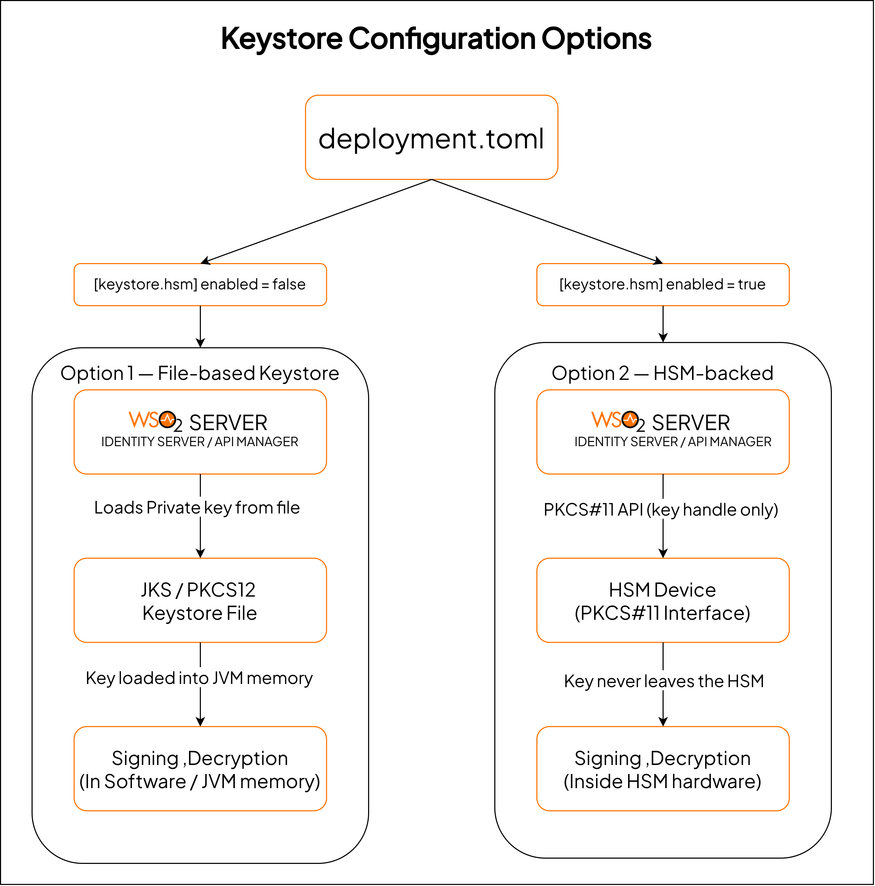

WSO2 Open Banking Accelerator supports Hardware Security Module (HSM) integration for secure cryptographic key 
management. This guide explains how to configure an HSM with WSO2 Identity Server and WSO2 API Manager to protect 
private keys used in JWT signing, JWS response signing, and JWE payload decryption.

## Overview

### What is an HSM?

A Hardware Security Module (HSM) is a dedicated cryptographic processor that securely generates, stores, and manages 
digital keys. Unlike file-based keystores (JKS/PKCS12), an HSM ensures that private key material never leaves the 
secure hardware boundary. All cryptographic operations — signing, decryption, and key generation — are performed 
inside the HSM.

WSO2 Open Banking Accelerator integrates with HSMs through the **PKCS#11** standard, which is supported by all 
major HSM vendors.

!!! info "Supported HSM Vendors"
    WSO2 Open Banking Accelerator works with any HSM that provides a PKCS#11-compliant library, including but not 
    limited to:

    - **Thales Luna Network HSM**
    - **AWS CloudHSM**
    - **Azure Dedicated HSM**

### Why use an HSM for Open Banking?

Open banking regulations across multiple jurisdictions require financial institutions to adhere to strict cryptographic 
key management standards. An HSM addresses these requirements by providing a tamper-resistant environment for key 
storage and cryptographic operations.

<table>
    <thead>
        <tr>
            <th>Requirement</th>
            <th>HSM Capability</th>
        </tr>
    </thead>
    <tbody>
        <tr>
            <td>FIPS 140-2 Level 3 compliance</td>
            <td>HSMs are certified to meet FIPS 140-2 Level 3, ensuring keys are protected within a tamper-evident boundary.</td>
        </tr>
        <tr>
            <td>PCI DSS key management</td>
            <td>HSMs satisfy PCI DSS requirements for cryptographic key protection and lifecycle management.</td>
        </tr>
        <tr>
            <td>Non-extractable private keys</td>
            <td>Private keys are generated inside the HSM and cannot be exported or read by the operating system or application.</td>
        </tr>
        <tr>
            <td>Audit and access control</td>
            <td>HSMs provide PIN-based access control and tamper-evident logging of all cryptographic operations.</td>
        </tr>
        <tr>
            <td>Regulatory compliance (PSD2, CDR, OB UK)</td>
            <td>Meets the security requirements of major open banking standards and regional regulations.</td>
        </tr>
    </tbody>
</table>

### Architecture: HSM vs file-based keystore

The following diagram illustrates how WSO2 Open Banking operates with an HSM-backed keystore compared to a 
traditional file-based keystore.



!!! tip
    When HSM is enabled, the WSO2 platform is fully backward compatible. You can switch between HSM and file-based 
    keystores by toggling the `[keystore.hsm]` configuration in `deployment.toml` without any code or deployment 
    changes. A server restart is required after changing this configuration.

### What operations use the HSM?

When HSM is enabled, all private key signing and decryption operations across the WSO2 Identity Server and WSO2 API 
Manager are performed using the HSM-backed key. This includes JWT signing, JWS response signing, JWE payload 
decryption, consent enforcement token signing, and any other operation that requires the server's private key.

---

## Prerequisites

Before configuring HSM integration, ensure the following prerequisites are met:

- WSO2 Open Banking Accelerator is installed and configured. See [Setting up servers](setting-up-servers.md).
- An HSM device or service is provisioned and accessible from the WSO2 server hosts.
- The PKCS#11 library (`.so` on Linux, `.dll` on Windows) provided by your HSM vendor is installed on each server.
- A token (partition) is initialized in the HSM with a user PIN.
- Java 11 or Java 17 is configured as the runtime.

!!! note
    Contact your HSM vendor for instructions on installing and initializing the PKCS#11 library and token for your 
    specific device. The steps vary by vendor, but the PKCS#11 configuration for WSO2 is the same regardless of 
    the HSM used.

---

## Step 1: Create the PKCS#11 provider configuration file

The PKCS#11 provider configuration file tells the Java runtime how to connect to your HSM. Create a file named 
`pkcs11.cfg` in the security resources directory of each WSO2 server.

**Identity Server:** `<IS_HOME>/repository/resources/security/pkcs11.cfg`  
**API Manager:** `<APIM_HOME>/repository/resources/security/pkcs11.cfg`

``` properties
name = <PROVIDER_NAME>
library = <PKCS11_LIBRARY_PATH>
slot = <SLOT_NUMBER>
```

Replace the placeholders with values specific to your HSM:

| Parameter | Description | Example |
|-----------|-------------|---------|
| `name` | A descriptive name for the PKCS#11 provider. This appears in Java security provider listings. | e.g., `LunaHSM`, `CloudHSM` |
| `library` | The absolute path to the PKCS#11 shared library provided by your HSM vendor. | See table below |
| `slot` | The slot number (or token slot ID) assigned to your initialized HSM partition. | e.g., `0` |

??? info "Click here to see common PKCS#11 library paths by vendor."

    | HSM Vendor | Operating System | Typical Library Path |
    |------------|-----------------|----------------------|
    | Thales Luna | Linux | `/usr/lib/libCryptoki2_64.so` |
    | Thales Luna | Windows | `C:\Program Files\SafeNet\LunaClient\cryptoki.dll` |
    | AWS CloudHSM | Linux | `/opt/cloudhsm/lib/libcloudhsm_pkcs11.so` |
    | Azure Dedicated HSM | Linux | `/usr/lib/libCryptoki2_64.so` |

!!! tip
    Some HSMs support additional PKCS#11 configuration attributes such as `slotListIndex` or specific mechanism 
    filters. Refer to the 
    [Java PKCS#11 Reference Guide](https://docs.oracle.com/en/java/javase/17/security/pkcs11-reference-guide1.html) 
    and your HSM vendor documentation for advanced configuration options.

---

## Step 2: Generate a key pair in the HSM

Generate an RSA key pair inside the HSM. The private key will remain in the HSM and the corresponding certificate 
will be used for signature verification.

You can use the Java `keytool` utility with the PKCS#11 provider to generate a key pair directly in the HSM.
Run this command on **each server** (Identity Server and API Manager) that will use HSM:

``` bash
keytool -genkeypair \
  -alias wso2carbon \
  -keyalg RSA \
  -keysize 2048 \
  -sigalg SHA256withRSA \
  -dname "CN=<HOSTNAME>, OU=<ORG_UNIT>, O=<ORGANIZATION>, L=<CITY>, ST=<STATE>, C=<COUNTRY>" \
  -validity 3650 \
  -keystore NONE \
  -storetype PKCS11 \
  -providerClass sun.security.pkcs11.SunPKCS11 \
  -providerArg <PRODUCT_HOME>/repository/resources/security/pkcs11.cfg \
  -storepass <HSM_PIN>
```

!!! note
    - Replace `<PRODUCT_HOME>` with `<IS_HOME>` or `<APIM_HOME>` depending on the server.
    - The `-keystore NONE` and `-storetype PKCS11` flags instruct `keytool` to use the HSM instead of a file-based 
      keystore.
    - The `-storepass` is the HSM user PIN, not a file password. You can omit `-storepass` to be prompted 
      interactively, which avoids exposing the PIN in shell history and process listings.
    - The `-alias` value must match the `alias` configured in `[keystore.hsm]` in the `deployment.toml` file.
    - Each server generates its own key pair in its own HSM partition. If the Identity Server and API Manager share 
      the same HSM partition and slot, a single key pair is sufficient.

Verify that the key pair was created successfully:

``` bash
keytool -list \
  -keystore NONE \
  -storetype PKCS11 \
  -providerClass sun.security.pkcs11.SunPKCS11 \
  -providerArg <PRODUCT_HOME>/repository/resources/security/pkcs11.cfg \
  -storepass <HSM_PIN>
```

Expected output:

``` text
Keystore type: PKCS11
Keystore provider: SunPKCS11-<PROVIDER_NAME>

Your keystore contains 1 entry

wso2carbon, PrivateKeyEntry,
Certificate fingerprint (SHA-256): XX:XX:XX:...
```

---

## Step 3: Exchange certificates between servers

When using both WSO2 Identity Server and WSO2 API Manager, the API Manager's HSM certificate must be imported into 
the Identity Server's truststore. This is required because the API Manager signs consent enforcement JWTs with its 
HSM-backed private key, and the Identity Server must verify these signatures during consent validation.

### 3.1 Export the APIM HSM certificate

Export the certificate from the API Manager HSM:

``` bash
keytool -exportcert \
  -alias wso2carbon \
  -keystore NONE \
  -storetype PKCS11 \
  -providerClass sun.security.pkcs11.SunPKCS11 \
  -providerArg <APIM_HOME>/repository/resources/security/pkcs11.cfg \
  -storepass <HSM_PIN> \
  -rfc \
  -file hsm-apim.cer
```

### 3.2 Import the certificate into the Identity Server truststore

``` bash
keytool -importcert \
  -alias hsm-gateway-cert \
  -file hsm-apim.cer \
  -keystore <IS_HOME>/repository/resources/security/client-truststore.p12 \
  -storetype PKCS12 \
  -storepass wso2carbon \
  -noprompt
```

### 3.3 Verify the import

``` bash
keytool -list \
  -keystore <IS_HOME>/repository/resources/security/client-truststore.p12 \
  -storetype PKCS12 \
  -storepass wso2carbon \
  -alias hsm-gateway-cert
```

!!! note
    The alias `hsm-gateway-cert` used during the import must match the `signature.alias` configured in 
    [Step 5](#step-5-configure-consent-validation-signing-alias).

---

## Step 4: Configure deployment.toml

Add the HSM keystore configuration to the `deployment.toml` file of each WSO2 server.

### Identity Server

Open `<IS_HOME>/repository/conf/deployment.toml` and add the following configuration:

``` toml
[keystore.hsm]
enabled = true
pin = "<HSM_PIN>"
alias = "wso2carbon"
provider_configuration = "pkcs11.cfg"
```

!!! note
    The `provider_configuration` value is the filename of the PKCS#11 configuration file created in 
    [Step 1](#step-1-create-the-pkcs11-provider-configuration-file). It is resolved relative to 
    `<IS_HOME>/repository/resources/security/`.

!!! warning
    The HSM PIN is stored in plain text in `deployment.toml`. In production environments, use WSO2's 
    [secure vault](https://is.docs.wso2.com/en/latest/deploy/security/encrypt-passwords-with-cipher-tool/) to 
    encrypt the PIN value. See [Security best practices](#security-best-practices) for more details.

Ensure that the primary keystore is configured. The primary keystore is used for TLS and other non-HSM operations:

``` toml
[keystore.primary]
file_name = "wso2carbon.p12"
password = "wso2carbon"
type = "PKCS12"
```

### API Manager

Open `<APIM_HOME>/repository/conf/deployment.toml` and add the following configuration:

``` toml
[keystore.hsm]
enabled = true
pin = "<HSM_PIN>"
alias = "wso2carbon"
provider_configuration = "pkcs11.cfg"
```

Configure the TLS and internal keystores for non-HSM operations:

``` toml
[keystore.tls]
file_name = "wso2carbon.jks"
type = "JKS"
password = "wso2carbon"
alias = "wso2carbon"
key_password = "wso2carbon"

[keystore.internal]
file_name = "wso2carbon.jks"
type = "JKS"
password = "wso2carbon"
alias = "wso2carbon"
key_password = "wso2carbon"
```

!!! info
    When HSM is enabled, the `[keystore.primary]` configuration is not used for signing operations — the HSM 
    keystore takes over automatically. However, you can keep `[keystore.primary]` configured as a fallback for 
    when HSM is disabled. There is no conflict between having both sections present.

### Configuration reference

The following table describes the parameters available under `[keystore.hsm]`:

| Parameter | Type | Required | Description |
|-----------|------|----------|-------------|
| `enabled` | Boolean | Yes | Set to `true` to enable HSM-backed keystore. Set to `false` to use file-based keystores. |
| `pin` | String | Yes | The user PIN for the HSM token/partition. This is used for authentication when accessing the HSM. |
| `alias` | String | Yes | The alias of the key pair stored in the HSM. Must match the alias used during key generation. |
| `provider_configuration` | String | Yes | The filename of the PKCS#11 provider configuration file, relative to `<PRODUCT_HOME>/repository/resources/security/`. |

---

## Step 5: Configure consent validation signing alias

If you are using the consent validation flow with HSM, configure the `signature.alias` to point to the HSM 
certificate alias that the Identity Server should use for verifying APIM gateway signatures.

Open `<IS_HOME>/repository/conf/deployment.toml` and add:

``` toml
[financial_services.consent.validation]
signature.alias = "hsm-gateway-cert"
```

!!! note
    The `signature.alias` value must match the alias used when importing the HSM certificate into the Identity 
    Server truststore in [Step 3](#step-3-exchange-certificates-between-servers).

---

## Step 6: Start the servers and verify

### Start the servers

1. Start the Identity Server:

    ``` bash
    cd <IS_HOME>/bin
    ./wso2server.sh
    ```

2. Start the API Manager:

    ``` bash
    cd <APIM_HOME>/bin
    ./api-manager.sh
    ```

### Verify HSM initialization

Check the server startup logs to confirm that the HSM keystore was loaded successfully.

**Expected log entry:**

``` text
[INFO] {KeyStoreManager} - Primary keystore loaded successfully ---SunPKCS11-<PROVIDER_NAME> version XX
```

If the HSM is not configured correctly, you will see an error similar to:

``` text
[ERROR] {KeyStoreManager} - Error loading HSM keystore
```

!!! tip "Troubleshooting HSM startup issues"
    If the server fails to start with HSM enabled, verify the following:
    
    1. The PKCS#11 library path in `pkcs11.cfg` is correct and the library file exists.
    2. The slot number matches your initialized HSM token.
    3. The HSM PIN is correct.
    4. The key alias in `[keystore.hsm]` matches the alias of the key pair in the HSM.
    5. The HSM device or service is accessible from the server (check network connectivity for remote HSMs).
    6. Java has permission to load the PKCS#11 native library.

---

## Disabling HSM

To revert to file-based keystores, set the `enabled` parameter to `false` in the `deployment.toml` file of each 
server:

``` toml
[keystore.hsm]
enabled = false
```

Restart the servers. The platform will automatically fall back to using the configured file-based keystore. 
For the Identity Server, this is `[keystore.primary]`. For the API Manager, this is `[keystore.tls]`.

!!! info
    Disabling HSM does not require any code changes or redeployment of accelerator components. The switch is 
    entirely configuration-driven.

---

## HSM configuration for specific vendors

The following sections provide vendor-specific examples for the PKCS#11 configuration file. Replace the 
`<SLOT_NUMBER>` placeholder with the slot number assigned to your HSM partition.

### Thales Luna Network HSM

``` properties
name = LunaHSM
library = /usr/lib/libCryptoki2_64.so
slot = <SLOT_NUMBER>
```

### AWS CloudHSM

``` properties
name = CloudHSM
library = /opt/cloudhsm/lib/libcloudhsm_pkcs11.so
slot = <SLOT_NUMBER>
```

### Azure Dedicated HSM

``` properties
name = AzureHSM
library = /usr/lib/libCryptoki2_64.so
slot = <SLOT_NUMBER>
```

---

## Security best practices

When deploying HSM in a production environment, consider the following best practices:

- **Protect the HSM PIN.** Store the HSM PIN in a secure secrets vault or use WSO2's 
  [secure vault](https://is.docs.wso2.com/en/latest/deploy/security/encrypt-passwords-with-cipher-tool/) to encrypt 
  the PIN in `deployment.toml`.
- **Use dedicated HSM partitions.** Assign separate HSM partitions (or separate HSMs) for the Identity Server and 
  API Manager in production deployments.
- **Enable HSM audit logging.** Configure your HSM to log all cryptographic operations for compliance and auditing 
  purposes.
- **Ensure high availability.** Use HSM clustering or replication features provided by your vendor to avoid a single 
  point of failure.
- **Restrict network access.** For network-attached HSMs, restrict access to the HSM network interface to only the 
  WSO2 server hosts.
- **Rotate keys periodically.** Establish a key rotation policy in accordance with your organization's security 
  standards and regulatory requirements.
