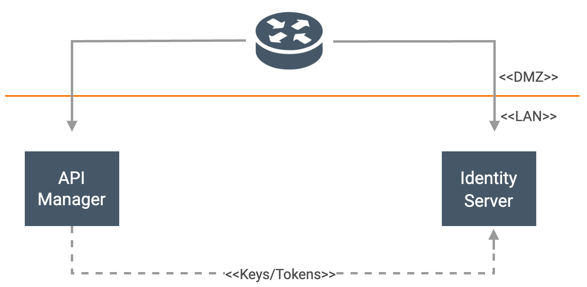
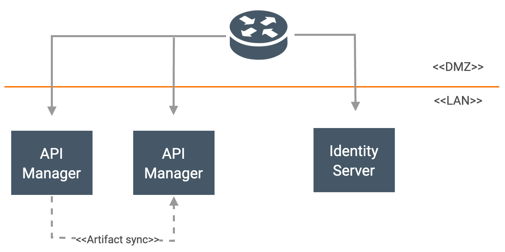
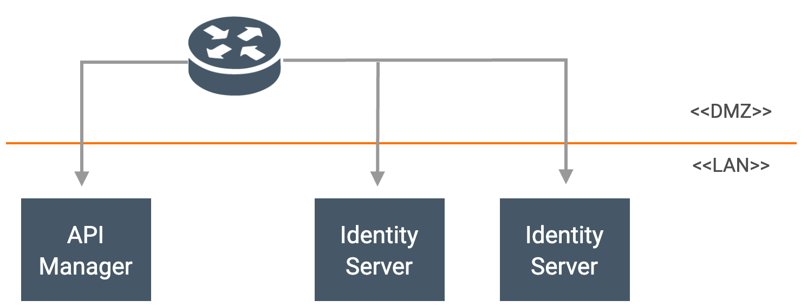

The base products for WSO2 Open Banking Accelerator are WSO2 API Manager and WSO2 Identity Server. 

- The Identity Server can be deployed in clustered setup for high availability (HA) and is recommended for production 
deployment environments. You can run multiple nodes of WSO2 Identity Server in a cluster mode for seamless request 
handling and balanced traffic handling. 

- The API Manager can have an [All-in-One Deployment](https://apim.docs.wso2.com/en/4.0.0/install-and-setup/setup/single-node/all-in-one-deployment-overview/#!)
as well as a [Distributed Deployment](https://apim.docs.wso2.com/en/4.0.0/install-and-setup/setup/distributed-deployment/understanding-the-distributed-deployment-of-wso2-api-m)
where the server nodes separately run the [API Manager profiles](https://apim.docs.wso2.com/en/4.0.0/install-and-setup/setup/distributed-deployment/understanding-the-distributed-deployment-of-wso2-api-m/#api-m-profiles).
Typically, when you get started with the API Manager in a development environment, you deploy it as a 
single instance with all its components on a single server. In a production deployment, the components are 
deployed in a distributed manner for HA. Therefore, you can create a distributed deployment of the main components. 

This page describes the recommended patterns for a HA deployment of WSO2 Open Banking Accelerator and its
base products.

## Deployment Patterns

### Pattern 1

Single node (All-in-one) deployment with API Manager and Identity Server.

### Pattern 2

Multi-node deployment with 2 API Manager instances and an Identity Server.

### Pattern 3

Single node (All-in-one) deployment with API Manager and 2 Identity Server instances.

### Pattern 4

Multi-node deployment with API Manager, Identity Server, and Streaming Integrator.

## Setting up deployment

Set up WSO2 Open Banking Accelerator and its base products by following the [Install and Setup](setting-up-servers.md)
section. 

### Identity Server HA Deployment

!!! tip
    Set the hostname of the Identity Server node as `obiam`.

- Configure WSO2 Identity Server in a clustered setup by following 
  [Set up WSO2 IS clusters with Nginx](https://is.docs.wso2.com/en/5.11.0/setup/deployment-guide/#fronting-with-a-load-balancer?).

!!! note
    Follow the Nginx configuration that exposes `/oauth2`, `/commonauth`, and other endpoints.

### API Manager HA Deployment

!!! warning
    WSO2 Open Banking Accelerator does not support the multi-tenancy capabilities in WSO2 API Manager

- Configure the [Proxy Server and the Load Balancer](https://apim.docs.wso2.com/en/4.0.0/install-and-setup/setup/setting-up-proxy-server-and-the-load-balancer/configuring-the-proxy-server-and-the-load-balancer/#step-2-configure-the-load-balancerreverse-proxy-server)
  for WSO2 API Manager. Follow the configurations available under the **HA for Gateway** section.

- To learn more about API Manager Deployment Patterns, see 
[WSO2 API Manager Deployment](https://apim.docs.wso2.com/en/4.0.0/install-and-setup/setup/deployment-overview/).

### Open ports

<table>
   <thead>
      <tr>
         <th>Product</th>
         <th>Port</th>
         <th>Usage</th>
      </tr>
   </thead>
   <tbody>
      <tr>
         <td rowspan="3">WSO2 API Manager</td>
         <td>9763</td>
         <td>HTTP servlet port</td>
      </tr>
      <tr>
         <td>9443</td>
         <td>HTTPS servlet port</td>
      </tr>
      <tr>
         <td>8280,8243</td>
         <td>NIO/PT transport ports</td>
      </tr>
      <tr>
         <td rowspan="3">WSO2 Identity Server</td>
         <td>9766</td>
         <td>HTTP servlet port</td>
      </tr>
      <tr>
         <td>9446</td>
         <td>HTTPS servlet port</td>
      </tr>
      <tr>
         <td>4000</td>
         <td>Ports to be opened with respect to clustering membership scheme used</td>
      </tr>
   <tbody>
</table>
