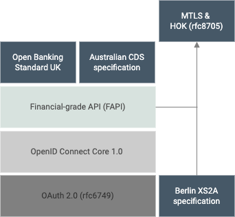

# API Security

Open Banking allows API consumers to access financial data through open APIs, which requires greater API security. Therefore, 
open banking standards provide guidelines for security implementations so that only the intended party can access 
information that the customer has given prior consent.

To achieve this, different specifications mandate security requirements via the relevant specification, which is built 
upon existing standards defined in OAuth 2.0 and OpenID specifications. The diagram below provides a brief idea of how 
certain specifications are built upon these specifications.

While some open banking specifications, such as the Open Banking Standard - UK and Consumer Data Standards - Australia 
mandated FAPI, others do not. However, regardless of your regional specification, WSO2 Open Banking Accelerator provides 
FAPI security standards because of the robust security standards offered by FAPI.

###MTLS enforcement

Authentication is a  crucial requirement in open banking to verify the authenticity of an API consumer before sharing the 
customer’s banking information. When an  API consumer invokes APIs, their private credentials can be shared in the requests, 
and it leads to credential leakages and data thefts. Therefore, Mutual Transport Layer Security (MTLS) is introduced as 
an authentication protocol where the API consumers do not need to send their private credentials.

MTLS handshake at the transport layer ensures that the corresponding API consumer possesses a secret key that is associated 
with the X509 certificate issued by a trusted Certificate Authority (CA).

In WSO2 Open Banking Accelerator, MTLS is enforced at the API Manager level to check if 

- the message context contains the transport certificate to make sure that the MTLS handshake is successful at the gateway
- the transport certificate bound to the application when invoking the APIs

There are two scenarios to consider for the MTLS validation:

1. If the client directly initiates an MTLS connection with the WSO2 API Manager Gateway, the issuer of the certificate needs 
to be present in the truststore of the gateway.

2. If the MTLS terminates at the load balancer prior to the gateway, the WSO2 API Manager Gateway expects the load balancer 
to send the client certificate as a header. In such scenarios, the WSO2 API Manager gateway expects the load balancer to 
perform the issuer validation.

###Certificate Revocation Validation 

A certificate is issued by a trusted organization commonly known as a CA. It is also known as 
a Trust Service Provider (TSP). These certificates are expected to be in use for their entire validity period. However, 
certain circumstances may cause a certificate to become invalid prior to the expiration of the validity period. 
For example, a compromise or suspected compromise of the corresponding private key may cause a certificate to become invalid 
prior to the expiration.  

A revocation request can originate from the National Competent Authority (NCA), which has authorised or registered an API 
consumer. The TSP revokes the certificate based on a verifiable and  authentic revocation request.

There are circumstances where the issuing CA needs to revoke the certificate prior to the scheduled expiry date so that the 
certificate would no longer be trusted. Therefore, it is required to check whether a given certificate is revoked by its 
issuer. That can be done through two protocols:

####Certificate Revocation List (CRL)
 
CRL is a list of digital certificates that have been revoked by the issuing CA.

####Online Certificate Status Protocol (OCSP)
 
OCSP is an internet protocol used for obtaining the revocation status of a digital certificate based on the certificate 
serial number. The OCSP validation is faster compared to the CRL validation.

By default, WSO2 Open Banking Accelerator verifies the revocation status of a certificate using the OCSP validation. If the 
OCSP validation is unsuccessful, the revocation status is verified using the CRL information. The certificate is rejected 
if none of these protocols is successful or if the required revocation information is not found on the certificate.

###Validate external API consumers

This validation allows banks to validate API consumers from the NCAs. This is done by 
validating the transport layer certificate an API consumer has obtained. 

###Role validation 
According to the [Open Banking Standard - UK](https://www.openbanking.org.uk/about-us/glossary/), API consumers have roles 
for the services they provide. The API consumer’s role is defined in the API consumer’s transport certificate (QWAC certificate 
that they obtain from an NCA), which WSO2 Open Banking Accelerator checks in the API and Dynamic Client Registration flows. 
If the role exists in the transport certificate, WSO2 Open Banking Accelerator allows the API consumer to invoke the API.

Following are the roles that an API consumer can have:

 | Role | Description  |
 |---------|---------    |
 |Account Information Service Provider|Provides an online service by sharing information on payment accounts held by a payment service user with payment service providers.|
 |Payment Initiation Services Provider|Provides an online service to initiate a payment order at the request of the payment service user with respect to a payment account held at another payment service provider.|
 |Card-Based Payment Instrument Issuer|Issues card-based payment instruments that can be used to initiate a payment transaction from a payment account held with another payment service provider.|

!!!tip
    An API consumer can have one or more roles. For example, if an API consumer provides an application to view account 
    information as well as to initiate payments, the roles of the API consumer are **Account Information Service Provider** 
    and **Payment Initiation Services Provider**.
     
###eIDAS 
The **electronic IDentification, Authentication and trust Services (eIDAS)** regulation provides unique identity schemas for individuals and businesses to access the publicly available online 
services in Europe. Among electronic Identification (eID) solutions, PSD2 recommends Qualified Website Authentication 
Certificate (QWAC) and Qualified Certificates for Electronic Seals (QSealC) to secure the transport layer and application 
layer with the API consumer.

####Qualified Web Authentication Certificate (QWAC)
QWAC validates the identity and the role of the [API consumer](#role-validation). During API invocations, API consumers can use their eIDAS 
QWAC to establish a secure TLS channel and protect the transport layer communication from potential attackers on the network. 

WSO2 Open Banking Accelerator validates the following aspects of the QWAC if it is used for an API invocation:

- The certificate is qualified, technically correct, and is not expired.
- The PSD2 information in the certificate such as PSD2 roles, Authorization Number matches with the API being invoked.
- The certificate is not revoked using CRL or Online OCSP validations.

####Qualified e-Seal Certificate (QSealC) 
QSealC seals application data and sensitive information to ensure that the origin of the document is trusted. WSO2 Open 
Banking Accelerator allows using QSealC as the signing certificates in application layer security to ensure protecting the 
data or messages from potential attackers during or after the communication.

Generally, open banking flows always consist of 3 different types of API requests by the client applications.
The following section lists the different security measures taken at each of the request types.

### Authorization Request

WSO2 Open Banking Accelerator supports the following security features and fulfil FAPI requirements 
during Authorization flows:

  - OIDC Hybrid Flow
    - Request object verification
    - Pushed Authorization Request validation
    - Pairwise Identifier support for ID tokens
  - Authorization Code Flow
    - When a request object is not available, support authentication mechanisms such as PKCE

You can use the provided extension points and customize the authorization flows. For more information, refer to the
[Authorization Flow Customization](../develop/keyid-provider.md) topic in the Develop section.

### Token Request

API consumer applications use the Token Endpoint to obtain access tokens, id tokens, and optionally, a refresh token.
Following security features are available in WSO2 Open Banking during Token flows.

- The API consumer application can authenticate the authorization server when accessing the token endpoint using any of 
the following methods:
    - Private key JWT authentication (Auth code grant)
    - MTLS authentication (Auth code grant)
    - Client Assertion (Client Credentials Grant)
- Bind consent Id and MTLS certificate to the token
- Provide verification mechanisms such as PKCE, if initiated in the authorization flow

You can use the provided extension points and customize the token flows. For more information, refer to the
[Token Flow Customization](../develop/jwt-access-tokens.md) topic in the Develop section.

### Resource Request

After an API consumer application obtains an access token, it is used to invoke a resource endpoint. In this request, 
the following validations will be performed:

- Token validity verification
- Token type verification (User Access Token/Application Access Token)
- Scopes/roles validation
- Token-bound certificate validation
- Consent validation

The resource requests go through token-bound certificate validations according to
[rfc8705](https://datatracker.ietf.org/doc/html/rfc8705)
The MTLS token binding happens once a token is issued to a particular client. This ensures that at the resource endpoint,
the provided MTLS certificate can be validated against the certificate bound to the token. Self-contained tokens are
used for this purpose and are bound to the tokens via a claim named `cnf`. For more information,
see [Token Authentication](token-authentication.md#certificate-bound-access-tokens).

Consent validation ensures that the API consumer application's resource requests adhere to the consent provided 
by the bank customers. This is a custom implementation as the behaviour of consent is defined by an open banking 
specification. You can use the [Consent Validate](../develop/consent-management-validate.md) endpoint and define the 
consent validations by comparing the resource requests against the user-provided consent.

