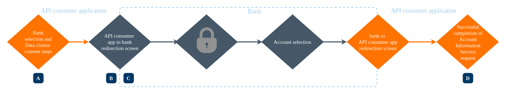
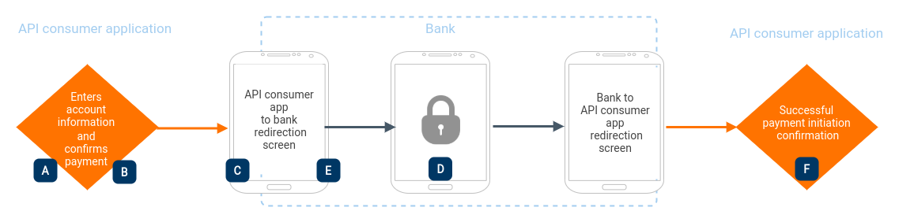
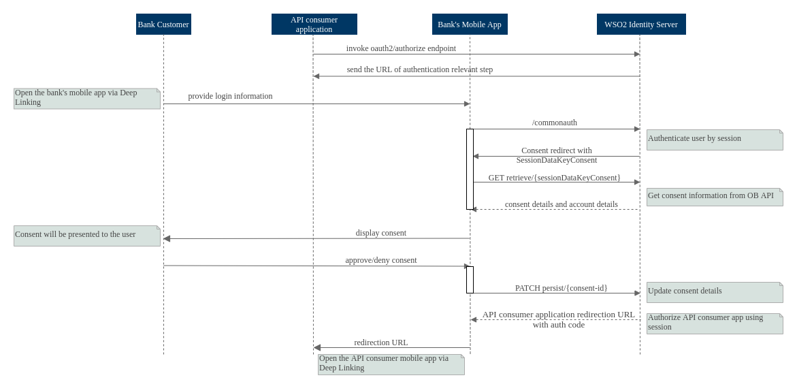

Based on user redirection, Consumer Authentication/Strong Customer Authentication (SCA) can happen in two different 
ways:

   1. Browser-based redirection
   2. App-based redirection
    
Browser-based redirection is the general redirection flow supported by most of the open banking specifications. Certain 
specifications like *Open Banking Standard - UK* and *NextGenPSD2XS2A - Berlin* mention an app-based redirection flow 
known as **App-to-App redirection**. 

!!! note
    WSO2 Open Banking supports both browser-based and app-based redirection flows.

Ideally, even when app-based redirection is used, browser-based redirection needs to be available for users 
who do not have the mobile application of the bank installed in their devices.

According to the OAuth2/OIDC Authorization Code Flow, the bank customer is redirected from the API consumer’s mobile 
application to the bank’s mobile application via mobile OS utilities. Upon successful authentication, the customer is 
redirected back to the API consumer's mobile application with the authentication code. 

!!!note 
    The [Open Banking Implementation Entity](https://openbanking.atlassian.net/wiki/spaces/DZ/pages/23889379/Deep+linking+for+App-to-App+redirection) 
    recommends App-to-App redirection as the preferred method of implementing SCA. Refer to the 
    [Implementing App-to-App Authorisation in OAuth2/OpenID Connect](https://openid.net/2019/10/21/guest-blog-implementing-app-to-app-authorisation-in-oauth2-openid-connect/) 
    blog, to gain a further understanding of this flow. *This link directs you to an external site and its content is 
    not owned by WSO2.*

## Customer Experience Guidelines
    
The bank’s interface and redirection may vary according to the service it provides. The following section explains some 
guidelines provided by the [Customer Experience Guidelines, Open Banking Standard - UK](https://www.openbanking.org.uk/wp-content/uploads/Customer-Experience-Guidelines-V1.3.0.pdf).

### Account Information Service

If the API consumer application is aggregating account information on behalf of the bank user, the APP-to-APP redirection 
flow is as follows: 

[  ](../assets/img/learn/app-to-app-redirection/ais-app-based-flow.png)

According to the [Customer Experience Guidelines, Open Banking Standard - UK](https://www.openbanking.org.uk/wp-content/uploads/Customer-Experience-Guidelines-V1.3.0.pdf), 
the following implementation steps are described explicitly:

!!! note
    According to [Open Banking Standard - UK](https://www.openbanking.org.uk/about-us/glossary/), when an API consumer 
    application provides the Account Information Service, it is known as an Account Information Service Provider (AISP).

| Implementation | Requirement | Participant |
|----------------|-------------|-------------|
| A- AISP requests the bank customer to identify the bank. | Required | AISP |
| B- The bank application loads for authentication (If the bank app resides in the same mobile device, or else redirect to the browser) | Required | bank |
| C- The customer consents to the accounts, which the AISP is allowed to have access | Required | Bank |
| D- Confirms the completion of AIS request | Recommended | AISP |
 
### Payment Initiation Service

If the API consumer application is initiating a credit transfer on behalf of the bank customer, the App-to-App redirection 
flow is as follows:

[  ](../assets/img/learn/app-to-app-redirection/pis-app-based-flow.png)

According to the [Customer Experience Guidelines, Open Banking Standard - UK](https://www.openbanking.org.uk/wp-content/uploads/Customer-Experience-Guidelines-V1.3.0.pdf), 
the following implementation steps are described explicitly:

!!! note
    According to [Open Banking Standard - UK](https://www.openbanking.org.uk/about-us/glossary/), when an API consumer 
    application provides the Payment Initiation Service, it is known as a Payment Initiation Services Provider (PISP).

| Implementation | Requirement | Participant |
| -------------- | ------------| ------------|
| A- The customer enters/selects the account associated with their bank | Required | PISP |
| B- Shares the information to obtain customer's consent before initiating a payment | Required | PISP |
| C- The bank application loads for authentication (If the bank app resides in the same mobile device, or else redirect to the browser) | Required | Bank |
| D- Display the minimum payment amount, currency, and payee account name to the customer | Required | Bank |
| E- The bank's app-based authentication must not be more than the number of steps the customer would go through when directly accessing the bank interface | Required | Bank |
| F- The customer needs to be directed back to the API consumer’s interface displaying the confirmation of successful payment initiation. | Required | PISP |

## How WSO2 Open Banking supports App-to-App redirection

[  ](../assets/img/learn/app-to-app-redirection/app-to-app-redirection-sequence-flow.png)

WSO2 Open Banking supports the App-to-App redirection flow as follows: 

The API consumer mobile application invokes the `authorize` endpoint, similar to a basic browser-based auth-code/hybrid 
redirect flow. When the bank’s mobile application is installed in the customer’s device with a deep link connected to 
this authorize request, the request is handled by the bank’s mobile application instead of the browser.

!!! note 
    If the bank’s mobile application is not available in the customer’s device, the customer is taken through a typical 
    browser-based flow. 
    
Once the mobile application handles the customer authentication and consent, it obtains a callback URI. This is the URL 
to the API consumer application. Using deep links, the bank application redirects the customer to the API consumer’s 
mobile application. Here, similar to the initial scenario, the callback URI is deep linked to the API consumer’s mobile 
application. Using this, the flow continues from the bank’s mobile application to the API consumer’s mobile application 
again.

In the App-to-App redirection method, the flow should be handled in the bank’s mobile application as follows:

1. The bank’s mobile application is opened using the deep link.
2. The application invokes the `/authorize` endpoint to initiate the authorization flow. The response redirect is sent 
by an authenticator that is customized to the app-based flow. 

    !!! note 
        You need to configure custom authenticators that address the requirements of both browser-based and app-based 
        redirection flows. For more information, see [Adding Custom Authenticators](https://is.docs.wso2.com/en/latest/develop/writing-a-custom-local-authenticator/#writing-a-custom-local-authenticator). 
   
    If this is not an error page or application callback redirect, the application can gain the authentication of the 
    bank customer. For example, using biometrics. 
    
    !!! info
        Based on the user agent of the auth request in the adaptive authentication script, a mobile app-based flow can 
        be detected. This states which authenticators need to be invoked in each scenario.

3. Once the authentication is provided, a `/commonauth` request has to be made. This is processed by the authenticator 
mentioned above. In a biometric scenario, since the verification happens in the mobile application, this request should 
guarantee non-repudiation and client identification. Given below is a sample request, modify the payload according to 
your requirements:

    ``` cURL
    curl -X POST \
      https://<IS_HOST>:9446/commonauth \
      -H 'Content-Type: application/x-www-form-urlencoded' \
      -d 'sessionDataKey=value&username=value&password=value'
    ```
   
       - It is recommended to have a key pair for the mobile application. So that the response can be included with a signed 
       JWT, which helps to identify the client with guaranteed non-repudiation.
       
4. Successful authentication prompts a redirection response to the consent page that contains `sessionDataKeyConsent`. 
This value is extracted and will be used in the next step.

5. The `authorize/retrieve` request has to be sent with the `SessionDataKeyConsent`. This is to retrieve the data that is 
required to display on the consent page.

6. After the user approves/denies the consent and selects the accounts, a `PATCH authorize/persist` request is made 
to persist the consent information.

7. Finally, if the persistence is successful, to complete the flow the `/authorize` endpoint is invoked. This results in 
a redirection to the callback URL of the API consumer application, which is deep linked to the API consumer application. 
Therefore, the customer is redirected to the mobile application of the API consumer. 