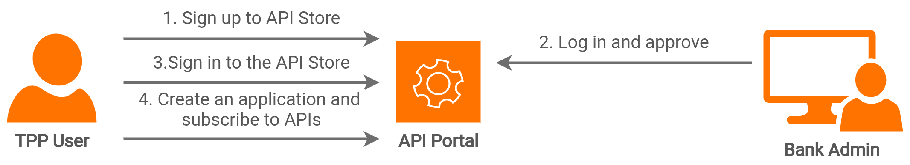
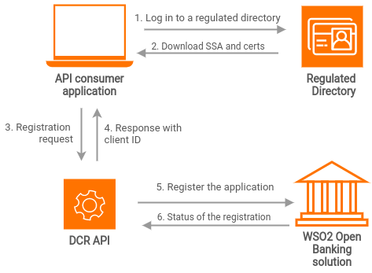

TPP onboarding is the process of registering a TPP with an ASPSP. The TPPs go through an in-depth verification during this process to make sure that the financial data and the applications are secured. This can be a manual or an automated process. The bank/ASPSP decides the TPP onboarding method.

The bank has to implement a proper TPP Onboarding process in its banking system. This registration process:

- Validates if the TPP is authorised by a competent authority
- Validates the TPP's information (TPP role, TPP ID, application type, and request issuance time) See the full list of request parameters that must be validated according to the specification.
- Allows accessing the banking APIs

For TPP Onboarding, the Open Banking Entities suggests the following processes: 

## Manual Client Registration

Manual Client Registration or Signup Workflow is the process of on boarding the TPPs through the Dev Portal Signuo process. In this method, you can configure workflows to approve TPPs who signup and the applications that are registered.

Examples of Manual Client Registration

1. The ASPSP requests TPP information using a customised signup form during the signup process. 
2. The ASPSP requests basic information of the TPP during the signup process and lets the TPPs try out the production/sandbox environment. The ASPSP requests more details during the (production/sandbox) application access key generation process.

In both of these scenarios, the ASPSPs will approve the TPP based on its information and let the applications use the APIs. For more information, refer [Manual Client Registration](../learn/manual-client-registration.md).

## Dynamic Client Registration

With the Open Banking OpenID Dynamic Client Registration API, TPPs can register with ASPSPs in a seamless and a fully automated basis. To use DCR, a TPP has to register at a competent authority and obtain SSA and relevant certificates. 

### Software Statement Assertion (SSA)

A software statement that is signed by its issuer is referred to as an SSA. An SSA is represented as a JSON Web Signature (JWS). An SSA is unique for an application and contains metadata of the client to be created. It also ensures that the TPP is trusted and is allowed to consume banking APIs and provide services.

- The TPP submits the SSA to an ASPSP to create OAuth clients that are registered with the ASPSP. 
- WSO2 Open Banking supports Dynamic Client Registration (DCR) API.
- DCR API supersedes the OpenID Connect (OIDC) Dynamic Client Registration profile.

The diagram below shows the flow of the dynamically registering a client application. 

The TPPs need to obtain the Software Statement Assertion (SSA) from a directory solution provider. For example, Open Banking Directory. The DCR API v3.2 consist of POST, GET, PUT and DELETE endpoints. These endpoints rely on the Client Credential Grant Type and TLS Mutual Authentication for authenticating the TPP.  For more information, refer [Dynamic Client Registration](../learn/dynamic-client-registration.md).