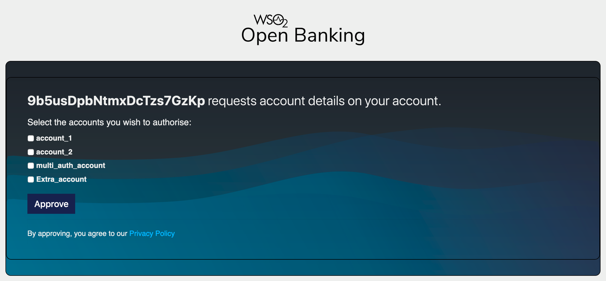
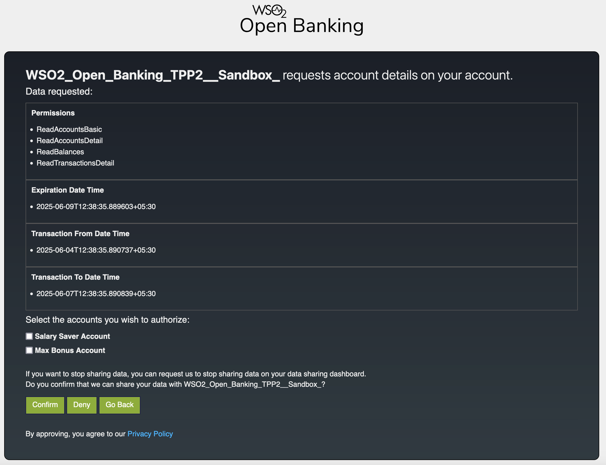

This document provides instructions for trying out consent initiation, retrieval, update, and deletion flows. These endpoints are provided by the WSO2 Accelerator and can be used as backend services for the consent endpoints defined in the Open Banking specification.

 

!!! tip "Prerequisites" 
    - Before you try out the consent flow, you need to do the following:
        - Configure API Resources, Users and Roles.
        - Assign roles to the user.
        - Register an application for the API consumer.


!!! note
    - Replace the <AUTH_HEADER_VALUE> with Base64 encoded "admin_username:admin_password" value.
      `Eg: Base64(admin_username:admin_password)`
    - You can try out this sample flow with the transport certificates available [here](../../assets/attachments/transport-certs).
                
### Consent Initiation

- In this step, a request is created to obtain the customer’s consent to access their bank accounts and related information. A sample consent initiation request is shown below:

    ``` bash
    curl -X POST \
     'https://<IS_HOSTNAME>:9446/api/fs/consent/manage/account-access-consents' \
    -H 'Authorization: Basic <AUTH_HEADER_VALUE>' \
    -H 'x-wso2-client-id: <CLIENT_ID>' \
    -H 'x-fapi-interaction-id: <INTERACTION_ID>' \
    -H 'Content-Type: application/json' \
    --cert <TRANSPORT_PUBLIC_KEY_FILE_PATH> --key <TRANSPORT_PRIVATE_KEY_FILE_PATH> \
    --data '{
      "Data": {
          "TransactionToDateTime": "2026-03-19T13:46:07.270659+05:30",
          "ExpirationDateTime": "2026-03-21T13:46:07.269894+05:30",
          "Permissions": [
              "ReadAccountsBasic",
              "ReadAccountsDetail",
              "ReadBalances",
              "ReadTransactionsDetail"
          ],
          "TransactionFromDateTime": "2026-03-16T13:46:07.270580+05:30"
      },
      "Risk": {
          
      }
    }'
    ```
  
- The response contains a Consent ID. A sample response looks as follows:

    ``` json
    {
      "Data": {
          "StatusUpdateDateTime": "2026-03-16T13:46:08+05:30",
          "Status": "AwaitingAuthorisation",
          "CreationDateTime": "2026-03-16T13:46:08+05:30",
          "TransactionToDateTime": "2026-03-19T13:46:07.270659+05:30",
          "ExpirationDateTime": "2026-03-21T13:46:07.269894+05:30",
          "Permissions": [
              "ReadAccountsBasic",
              "ReadAccountsDetail",
              "ReadBalances",
              "ReadTransactionsDetail"
          ],
          "ConsentId": "328524c0-b4a3-457e-a145-e79d92c4654e",
          "TransactionFromDateTime": "2026-03-16T13:46:07.270580+05:30"
      },
      "Risk": {
          
      }
    }    
    ```

### Authorize a consent

The bank sends the request to the customer stating the accounts and information that the API consumer wishes to access.
    
  1. Generate the request object by signing the following JSON payload using the supported algorithms. Given below is 
  a sample request object in the JWT format:
  
      ``` tab='Sample'
      eyJraWQiOiJfTG03VFVWNF8yS3dydWhJQzZUWTdtel82WTQxMlhabG54dHl5QXB6eEw4IiwiYWxnIjoiUFMyNTYiLCJ0eXAiOiJKV1QifQ.eyJtYXhfYWdlIjo4NjQwMCwiYXVkIjoiaHR0cHM6Ly9sb2NhbGhvc3Q6OTQ0Ni9vYXV0aDIvdG9rZW4iLCJzY29wZSI6ImFjY291bnRzIG9wZW5pZCIsImlzcyI6IjRoWklMQVRmUHlYbExGcWtQM1owT0JZaG1Ed2EiLCJjbGFpbXMiOnsiaWRfdG9rZW4iOnsiYWNyIjp7InZhbHVlcyI6WyJ1cm46b3BlbmJhbmtpbmc6cHNkMjpzY2EiLCJ1cm46b3BlbmJhbmtpbmc6cHNkMjpjYSJdLCJlc3NlbnRpYWwiOnRydWV9LCJvcGVuYmFua2luZ19pbnRlbnRfaWQiOnsidmFsdWUiOiI4NmM4YTA4NS1hNDQ0LTQyZDUtYmU0My05NjhiMzY2YTU0NjciLCJlc3NlbnRpYWwiOnRydWV9fSwidXNlcmluZm8iOnsib3BlbmJhbmtpbmdfaW50ZW50X2lkIjp7InZhbHVlIjoiODZjOGEwODUtYTQ0NC00MmQ1LWJlNDMtOTY4YjM2NmE1NDY3IiwiZXNzZW50aWFsIjp0cnVlfX19LCJyZXNwb25zZV90eXBlIjoiY29kZSBpZF90b2tlbiIsInJlZGlyZWN0X3VyaSI6Imh0dHBzOi8vd3d3Lmdvb2dsZS5jb20vIiwic3RhdGUiOiJZV2x6Y0Rvek1UUTIiLCJleHAiOjE2MzM1ODY0MDgsIm5vbmNlIjoibi0wUzZfV3pBMk1qIiwiY2xpZW50X2lkIjoiNGhaSUxBVGZQeVhsTEZxa1AzWjBPQllobUR3YSJ9.LytrdYnlos_hq5p21KVf8P0KkixetUseR1RnhMLtvQJOZow2vspm-XGltU5b4ciFdfdvkRvOh4qSjFozrYabMDToUnSDjoxyLTi5e5kBld81SyWeCt2XQwMV1qQdS4N-ISuTHHUsECox73-rF5kRmi_8RFfJSi2fUjtXkGZpo5JhQIJ1v37IQrOi3RlPhhH33kiVataXtWP1Dy5c28xAKXFaMkm7apRT5X6Rf1s34A9iouQuuxdVi6PCrwFutbYZnrNwy8EW7UMI7YNZsrkfhcXgJt0BMMsgNdIhYXdr7Ui3_q-ICi6zMRQuov0yTbVuHEkjsK2u81EIV3e2C_u_Jg
      ```
      
      ``` tab='Format'
      {
        "kid": "<The KID value of the signing jwk set>",
        "alg": "<SUPPORTED_ALGORITHM>",
        "typ": "JWT"
      }
      {
        "max_age": 86400,
            "aud": "<This is the audience that the ID token is intended for. Example: https://<IS_HOST>:9446/oauth2/token>",
        "scope": "accounts openid",
        "iss": "<CLIENT_ID>",
        "claims": {
          "id_token": {
            "acr": {
              "values": [
                "urn:openbanking:psd2:sca",
                "urn:openbanking:psd2:ca"
              ],
              "essential": true
            },
            "openbanking_intent_id": {
              "value": "<CONSENTID>",
              "essential": true
            }
          },
          "userinfo": {
            "openbanking_intent_id": {
              "value": "<CONSENTID>",
              "essential": true
            }
          }
        },
        "response_type": "code id_token",  
        "redirect_uri": "<CLIENT_APPLICATION_REDIRECT_URI>",
        "state": "YWlzcDozMTQ2",
        "exp": <The expiration time of the request object in Epoch format>,
        "nonce": "<PREVENTS_REPLAY_ATTACKS>",
        "client_id": "<CLIENT_ID>"
      }
      ```
      
  2. The request that the bank sends to the customer is in the format of a URL as follows: 
         
    ``` url tab="Sample"
    https://localhost:9446/oauth2/authorize?response_type=code%20id_token&client_id=LvbSjaOIUPmAWZT8jdzyvjqCqY8a&redirect_uri=https://wso2.com&scope=openid accounts&state=0pN0NBTHcv&nonce=jBXhOmOKCB&request=<REQUEST_OBJECT>
    ```
   
    ``` url tab="Format"
    https://<IS_HOST>:9446/oauth2/authorize?response_type=code%20id_token&client_id=<CLIENT_ID>&scope=accounts%20op
    enid&redirect_uri=<APPLICATION_REDIRECT_URI>&state=YWlzcDozMTQ2&request=<REQUEST_OBJECT>&prompt=login&nonce=<REQUEST_OBJECT_NONCE>
    ```
    
  3. Change the value of the `<CLIENT_ID>` placeholder with the value you obtained in the application registration.
    
  4. Upon successful authentication, the user is redirected to the consent authorize page. Use the login 
  credentials of a user that has a `subscriber` role. 
    
  5. You can view the list of bank accounts and the information that the API consumer wishes to access.
       
  
  6. Data requested by the consent such as permissions, transaction period, and expiration date are displayed. 
  Click **Confirm** to grant these permissions.
     
  
  7. Upon providing consent, an authorization code is generated on the URL of the web page defined in `redirect_uri`.
  See the sample given below:
  
    - The authorization code from the below URL is in the code parameter (`code=e61579c3-fe9c-3dfe-9af2-0d2f03b95775`).
  
      ```
      https://wso2.com/#code=e61579c3-fe9c-3dfe-9af2-0d2f03b95775&id_token=eyJ4NXQiOiJNell4TW1Ga09HWXdNV0kwWldObU5EY3hOR1l3WW1
      NNFpUQTNNV0kyTkRBelpHUXpOR00wWkdSbE5qSmtPREZrWkRSaU9URmtNV0ZoTXpVMlpHVmxOZyIsImtpZCI6Ik16WXhNbUZrT0dZd01XSTBaV05tTkRjeE5
      a4f936c74e2ca7f4250208aa42.sk_04ejciXBj6DnpALyYaw
      ```
 
### Retrieve a consent 

- Consent Retrieval endpoint can be used to retrieve a consent resource that they have created to check its status. A sample request to retrieve a consent looks as follows:

``` bash
curl -X GET \
  https://<IS_HOSTNAME>:9446/api/fs/consent/manage/account-access-consents/<CONSENT_ID> \
  -H 'Authorization: Basic <AUTH_HEADER_VALUE>' \
  -H 'x-wso2-client-id: <CLIENT_ID>' \
  -H 'x-fapi-interaction-id: <INTERACTION_ID>' \
  -H 'Accept: application/json' \
  -H 'charset: UTF-8' \
  -H 'Content-Type: application/json; charset=UTF-8' \
  --cert <PUBLIC_KEY_FILE_PATH> --key <PRIVATE_KEY_FILE_PATH>
```
- A sample response looks as follows:
``` json
{
  "Data": {
      "StatusUpdateDateTime": "2026-03-16T13:46:08+05:30",
      "Status": "AwaitingAuthorisation",
      "CreationDateTime": "2026-03-16T13:46:08+05:30",
      "TransactionToDateTime": "2026-03-19T13:46:07.270659+05:30",
      "ExpirationDateTime": "2026-03-21T13:46:07.269894+05:30",
      "Permissions": [
          "ReadAccountsBasic",
          "ReadAccountsDetail",
          "ReadBalances",
          "ReadTransactionsDetail"
      ],
      "ConsentId": "328524c0-b4a3-457e-a145-e79d92c4654e",
      "TransactionFromDateTime": "2026-03-16T13:46:07.270580+05:30"
  },
  "Risk": {
      
  }
}
```

### Retrieve internal details of consent 

- WSO2 Accelerator provides an internal consent-retrieval endpoint to retrieve details of a consent resource and check its authorizations. This endpoint can be invoked only by banks, with the `x-wso2-internal-request` header. A sample request to retrieve a consent looks as follows:

``` bash
curl -X GET \
  https://<IS_HOSTNAME>:9446/api/fs/consent/manage/account-access-consents/<CONSENT_ID> \
  -H 'Authorization: Basic <AUTH_HEADER_VALUE>' \
  -H 'x-wso2-internal-request: true' \
  -H 'x-wso2-client-id: <CLIENT_ID>' \
  -H 'x-fapi-interaction-id: <INTERACTION_ID>' \
  -H 'Accept: application/json' \
  -H 'charset: UTF-8' \
  -H 'Content-Type: application/json; charset=UTF-8' \
  --cert <PUBLIC_KEY_FILE_PATH> --key <PRIVATE_KEY_FILE_PATH>
```

- A sample response looks as follows:

``` json
{
    "validityPeriod": 1774080967,
    "consentAttributes": {
        
    },
    "updatedTime": 1773648968,
    "consentID": "328524c0-b4a3-457e-a145-e79d92c4654e",
    "clientID": "7bw8O8_7_E7s2Y6reXupdwXqGm4a",
    "consentType": "accounts",
    "createdTime": 1773648968,
    "recurringIndicator": false,
    "receipt": "{\"Data\": {\"Permissions\": [\"ReadAccountsBasic\", \"ReadAccountsDetail\", \"ReadBalances\", \"ReadTransactionsDetail\"], \"ExpirationDateTime\": \"2026-03-21T13:46:07.269894+05:30\", \"TransactionToDateTime\": \"2026-03-19T13:46:07.270659+05:30\", \"TransactionFromDateTime\": \"2026-03-16T13:46:07.270580+05:30\"}, \"Risk\": {}}",
    "authorizationResources": [
        {
            "authorizationID": "7b77e19b-e588-49b9-a4fb-937c66f589ce",
            "authorizationType": "authorisation",
            "resources": [
                
            ],
            "authorizationStatus": "Created"
        }
    ],
    "consentFrequency": 0,
    "status": "AwaitingAuthorisation"
}
```

### Update a consent

- In this step, the Bank creates a request to update the consent of the customer. This endpoint is an internal endpoint which can be invoked by the banks only with WSO2 Internal header. A sample consent update request looks as follows:

``` bash
curl -X PUT \
https://<IS_HOSTNAME>:9446/api/fs/consent/manage/account-access-consents/<CONSENT_ID> \
-H 'Authorization: Basic <AUTH_HEADER_VALUE>' \
-H 'x-wso2-client-id: <CLIENT_ID>' \
-H 'x-wso2-internal-request: true' \
-H 'x-fapi-interaction-id: <INTERACTION_ID>' \
-H 'Content-Type: application/json' \
--cert <TRANSPORT_PUBLIC_KEY_FILE_PATH> --key <TRANSPORT_PRIVATE_KEY_FILE_PATH> \
--data '{
    "consentID": "328524c0-b4a3-457e-a145-e79d92c4654e",
    "status": "AwaitingAuthorisation",
    "validityPeriod": 1774080967,
    "recurringIndicator": true,
    "consentFrequency": 0,
    "receipt": "{\"Data\": {\"Permissions\": [\"ReadAccountsBasic\",\"ReadAccountsDetail\",\"ReadBalances\"],\"ExpirationDateTime\": \"2026-03-17T15:43:35.946770+05:30\",\"TransactionFromDateTime\": \"2026-03-12T15:43:35.947399+05:30\",\"TransactionToDateTime\": \"2026-03-15T15:43:35.947514+05:30\"},\"Risk\": { }}",
    "consentAttributes": {
        "key1": "value1",
        "key2": "value2"
    },
    "authorizationResources": [
        {
            "userID": "admin@wso2.com",
            "authorizationType": "auth",
            "authorizationStatus": "Created",
            "resources": [
                {
                    "accountID": "1962368",
                    "permission": "account",
                    "mappingStatus": "active"
                }
            ]
        }
    ]
}'
```
  
- A sample response looks as follows:

``` json
{
    "validityPeriod": 1774080967,
    "consentAttributes": {
        "key1": "value1",
        "key2": "value2"
    },
    "updatedTime": 1773648968,
    "consentID": "328524c0-b4a3-457e-a145-e79d92c4654e",
    "clientID": "7bw8O8_7_E7s2Y6reXupdwXqGm4a",
    "consentType": "accounts",
    "createdTime": 1773648968,
    "recurringIndicator": true,
    "receipt": "{\"Data\": {\"Permissions\": [\"ReadAccountsBasic\", \"ReadAccountsDetail\", \"ReadBalances\"], \"ExpirationDateTime\": \"2026-03-17T15:43:35.946770+05:30\", \"TransactionToDateTime\": \"2026-03-15T15:43:35.947514+05:30\", \"TransactionFromDateTime\": \"2026-03-12T15:43:35.947399+05:30\"}, \"Risk\": {}}",
    "authorizationResources": [
        {
            "authorizationID": "f562ce1f-7afc-4b6f-ac9d-2c3b1b5633d3",
            "authorizationType": "auth",
            "resources": [
                {
                    "mappingStatus": "active",
                    "mappingID": "eeb76808-ce1c-4cdb-b161-b5b370c5827e",
                    "accountID": "1962368",
                    "permission": "account"
                }
            ],
            "authorizationStatus": "Created",
            "userID": "admin@wso2.com"
        }
    ],
    "consentFrequency": 0,
    "status": "AwaitingAuthorisation"
}  
```

### Delete a consent

- If the customer revokes a consent to data access, a request should be made to delete the consent resource. A sample request to delete a consent looks as follows:

``` bash
curl -X DELETE \
  https://<IS_HOSTNAME>:9446/api/fs/consent/manage/account-access-consents/<CONSENT_ID> \
  -H 'Authorization: Basic <AUTH_HEADER_VALUE>' \
  -H 'x-wso2-client-id: <CLIENT_ID>' \
  -H 'x-fapi-interaction-id: <INTERACTION_ID>' \
  -H 'Accept: application/json' \
  -H 'charset: UTF-8' \
  -H 'Content-Type: application/json; charset=UTF-8' \
  --cert <PUBLIC_KEY_FILE_PATH> --key <PRIVATE_KEY_FILE_PATH>
```
- If the deletion is successful you will get a `204 No Content` response.
