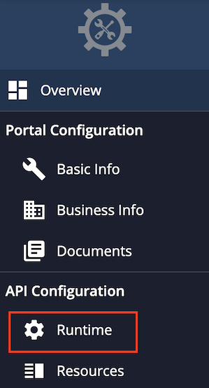
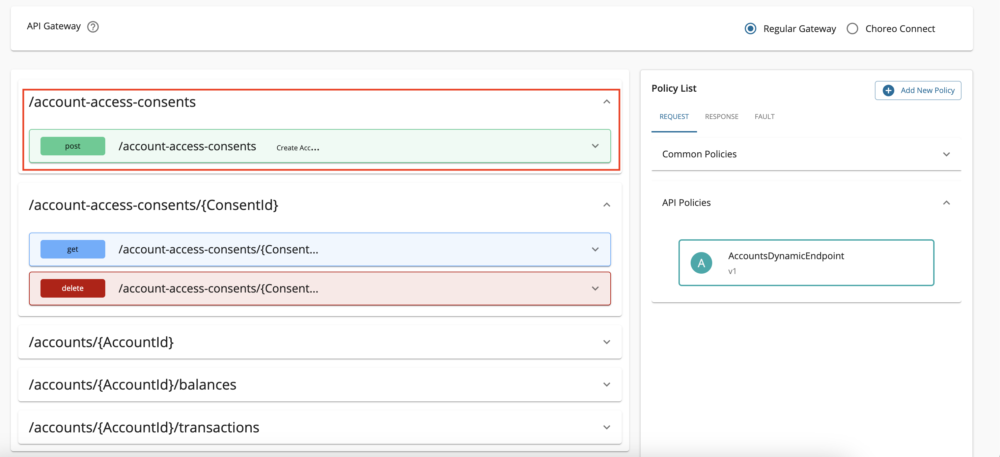
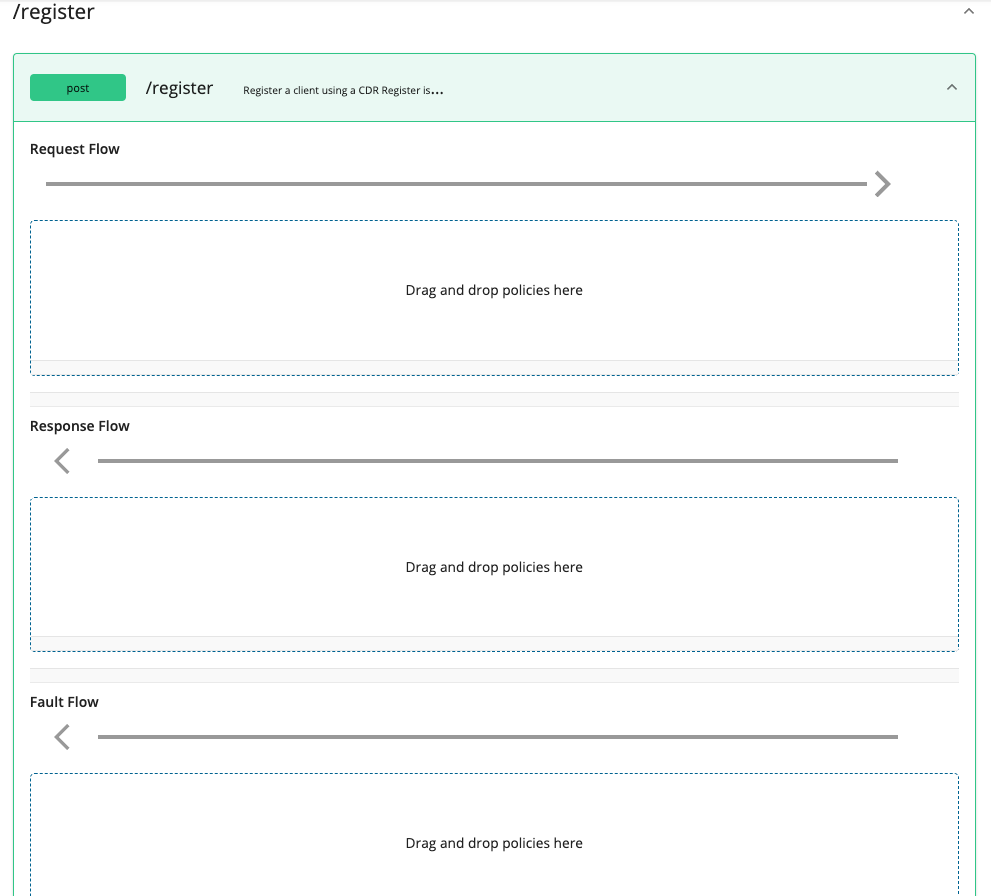
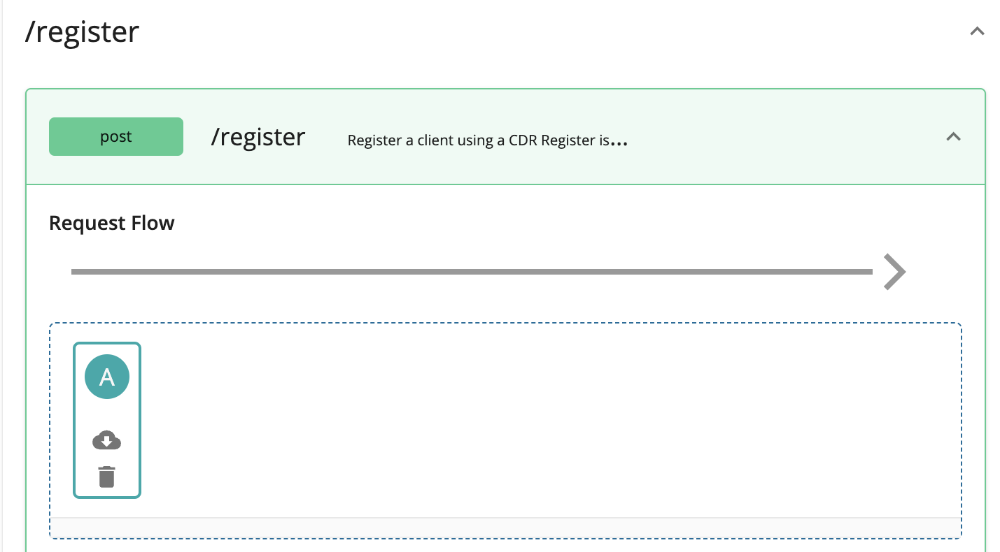
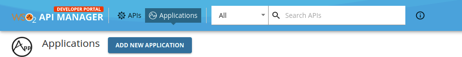
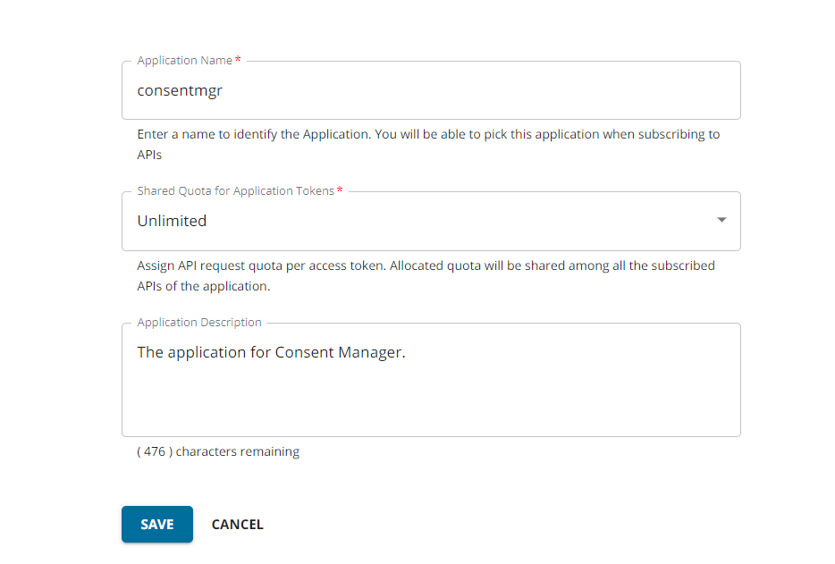
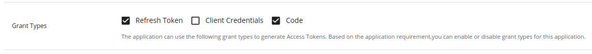
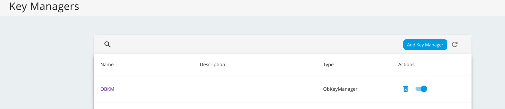
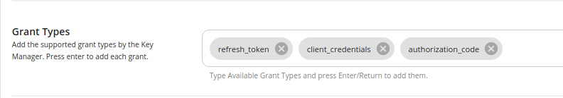
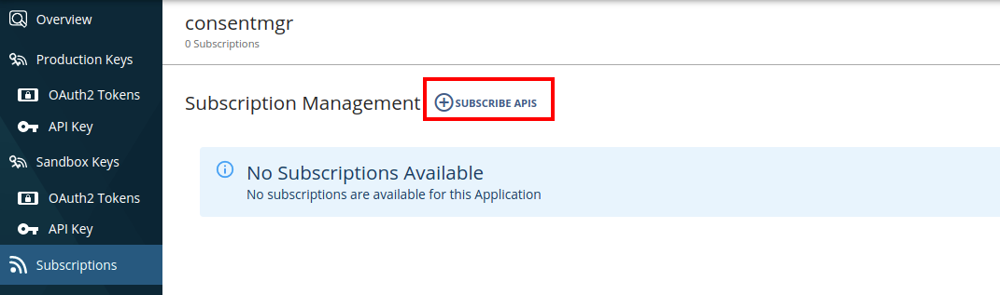

After a certain period, bank customers may need to view, update, or revoke consents they have granted to API consumer 
applications to access account data. **Consent Manager** is an application in WSO2 Open Banking that supports all these
requirements and manages consents.

!!! tip
    You can use the [/admin endpoint in Consent REST API](../references/consent-rest-api.md#/Admin) 
    to retrieve consent details and customize Consent Manager. For example,

    ``` 
    curl -X GET "https://localhost:9446/api/openbanking/consent/admin/search?consentIDs=12345&clientIDs=5678&consentTypes=accounts&consentStatuses=authorized&userIDs=user1&fromTime=12012020&toTime=12012021&limit=10&offset=0" -H "accept: application/json"
    ```

!!! note
    - Bank officers with the `CustomerCareOfficerRole` role and bank customers can access the Consent Manager.  
    - Customer Care Officers have privileges such as Advanced Search options and the ability to view the consents of all bank customers. 
    
## Configuring servers

1. Open the `<IS_HOME>/repository/conf/deployment.toml` file and update access control configurations for the 
`consentmgr` resource as follows: 

    ``` toml
    [[resource.access_control]]
    context = "(.*)/consentmgr(.*)"
    secure="false"
    http_method="GET,DELETE"
    ```
   
2. Open the `<APIM_HOME>/repository/conf/deployment.toml` file and add the following gateway executor configurations for 
the Consent flow:
   
    ``` toml
    [[open_banking.gateway.openbanking_gateway_executors.type]]
    name = "Consent"
    [[open_banking.gateway.openbanking_gateway_executors.type.executors]]
    name = "com.wso2.openbanking.accelerator.gateway.executor.impl.selfcare.portal.UserPermissionValidationExecutor"
    priority = 1
    ``` 
   
3. Restart the Identity Server and API Manager servers respectively.

## Creating users and roles

Follow [Configuring users and roles](../install-and-setup/configuring-users-and-roles.md) and do the following:

 1. Create a user and assign the `CustomerCareOfficerRole` role.
    
 2. Create 2 other users and assign them only the `Internal/subscriber` role. 

## Publishing Self-Care Portal API 

1. Sign in to the API Publisher Portal at `https://<APIM_HOST>:9443/publisher` with `creator/publisher` privileges. 

2. On the homepage, go to **REST API** and select **Import Open API**. 

3. Select **OpenAPI File/Archive**.

4. Download the `scp-swagger.yaml` file available <a href="../../assets/attachments/scp-swagger.yaml" download> here </a>.

5. Click **Browse File to Upload** and use the `scp-swagger.yaml` file.

6. Click **Next**. 

7. Set the value for **Endpoint** as follows:

    ``` 
    https://<IS_HOST>:9446/api/openbanking/consent
    ```
   
    - Replace the placeholder with the hostname of Identity Server. 
    
8. Click **Create**. 

9. Go to **Portal Configurations > Subscriptions > Select Business Plan as 'Unlimited'** using the left menu pane.

10. Add a custom policy. Follow the instructions given below according to the API Manager version you are using:

    ??? note "Click here to see how to add a custom policy if you are using API Manager 4.0.0..."
    
        1. Go to **Develop > API Configurations > Runtime** using the left menu pane.   
        
            
        2. Click the edit button under **Request > Message Mediation**.
        
           
        3. Now, select the **Custom Policy** option. 
        
        4. Download the `scp-insequence.xml` file available <a href="../../assets/attachments/scp-insequence.xml" download> here </a> and use it as the Mediation Policy. 
        
        5. Upload the `scp-insequence.xml` file and click **SELECT**.
        
        6. Scroll down and click **SAVE**. 

    ??? note "Click here to see how to add a custom policy if you are using API Manager 4.1.0 or 4.2.0..."
        
        1. Go to **Develop -> API Configurations -> Policies** in the left menu pane.<br><br>
        <div style="width:40%">
        
        </div>

        2. On the **Policy List** card, click on **Add New Policy**.

        3. Fill in the **Create New Policy**.

        4. Download the `scp-insequence.xml` file available <a href="../../assets/attachments/scp-insequence.xml" download> here </a> and use it as the Mediation Policy. 
        
        5. Upload the `scp-insequence.xml` file and click **SELECT**.

        6. Scroll down and click **Save**. Upon successful creation of the policy, you receive an alert as shown below: <br><br>
        <div style="width:35%">
        
        </div>

        7. Expand the API endpoint you want from the list of API endpoints. For example: 

        8. Expand the HTTP method from the API endpoint you selected. For example: 

        9. Drag and drop the previously created policy to the **Request Flow** of the API endpoint. 

        10. Select **Apply to all resources** and click **Save**.

        11. Scroll down and click **Save**.

11. Go to **Overview** using the left menu pane.
 
12. Click **Deploy**. 

13. Set the API Gateways configurations and deploy the API.

14. Go back to **Overview**.

15. Click **Publish**.

## Subscribing to Self-Care Portal API

1. Sign in to the Developer Portal at `https://<APIM_HOST>:9443/devportal` with `Internal/subscriber` privileges.

2. Go to the **Applications** tab and click **ADD NEW APPLICATION**. 

3. Enter `consentmgr` as the name of the application and click **Save**.  

4. Go to the left menu pane and select **Production Keys** or **Sandbox Keys** to generate keys.

5. Set the **Grant Types** to **Refresh Token** and **Code**.

    [  ](../assets/img/learn/consent-manager/generate-keys.png)
    
    ??? tip "If these grant types are not visible in the Developer Portal, click here to see how to configure them. "
        Follow the steps below and configure the Grant Types for the Key Manager according to your Open Banking specification:
        
        1. Sign in to the Admin Portal of API Manager at `https://<APIM_HOST>:9443/admin`.
        
        2. Go to the `Key Managers` tab using the left menu pane.
        
        3. Select the **OBKM** key manager. 
        
        4. Enter the required grant types and press enter. 
        
        5. Scroll down and click **Update**.
        
        For more information see, [Configure Identity Server as the Key Manager](../dynamic-client-registration-try-out/#step-2-configure-is-as-key-manager).
    
6. Set the **Callback URL** to `https://<IS_HOST>:9446/consentmgr/scp_oauth2_callback`.

    - Replace the placeholder with the hostname of the Identity Server.

7. Leave their default values for other configurations.

8. Scroll down and click **GENERATE KEYS**.

9. A message box will display the access token. 

10. You can see that the consumer key and consumer secret are generated for the `consentmgr` application.  

11. Now, go to the left menu pane and select **Subscriptions**.

12. Click **SUBSCRIBE APIS**. 

13. Find the **SelfCarePortalAPI** from the list and click the **Subscribe** button corresponding to it.

## Configuring Consent Manager

!!! note
    We recommend that you use the latest version of the WSO2 Open Banking Identity Server Accelerator.

1. Open the `<IS_HOME>/repository/deployment/server/webapps/consentmgr/runtime-config.js` file.

2. Follow the below instructions if you are using **WSO2 Open Banking Identity Server Accelerator at U2 level 3.0.0.76 or above**, 
          
    - If the Consent Manager Portal is deployed on the WSO2 Identity Server, use the default configuration given below.
    
        ```javascript
        window.env = {
            // This option can be retrieved in "src/index.js" with "window.env.API_URL".
            USE_DEFAULT_CONFIGS: true,
            SERVER_URL: 'https://localhost:9446',
            SPEC: 'Default',
            TENANT_DOMAIN: 'carbon.super',
            NUMBER_OF_CONSENTS: 20,
            VERSION: '3.0.0'
          };
        ```
    
    - If you are using a different server instance for the Identity Server, update the above configurations as follows. 
    
        1. Set the `USE_DEFAULT_CONFIGS` parameter to `false`. 
        
        2. Update the `SERVER_URL` parameter with the URL of the Identity Server.
    
    ??? tip "Click here to see how to configure the above if you are not using the latest version of the WSO2 Open Banking Identity Server Accelerator."
        Update the `SERVER_URL` parameter with the URL to the Identity Server. For example:
            
           ``` javascript
           window.env = {
               // This option can be retrieved in "src/index.js" with "window.env.API_URL".
               SERVER_URL: 'https://localhost:9446',
               TENANT_DOMAIN: 'carbon.super',
               NUMBER_OF_CONSENTS: 25,
               VERSION: '3.0.0'
             };
           ```
      
3. If you are using **WSO2 Open Banking Identity Server Accelerator at U2 level 3.0.0.73 or above**, open the `<IS_HOME>/repository/conf/deployment.toml` file and update the configurations.
 
    | Configuration | Description |
    | ----------| ------------|
    | `identity_server_base_url` | The hostname of the Identity Server. |
    | `api_manager_server_base_url` | The hostname of the API Manager. |
    | `client_id` | The Consumer Key of the [application created](#subscribing-to-self-care-portal-api). |
    | `client_secret` | The Consumer Secret of the [application created](#subscribing-to-self-care-portal-api). |
     
    For example, 
    
    ``` toml
    [open_banking.consent.portal.client_credentials]
    client_id="2zB5s9wGHWVwmlrvHdWa6Mwc4vsa"
    client_secret="cqblprasAniVfi02IXGFvp8VREAa"
    
    [open_banking.consent.portal.params]
    identity_server_base_url="https://localhost:9446"
    api_manager_server_base_url="https://localhost:8243"
    ```
    
    ??? tip "Click here to see how to configure the above if you are not using the latest version of the WSO2 Open Banking Identity Server Accelerator."

        Open the `<IS_HOME>/repository/deployment/server/webapps/consentmgr/WEB-INF/web.xml` file and update the configurations.

        | Configuration | Description |
        | ----------| ------------|
        | `identityServerBaseUrl` | The hostname of the Identity Server. |
        | `apiManagerServerUrl` | The hostname of the API Manager. |
        | `scpClientKey` | The Consumer Key of the [application created](#subscribing-to-self-care-portal-api). |
        | `scpClientSecret` | The Consumer Secret of the [application created](#subscribing-to-self-care-portal-api). |
        
        For example,
        
        ``` xml
        <context-param>
            <param-name>identityServerBaseUrl</param-name>
            <param-value>https://localhost:9446</param-value>
        </context-param>
        <context-param>
            <param-name>apiManagerServerUrl</param-name>
            <param-value>https://localhost:8243</param-value>
        </context-param>
        <context-param>
            <param-name>scpClientKey</param-name>
            <param-value>2zB5s9wGHWVwmlrvHdWa6Mwc4vsa</param-value>
        </context-param>
        <context-param>
            <param-name>scpClientSecret</param-name>
            <param-value>cqblprasAniVfi02IXGFvp8VREAa</param-value>
        </context-param>
        ```

## Using Consent Manager

1. Go to the Consent Manager application at
   `https://<IS_HOST>:9446/consentmgr` 

2. Sign in with the credentials provided by the bank.

3. The `consentmgr` application requests access to your profile. To grant access, click **Continue**.
    
    

4. You are redirected to the homepage of the Consent Manager portal.

    

The three tabs are as follows:

   - **Active**: Lists active consents that can access your account/payment information.
   - **Expired**: Lists expired consent that cannot access your account/payment information anymore.
   - **Withdrawn**: Lists the consents that you have revoked.

!!! tip
    Use the **Search** button to search consents.

### Viewing consent details

- To view consent details, click the respective `Action` button. 

    

- You can view the details such as the associated API consumer application, consent granted date, consent expiry date, 
account numbers, and permissions that you have granted.

    

### Revoking a consent

- To revoke a consent, review the details and click **Stop Sharing**. 
    
    
    
- Revoking a consent consists of 2 steps:

    - Step 1: The first step shows the impact of withdrawing the consent.
    
        
    
    - Step 2: Displays the information the consent has access to. 
    
        
    
- Once you click **Stop Sharing**, the status of the consent changes to `withdrawn`. You can find this consent in the 
**Withdrawn** tab now.

!!!note
    To learn about customizing the Consent Manager Portal, see the [Customize the Consent Manager Portal](../develop/customize-consent-manager-portal) documentation.