After a certain period, bank customers may need to view, update, or revoke consents they have granted to API consumer 
applications to access account data. **Consent Manager** is an application in WSO2 Open Banking that supports all these
requirements and manage consents.

!!! note
    Bank officers with the `CustomerCareOfficerRole` role and bank customers can access the Consent Manager.

## Configuring Consent Manager

Before you begin, configure the Consent Manager application. 

1. Go to the WSO2 Identity Server Management Console at

    `https://<IS_HOST>:9446/carbon`

2. On the **Main** tab, click **Home > Identity > Service Providers > Add**.

    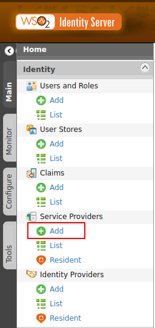

3. Select **Manual Configuration**.

4. Enter `consentmgt` as **Service Provider Name**.

    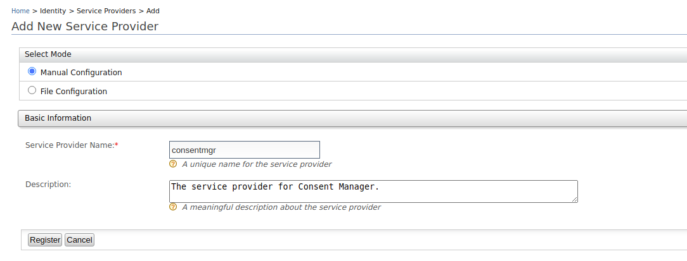

5. Click **Register**. 

6. Click **Inbound Authentication configuration > OAuth/OpenID Connect configuration > Configure**.

    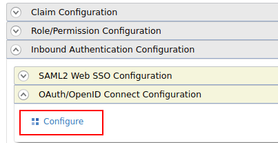

7. Set the given values for the following parameters and for other parameters, leave their default values.

    <table>
       <tbody>
          <tr>
             <th>OAuth Version</th>
             <td>2.0</td>
          </tr>
          <tr>
             <th>Allowed Grant Type</th>
             <td>Code</td>
          </tr>
          <tr>
             <th>Callback URL</th>
             <td>https://&lt;IS_HOST&gt;:9446/consentmgr</td>
          </tr>
       </tbody>
    </table>
  
    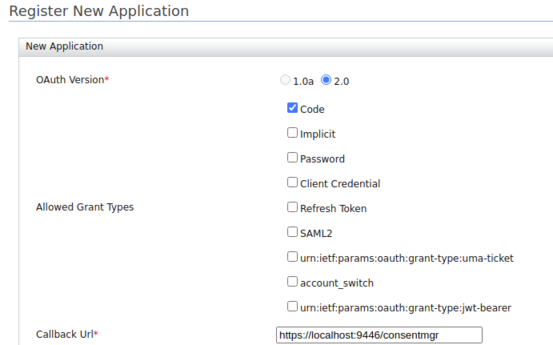
    
8. Scroll down and click **Add**.

9. OAuth Client Key and OAuth Client Secret are generated now. 

    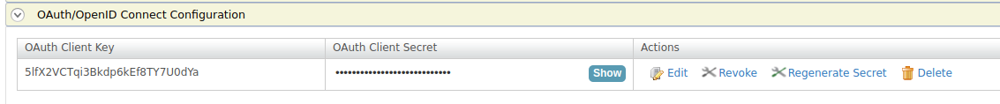    
    
## Configuring Identity Server

1. Open the `<IS_HOME>/repository/deployment/server/webapps/consentmgr/runtime-config.js` file.

    ``` javascript
    window.env = {
        // This option can be retrieved in "src/index.js" with "window.env.API_URL".
        SERVER_URL: 'https://localhost:9446',
        SPEC: 'AU',
        CLIENT_ID: '<CLIENT_ID>',
        CLIENT_SECRET: '<CLIENT_SECRET>',
        BASIC_AUTH: '<BASIC_AUTH>',
        TENANT_DOMAIN: 'carbon.super',
        NUMBER_OF_CONSENTS: 25,
        VERSION: '3.0.0'
      };
    ```

2. Update the following parameters:

    | Parameter | Description |
    | ----------| ------------|
    | SERVER_URL | `<IS_HOST>:<IS_PORT>` |
    | CLIENT_ID | The OAuth Client Key of the application. |
    | CLIENT_SECRET | Base64 encoded `<CLIENT_ID:CLIENT_SECRET>` |
    | BASIC_AUTH | Base64 encoded `<ADMIN_USERNAME:ADMIN_PASSWORD>` |

## Using Consent Manager

1. Go the Consent Manager application at
   `https://<IS_HOST>:9446/consentmgr` 

2. Sign in with the credentials provided by the bank.

3. The `consentmgr` application requests access to your profile. To grant access, click **Continue**.
    
    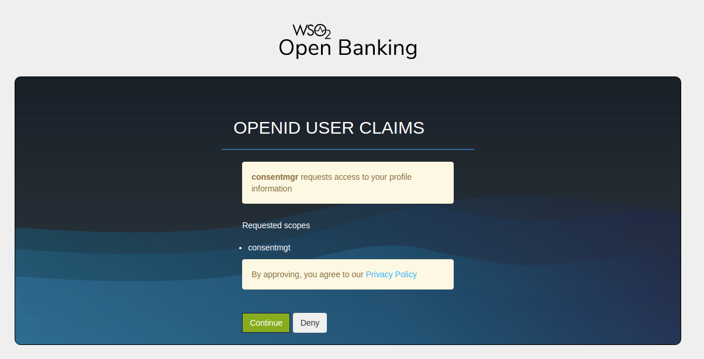

4. You are redirected to the homepage of the Consent Manager portal.

    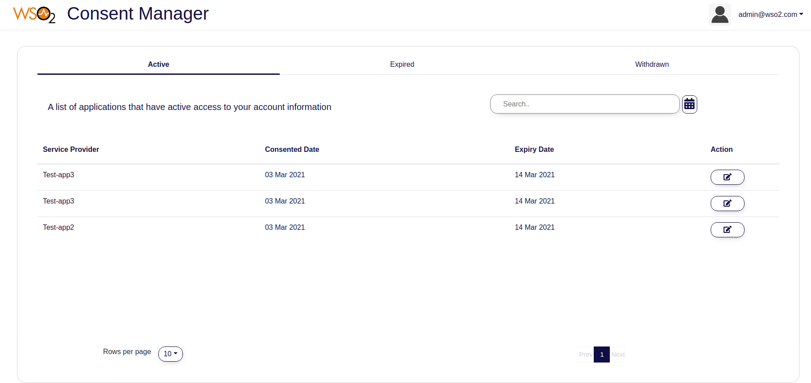

The three tabs are as follows:

   - **Active**: Lists active consents that can access your account/payment information.
   - **Expired**: Lists expired consent that cannot access your account/payment information anymore.
   - **Withdrawn**: Lists the consents that you have revoked.

!!! tip
    Use the **Search** button to search consents.

### View consent details

- To view consent details, click the respective `Action` button. 

    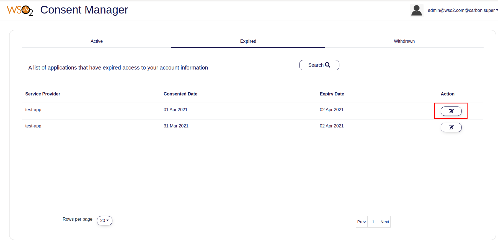

- You can view the details such as the associated API consumer application, consent granted date, consent expiry date, 
account numbers, and permissions that you have granted.

    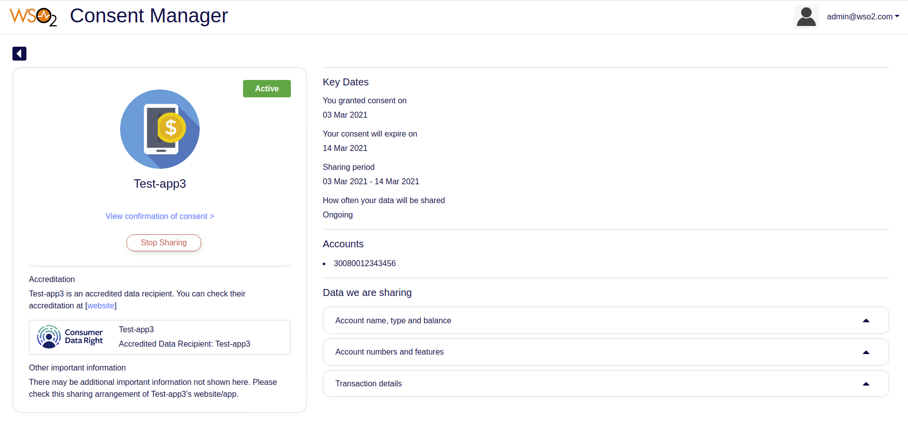

### Revoke a consent

- To revoke a consent, review the details and click **Stop Sharing**. 
    
    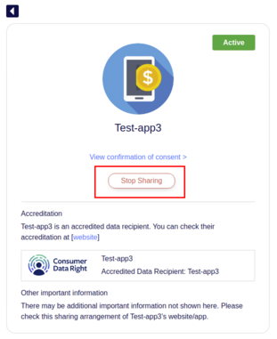
    
- Revoking a consent consists of 2 steps:

    - Step 1: The first step shows the impact of withdrawing the consent.
    
        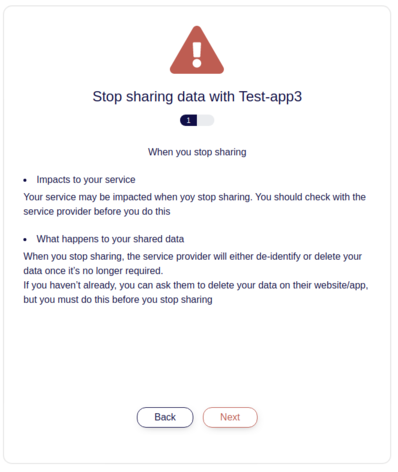
    
    - Step 2: Displays the information the consent has access to. 
    
        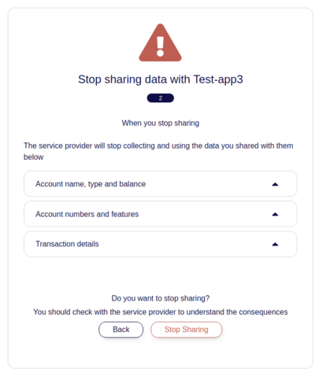
    
- Once you click **Stop Sharing**, the status of the consent changes to `withdrawn`. You can find this consent in the 
**Withdrawn** tab now.
