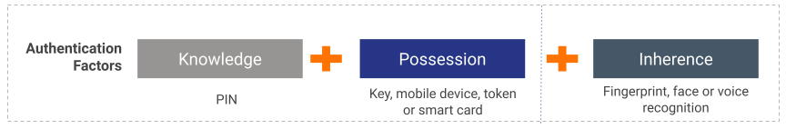

**Consumer Authentication** is a mechanism used to authenticate a user that initiates a payment or accesses banking 
information via an API consumer application. Authentication can be configured using two or more of the following factors 
to  minimise fraudulent activities by preventing identity theft. It authenticates the user using the following factors 
one at a time:

- Knowledge: Things only the user knows, such as passwords.
- Possession: Things only the user has, such as ATM cards.
- Inherence: Things only the user is, such as a fingerprint.

!!!note
    **Strong Customer Authentication** is the term used in PSD2 for **Consumer Authentication**. In Strong Customer Authentication,
    it is mandatory to use at least two of the authentication factors mentioned above.
    
You can enforce Consumer Authentication for the WSO2 Open Banking solution with the use of authentication mechanisms supported in
WSO2 Identity Server. For more information:

- By default, WSO2 Identity Server supports basic authentication and SMS OTP authentication. See [The Default Authenticator](https://is.docs.wso2.com/en/latest/learn/writing-a-new-oauth-client-authenticator/#the-default-authenticator).
- WSO2 Identity Server provides you with the flexibility of implementing any type of authentication such as biometric, FIDO, Duo etc. See [Identity Federation for Developers](https://is.docs.wso2.com/en/latest/develop/writing-a-custom-federated-authenticator/).
    - By default, identifier-first authentication is supported. To configure identifier-first authentication, see [Identifier-first Authentication]()
- WSO2 Identity Server allows you to strengthen the existing authentication by adding an additional authentication step 
to authenticate with basic authentication, such as FIDO, TOTP. See [Multi-factor Authentication](https://is.docs.wso2.com/en/latest/learn/multi-factor-authentication/).
- Once you implement multi-factor authentication, you can configure and deploy those multiple factors in a way that the 
Identity Service Provider can select the right factors depending on a user’s risk profile and behavior. See [Adaptive Authentication](https://is.docs.wso2.com/en/latest/learn/adaptive-authentication/).
    - Try out adaptive authentication using the instructions given in [Configuring a Service Provider for Adaptive Authentication](https://is.docs.wso2.com/en/latest/learn/configuring-a-service-provider-for-adaptive-authentication/).
    - According to your open banking standard, you can write a custom function for adaptive authentication. See [Writing a custom function for Adaptive Authentication](https://is.docs.wso2.com/en/latest/develop/writing-custom-functions-for-adaptive-authentication/).
