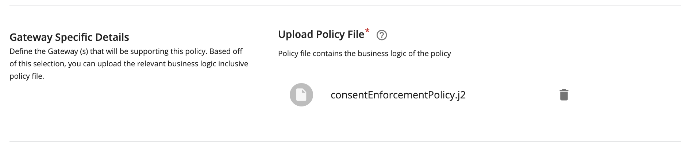

## Creating a Common Policy

1. Sign in to the API Publisher Portal at `https://<APIM_HOSTNAME>:9443/publisher`. 

2. Click on the Policies tab on the left side tab panel.
    

3. Click on Add New Policy.
    

## Creating an API Policy

1. Sign in to the API Publisher Portal at `https://<APIM_HOSTNAME>:9443/publisher`. 

2. Click on the API that you want to create the policy.
    

3. Click on the Policies tab under API Configurations on left side tab panel.
    

4. Click on Add New Policy button to add a new policy.
    

## Defining the policy config

Follow the following steps to define the policy in either type.

1. Enter the basic details of the policy.
    

    | Name | Name of the Policy |
    | Version | Version of the Policy |
    | Description | Description of the Policy |
    | Applicable Flows | Which flow the policy should be applied. |
    | Supported API Types | Which API Type the policy should be applied. |

2. Upload the policy file from the relevant place.
    

3. Add policy attributes if there are any attributes for the policy.
    - Click on Add Policy Attribute button.
        

    - Add the attribute Name and Display Name.
        

    - If the attribute is required mark it as below.
        

    - Click on the **Description** box to add a description to the attribute.
        

    - Add the description of the attribute.
        

    - Click on the **Value Properties** box.
        

    - Add the attribute value properties.
        

4. Add then click on Save.
