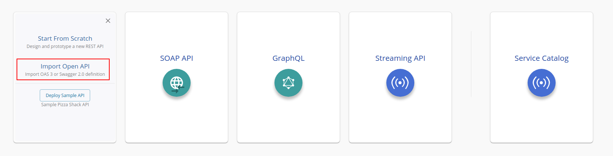
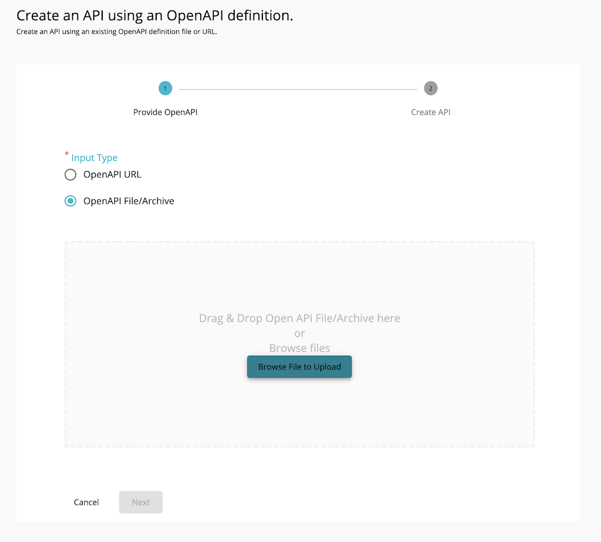
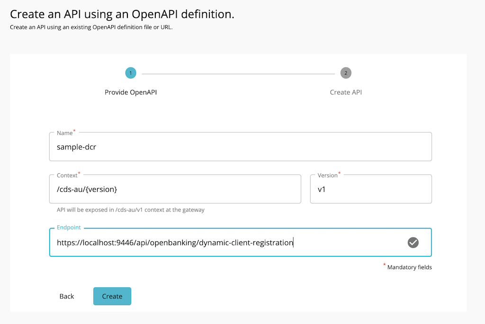
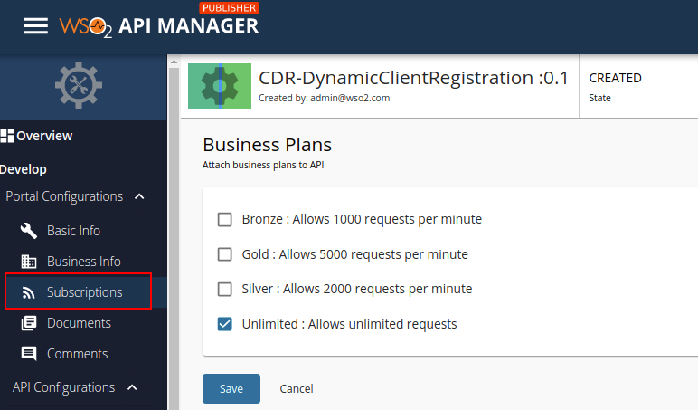
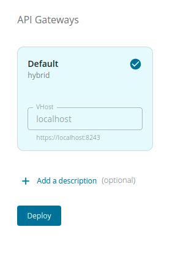
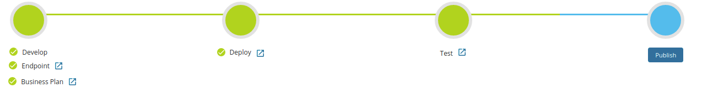
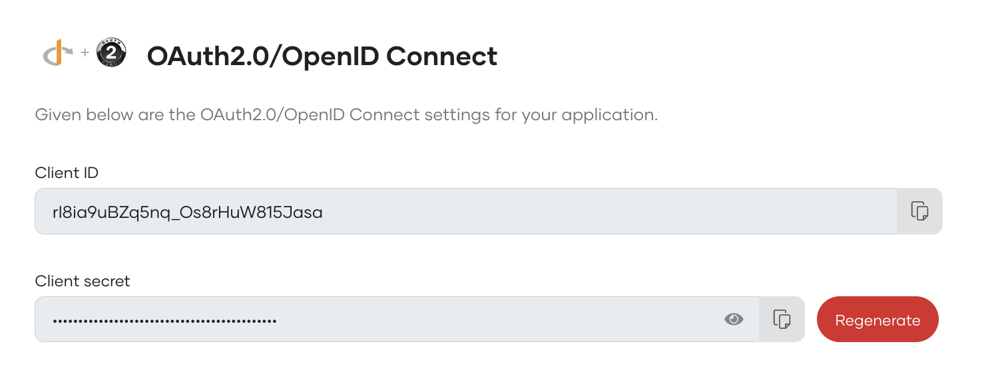

This page explains how to onboard API consumers using the Dynamic Client Registration API. 

!!! tip "Before you begin:"
    See the [Configurations](dynamic-client-registration-configuration.md) section and configure Dynamic Client
    Registration.
    
### Step 1: Deploy the Dynamic Client Registration(DCR) API

1. Sign in to the API Publisher Portal at `https://<APIM_HOST>:9443/publisher` with `creator/publisher` 
privileges. 

2. In the homepage, go to **REST API** and select **Import Open API**. 

3. Select **OpenAPI File/Archive**. 

4. Click **Browse File to Upload** and select the `<APIM_HOME>/<OB_APIM_ACCELERATOR_HOME>/repository/resources/apis/
DynamicClientRegistration/dcr-swagger.yaml` file.

5. Click **Next**.

6. Set the value for **Endpoint** as follows:
```
https://<IS_HOST>:9446/api/openbanking/dynamic-client-registration
```
    

7. Click **Create**. 

8. Select **Subscriptions** from the left menu pane and set the business plan to **Unlimited: Allows unlimited requests**. 

9. Click **Save**.

10. Go to **Deployments** using the left menu pane and select **Default Hybrid** API Gateway. 

11. Click **Deploy**.

12.Go to **Overview** using the left menu pane. 

   
 
13.Click **Publish**. 

  

14.The deployed DCR API is now available in the Developer Portal at `https://<APIM_HOST>:9443/devportal`.

15.Upload the root and issuer certificates in OBIE ([Sandbox certificates](https://openbanking.atlassian.net/wiki/spaces/DZ/pages/252018873/OB+Root+and+Issuing+Certificates+for+Sandbox)/
[Production certificates](https://openbanking.atlassian.net/wiki/spaces/DZ/pages/80544075/OB+Root+and+Issuing+Certificates+for+Production))
to the client trust stores in `<APIM_HOME>/repository/resources/security/client-truststore.jks` and 
`<IS_HOME>/repository/resources/security/client-truststore.jks` using the following command:

  ```
  keytool -import -alias <alias> -file <certificate_location> -storetype JKS -keystore <truststore_location> -storepass wso2carbon
  ```

16.Restart the Identity Server and API Manager instances. 

## Step 2: Configure IS as Key Manager

 1. Sign in to the Admin Portal of API Manager at `https://<APIM_HOST>:9443/admin`.
 2. Go to **Key Manager** on the left main menu. 
 3. Click **Add New Key Manager** and configure Key Manager. 
    
    ??? tip "Click here to see the full list of configurations..."
        | Configuration       | Description                           | Value                    |
        | -------------       |-------------                          | -----                    |
        | Name                | The name of the authorization server. | OBKM                     |
        | Display Name        | A name to display on the UI.          | OBKM                     |
        | Description         | The name of the authorization server. | (Optional)               |
        | Key Manager Type    | The type of the Key Manager to be selected. | Select `ObKeyManager` |
        |Well-known-url      | The well-known URL of the authorization server (Key Manager).|   `https://<IS_HOST>:9446/oauth2/token/.well-known/openid-configuration` |
        | Issuer              | The issuer that consumes or validates access tokens.         | `https://<IS_HOST>:9446/oauth2/token` |
        |**Key Manager Endpoints**                                                                |
        | Client Registration Endpoint | The endpoint that verifies the identity and obtain profile information of the end-user based on the authentication performed by an authorization server.  |  `https://<IS_HOST>:9446/keymanager-operations/dcr/register`| 
        | Introspection Endpoint | The endpoint that allows authorized protected resources to query the authorization server to determine the set of metadata for a given token that was presented to them by an OAuth Client. | `https://<IS_HOST>:9446/oauth2/introspect` |
        | Token Endpoint      | The endpoint that issues the access tokens. | `https://<IS_HOST>:9446/oauth2/token` |
        | Revoke Endpoint     | The endpoint that revokes the access tokens.| `https://<IS_HOST>:9446/oauth2/revoke` |
        | Userinfo Endpoint   | The endpoint that allows clients to verify the identity of the end-user based on the authentication performed by an authorization server, as well as to obtain basic profile information about the end-user. | `https://<IS_HOST>:9446/oauth2/userinfo?schema=openid` |
        | Authorize Endpoint  | The endpoint used to obtain an authorization grant from the resource owner via the user-agent redirection. | `https://<IS_HOST>:9446/oauth2/authorize` |
        | Scope Management Endpoint | The endpoint used to manage the scopes. | `https://<IS_HOST>:9446/api/identity/oauth2/v1.0/scopes` |
        | **Connector Configurations**                        |
        | Username            | The username of an admin user who is authorized to connect to the authorization server. |  |
        | Password            | The password corresponding to the latter mentioned admin user who is authorized to connect to the authorization server. | |
        | **Claim URIs**      |   
        | Consumer Key Claim URI | The claim URI for the consumer key.  | (Optional)  |
        | Scopes Claim URI | The claim URI for the scopes | (Optional) | 
        | Grant Types | The supported grant types. Add multiple grant types by adding a grant type press Enter. Add the `client_credentials`, `authorization_code`, `refresh_token`, and `urn:ietf:params:oauth:grant-type:jwt-bearer` grant types. | (Mandatory) |
        | **Certificates** | 
        | PEM | Either copy and paste the certificate in PEM format or upload the PEM file. | (Optional) |
        | JWKS | The JSON Web Key Set (JWKS) endpoint is a read-only endpoint. This URL returns the Identity Server's public key set in JSON web key set format. This contains the signing key(s) the Relying Party (RP) uses to validate signatures from the Identity Server. | `https://<IS_HOST>:9446/oauth2/jwks` |
        | **Advanced Configurations** |
        | Token Generation | This enables token generation via the authorization server. | (Mandatory) |
        | Out Of Band Provisioning | This enables the provisioning of Auth clients that have been created without the use of the Developer Portal, such as previously created Auth clients. | (Mandatory) |
        | Oauth App Creation | This enables the creation of Auth clients. | (Mandatory) |
        | **Token Validation Method** | The method used to validate the JWT signature. |
        | Self Validate JWT | The kid value is used to validate the JWT token signature. If the kid value is not present, `gateway_certificate_alias` will be used. | (Mandatory) |
        | Use introspect | The JWKS endpoint is used to validate the JWT token signature. | - |
        | **Token Handling Options** | This provides a way to validate the token for this particular authorization server. This is mandatory if the Token Validation Method is introspect.| (Optional) |
        | REFERENCE | The tokens that match a specific regular expression (regEx) are validated. e.g., <code>[0-9a-fA-F]{8}-[0-9a-fA-F]{4}-[1-5][0-9a-fA-F]{3}-[89abAB][0-9a-fA-F]{3}-[0-9a-fA-F]{12}</code> | (Optional) |
        | JWT | The tokens that match a specific JWT are validated. | Select this icon |
        | CUSTOM | The tokens that match a custom pattern are validated. | (Optional) |
        | **Claim Mappings** | Local and remote claim mapping. | (Optional) |
    

3. Go to the list of Key Managers and select **Resident Key Manager**. 

4. Locate **Connector Configurations** and provide a username and a password for a user with super admin credentials.

5. Click **Update**.

6. Disable the Resident Key Manager. 

## Step 3: Tryout DCR

!!! tip
    If you have [Postman](https://www.postman.com/), import the [script](https://www.getpostman.com/collections/0aefc25adfb0716c778c) 
    to invoke the DCR endpoints for the scenarios explained below.

###Register an application
The API allows the API consumer to request the bank to register a new application. The process is as follows:

- The API consumer sends a registration request including a Software Statement Assertion (SSA) as a claim in the payload. 
This SSA contains API consumer's metadata. A sample request looks as follows:

 For this sample flow, you can use the transport certificates available [here](../../assets/attachments/ob-transport-certs.zip). 

```
curl -X POST https://<APIM_HOST>:8243/open-banking/0.1/register \
 -H 'Content-Type: application/jwt' \
 --cert <TRANSPORT_PUBLIC_CERT_FILE_PATH> --key <TRANSPORT_PRIVATE_KEY_FILE_PATH> \
 -d 'eyJ0eXAiOiJKV1QiLCJhbGciOiJQUzI1NiIsImtpZCI6Ik9OUEN2YU9YZjFtcFZjazhNYkU2bDI5eTNvMCJ9.eyJpc3MiOiJqRlF1UTRlUWJOQ01TcWRDb2cyMW5GIiwiaWF0IjoxNTcxODA4MTY3LCJleHAiOjIxNDc0ODM2NDYsImp0aSI6IjM3NzQ3Y2QxYzEwNTQ1Njk5Zjc1NGFkZjI4YjczZTMxIiwiYXVkIjoiaHR0cHM6Ly9zZWN1cmUuYXBpLmRhdGFob2xkZXIuY29tL2lzc3VlciIsInJlZGlyZWN0X3VyaXMiOlsiaHR0cHM6Ly93d3cubW9ja2NvbXBhbnkuY29tLmF1L3JlZGlyZWN0cy9yZWRpcmVjdDEiLCJodHRwczovL3d3dy5tb2NrY29tcGFueS5jb20uYXUvcmVkaXJlY3RzL3JlZGlyZWN0MiJdLCJ0b2tlbl9lbmRwb2ludF9hdXRoX3NpZ25pbmdfYWxnIjoiUFMyNTYiLCJ0b2tlbl9lbmRwb2ludF9hdXRoX21ldGhvZCI6InByaXZhdGVfa2V5X2p3dCIsImdyYW50X3R5cGVzIjpbImNsaWVudF9jcmVkZW50aWFscyIsImF1dGhvcml6YXRpb25fY29kZSIsInJlZnJlc2hfdG9rZW4iLCJ1cm46aWV0ZjpwYXJhbXM6b2F1dGg6Z3JhbnQtdHlwZTpqd3QtYmVhcmVyIl0sInJlc3BvbnNlX3R5cGVzIjpbImNvZGUgaWRfdG9rZW4iXSwiYXBwbGljYXRpb25fdHlwZSI6IndlYiIsImlkX3Rva2VuX3NpZ25lZF9yZXNwb25zZV9hbGciOiJQUzI1NiIsImlkX3Rva2VuX2VuY3J5cHRlZF9yZXNwb25zZV9hbGciOiJSU0EtT0FFUCIsImlkX3Rva2VuX2VuY3J5cHRlZF9yZXNwb25zZV9lbmMiOiJBMjU2R0NNIiwicmVxdWVzdF9vYmplY3Rfc2lnbmluZ19hbGciOiJQUzI1NiIsInNjb3BlIjoiYWNjb3VudHMiLCJzb2Z0d2FyZV9zdGF0ZW1lbnQiOiJleUpoYkdjaU9pSlFVekkxTmlJc0ltdHBaQ0k2SW5obVUyczNOM05YVEhrMmFHTlJZbVZSTVVsNFdteEZlRlpPWDA5UWVUaEJhRzVaV20xb1RYaFROMGs5SWl3aWRIbHdJam9pU2xkVUluMC5leUpwYzNNaU9pSlBjR1Z1UW1GdWEybHVaeUJNZEdRaUxDSnBZWFFpT2pFMk5EWTRPVFV3TmpZc0ltcDBhU0k2SWpnMU16bGpZV0V6T0RFeE9UUTRaR0VpTENKemIyWjBkMkZ5WlY5bGJuWnBjbTl1YldWdWRDSTZJbk5oYm1SaWIzZ2lMQ0p6YjJaMGQyRnlaVjl0YjJSbElqb2lWR1Z6ZENJc0luTnZablIzWVhKbFgybGtJam9pYWtaUmRWRTBaVkZpVGtOTlUzRmtRMjluTWpGdVJpSXNJbk52Wm5SM1lYSmxYMk5zYVdWdWRGOXBaQ0k2SW1wR1VYVlJOR1ZSWWs1RFRWTnhaRU52WnpJeGJrWWlMQ0p6YjJaMGQyRnlaVjlqYkdsbGJuUmZibUZ0WlNJNklsZFRUeklnVDNCbGJpQkNZVzVyYVc1bklGUlFVRElnS0ZOaGJtUmliM2dwSWl3aWMyOW1kSGRoY21WZlkyeHBaVzUwWDJSbGMyTnlhWEIwYVc5dUlqb2lWR2hwY3lCaGJIUmxjbTVoZEdsMlpTQlVVRkFnYVhNZ1kzSmxZWFJsWkNCbWIzSWdkR1Z6ZEdsdVp5QndkWEp3YjNObGN5NGdJaXdpYzI5bWRIZGhjbVZmZG1WeWMybHZiaUk2TVM0MUxDSnpiMlowZDJGeVpWOWpiR2xsYm5SZmRYSnBJam9pYUhSMGNITTZMeTkzYzI4eUxtTnZiU0lzSW5OdlpuUjNZWEpsWDNKbFpHbHlaV04wWDNWeWFYTWlPbHNpYUhSMGNITTZMeTkzYzI4eUxtTnZiU0pkTENKemIyWjBkMkZ5WlY5eWIyeGxjeUk2V3lKQlNWTlFJaXdpVUVsVFVDSXNJa05DVUVsSklsMHNJbTl5WjJGdWFYTmhkR2x2Ymw5amIyMXdaWFJsYm5SZllYVjBhRzl5YVhSNVgyTnNZV2x0Y3lJNmV5SmhkWFJvYjNKcGRIbGZhV1FpT2lKUFFrZENVaUlzSW5KbFoybHpkSEpoZEdsdmJsOXBaQ0k2SWxWdWEyNXZkMjR3TURFMU9EQXdNREF4U0ZGUmNscEJRVmdpTENKemRHRjBkWE1pT2lKQlkzUnBkbVVpTENKaGRYUm9iM0pwYzJGMGFXOXVjeUk2VzNzaWJXVnRZbVZ5WDNOMFlYUmxJam9pUjBJaUxDSnliMnhsY3lJNld5SlFTVk5RSWl3aVFVbFRVQ0lzSWtOQ1VFbEpJbDE5TEhzaWJXVnRZbVZ5WDNOMFlYUmxJam9pU1VVaUxDSnliMnhsY3lJNld5SlFTVk5RSWl3aVEwSlFTVWtpTENKQlNWTlFJbDE5TEhzaWJXVnRZbVZ5WDNOMFlYUmxJam9pVGt3aUxDSnliMnhsY3lJNld5SlFTVk5RSWl3aVFVbFRVQ0lzSWtOQ1VFbEpJbDE5WFgwc0luTnZablIzWVhKbFgyeHZaMjlmZFhKcElqb2lhSFIwY0hNNkx5OTNjMjh5TG1OdmJTOTNjMjh5TG1wd1p5SXNJbTl5WjE5emRHRjBkWE1pT2lKQlkzUnBkbVVpTENKdmNtZGZhV1FpT2lJd01ERTFPREF3TURBeFNGRlJjbHBCUVZnaUxDSnZjbWRmYm1GdFpTSTZJbGRUVHpJZ0tGVkxLU0JNU1UxSlZFVkVJaXdpYjNKblgyTnZiblJoWTNSeklqcGJleUp1WVcxbElqb2lWR1ZqYUc1cFkyRnNJaXdpWlcxaGFXd2lPaUp6WVdOb2FXNXBjMEIzYzI4eUxtTnZiU0lzSW5Cb2IyNWxJam9pS3prME56YzBNamMwTXpjMElpd2lkSGx3WlNJNklsUmxZMmh1YVdOaGJDSjlMSHNpYm1GdFpTSTZJa0oxYzJsdVpYTnpJaXdpWlcxaGFXd2lPaUp6WVdOb2FXNXBjMEIzYzI4eUxtTnZiU0lzSW5Cb2IyNWxJam9pS3prME56YzBNamMwTXpjMElpd2lkSGx3WlNJNklrSjFjMmx1WlhOekluMWRMQ0p2Y21kZmFuZHJjMTlsYm1Sd2IybHVkQ0k2SW1oMGRIQnpPaTh2YTJWNWMzUnZjbVV1YjNCbGJtSmhibXRwYm1kMFpYTjBMbTl5Wnk1MWF5OHdNREUxT0RBd01EQXhTRkZSY2xwQlFWZ3ZNREF4TlRnd01EQXdNVWhSVVhKYVFVRllMbXAzYTNNaUxDSnZjbWRmYW5kcmMxOXlaWFp2YTJWa1gyVnVaSEJ2YVc1MElqb2lhSFIwY0hNNkx5OXJaWGx6ZEc5eVpTNXZjR1Z1WW1GdWEybHVaM1JsYzNRdWIzSm5MblZyTHpBd01UVTRNREF3TURGSVVWRnlXa0ZCV0M5eVpYWnZhMlZrTHpBd01UVTRNREF3TURGSVVWRnlXa0ZCV0M1cWQydHpJaXdpYzI5bWRIZGhjbVZmYW5kcmMxOWxibVJ3YjJsdWRDSTZJbWgwZEhCek9pOHZhMlY1YzNSdmNtVXViM0JsYm1KaGJtdHBibWQwWlhOMExtOXlaeTUxYXk4d01ERTFPREF3TURBeFNGRlJjbHBCUVZndmFrWlJkVkUwWlZGaVRrTk5VM0ZrUTI5bk1qRnVSaTVxZDJ0eklpd2ljMjltZEhkaGNtVmZhbmRyYzE5eVpYWnZhMlZrWDJWdVpIQnZhVzUwSWpvaWFIUjBjSE02THk5clpYbHpkRzl5WlM1dmNHVnVZbUZ1YTJsdVozUmxjM1F1YjNKbkxuVnJMekF3TVRVNE1EQXdNREZJVVZGeVdrRkJXQzl5WlhadmEyVmtMMnBHVVhWUk5HVlJZazVEVFZOeFpFTnZaekl4YmtZdWFuZHJjeUlzSW5OdlpuUjNZWEpsWDNCdmJHbGplVjkxY21raU9pSm9kSFJ3Y3pvdkwzZHpiekl1WTI5dElpd2ljMjltZEhkaGNtVmZkRzl6WDNWeWFTSTZJbWgwZEhCek9pOHZkM052TWk1amIyMGlMQ0p6YjJaMGQyRnlaVjl2Ymw5aVpXaGhiR1pmYjJaZmIzSm5Jam9pVjFOUE1pQlBjR1Z1SUVKaGJtdHBibWNpZlEuMERVZ1VaZndfSE91WXFURUxBSmNUUWRlUjMzdGlIYmtkRHMzbTRGalQ2Z2thVzEyTUQ2dWk0XzZvMy0yYVJQOXBGME1nTG0xdW1KMGlYb2EyZjFCbzExZ1BKNWJucTlDNkdiTWNHTXZ6TjVuY3lZWF81ZEprVFBUS2FURlVHQU5BSHRkZi1IaGp1QmNZT09wWUpjc1M0MmJsSlpIakdWVXJuUWU3bVJsSVRSVWZqYXZCcldnUDBvM2pqNVZ0Tm9zc0RVZkpvLUtCOWd2ajJBNWdYaF9aWEw2RGxDYWpPWHNiRkVDLTBmeFlORXVrQWpPSHptRlVVZjN5bWhoWnFLYWZReVNpejRTVmc4Sk1lMnZDRWFDSFBXTzRZMEZnRlVuaGgxemNidmNRT3lEVkZvTGluUW1yYWRLYmxfMFJVYkVvSWIxaVFyUmYyU1I4b3RtTEk1WHlRIn0.XSNlggSNYWawNddtoyye7DVptMHqoUFlE25GcRLSqEb84YT7fLzV9fWeT4p5-VJAPFqUr_6zw6tg9HOQCq8jfuM6oVLeNPwT2gmKLuec7EarIkxkG30X-sx_poErc2UD4XPkrYFAfyALSbG_xwS5i_Ez2z8fIcxAfHbJugPGOJPl4BLls6x9YCSYahqzkQYOEIjGA6vMbadp_bc8yTolehHCadhA7Rw3bzH93DABffBlfxL2xIrheRIJoLRhcxAczmd7oVVnolLnLb3QkwxG6bGXE92kikD2n_ySoHQg1bKa529dxycaAtlTbuk4yGid4gd8QlwvBFhTr-IeUWnfTw' 
```

 The payload is a signed JWT.

??? tip "Click here to see the decoded format of the payload..."
    
    ```
    {
      "typ": "JWT",
      "alg": "PS256",
      "kid": "ONPCvaOXf1mpVck8MbE6l29y3o0"
    }

    {
      "iss": "jFQuQ4eQbNCMSqdCog21nF",
      "iat": 1571808167,
      "exp": 2147483646,
      "jti": "37747cd1c10545699f754adf28b73e31",
      "aud": "https://secure.api.dataholder.com/issuer",
      "redirect_uris": [
        "https://www.mockcompany.com.au/redirects/redirect1",
        "https://www.mockcompany.com.au/redirects/redirect2"
      ],
      "token_endpoint_auth_signing_alg": "PS256",
      "token_endpoint_auth_method": "private_key_jwt",
      "grant_types": [
        "client_credentials",
        "authorization_code",
        "refresh_token",
        "urn:ietf:params:oauth:grant-type:jwt-bearer"
      ],
      "response_types": [
        "code id_token"
      ],
      "application_type": "web",
      "id_token_signed_response_alg": "PS256",
      "id_token_encrypted_response_alg": "RSA-OAEP",
      "id_token_encrypted_response_enc": "A256GCM",
      "request_object_signing_alg": "PS256",
      "scope": "accounts",
      "software_statement": "eyJhbGciOiJQUzI1NiIsImtpZCI6InhmU2s3N3NXTHk2aGNRYmVRMUl4WmxFeFZOX09QeThBaG5ZWm1oTXhTN0k9IiwidHlwIjoiSldUIn0.eyJpc3MiOiJPcGVuQmFua2luZyBMdGQiLCJpYXQiOjE2NDY4OTUwNjYsImp0aSI6Ijg1MzljYWEzODExOTQ4ZGEiLCJzb2Z0d2FyZV9lbnZpcm9ubWVudCI6InNhbmRib3giLCJzb2Z0d2FyZV9tb2RlIjoiVGVzdCIsInNvZnR3YXJlX2lkIjoiakZRdVE0ZVFiTkNNU3FkQ29nMjFuRiIsInNvZnR3YXJlX2NsaWVudF9pZCI6ImpGUXVRNGVRYk5DTVNxZENvZzIxbkYiLCJzb2Z0d2FyZV9jbGllbnRfbmFtZSI6IldTTzIgT3BlbiBCYW5raW5nIFRQUDIgKFNhbmRib3gpIiwic29mdHdhcmVfY2xpZW50X2Rlc2NyaXB0aW9uIjoiVGhpcyBhbHRlcm5hdGl2ZSBUUFAgaXMgY3JlYXRlZCBmb3IgdGVzdGluZyBwdXJwb3Nlcy4gIiwic29mdHdhcmVfdmVyc2lvbiI6MS41LCJzb2Z0d2FyZV9jbGllbnRfdXJpIjoiaHR0cHM6Ly93c28yLmNvbSIsInNvZnR3YXJlX3JlZGlyZWN0X3VyaXMiOlsiaHR0cHM6Ly93c28yLmNvbSJdLCJzb2Z0d2FyZV9yb2xlcyI6WyJBSVNQIiwiUElTUCIsIkNCUElJIl0sIm9yZ2FuaXNhdGlvbl9jb21wZXRlbnRfYXV0aG9yaXR5X2NsYWltcyI6eyJhdXRob3JpdHlfaWQiOiJPQkdCUiIsInJlZ2lzdHJhdGlvbl9pZCI6IlVua25vd24wMDE1ODAwMDAxSFFRclpBQVgiLCJzdGF0dXMiOiJBY3RpdmUiLCJhdXRob3Jpc2F0aW9ucyI6W3sibWVtYmVyX3N0YXRlIjoiR0IiLCJyb2xlcyI6WyJQSVNQIiwiQUlTUCIsIkNCUElJIl19LHsibWVtYmVyX3N0YXRlIjoiSUUiLCJyb2xlcyI6WyJQSVNQIiwiQ0JQSUkiLCJBSVNQIl19LHsibWVtYmVyX3N0YXRlIjoiTkwiLCJyb2xlcyI6WyJQSVNQIiwiQUlTUCIsIkNCUElJIl19XX0sInNvZnR3YXJlX2xvZ29fdXJpIjoiaHR0cHM6Ly93c28yLmNvbS93c28yLmpwZyIsIm9yZ19zdGF0dXMiOiJBY3RpdmUiLCJvcmdfaWQiOiIwMDE1ODAwMDAxSFFRclpBQVgiLCJvcmdfbmFtZSI6IldTTzIgKFVLKSBMSU1JVEVEIiwib3JnX2NvbnRhY3RzIjpbeyJuYW1lIjoiVGVjaG5pY2FsIiwiZW1haWwiOiJzYWNoaW5pc0B3c28yLmNvbSIsInBob25lIjoiKzk0Nzc0Mjc0Mzc0IiwidHlwZSI6IlRlY2huaWNhbCJ9LHsibmFtZSI6IkJ1c2luZXNzIiwiZW1haWwiOiJzYWNoaW5pc0B3c28yLmNvbSIsInBob25lIjoiKzk0Nzc0Mjc0Mzc0IiwidHlwZSI6IkJ1c2luZXNzIn1dLCJvcmdfandrc19lbmRwb2ludCI6Imh0dHBzOi8va2V5c3RvcmUub3BlbmJhbmtpbmd0ZXN0Lm9yZy51ay8wMDE1ODAwMDAxSFFRclpBQVgvMDAxNTgwMDAwMUhRUXJaQUFYLmp3a3MiLCJvcmdfandrc19yZXZva2VkX2VuZHBvaW50IjoiaHR0cHM6Ly9rZXlzdG9yZS5vcGVuYmFua2luZ3Rlc3Qub3JnLnVrLzAwMTU4MDAwMDFIUVFyWkFBWC9yZXZva2VkLzAwMTU4MDAwMDFIUVFyWkFBWC5qd2tzIiwic29mdHdhcmVfandrc19lbmRwb2ludCI6Imh0dHBzOi8va2V5c3RvcmUub3BlbmJhbmtpbmd0ZXN0Lm9yZy51ay8wMDE1ODAwMDAxSFFRclpBQVgvakZRdVE0ZVFiTkNNU3FkQ29nMjFuRi5qd2tzIiwic29mdHdhcmVfandrc19yZXZva2VkX2VuZHBvaW50IjoiaHR0cHM6Ly9rZXlzdG9yZS5vcGVuYmFua2luZ3Rlc3Qub3JnLnVrLzAwMTU4MDAwMDFIUVFyWkFBWC9yZXZva2VkL2pGUXVRNGVRYk5DTVNxZENvZzIxbkYuandrcyIsInNvZnR3YXJlX3BvbGljeV91cmkiOiJodHRwczovL3dzbzIuY29tIiwic29mdHdhcmVfdG9zX3VyaSI6Imh0dHBzOi8vd3NvMi5jb20iLCJzb2Z0d2FyZV9vbl9iZWhhbGZfb2Zfb3JnIjoiV1NPMiBPcGVuIEJhbmtpbmcifQ.0DUgUZfw_HOuYqTELAJcTQdeR33tiHbkdDs3m4FjT6gkaW12MD6ui4_6o3-2aRP9pF0MgLm1umJ0iXoa2f1Bo11gPJ5bnq9C6GbMcGMvzN5ncyYX_5dJkTPTKaTFUGANAHtdf-HhjuBcYOOpYJcsS42blJZHjGVUrnQe7mRlITRUfjavBrWgP0o3jj5VtNossDUfJo-KB9gvj2A5gXh_ZXL6DlCajOXsbFEC-0fxYNEukAjOHzmFUUf3ymhhZqKafQySiz4SVg8JMe2vCEaCHPWO4Y0FgFUnhh1zcbvcQOyDVFoLinQmradKbl_0RUbEoIb1iQrRf2SR8otmLI5XyQ"
    }

    <signature>
    ```

??? tip "Click here to see the decoded format of an SSA..."

    ```
    {
       "alg":"PS256",
       "kid":"xfSk77sWLy6hcQbeQ1IxZlExVN_OPy8AhnYZmhMxS7I=",
       "typ":"JWT"
    } 

    {
       "iss":"OpenBanking Ltd",
       "iat":1646895066,
       "jti":"8539caa3811948da",
       "software_environment":"sandbox",
       "software_mode":"Test",
       "software_id":"jFQuQ4eQbNCMSqdCog21nF",
       "software_client_id":"jFQuQ4eQbNCMSqdCog21nF",
       "software_client_name":"WSO2 Open Banking TPP2 (Sandbox)",
       "software_client_description":"This alternative TPP is created for testing purposes. ",
       "software_version":1.5,
       "software_client_uri":"https://wso2.com",
       "software_redirect_uris":[
          "https://wso2.com"
       ],
       "software_roles":[
          "AISP",
          "PISP",
          "CBPII"
       ],
       "organisation_competent_authority_claims":{
          "authority_id":"OBGBR",
          "registration_id":"Unknown0015800001HQQrZAAX",
          "status":"Active",
          "authorisations":[
             {
                "member_state":"GB",
                "roles":[
                   "PISP",
                   "AISP",
                   "CBPII"
                ]
             },
             {
                "member_state":"IE",
                "roles":[
                   "PISP",
                   "CBPII",
                   "AISP"
                ]
             },
             {
                "member_state":"NL",
                "roles":[
                   "PISP",
                   "AISP",
                   "CBPII"
                ]
             }
          ]
       },
       "software_logo_uri":"https://wso2.com/wso2.jpg",
       "org_status":"Active",
       "org_id":"0015800001HQQrZAAX",
       "org_name":"WSO2 (UK) LIMITED",
       "org_contacts":[
          {
             "name":"Technical",
             "email":"test@wso2.com",
             "phone":"+94000000000",
             "type":"Technical"
          },
          {
             "name":"Business",
             "email":"test@wso2.com",
             "phone":"+94000000000",
             "type":"Business"
          }
       ],
       "org_jwks_endpoint":"https://keystore.openbankingtest.org.uk/0015800001HQQrZAAX/0015800001HQQrZAAX.jwks",
       "org_jwks_revoked_endpoint":"https://keystore.openbankingtest.org.uk/0015800001HQQrZAAX/revoked/0015800001HQQrZAAX.jwks",
       "software_jwks_endpoint":"https://keystore.openbankingtest.org.uk/0015800001HQQrZAAX/jFQuQ4eQbNCMSqdCog21nF.jwks",
       "software_jwks_revoked_endpoint":"https://keystore.openbankingtest.org.uk/0015800001HQQrZAAX/revoked/jFQuQ4eQbNCMSqdCog21nF.jwks",
       "software_policy_uri":"https://wso2.com",
       "software_tos_uri":"https://wso2.com",
       "software_on_behalf_of_org":"WSO2 Open Banking"
    }

    <signature>
    ```

!!! note 
    If you change the payload, use the following certificates to sign the JWT and SSA:
    
    - [signing certificate](../../assets/attachments/obsigning.pem)
    - [private keys](../../assets/attachments/obsigning.key)

- The bank registers the application using the metadata sent in the SSA.

- If an application is successfully created, the bank responds with a JSON payload describing the API consumer that the application was created. 
The API consumer can then use the identifier (`CONSUMER_KEY`) to access customers' financial data on the bank's resource server. A sample response is 
given below:
```
{
   "client_id":"DlrcfkW5kLYwf4fZggp69OGirisa",
   "client_id_issued_at":"1628232683",
   "redirect_uris":[
      "https://www.mockcompany.com.au/redirects/redirect1",
      "https://www.mockcompany.com.au/redirects/redirect2"
   ],
   "grant_types":[
      "client_credentials",
      "authorization_code",
      "refresh_token",
      "urn:ietf:params:oauth:grant-type:jwt-bearer"
   ],
   "response_types":[
      "code id_token"
   ],
   "application_type":"web",
   "id_token_signed_response_alg":"PS256",
   "request_object_signing_alg":"PS256",
   "scope":"accounts",
   "software_id":"sgsMuc8ACBgBzinpr8oJ8B",
   "token_endpoint_auth_method":"private_key_jwt",
   "software_statement": "eyJhbGciOiJQUzI1NiIsImtpZCI6IjJNSTlYU0tpNmRkeENiV2cycmhETnRVbHhKYyIsInR5cCI6IkpXVCJ9.eyJpc3MiOiJPcGVuQmFua2luZyBMdGQiLCJpYXQiOjE2MTI4NjE3NzEsImp0aSI6ImVjNGJkNmM1ZmIzNTQwN2EiLCJzb2Z0d2FyZV9lbnZpcm9ubWVudCI6InNhbmRib3giLCJzb2Z0d2FyZV9tb2RlIjoiVGVzdCIsInNvZnR3YXJlX2lkIjoic2dzTXVjOEFDQmdCemlucHI4b0o4QiIsInNvZnR3YXJlX2NsaWVudF9pZCI6InNnc011YzhBQ0JnQnppbnByOG9KOEIiLCJzb2Z0d2FyZV9jbGllbnRfbmFtZSI6IldTTzIgT3BlbiBCYW5raW5nIFRQUCAoU2FuZGJveCkiLCJzb2Z0d2FyZV9jbGllbnRfZGVzY3JpcHRpb24iOiJXU08yIE9wZW4gQmFua2luZyIsInNvZnR3YXJlX3ZlcnNpb24iOjEuNSwic29mdHdhcmVfY2xpZW50X3VyaSI6Imh0dHBzOi8vd3NvMi5jb20iLCJzb2Z0d2FyZV9yZWRpcmVjdF91cmlzIjpbImh0dHBzOi8vd3NvMi5jb20iXSwic29mdHdhcmVfcm9sZXMiOlsiQUlTUCIsIlBJU1AiLCJDQlBJSSJdLCJvcmdhbmlzYXRpb25fY29tcGV0ZW50X2F1dGhvcml0eV9jbGFpbXMiOnsiYXV0aG9yaXR5X2lkIjoiT0JHQlIiLCJyZWdpc3RyYXRpb25faWQiOiJVbmtub3duMDAxNTgwMDAwMUhRUXJaQUFYIiwic3RhdHVzIjoiQWN0aXZlIiwiYXV0aG9yaXNhdGlvbnMiOlt7Im1lbWJlcl9zdGF0ZSI6IkdCIiwicm9sZXMiOlsiQUlTUCIsIlBJU1AiLCJDQlBJSSJdfSx7Im1lbWJlcl9zdGF0ZSI6IklFIiwicm9sZXMiOlsiQUlTUCIsIlBJU1AiLCJDQlBJSSJdfSx7Im1lbWJlcl9zdGF0ZSI6Ik5MIiwicm9sZXMiOlsiQUlTUCIsIlBJU1AiLCJDQlBJSSJdfV19LCJzb2Z0d2FyZV9sb2dvX3VyaSI6Imh0dHBzOi8vd3NvMi5jb20vd3NvMi5qcGciLCJvcmdfc3RhdHVzIjoiQWN0aXZlIiwib3JnX2lkIjoiMDAxNTgwMDAwMUhRUXJaQUFYIiwib3JnX25hbWUiOiJXU08yIChVSykgTElNSVRFRCIsIm9yZ19jb250YWN0cyI6W3sibmFtZSI6IlRlY2huaWNhbCIsImVtYWlsIjoidGVzdDFAd3NvMi5jb20iLCJwaG9uZSI6Iis5NDc3MDAwMDAwMCIsInR5cGUiOiJUZWNobmljYWwifSx7Im5hbWUiOiJCdXNpbmVzcyIsImVtYWlsIjoidGVzdDFAd3NvMi5jb20iLCJwaG9uZSI6Iis5NDc3MDAwMDAwMCIsInR5cGUiOiJCdXNpbmVzcyJ9XSwib3JnX2p3a3NfZW5kcG9pbnQiOiJodHRwczovL2tleXN0b3JlLm9wZW5iYW5raW5ndGVzdC5vcmcudWsvMDAxNTgwMDAwMUhRUXJaQUFYLzAwMTU4MDAwMDFIUVFyWkFBWC5qd2tzIiwib3JnX2p3a3NfcmV2b2tlZF9lbmRwb2ludCI6Imh0dHBzOi8va2V5c3RvcmUub3BlbmJhbmtpbmd0ZXN0Lm9yZy51ay8wMDE1ODAwMDAxSFFRclpBQVgvcmV2b2tlZC8wMDE1ODAwMDAxSFFRclpBQVguandrcyIsInNvZnR3YXJlX2p3a3NfZW5kcG9pbnQiOiJodHRwczovL2tleXN0b3JlLm9wZW5iYW5raW5ndGVzdC5vcmcudWsvMDAxNTgwMDAwMUhRUXJaQUFYL3Nnc011YzhBQ0JnQnppbnByOG9KOEIuandrcyIsInNvZnR3YXJlX2p3a3NfcmV2b2tlZF9lbmRwb2ludCI6Imh0dHBzOi8va2V5c3RvcmUub3BlbmJhbmtpbmd0ZXN0Lm9yZy51ay8wMDE1ODAwMDAxSFFRclpBQVgvcmV2b2tlZC9zZ3NNdWM4QUNCZ0J6aW5wcjhvSjhCLmp3a3MiLCJzb2Z0d2FyZV9wb2xpY3lfdXJpIjoiaHR0cHM6Ly93c28yLmNvbSIsInNvZnR3YXJlX3Rvc191cmkiOiJodHRwczovL3dzbzIuY29tIiwic29mdHdhcmVfb25fYmVoYWxmX29mX29yZyI6IldTTzIgT3BlbiBCYW5raW5nIn0.eVQY1VY3tjAfCu1APWN5hK5XKwbBd1FyBQV_4j6F7LvUrdrGHoV1_XbCHXzUJdWxvgCJcm_ozU-oYrwin1b5rPkxzG0kVXCKaVIJ5wt78ogqlTKPhIV15xB3xjtUdzpEw_kLxFqX5Sa3mSKUxYpfdz07RASJxxOCvrxVOD5QiBPd6N_FM8T-zEkDBDRxEVVad9JB2RxZvkUjBYkVvnYyQWg0XA5VRqap19QlwFZl1mZOmvGvo4d0iz1id-G79p3zGnUqpuMiOGKDO5iH9EqQAfFbw5N3981U3cmqUPv4DYjxerx25kX0pZjS7PnxPtfmElIAw4GApgXN6XO3C5S0yQ"
}

```

- If application creation is unsuccessful, the bank responds with an error payload. 
   
Generate an application access token using Client Credentials grant. A sample command is given below. 

```
curl -X POST https://<IS_HOST>:9446/oauth2/token  \
	-H 'Content-Type: application/x-www-form-urlencoded' \
	--cert <TRANSPORT_PUBLIC_KEY_FILE_PATH> --key <TRANSPORT_PRIVATE_KEY_FILE_PATH> \
	-d 'grant_type=client_credentials&scope=accounts 
openid&client_assertion=<CLIENT_ASSERTION>&client_assertion_type=urn:ietf:params:oauth:client-assertion-type:jwt-bearer&
redirect_uri=<REDIRECT_URI>&client_id=<CONSUMER_KEY>’
```

??? example "Make sure to update the placeholders with the relevant values"
    - The client assertion looks as follows:
    
        ``` xml tab="Client Assertion Format"
        {
        "alg": "<<The algorithm used for signing.>>",
        "kid": "<<The thumbprint of the certificate.>>",
        "typ": "JWT"
        }
         
        {
        "iss": "<<This is the issuer of the token. For example, client ID of your application>>",
        "sub": "<<This is the subject identifier of the issuer. For example, client ID of your application>>",
        "exp": <<This is epoch time of the token expiration date/time>>,
        "iat": <<This is epoch time of the token issuance date/time>>,
        "jti": "<<This is an incremental unique value>>",
        "aud": "<<This is the audience that the ID token is intended for. For example, https:/<IS_HOST>:9446/oauth2/token"
        }
         
        <signature: For DCR, the client assertion is signed by the private key of the signing certificate. Otherwise the private 
        signature of the application certificate is used.>
        ```
        
        ``` xml tab="Sample"
        eyJraWQiOiJEd01LZFdNbWo3UFdpbnZvcWZReVhWenlaNlEiLCJhbGciOiJQUzI1NiJ9.eyJzdWIiOiJIT1VrYVNieThEeWRuYmVJaEU3bHljYmtJSThhIiw
        iYXVkIjoiaHR0cHM6Ly9sb2NhbGhvc3Q6OTQ0Ni9vYXV0aDIvdG9rZW4iLCJpc3MiOiJIT1VrYVNieThEeWRuYmVJaEU3bHljYmtJSThhIiwiZXhwIjoxNjg
        0MDk5ODEyLCJpYXQiOjE2ODQwOTk4MTMsImp0aSI6IjE2ODQwOTk4MTIifQ.EMZ2q3jciJ4MmrsH93kH_VGacrt2izbLaCBchGWiyUltdWwj3GwDMKfhpeMH
        tThd0DszwV8LUPKZaMT3wUSoH3adY2IBC8aa2GKeb_vaQB5b0ZO6WpYQ45y_xIttAVj56d6oPli8wN4MlJoJsFPUlaxQohCLunN43BxSr-kFgeFMj7ynEsVb
        QvuYuEiTppwTSyXltJmv70-nwpGU9UyuPCkXUsU53ShICrY0nC-3NUhY6oNpZclJP4MwG8mP4ZOvUIez_PSoP3AiaNithWhPCfLuKd68OLAReTBGdItqidsW
        Wnn8lPVbM2FLvehukHDCJhf9-ev1pdWIiwDSVDV7uQ
        ``` 
        
    - Enter the value for <REDIRECT_URI> that you entered in the registration request.
    - To locate the value for `<CONSUMER_KEY>`,
        - Go to `https://<APIM_HOST>:9443/devportal` and click the **Applications** tab on top.
        - Select the application you registered and **Production Keys** > **OAuth2 Tokens**.
        - You can view the unique value generated for `<CONSUMER_KEY>` as 
        follows: 

    
###Retrieve an application
The API allows the API consumer to retrieve the details for an application that has already been registered. 
The request consists of one path parameter named `Client ID` that the API consumer wants to retrieve details for. 
When invoking this API, use the transport certificates available [here](../assets/attachments/ob-transport-certs.zip).

See the following sample request:
```
curl GET \https://<APIM_HOST>:8243/open-banking/0.1/register/<CLIENT_ID> \
    -H 'Content-Type: application/json' \
    -H 'Authorization: Bearer <APPLICATION_ACCESS_TOKEN>
--cert <TRANSPORT_PUBLIC_KEY_FILE_PATH> --key <TRANSPORT_PRIVATE_KEY_FILE_PATH>
```

1. If the request is successful and the `Client ID` matches the application to whom the application access token was issued, 
the bank returns details of the requested application.
2. If the `Client ID` is unknown, the bank responds with an `Unauthorized` status code.

You can find a sample response below:
```
{
    "client_id": "CVY8RUWT3XVHAlRV_ZiA0dlB2Owa",
    "client_id_issued_at": "1617198228",
    "redirect_uris": [
        "https://www.mockcompany.com.au/redirects/redirect1",
        "https://www.mockcompany.com.au/redirects/redirect2"
    ],
    "grant_types": [
        "client_credentials",
        "authorization_code",
        "refresh_token",
        "urn:ietf:params:oauth:grant-type:jwt-bearer"
    ],
    "response_types": [
        "code id_token"
    ],
    "application_type": "web",
    "id_token_signed_response_alg": "PS256",
    "request_object_signing_alg": "PS256",
    "scope": "bank:accounts.basic:read bank:accounts.detail:read bank:transactions:read bank:payees:read bank:regular_payments:read common:customer.basic:read common:customer.detail:read cdr:registration",
    "software_id": "740C368F-ECF9-4D29-A2EA-0514A66B0CDN",
    "token_endpoint_auth_method": "private_key_jwt",
    "software_statement": "eyJhbGciOiJQUzI1NiIsImtpZCI6IkR3TUtkV01tajdQV2ludm9xZlF5WFZ6eVo2USIsInR5cCI6IkpXVCJ9.eyJpc3Mi
OiJjZHItcmVnaXN0ZXIiLCJpYXQiOjE1NzE4MDgxNjcsImV4cCI6MjE0NzQ4MzY0NiwianRpIjoiM2JjMjA1YTFlYmM5NDNmYmI2MjRiMTRmY2IyNDExOTYi
LCJvcmdfaWQiOiIzQjBCMEE3Qi0zRTdCLTRBMkMtOTQ5Ny1FMzU3QTcxRDA3QzgiLCJvcmdfbmFtZSI6Ik1vY2sgQ29tcGFueSBJbmMuIiwiY2xpZW50X25h
bWUiOiJNb2NrIFNvZnR3YXJlIiwiY2xpZW50X2Rlc2NyaXB0aW9uIjoiQSBtb2NrIHNvZnR3YXJlIHByb2R1Y3QgZm9yIHRlc3RpbmcgU1NBIiwiY2xpZW50
X3VyaSI6Imh0dHBzOi8vd3d3Lm1vY2tjb21wYW55LmNvbS5hdSIsInJlZGlyZWN0X3VyaXMiOlsiaHR0cHM6Ly93d3cuZ29vZ2xlLmNvbS9yZWRpcmVjdHMv
cmVkaXJlY3QxIiwiaHR0cHM6Ly93d3cuZ29vZ2xlLmNvbS9yZWRpcmVjdHMvcmVkaXJlY3QyIl0sImxvZ29fdXJpIjoiaHR0cHM6Ly93d3cubW9ja2NvbXBh
bnkuY29tLmF1L2xvZ29zL2xvZ28xLnBuZyIsInRvc191cmkiOiJodHRwczovL3d3dy5tb2NrY29tcGFueS5jb20uYXUvdG9zLmh0bWwiLCJwb2xpY3lfdXJp
IjoiaHR0cHM6Ly93d3cubW9ja2NvbXBhbnkuY29tLmF1L3BvbGljeS5odG1sIiwiandrc191cmkiOiJodHRwczovL2tleXN0b3JlLm9wZW5iYW5raW5ndGVz
dC5vcmcudWsvMDAxNTgwMDAwMUhRUXJaQUFYLzliNXVzRHBiTnRteERjVHpzN0d6S3AuandrcyIsInJldm9jYXRpb25fdXJpIjoiaHR0cHM6Ly9naXN0Lmdp
dGh1YnVzZXJjb250ZW50LmNvbS9pbWVzaDk0LzMxNzJlMmU0NTc1N2NkYTA4ZWMyNzI3ZjkwYjcyY2VkL3Jhdy9mZjBkM2VhYmU0Y2RkY2U0N2VlYzAyMjhm
NTkyMTc1MjIzZGQ5MmIyL3dzbzItYXUtZGNyLWRlbW8uandrcyIsInJlY2lwaWVudF9iYXNlX3VyaSI6Imh0dHBzOi8vd3d3Lm1vY2tjb21wYW55LmNvbS5h
dSIsInNvZnR3YXJlX2lkIjoiNzQwQzM2OEYtRUNGOS00RDI5LUEyRUEtMDUxNEE2NkIwQ0ROIiwic29mdHdhcmVfcm9sZXMiOiJkYXRhLXJlY2lwaWVudC1z
b2Z0d2FyZS1wcm9kdWN0Iiwic2NvcGUiOiJiYW5rOmFjY291bnRzLmJhc2ljOnJlYWQgYmFuazphY2NvdW50cy5kZXRhaWw6cmVhZCBiYW5rOnRyYW5zYWN0
aW9uczpyZWFkIGJhbms6cGF5ZWVzOnJlYWQgYmFuazpyZWd1bGFyX3BheW1lbnRzOnJlYWQgY29tbW9uOmN1c3RvbWVyLmJhc2ljOnJlYWQgY29tbW9uOmN1
c3RvbWVyLmRldGFpbDpyZWFkIGNkcjpyZWdpc3RyYXRpb24ifQ.bKtuQ9AM5ekKx1l3R36dkJi423jagZvrKflNzZjZt8vFIGgBYp10g0RTYkL4uvJPICcfo
6e01tP4nMd1Z47TvHdMdAxk-1Mr6QpxJQFeVRrtI2MHPiCNrD-0b0-2l6VxN5YO-ggJq1wouhecKxR-HnHLrpoO6l9Zsrnouy4rQbznDFsQmvX2N7n-rKUnD
93z_TojwLqIIECKCAZhlJpjgOMIi4bZoe4-y_1zkUS9D-VB2ZA-eftEQfsD1-aQ9mNsn-uFmWSACsaTYOMd6xmsoog5dVd29i2HEKXpiLNl02XeMRlFWUHmJ
vOFwerKQESFMV2evdg1gyCR5odG_8dxXg"
}   
```

###Update an application
The API allows the API consumer to request the bank to modify one or more attributes related to an existing application. 
The API consumer submits `Client ID` as a path parameter and a JWS payload that describes the characteristics of the 
application to be modified. This must include all the claims, including the ones that will not be modified. When invoking this API, 
use the transport certificates available [here](../assets/attachments/ob-transport-certs.zip).

See the following sample request:
```
curl PUT \https://<APIM_HOST>:8243/open-banking/0.1/register/<CLIENT_ID> \
    -H 'Content-Type: application/jwt' \
    -H 'Authorization: Bearer <APPLICATION_ACCESS_TOKEN> \
--cert <TRANSPORT_PUBLIC_KEY_FILE_PATH> --key <TRANSPORT_PRIVATE_KEY_FILE_PATH>
    -d 'eyJ0eXAiOiJKV1QiLCJhbGciOiJQUzI1NiIsImtpZCI6IkR3TUtkV01tajdQV2ludm9xZlF5WFZ6eVo2USJ9.eyJpc3MiOiI3NDBDMzY4Ri1FQ0Y5LTREMjktQTJFQS0wNTE0QTY2QjBDRE4iLCJpYXQiOjE1NzE4MDgxNjcsImV4cCI6MjE0NzQ4MzY0NiwianRpIjoiMzc3NDdjZDFjMTA1NDU2OTlmNzU0YWRmMjhiNzNlMzEiLCJhdWQiOiJodHRwczovL3NlY3VyZS5hcGkuZGF0YWhvbGRlci5jb20vaXNzdWVyIiwicmVkaXJlY3RfdXJpcyI6WyJodHRwczovL3d3dy5tb2NrY29tcGFueS5jb20uYXUvcmVkaXJlY3RzL3JlZGlyZWN0MSIsImh0dHBzOi8vd3d3Lm1vY2tjb21wYW55LmNvbS5hdS9yZWRpcmVjdHMvcmVkaXJlY3QyIl0sInRva2VuX2VuZHBvaW50X2F1dGhfc2lnbmluZ19hbGciOiJQUzI1NiIsInRva2VuX2VuZHBvaW50X2F1dGhfbWV0aG9kIjoidGxzX2NsaWVudF9hdXRoIiwiZ3JhbnRfdHlwZXMiOlsiY2xpZW50X2NyZWRlbnRpYWxzIiwiYXV0aG9yaXphdGlvbl9jb2RlIiwicmVmcmVzaF90b2tlbiIsInVybjppZXRmOnBhcmFtczpvYXV0aDpncmFudC10eXBlOmp3dC1iZWFyZXIiXSwicmVzcG9uc2VfdHlwZXMiOlsiY29kZSBpZF90b2tlbiJdLCJhcHBsaWNhdGlvbl90eXBlIjoid2ViIiwiaWRfdG9rZW5fc2lnbmVkX3Jlc3BvbnNlX2FsZyI6IlBTMjU2IiwiaWRfdG9rZW5fZW5jcnlwdGVkX3Jlc3BvbnNlX2FsZyI6IlJTQS1PQUVQIiwiaWRfdG9rZW5fZW5jcnlwdGVkX3Jlc3BvbnNlX2VuYyI6IkEyNTZHQ00iLCJyZXF1ZXN0X29iamVjdF9zaWduaW5nX2FsZyI6IlBTMjU2Iiwic29mdHdhcmVfc3RhdGVtZW50IjoiZXlKaGJHY2lPaUpRVXpJMU5pSXNJbXRwWkNJNklrUjNUVXRrVjAxdGFqZFFWMmx1ZG05eFpsRjVXRlo2ZVZvMlVTSXNJblI1Y0NJNklrcFhWQ0o5LmV5SnBjM01pT2lKalpISXRjbVZuYVhOMFpYSWlMQ0pwWVhRaU9qRTFOekU0TURneE5qY3NJbVY0Y0NJNk1qRTBOelE0TXpZME5pd2lhblJwSWpvaU0ySmpNakExWVRGbFltTTVORE5tWW1JMk1qUmlNVFJtWTJJeU5ERXhPVFlpTENKdmNtZGZhV1FpT2lJelFqQkNNRUUzUWkwelJUZENMVFJCTWtNdE9UUTVOeTFGTXpVM1FUY3hSREEzUXpnaUxDSnZjbWRmYm1GdFpTSTZJazF2WTJzZ1EyOXRjR0Z1ZVNCSmJtTXVJaXdpWTJ4cFpXNTBYMjVoYldVaU9pSk5iMk5ySUZOdlpuUjNZWEpsSWl3aVkyeHBaVzUwWDJSbGMyTnlhWEIwYVc5dUlqb2lRU0J0YjJOcklITnZablIzWVhKbElIQnliMlIxWTNRZ1ptOXlJSFJsYzNScGJtY2dVMU5CSWl3aVkyeHBaVzUwWDNWeWFTSTZJbWgwZEhCek9pOHZkM2QzTG0xdlkydGpiMjF3WVc1NUxtTnZiUzVoZFNJc0luSmxaR2x5WldOMFgzVnlhWE1pT2xzaWFIUjBjSE02THk5M2QzY3VaMjl2WjJ4bExtTnZiUzl5WldScGNtVmpkSE12Y21Wa2FYSmxZM1F4SWl3aWFIUjBjSE02THk5M2QzY3VaMjl2WjJ4bExtTnZiUzl5WldScGNtVmpkSE12Y21Wa2FYSmxZM1F5SWwwc0lteHZaMjlmZFhKcElqb2lhSFIwY0hNNkx5OTNkM2N1Ylc5amEyTnZiWEJoYm5rdVkyOXRMbUYxTDJ4dloyOXpMMnh2WjI4eExuQnVaeUlzSW5SdmMxOTFjbWtpT2lKb2RIUndjem92TDNkM2R5NXRiMk5yWTI5dGNHRnVlUzVqYjIwdVlYVXZkRzl6TG1oMGJXd2lMQ0p3YjJ4cFkzbGZkWEpwSWpvaWFIUjBjSE02THk5M2QzY3ViVzlqYTJOdmJYQmhibmt1WTI5dExtRjFMM0J2YkdsamVTNW9kRzFzSWl3aWFuZHJjMTkxY21raU9pSm9kSFJ3Y3pvdkwydGxlWE4wYjNKbExtOXdaVzVpWVc1cmFXNW5kR1Z6ZEM1dmNtY3VkV3N2TURBeE5UZ3dNREF3TVVoUlVYSmFRVUZZTHpsaU5YVnpSSEJpVG5SdGVFUmpWSHB6TjBkNlMzQXVhbmRyY3lJc0luSmxkbTlqWVhScGIyNWZkWEpwSWpvaWFIUjBjSE02THk5bmFYTjBMbWRwZEdoMVluVnpaWEpqYjI1MFpXNTBMbU52YlM5cGJXVnphRGswTHpNeE56SmxNbVUwTlRjMU4yTmtZVEE0WldNeU56STNaamt3WWpjeVkyVmtMM0poZHk5bVpqQmtNMlZoWW1VMFkyUmtZMlUwTjJWbFl6QXlNamhtTlRreU1UYzFNakl6WkdRNU1tSXlMM2R6YnpJdFlYVXRaR055TFdSbGJXOHVhbmRyY3lJc0luSmxZMmx3YVdWdWRGOWlZWE5sWDNWeWFTSTZJbWgwZEhCek9pOHZkM2QzTG0xdlkydGpiMjF3WVc1NUxtTnZiUzVoZFNJc0luTnZablIzWVhKbFgybGtJam9pTnpRd1F6TTJPRVl0UlVOR09TMDBSREk1TFVFeVJVRXRNRFV4TkVFMk5rSXdRMFJPSWl3aWMyOW1kSGRoY21WZmNtOXNaWE1pT2lKa1lYUmhMWEpsWTJsd2FXVnVkQzF6YjJaMGQyRnlaUzF3Y205a2RXTjBJaXdpYzJOdmNHVWlPaUppWVc1ck9tRmpZMjkxYm5SekxtSmhjMmxqT25KbFlXUWdZbUZ1YXpwaFkyTnZkVzUwY3k1a1pYUmhhV3c2Y21WaFpDQmlZVzVyT25SeVlXNXpZV04wYVc5dWN6cHlaV0ZrSUdKaGJtczZjR0Y1WldWek9uSmxZV1FnWW1GdWF6cHlaV2QxYkdGeVgzQmhlVzFsYm5Sek9uSmxZV1FnWTI5dGJXOXVPbU4xYzNSdmJXVnlMbUpoYzJsak9uSmxZV1FnWTI5dGJXOXVPbU4xYzNSdmJXVnlMbVJsZEdGcGJEcHlaV0ZrSW4wLlM2QjYwbmI3S2doVnJOaWhNRVM4T0k4d1BaRkUzSER6NEVucGt2ckNCTDJPdVlOc2J3SGc4LXpQdWM0LVU0dlZEWmozXzNKYUNkbERQZy1JNHNhTFZkLTJWcmhXeEJoWkNLLXVScUs1WklXSkdYanYzU3RQRDhfMkZORlZMdGJjTk4yVjNwVHkxdG5haXROZkgwZjhoYklhUkV6M29HTmh5NVNPS1NlNTNZVjRzV0ZxSVJBeC1zclVqRk4yclF0cldEMTRDSmtCd25TcnB5bWMxVlJBaURsdmNKNWF6UjhMVEJhelRfXzltUjRiMlBSelRhSjdnOTBqUklBSzlmdUs4Zy1qX1FoWVhjNXgxX2F4WWJZd3g2Q2dUc0QxWXo1N1F5U2RhU0JiaE5hZERfNDZEWEUtTnZITHVObFVhQVJGekFHaFhWZTJ1Rm5LQ0pROWw3VGM4QSJ9.OAPxUCCpmNMREraChiDyNrddPtHiMvuAePb-8FOZJJWOvzpR8h6nCTIbpienhs2PBvGDqJ_0CaoXLLMAXcEhJuBQZzee_BfWlDh3o2RgJj6yL9saM7WdddUOD4tt7mxghNVUx2tmQqxiAwwQjlYQVfzu6vjlCUQofaQj8baZx7wTWXbIC2vw-IoEY2TmNSps34q62LTTfIqJQmPqwc39iLsuWgU3_M1Zry9WwyMIKVYOicKtRXLRRh5s76V7IGUHBGT6qpVpOvZAUIKgdKykqmjCpot0dDTX1F43-DSdGVRl2p7I2lDC1IDIlD0GZ3N0w_LzqM-66rjZi2BSLrOp5Q'
```

1. If the application is successfully modified, the bank responds with a JSON payload.
2. If the `Client ID` is unknown, the bank responds with an `Unauthorized` status code.
3. If the modification is unsuccessful, the bank responds with an error payload.

You can find a sample response below:
```
{
    "client_id": "CVY8RUWT3XVHAlRV_ZiA0dlB2Owa",
    "client_id_issued_at": "1617198228",
    "redirect_uris": [
        "https://www.mockcompany.com.au/redirects/redirect1",
        "https://www.mockcompany.com.au/redirects/redirect2"
    ],
    "grant_types": [
        "client_credentials",
        "authorization_code",
        "refresh_token",
        "urn:ietf:params:oauth:grant-type:jwt-bearer"
    ],
    "response_types": [
        "code id_token"
    ],
    "application_type": "web",
    "id_token_signed_response_alg": "PS256",
    "request_object_signing_alg": "PS256",
    "scope": "bank:accounts.basic:read bank:accounts.detail:read bank:transactions:read bank:payees:read bank:regular_payments:read common:customer.basic:read common:customer.detail:read",
    "software_id": "740C368F-ECF9-4D29-A2EA-0514A66B0CDN",
    "token_endpoint_auth_method": "tls_client_auth",
    "software_statement": "eyJhbGciOiJQUzI1NiIsImtpZCI6IkR3TUtkV01tajdQV2ludm9xZlF5WFZ6eVo2USIsInR5cCI6IkpXVCJ9.eyJpc3Mi
OiJjZHItcmVnaXN0ZXIiLCJpYXQiOjE1NzE4MDgxNjcsImV4cCI6MjE0NzQ4MzY0NiwianRpIjoiM2JjMjA1YTFlYmM5NDNmYmI2MjRiMTRmY2IyNDExOTYi
LCJvcmdfaWQiOiIzQjBCMEE3Qi0zRTdCLTRBMkMtOTQ5Ny1FMzU3QTcxRDA3QzgiLCJvcmdfbmFtZSI6Ik1vY2sgQ29tcGFueSBJbmMuIiwiY2xpZW50X25h
bWUiOiJNb2NrIFNvZnR3YXJlIiwiY2xpZW50X2Rlc2NyaXB0aW9uIjoiQSBtb2NrIHNvZnR3YXJlIHByb2R1Y3QgZm9yIHRlc3RpbmcgU1NBIiwiY2xpZW50
X3VyaSI6Imh0dHBzOi8vd3d3Lm1vY2tjb21wYW55LmNvbS5hdSIsInJlZGlyZWN0X3VyaXMiOlsiaHR0cHM6Ly93d3cuZ29vZ2xlLmNvbS9yZWRpcmVjdHMv
cmVkaXJlY3QxIiwiaHR0cHM6Ly93d3cuZ29vZ2xlLmNvbS9yZWRpcmVjdHMvcmVkaXJlY3QyIl0sImxvZ29fdXJpIjoiaHR0cHM6Ly93d3cubW9ja2NvbXBh
bnkuY29tLmF1L2xvZ29zL2xvZ28xLnBuZyIsInRvc191cmkiOiJodHRwczovL3d3dy5tb2NrY29tcGFueS5jb20uYXUvdG9zLmh0bWwiLCJwb2xpY3lfdXJp
IjoiaHR0cHM6Ly93d3cubW9ja2NvbXBhbnkuY29tLmF1L3BvbGljeS5odG1sIiwiandrc191cmkiOiJodHRwczovL2tleXN0b3JlLm9wZW5iYW5raW5ndGVz
dC5vcmcudWsvMDAxNTgwMDAwMUhRUXJaQUFYLzliNXVzRHBiTnRteERjVHpzN0d6S3AuandrcyIsInJldm9jYXRpb25fdXJpIjoiaHR0cHM6Ly9naXN0Lmdp
dGh1YnVzZXJjb250ZW50LmNvbS9pbWVzaDk0LzMxNzJlMmU0NTc1N2NkYTA4ZWMyNzI3ZjkwYjcyY2VkL3Jhdy9mZjBkM2VhYmU0Y2RkY2U0N2VlYzAyMjhm
NTkyMTc1MjIzZGQ5MmIyL3dzbzItYXUtZGNyLWRlbW8uandrcyIsInJlY2lwaWVudF9iYXNlX3VyaSI6Imh0dHBzOi8vd3d3Lm1vY2tjb21wYW55LmNvbS5h
dSIsInNvZnR3YXJlX2lkIjoiNzQwQzM2OEYtRUNGOS00RDI5LUEyRUEtMDUxNEE2NkIwQ0ROIiwic29mdHdhcmVfcm9sZXMiOiJkYXRhLXJlY2lwaWVudC1z
b2Z0d2FyZS1wcm9kdWN0Iiwic2NvcGUiOiJiYW5rOmFjY291bnRzLmJhc2ljOnJlYWQgYmFuazphY2NvdW50cy5kZXRhaWw6cmVhZCBiYW5rOnRyYW5zYWN0
aW9uczpyZWFkIGJhbms6cGF5ZWVzOnJlYWQgYmFuazpyZWd1bGFyX3BheW1lbnRzOnJlYWQgY29tbW9uOmN1c3RvbWVyLmJhc2ljOnJlYWQgY29tbW9uOmN1
c3RvbWVyLmRldGFpbDpyZWFkIn0.S6B60nb7KghVrNihMES8OI8wPZFE3HDz4EnpkvrCBL2OuYNsbwHg8-zPuc4-U4vVDZj3_3JaCdlDPg-I4saLVd-2VrhW
xBhZCK-uRqK5ZIWJGXjv3StPD8_2FNFVLtbcNN2V3pTy1tnaitNfH0f8hbIaREz3oGNhy5SOKSe53YV4sWFqIRAx-srUjFN2rQtrWD14CJkBwnSrpymc1VRA
iDlvcJ5azR8LTBazT__9mR4b2PRzTaJ7g90jRIAK9fuK8g-j_QhYXc5x1_axYbYwx6CgTsD1Yz57QySdaSBbhNadD_46DXE-NvHLuNlUaARFzAGhXVe2uFnK
CJQ9l7Tc8A"
}
```

###Delete an application
The API allows the API consumer to request the bank to delete an existing application. The request consists of the 
`Client ID` of the application, which should be deleted. When invoking this API, use the transport 
certificates available [here](../assets/attachments/ob-transport-certs.zip).

See the following sample request:
```
curl DELETE \https://<APIM_HOST>:8243/open-banking/0.1/register/<CLIENT_ID> \
    -H 'Authorization: Bearer <APPLICATION_ACCESS_TOKEN> \
--cert <TRANSPORT_PUBLIC_KEY_FILE_PATH> --key <TRANSPORT_PRIVATE_KEY_FILE_PATH>
```

 1. If the request is successful and the `Client ID` matches the application, the bank deletes the application and 
 invalidates long-lived access tokens that were issued to the application.
 2. If the `Client ID` is unknown, the bank responds with an `Unauthorized` status code.
    
If the deletion is successful you will get a 204 No Content response.
