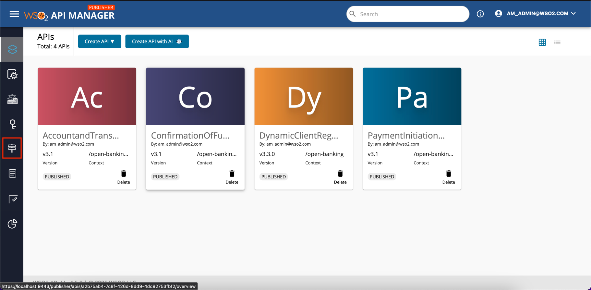

Policies can be engaged in API level and operational level based on the functionality.

1. Sign in to the API Publisher Portal at `https://<APIM_HOSTNAME>:9443/publisher`. 

2. Click on the API that you want to engage the policy.

3. Click on the Policies tab under API Configurations on left side tab panel.

4. To add an API Level Policy, Drag and drop the required policies from the policy list to the relevant flow. (Request, Response or Fault Flow)

5. To add an Operation Level Policy, Drag and drop the required policies from the policy list to the relevant flow of the API Resource. (Request, Response or Fault Flow)

6. Fill the attributes mentioned on the policy and click Save.

7. Then the policy will be added to the API as follows.

8. Scroll to down and click Save and Deploy to apply the changes to the API.

