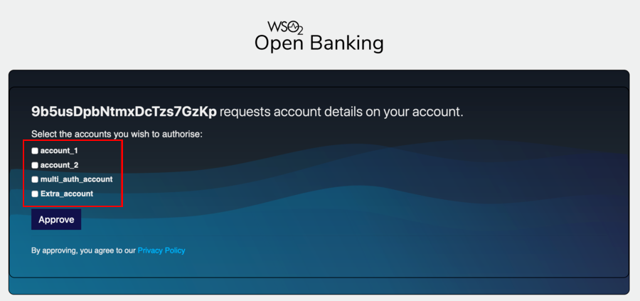

WSO2 Open Banking can be easily integrated into your current banking system. 

By default, WSO2 Open Banking Accelerator contains a mock back end that acts as the bank back-end server. In a 
production environment, you need to set up and configure the solution with your banking system. This documentation 
explains the integration points and APIs that your banking system needs to provide.

## Bank back end integration
   
The integration capabilities of the API Manager 4.0 can help you make the bank back end compatible with WSO2 Open 
Banking. For more information, see [Developing Your First Integration Solution](https://apim.docs.wso2.com/en/4.0.0/integrate/develop/integration-development-kickstart/). 

## Consent REST API
    
When interacting with the consent module, you can use the [Consent REST API](../references/consent-rest-api.md) exposed 
by WSO2 Open Banking Accelerator. 

## Sequence files

In a production environment, you can deploy your own APIs and configure sequence files by following the steps in 
[Publish an API](publish-an-api.md). By default, the solution contains a mock back end and a sample sequence file as 
follows:

``` xml
<sequence
	xmlns="http://ws.apache.org/ns/synapse" name="accounts-dynamic-endpoint-insequence">
	<property name="endpointURI" expression="get-property('To')"/>
	<!--Appending Basic Auth for Consent Management APIs -->
	<property name="Authorization" scope="transport" action="remove"/>
	<header name="Authorization" value="Basic YWRtaW5Ad3NvMi5jb206d3NvMjEyMw==" scope="transport"/>
	<filter regex=".*\/account-access-consents.*" source="$ctx:endpointURI">
		<then>
			<header name="To" value="https://<IS_HOST>:9446/api/openbanking/consent/manage" />
			<header name="x-wso2-client-id" expression="get-property('api.ut.consumerKey')" scope="transport"/>
		</then>
		<else>
			<header name="To" value="https://<APIM_HOST>:9443/api/openbanking/backend/services/accounts/accountservice" />
		</else>
	</filter>
</sequence>
```

- Update the placeholders with the hostname of your Identity Server and API Manager servers.
- Replace the `/api/openbanking/backend/services/accounts/accountservice`  URL with the API from your bank back end.

Follow the above sample and configure your sequence files to connect the bank back end to the WSO2 Open Banking solution.  

## Account-Request-Information header
   
The WSO2 Open Banking solution manages the initiation and authorisation of a consent. When an API consumer application 
makes a request to retrieve any account information, the solution validates the consent against the request. Upon 
successful validation, consent-related information is directed to the core banking system in the form of a header. This
header is known as `Account-Request-Information`.
   
The `Account-Request-Information` header is a signed JWT, which needs to be decoded by the core banking system.

The core banking system will perform all required validations and build a response. This response needs to adhere to 
the requirements in your open banking standard.

## Shareable and payable accounts 
   
Some bank customers may have a certain number of bank accounts in a particular bank, but not all these accounts have 
the ability to be shared externally or to make a payment online. These accounts are known as shareable and payable 
accounts respectively. In a bank, the list of shareable accounts and the payable accounts can either be the same or 
different.
   
The WSO2 Open Banking solution expects at least two APIs from the bank that return shareable and payable accounts when 
the `user_id` is provided. The response must be in the JSON format and it will automatically load the accounts list on 
the consent page during the consent authorization flow. 



The responses of shareable and payable accounts APIs depend on your open banking specification and what you need to 
display on the consent page. You can configure customized steps for retrieval by following the 
[Consent Authorize endpoint](https://ob.docs.wso2.com/en/latest/develop/consent-management-authorize/#configuration) 
documentation.