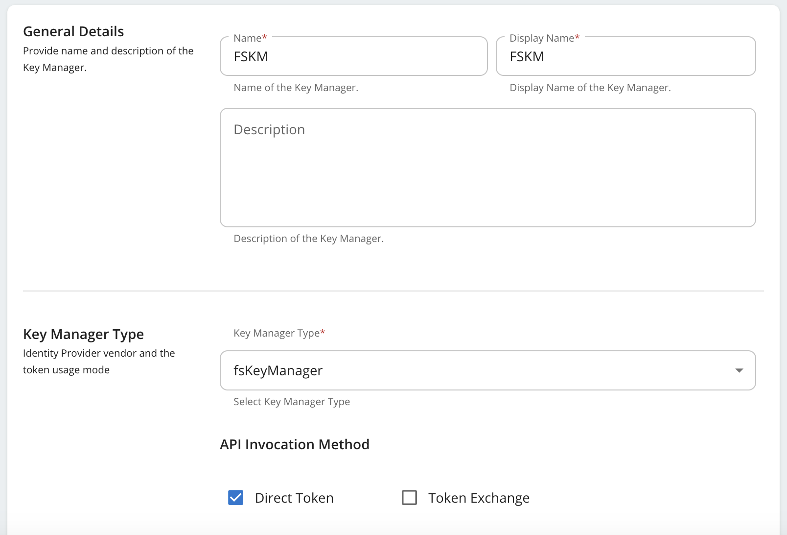
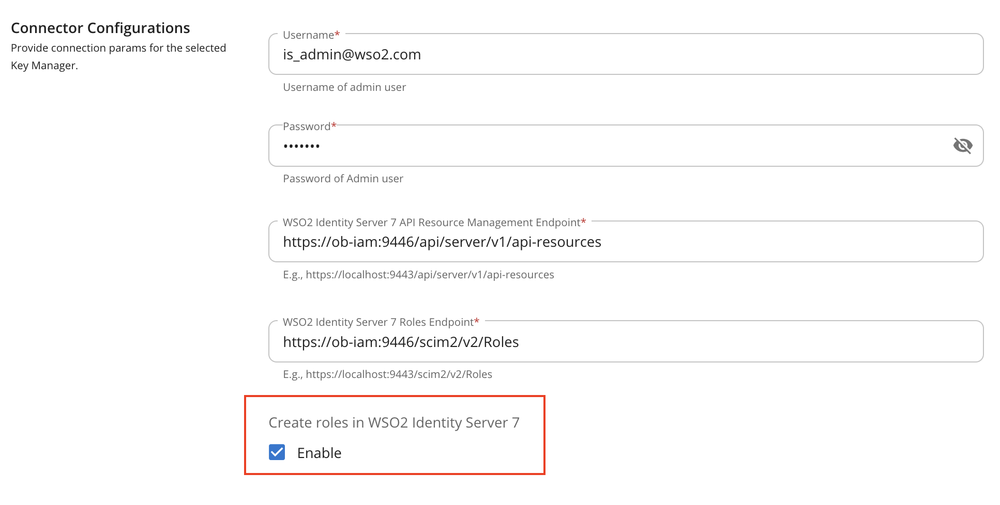
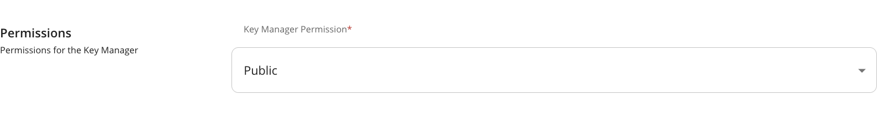
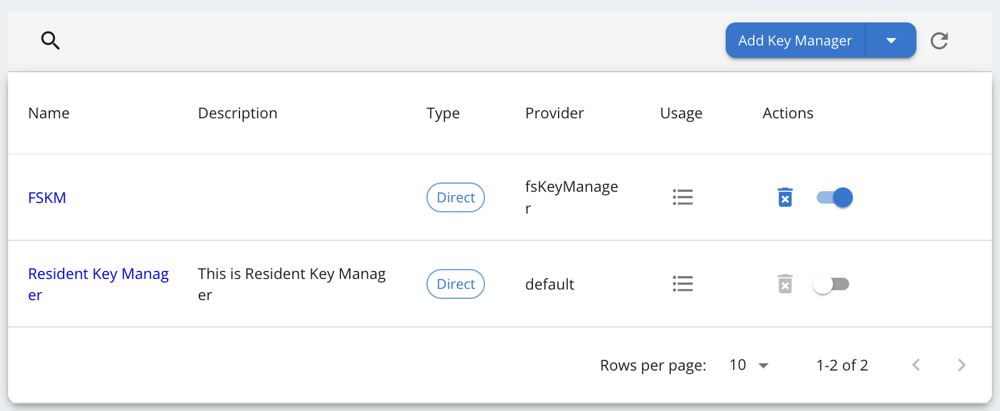
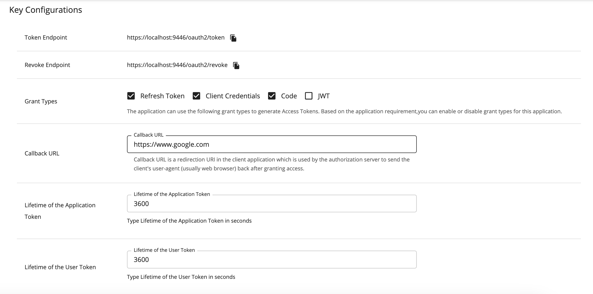

This page explains how to onboard API consumers using the Manual Client Registration. 

!!! tip "Before you begin:"
    See the [Configurations](manual-client-registration-configuration.md) section and configure Manual Client
    Registration.

## Configure FS Key Manager in WSO2 API Manager

1. Sign in to the Admin Portal of API Manager at `https://<APIM_HOSTNAME>:9443/admin` using admin credentials.

2. Go to Key Managers on the left main menu. Click on **Add Key Manager** button.
    

3. Enter a Name and Display Name, and select **fsKeyManager** as the Key Manager Type.
    

4. Enter the **Well-known-url** and **Issuer** as below.

    | Field | Value |
    | ----- | ----- |
    | Well-known-url | `https://<IS_HOSTNAME>:9446/oauth2/token/.well-known/openid-configuration` |
    | Issuer | `https://<IS_HOSTNAME>:9446/oauth2/token` |

5. Under the **Key Manager Endpoints** section, provide the following values:

    !!! note
        You can use `https://<IS_HOSTNAME>:9446/oauth2/token/.well-known/openid-configuration` as the Well-known URL, and click on Import to populate most of the fields mentioned below, Grant types, and the Certificates section. 

        If the Import button is used, verify all the auto imported values with the onces mentioned below.

    | Configuration | Values |
    | ------------- | ------ |
    | Issuer | `https://<IS_HOSTNAME>:9446/oauth2/token` |
    | Client Registration Endpoint | `https://<IS_HOSTNAME>:9446/api/identity/oauth2/dcr/v1.1/register` |
    | Introspection Endpoint | `https://<IS_HOSTNAME>:9446/oauth2/introspect` |
    | Token Endpoint | `https://<IS_HOSTNAME>:9446/oauth2/token` |
    | Display Token Endpoint | `https://<IS_HOSTNAME>:9446/oauth2/token` |
    | Revoke Endpoint | `https://<IS_HOSTNAME>:9446/oauth2/revoke` |
    | Display Revoke Endpoint | `https://<IS_HOSTNAME>:9446/oauth2/revoke` |
    | UserInfo Endpoint | `https://<IS_HOSTNAME>:9446/scim2/Me` |
    | Authorize Endpoint | `https://<IS_HOSTNAME>:9446/oauth2/authorize` |
    | Scope Management Endpoint | `https://<IS_HOSTNAME>:9446/api/identity/oauth2/v1.0/scopes` |

6. Under **Grant types**, provide all the following: 
    - Client_credentials
    - Refresh_token
    - Authorization_code
    - urn:ietf:params:oauth:grant-type:jwt-bearer
    
7. Under the **Certificates** section, select JWKS. Enter `https://<IS_HOSTNAME>:9446/oauth2/jwks` as the URL.

8. Under **Connector Configurations**, provide the following values:

    | Configuration | Values |
    | ------------- | ------ |
    | Username | Authorization server admin username |  
    | Password | Authorization server admin password |
    | WSO2 Identity Server 7 API Resource Management Endpoint | `https://<IS_HOSTNAME>:9446/api/server/v1/api-resources` |
    | WSO2 Identity Server 7 Roles Endpoint | `https://<IS_HOSTNAME>:9446/scim2/v2/Roles` |

9. Enable the Role creation is WSO2 Identity Server 7 as by ticking as below.
    

10. Set **Key Manager Permission** to **Public**.
    

11. Under **Advanced Configuration**, provide the following values:

    | Configuration | Values |
    | ------------- | ------ |
    | Token Generation | Tick (Mandatory) |
    | Out Of Band Provisioning | Tick (Mandatory) |     
    | Oauth App Creation | Tick (Mandatory)
    | Token Validation Method | Self Validate JWT |
    | Token Handling Options (Optional) | JWT |

12. Click on **Add** button to create the Key Manager. Key Manager will be displayed as below.
    

13. Disable the Resident Key Manager.
    

## Create Application using Manual Client Registration

### Step 1: Sign up as a TPP

1. Go to the Developer portal at `https://<APIM_HOST>:9443/devportal`.

2. Go to the **Applications** tab.   

3. In the Sign-in form, click **Create Account**.   

4. Provide a username and click **Proceed Self Register**.     

5. Fill out the **Create New Account** form to complete registration.

6. Read terms and conditions and click the checkbox to agree to the terms and conditions.  

7. Click Register.

### Step 2: Sign in to the Developer Portal as the TPP

1. Now, sign in to the [Developer portal](https://<APIM_HOST>:9443/devportal) as the TPP.

2. Enter the username and the password you entered when signing up as a TPP.

3. Click Continue. Now, you are on the home page of the Developer Portal.

### Step 3: Create an application

1. In the Developer Portal, go to the Applications tab. 

2. Click **ADD NEW APPLICATION**. [applications_tab](../assets/img/learn/mcr/create-new-application.png)  

3. Enter the following application details.  

4. Click **SAVE**. The Developer Portal displays the created application as follows: 

 
The application created via the Developer Portal allows you to observe statistics of APIs, subscribe to APIs, and access the subscribed APIs.

### Step 4: Subscribe to API

1. Go to the APIs tab in the Developer portal.

2. Select the API. 

3. Go to **Subscriptions** at the bottom of the API and select **SUBSCRIBE**.

4. Select **your application** from the drop-down list then set the **Throttling Policy** and click **SUBSCRIBE**. Once subscribed, the application can access all the supported services of the API resources.

### Step 5: Generate keys

The TPP application requires a Client ID (Consumer Key) to access the subscribed API.

1. Go to the **Applications** tab in the Developer Portal.

2. From the application list, select your application, which has subscribed to the API.

3. Select **Production Keys** > **OAuth2 Tokens or Sandbox Keys** > **OAuth2 Tokens** according to the type of key you require:
    a. Production Keys: Generates access tokens in the production environment.
    b. Sandbox Keys: Generates access tokens in the sandbox environment. 
     

4. Provide the requested information as defined below:

    | Field | Description |
    |-------|-------------|
    | Grant Types | Determine the credentials that are used to generate the access token. <ul> <li> Code: Relates to the authorisation code grant type and is applicable when consuming the API as a user. **It is mandatory to select the code grant type for regulatory applications.** </li> <li> Client Credentials: Relates to the client credentials grant type and is applicable when consuming the API as an application. </li> <li> Refresh Token: To renew an expired access token. </li> </ul> |
    | Callback URL | The URL used by the TPP to receive the authorization code sent from the bank. The authorisation code can be used later to generate an OAuth2 access token.   **This is a mandatory field for the authorization code grant type.** |
    | Enable PKCE | Enable if you want to enable PKCE support for your application |
    | Support PKCE Plain text | Enable if you want to enable PKCE Plain Text support for your application |
    | Application Certificate | This is the content of the application certificate (.PEM). For Regulatory applications, it is mandatory to use an application certificate |
    | Regulatory Application | The type of application. If your application complies with the Open Banking Regulation, it is a Regulatory application. |

    

    

5. Click **GENERATE KEYS** to generate production or sandbox keys.

6. It generates the consumer key and consumer secret and displays them at the top of the page.

    
