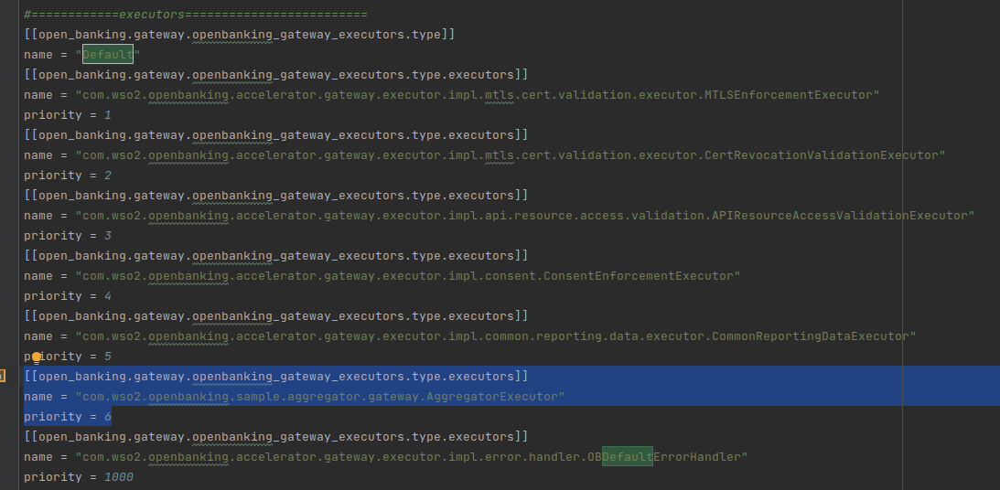
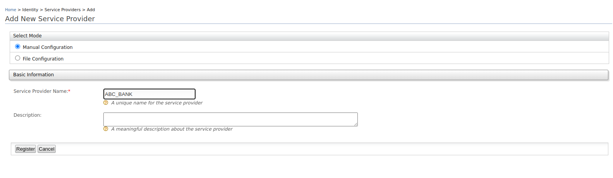
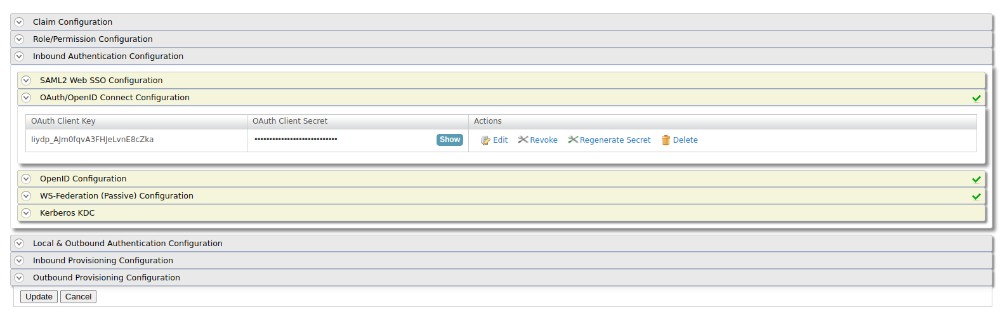
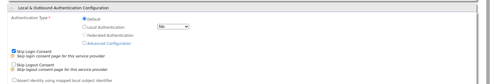
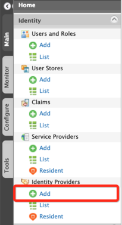
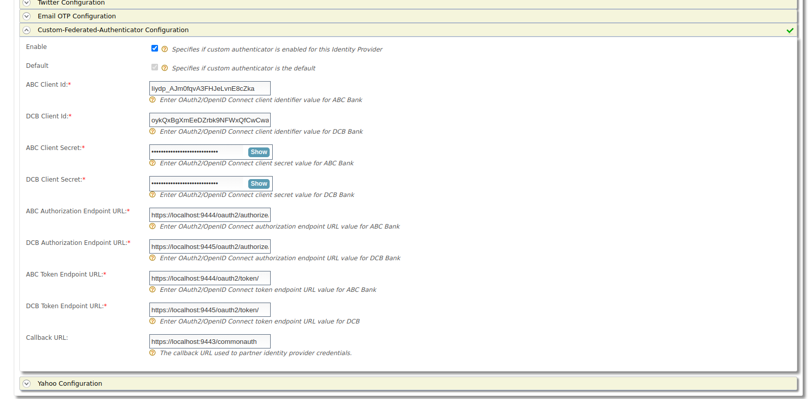
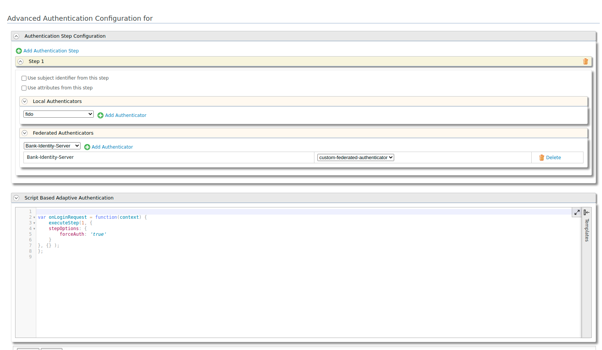

#Regulatory Aggregator - Quick Start Guide

This section guides you to set up WSO2 Open Banking Accelerator as a Regulatory Aggregator.

## Setting up JAVA_HOME

1. Install Oracle Java 8 or above to your node.
2. Set your `JAVA_HOME` environment variable to point to the directory where the Java Development Kit (JDK) is installed.
   For more information, see [Setting up JAVA_HOME](../../install-and-setup/setting-up-servers.md#setting-up-java_home).

##Installing base products

The accelerators run on top of WSO2 Identity Server and WSO2 API Manager, which are referred to as base
products. Before setting up the accelerator, download and install the base products:

- Install [WSO2 Identity Server 5.11.0](https://wso2.com/identity-server/#)
- Install [WSO2 API Manager 4.0.0](https://wso2.com/api-management/previous-releases/)

## Installing WSO2 Open Banking Accelerator

1. If you have an active WSO2 Open Banking subscription, contact us via [WSO2 Online Support System](https://support.wso2.com/)
   to download Open Banking Accelerator 3.0.0.

    !!! note
        If you don't have a WSO2 Open Banking subscription, [contact us](https://wso2.com/solutions/financial/open-banking/#contact)
        for more information.

2. Extract the downloaded WSO2 Open Banking Accelerator zip files. WSO2 Open Banking Accelerator contains the following
   accelerators.

    - wso2-obiam-accelerator-3.0.0
    - wso2-obam-accelerator-3.0.0

3. Go to the root directories of WSO2 Identity Server and API Manager. These root directories are the product
   homes.

    !!! tip
        This documentation will refer to the product homes as `<IS_HOME>` and `<APIM_HOME>` respectively.

## Getting WSO2 Updates

The WSO2 Update tool delivers hotfixes and updates seamlessly on top of products as WSO2 Updates. They include
improvements that are released by WSO2. You need to update the base products and accelerators using the relevant script.

1. Go to `/bin` directory and run the WSO2 Update tool:

    ```bash tab='On Linux'
    ./wso2update_linux 
    ```
 
    ```bash tab='On Mac'
    ./wso2update_darwin
    ```

    ```bash tab='On Windows'
    ./wso2update_windows.exe
    ```
   
2. Repeat this step for all the products and accelerators. 
For more information, see [Getting WSO2 Updates](../../install-and-setup/setting-up-servers.md#getting-wso2-updates).

## Setting up servers

This setup consists of the components below. We are using 2 WSO2 Identity Servers (vanilla) as the identity servers of 
banks ABC and DCB. However, you can use any standard identity servers with this setup.

!!! tip
    Port offsets are mentioned assuming that this setup is done using a single node. If you are using multiple nodes, 
    you can ignore the port offsets.

<!-- Add image from WSO2 blog -->

1. Take 3 copies of the updated WSO2 Identity Server.
2. Place 2 of them in a preferred location in the node. These 2 will be the identity servers of the banks.

## Setting up accelerators

This section explains how to set up the remaining WSO2 Identity Server and API Manager

1. Place the Identity Server and API Manager base products in the node.
2. Place the relevant accelerator in their respective product homes:

    |Accelerator| Directory location to place the Accelerator|
    |-----------| -------------------------------------------|
    |wso2-obiam-accelerator-3.0.0| `<IS_HOME>`|
    |wso2-obam-accelerator-3.0.0| `<APIM_HOME>`|

    !!! tip
        This documentation will refer to above accelerator root directories as
        `<OB_IS_ACCELERATOR_HOME>` and `<OB_APIM_ACCELERATOR_HOME>` respectively.

3. To copy the accelerator files to the API Manager server, go to the `<APIM_HOME>/<OB_APIM_ACCELERATOR_HOME>/bin`
   directory and run the `merge.sh` script as follows:

    ``` shell 
    ./merge.sh
    ```

4. To copy the accelerator files to the Identity Server, go to the `<IS_HOME>/<OB_IS_ACCELERATOR_HOME>/bin` directory
   and run the `merge.sh` script as follows:

    ``` shell 
    ./merge.sh
    ```
   
5. To configure the Identity Server with the API Manager, install
   [WSO2 IS Connector](https://apim.docs.wso2.com/en/4.0.0/assets/attachments/administer/wso2is-extensions-1.2.10.zip)

6. Extract the `wso2is-extensions` zip file. Copy the following files to the Identity Server as follows:

    | File to copy | Copy to |
    | -------------| ------- |
    | `wso2is-extensions-1.2.10/dropins/wso2is.key.manager.core-1.2.10.jar` | `<IS_HOME>/repository/components/dropins`|
    | `wso2is-extensions-1.2.10/dropins/wso2is.notification.event.handlers-1.2.10.jar` | `<IS_HOME>/repository/components/dropins` |
    | `wso2is-extensions-1.2.10/webapps/keymanager-operations.war` | `<IS_HOME>/repository/deployment/server/webapps` |


## Configuring database scripts

1. Open the `<APIM_HOME>/<OB_APIM_ACCELERATOR_HOME>/repository/conf/configure.properties` file.

2. Configure the hostnames of the API Manager and Identity Server.

3. Configure databases related properties and database names.

4. Open the `<IS_HOME>/<OB_IS_ACCELERATOR_HOME>/repository/conf/configure.properties` file and repeat steps 2 and 3. 

5. Run the configure.sh files in `<APIM_HOME>/<OB_APIM_ACCELERATOR_HOME>/bin` and
   `<IS_HOME>/<OB_IS_ACCELERATOR_HOME>/bin` respectively:
```
./configure.sh
```

## Configuring regulatory aggregator

1. Download the regulatory aggregator resources.
2. Copy the following files to the Open Banking Identity Server:

    | File to copy | Copy to |
    | -------------| ------- |
    | `com.wso2.openbanking.sample.aggregator.gateway-3.0.0.96-SNAPSHOT.jar` | `<APIM_HOME>/repository/components/libs`|
    | `com.wso2.openbanking.sample.aggregator.identity-3.0.0.96-SNAPSHOT.jar` | `<IS_HOME>/repository/components/libs` |
    | `org.wso2.carbon.identity.custom.federated.authenticator-1.0.0.jar` | `<IS_HOME>/repository/components/dropins` |

3. Copy the provided `api#openbanking#backend.war` file to the 
   `<BANK_IS_HOME>/repository/deployment/server/webapps` directories of ABC and DCB banks' identity servers.
    - This is to provide mock bank APIs from ABC and DCB banks.
4. Open the `<ABC_IS_HOME>/repository/conf/deployment.toml` file of ABC bank and configure it as follows:

    a. Set the `offset` to 1:
        ``` toml
        [server]
        offset = 1
        ```
    b. Add the following configurations to the end of the file. This is to protect the added web application 
       with OAuth2 Authentication.

       ``` toml
       [[resource.access_control]]
       context = "(.*)/api/openbanking/backend/(.*)"
       secure="true"
       http_method="all"
       permissions=["/permission/admin"]
       allowed_auth_handlers = "OAuthAuthentication"
       ```

5. Repeat step 4 for DBC bank's `<DBC_IS_HOME>/repository/conf/deployment.toml`. But set the `offset` to **2**.

6. Configure an executor:
    a. Open the `<APIM_HOME>/repository/conf/deployment.toml` file. 
    b. Locate the **executors** section and add the following as the 6th executor of the `Default` flow.

       ```
       [[open_banking.gateway.openbanking_gateway_executors.type.executors]] name = "com.wso2.openbanking.sample.aggregator.gateway.AggregatorExecutor" priority = 6
       ```

       For example: 

7. Configure the Open Banking Identity Server:

    a. Open the `<IS_HOME>/repository/conf/deployment.toml` file.

    b. Under `[authentication.endpoint.redirect_params]` tag, add 5 additional parameters as follows:

       ```toml
       parameters = ["sessionDataKeyConsent","relyingParty", "authenticators", "authFailureMsg", "authFailure", "scope", "client_id","redirect_uri", "response_type", "state"]
       ```
    c. Change the class parameter under the `[[oauth.custom_response_type]]` tag as follows:

       ```toml
       class = "com.wso2.openbanking.sample.aggregator.identity.AggregatorHybridResponseTypeHandler"
       ```

    d. Update the following `[open_banking.dcr]` configurations:

      ``` toml
      jwks_url_sandbox = "https://keystore.openbankingtest.org.uk/0015800001HQQrZAAX/u3ZWlf9Yt42dyZgIvzkvqb.jwks"
      jwks_url_production = "https://keystore.openbankingtest.org.uk/0015800001HQQrZAAX/u3ZWlf9Yt42dyZgIvzkvqb.jwks"
      applicationupdater = "com.wso2.openbanking.sample.aggregator.identity.AggregatorApplicationUpdaterImpl"
      ```

    e. Locate the `[[open_banking.consent.authorize_steps.retrieve]]` tag with `priority=2` to and change its class to 
       `class = "com.wso2.openbanking.sample.aggregator.identity.AggregatorConsentDisplayStep"`. 

       For example: 

    f. Locate the `[[open_banking.consent.authorize_steps.persist]]` tag with `priority=1` to and change its class to
   `class = "com.wso2.openbanking.sample.aggregator.identity.AggregatorConsentCreateStep"`.

       For example: 

    g. Change the `validator` attribute under the `[open_banking.consent.validation]` tag as follows:

       ``` toml
       validator="com.wso2.openbanking.sample.aggregator.identity.AggregatorConsentValidator"
       ```
		
    h. Update the value of `request_object_validator` under the `[open_banking.identity.extensions]` tag:
 
       ``` toml
       request_object_validator="com.wso2.openbanking.accelerator.identity.auth.extensions.request.validator.OBRequestObjectValidator"
       ```

    i. Under the `[open_banking.identity.extensions]` tag, add the given new parameter:

       ``` toml
       response_type_handler="com.wso2.openbanking.sample.aggregator.identity.OBAggregatorResponseTypeHandler"	
       ```

9. Upload the root and issuer certificates in OBIE ([Sandbox certificates](https://openbanking.atlassian.net/wiki/spaces/DZ/pages/252018873/OB+Root+and+Issuing+Certificates+for+Sandbox)/
   [Production certificates](https://openbanking.atlassian.net/wiki/spaces/DZ/pages/80544075/OB+Root+and+Issuing+Certificates+for+Production))
   to the client trust stores:

     - `<APIM_HOME>/repository/resources/security/client-truststore.jks` 
     - `<IS_HOME>/repository/resources/security/client-truststore.jks` 

     Use the following command:

    ```
    keytool -import -alias <alias> -file <certificate_location> -storetype JKS -keystore <truststore_location> -storepass wso2carbon
    ```
   
## Starting severs

1. Start all Identity Servers (including the ABC and DBC banks' servers). Go to the `<IS_HOME>/bin` directory using 
   a terminal and run the `wso2server` script:

    ``` toml tab="On Linux/macOS"
    ./wso2server.sh
    ```   
   
    ``` toml tab="On Windows"
    ./wso2server.bat
    ```

2. Start the API Manager server. Go to the `<APIM_HOME>/bin` directory using a terminal and run the `api-manager` script:

    ``` toml tab="On Linux/MacOS"
    ./api-manager.sh
    ```   

    ``` toml tab="On Windows"
    ./api-manager.bat
    ```

## Creating Service Providers 

This section explains how to create Service Providers in the Identity Servers at the banks.

1. Log in to the Management Console of ABC bank's Identity Server at `https://localhost:9444/carbon/` using
   admin credentials. 
2. On the **Main** menu, click **Identity > Service Providers > Add**.  
    
3. Fill in the **Service Provider Name** as **ABC_BANK**: 
4. Click **Register** to add the new service provider. The Service Provider Details page appears.
5. Expand the **Inbound Authentication Configuration > OAuth/OpenID Connect Configuration** section. 
6. Click **Configure**.
7. Set the **Callback URL** to `https://localhost:9446/commonauth`.
8. Click **Add**. Note that `client key` and `client secret` get generated. Note these values for future use.
   
9. Expand the **Local and Outbound Authentication Configuration** section. 
10. Select the **Skip Login Consent** box. 
11. Click **Update** and save the configurations.
12. Log in to the Management Console of DBC bank's Identity Server at `https://localhost:9445/carbon/` and repeat
    the same steps to create the **DBC_BANK** Service Provider.

## Configuring a Federated Authenticator 

This section explains how to configure a Federated Authenticator in the Open Banking Identity Server.

1. Log in to the Management Console of the Identity Server at `https://localhost:9446/carbon/` using
   admin credentials.
2. On the **Main** tab, click **Identity > Identity Providers > Add**. 

     

3. Fill in the **Identity Provider Name** as **Bank-Identity-Server**.
4. Expand **Federated Authenticators > Custom Federated Authenticator**.
5. Fill in the information regarding ABC and DCB banks. 
     - Provide the `client key` and `client secret` generated from the section [above](#creating-service-providers).
     - Extract the authorization endpoint and token endpoint from the well-known endpoints of each bank's identity server.
     - Set the **Callback URL** to `https://localhost:9446/commonauth`.
       
6. Click **Register**.

## Configuring Adaptive Authentication Script

This section explains how to configure an Authentication Script in the Open Banking Identity Server.

!!! tip "Before you begin"
    Follow the [Dynamic Client Registration](../../get-started/dynamic-client-registration.md) documentation
    and create a DCR Application.

1. Log in to the Management Console of the Identity Server at `https://localhost:9446/carbon/` using
   admin credentials.
2. On the **Main** menu, click **Identity > Service Providers > List**. The list of service providers you added appears.
3. Locate the service provider generated for DCR and click on the corresponding **Edit** link.
4. Expand **Local & Outbound Authentication Configuration**.
5. Select **Advanced Configuration** as the Authentication Type.
6. Use the following script for **Script Based Adaptive Authentication**. 

    ```
    var onLoginRequest = function(context) {
        executeStep(1, {
            stepOptions: {
                forceAuth: 'true'
            }
        }, {});
    };
    ```
   
7. Make sure that the previously created **Bank-Identity-Server** is the selected Authentication Step. For example:
   
8. Click **Update**.

## Deploying Accounts API 

Log in to API Publisher, Deploy, and Publish the Accounts API by following 
the [Try out API Flow](../../get-started/try-out-flow.md) documentation.

!!!note
    Use the provided `accounts-dynamic-endpoint-insequence.xml` file as the Message Mediation 
    instead of the default file.