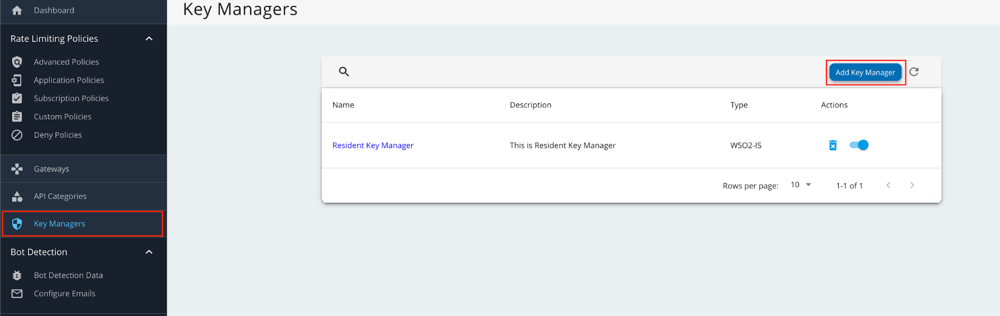
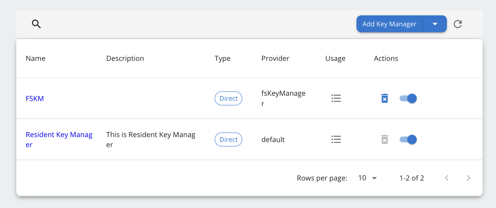

## Configure IS as Key Manager

### Configure WSO2 Identity Server 7.1.0

1. Add following configurations in the `<IS_HOME>/repository/conf/deployment.toml` file.

    ```
    [[event_listener]]
    id = "token_revocation"
    type = "org.wso2.carbon.identity.core.handler.AbstractIdentityHandler"
    name = "org.wso2.is.notification.ApimOauthEventInterceptor"
    order = 1

    [event_listener.properties]
    notification_endpoint = "https://<APIM_HOST>:<APIM_PORT>/internal/data/v1/notify"
    username = "${admin.username}"
    password = "${admin.password}"
    'header.X-WSO2-KEY-MANAGER' = "WSO2-IS"
    ```

2. Download [notification.event.handlers-2.0.5.jar](https://maven.wso2.org/nexus/content/repositories/releases/org/wso2/km/ext/wso2is/wso2is.notification.event.handlers/2.0.5/wso2is.notification.event.handlers-2.0.5.jar) and add it to `<IS_HOME>/repository/components/dropins` folder.

3. Restart the IS server

### Configure Key Manager in WSO2 API Manager

1. Sign in to the Admin Portal of API Manager at `https://<APIM_HOSTNAME>:9443/admin` using admin credentials.

2. Go to Key Managers on the left main menu. Click on **Add Key Manager** button.
    

3. Enter a Name and Display Name, and select **fsKeyManager** as the Key Manager Type.
    

4. Enter the **Well-known-url** and **Issuer** as below.

    | Field | Value |
    | ----- | ----- |
    | Well-known-url | `https://<IS_HOSTNAME>:9446/oauth2/token/.well-known/openid-configuration` |
    | Issuer | `https://<IS_HOSTNAME>:9446/oauth2/token` |

5. Under the **Key Manager Endpoints** section, provide the following values:

    !!! note
        You can use `https://<IS_HOSTNAME>:9446/oauth2/token/.well-known/openid-configuration` as the Well-known URL, and click on Import to populate most of the fields mentioned below, Grant types, and the Certificates section. 

        If the Import button is used, verify all the auto imported values with the onces mentioned below.


    | Configuration | Values |
    | ------------- | ------ |
    | Issuer | `https://<IS_HOSTNAME>:9446/oauth2/token` |
    | Client Registration Endpoint | `https://<IS_HOSTNAME>:9446/api/identity/oauth2/dcr/v1.1/register` |
    | Introspection Endpoint | `https://<IS_HOSTNAME>:9446/oauth2/introspect` |
    | Token Endpoint | `https://<IS_HOSTNAME>:9446/oauth2/token` |
    | Display Token Endpoint | `https://<IS_HOSTNAME>:9446/oauth2/token` |
    | Revoke Endpoint | `https://<IS_HOSTNAME>:9446/oauth2/revoke` |
    | Display Revoke Endpoint | `https://<IS_HOSTNAME>:9446/oauth2/revoke` |
    | UserInfo Endpoint | `https://<IS_HOSTNAME>:9446/scim2/Me` |
    | Authorize Endpoint | `https://<IS_HOSTNAME>:9446/oauth2/authorize` |
    | Scope Management Endpoint | `https://<IS_HOSTNAME>:9446/api/identity/oauth2/v1.0/scopes` |

6. Under **Grant types**, provide all the following: 
    - Client_credentials
    - Refresh_token
    - Authorization_code
    - urn:ietf:params:oauth:grant-type:jwt-bearer
    
7. Under the **Certificates** section, select JWKS. Enter `https://<IS_HOSTNAME>:9446/oauth2/jwks` as the URL.

8. Under **Connector Configurations**, provide the following values:

    | Configuration | Values |
    | ------------- | ------ |
    | Username | Authorization server admin username |  
    | Password | Authorization server admin password |
    | WSO2 Identity Server 7 API Resource Management Endpoint | `https://<IS_HOSTNAME>:9446/api/server/v1/api-resources` |
    | WSO2 Identity Server 7 Roles Endpoint | `https://<IS_HOSTNAME>:9446/scim2/v2/Roles` |

9. Enable the Role creation is WSO2 Identity Server 7 as by ticking as below.
    

10. Set **Key Manager Permission** to **Public**.
    

11. Under **Advanced Configuration**, provide the following values:

    | Configuration | Values |
    | ------------- | ------ |
    | Token Generation | Tick (Mandatory) |
    | Out Of Band Provisioning | Tick (Mandatory) |     
    | Oauth App Creation | Tick (Mandatory)
    | Token Validation Method | Self Validate JWT |
    | Token Handling Options (Optional) | JWT |

12. Click on **Add** button to create the Key Manager. Key Manager will be displayed as below.
    

13. Disable the Resident Key Manager.
    