This page explains how to onboard API consumers using the Dynamic Client Registration API. 

!!! tip "Before you begin..."

    1. Open the `<IS_HOME>/repository/conf/deployment.toml` file.
    
    2. Configure the JWKS endpoints by following the sample given below. These endpoints are used for validating the SSA signature. 
    ```toml
    [oauth.dcr]
    ssa_jkws= "https://keystore.openbankingtest.org.uk/0015800001HQQrZAAX/0015800001HQQrZAAX.jwks"
    ```
       
    3. Restart the Identity Server.


### Step 1: Deploy the Dynamic Client Registration(DCR) API

1. Sign in to the API Publisher Portal at [https://localhost:9443/publisher](https://localhost:9443/publisher). 
    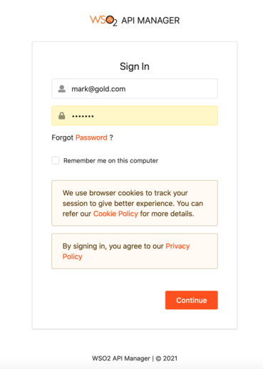

2. In the homepage, go to **REST API** and select **Import Open API**.
    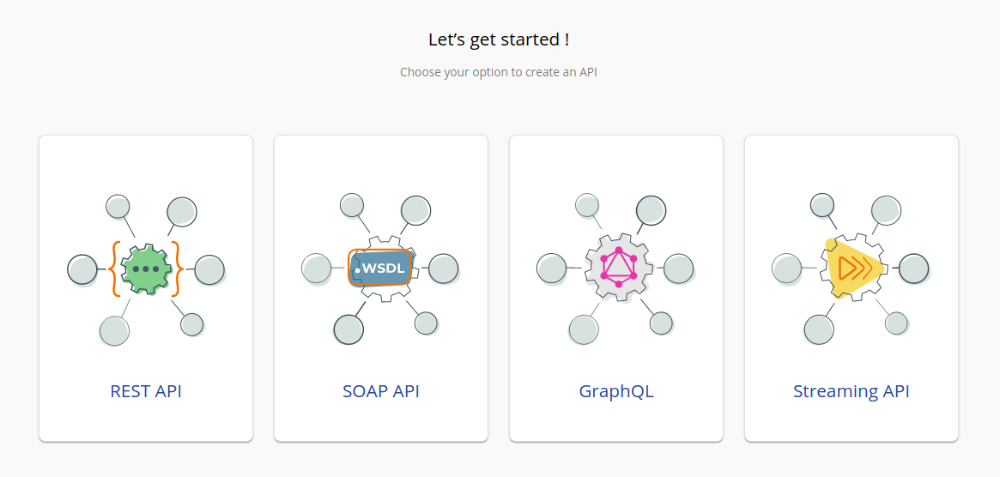

3. Select **OpenAPI File/Archive**. 
    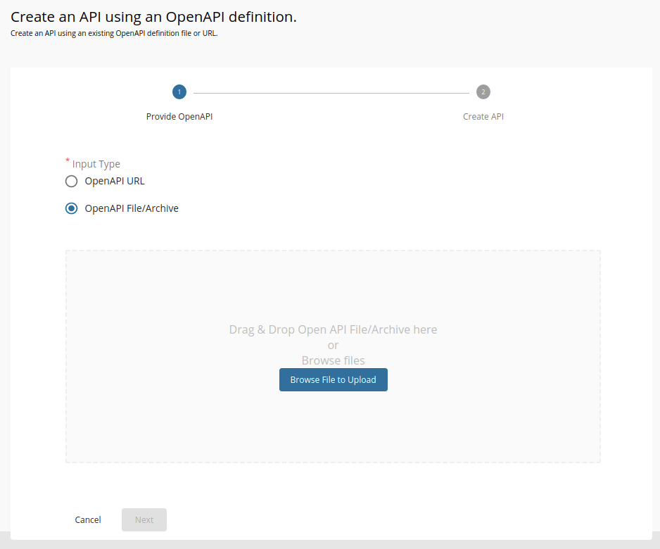

4. Click **Browse File to Upload** and select the [dcr-swagger.yaml](https://github.com/wso2/financial-services-accelerator/blob/4.0.0/financial-services-accelerator/accelerators/fs-apim/repository/resources/apis/DynamicClientRegistration/dcr-swagger.yaml) file.

5. Click **Next**.

6. Set the value for **Endpoint** as follows:
    ```
    http://<IS_HOSTNAME>:9766/api/identity/oauth2/dcr/v1.1
    ```
    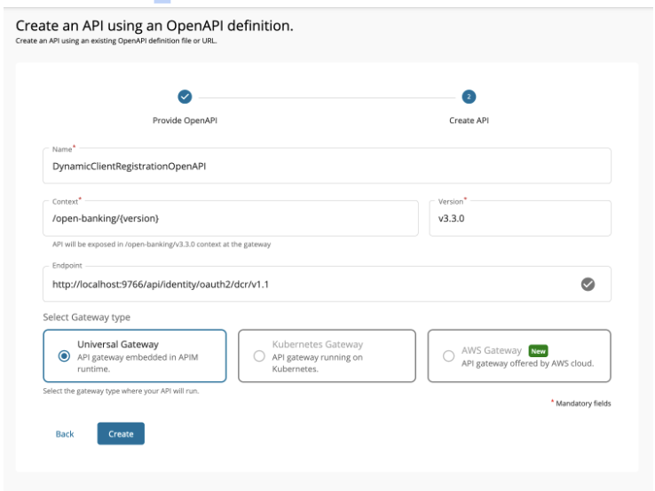

7. Click **Create**. 

8. Select **Subscriptions** from the left menu pane and uncheck all subscription plans.
    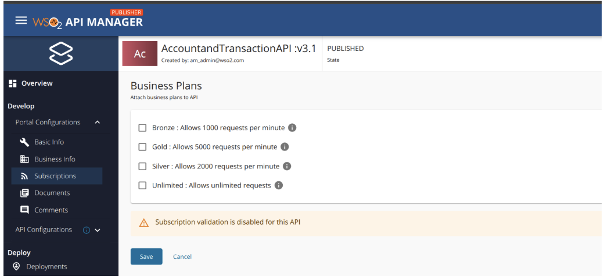

9. Click **Save**.

10. Select **Endpoints** from the left menu pane and select **Endpoint Security**.
    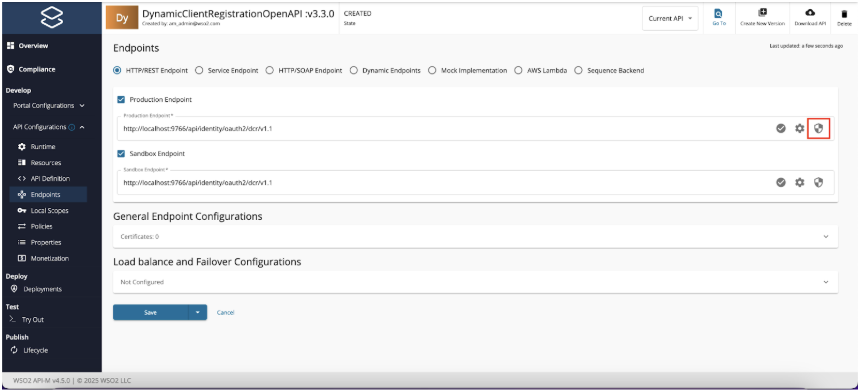

11. Select Basic Auth as the security type and provide Identity Server Administrator username and password. Click Submit.
    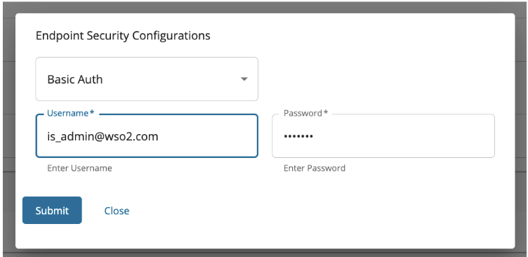

12. Do the same for both Production and Sandbox endpoints and click Save.

13. Refer the documentation on [Creating an API Policy](../learn/create-policies.md) and create DCR policies.

    - [DCR Request Mediation Policy](../../learn/dcr-request-policies.md)
    - [DCR Response Mediation Policy](../../learn/dcr-response-policies.md)

14. Add the policies created above for the resources in the applicable path (Request or Response) and click Save. Refer [Engaging Policies to APIs](../../learn/engage-policies.md) for more details.

15. Go to **Deployments** using the left menu pane. <br/>
    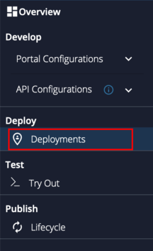

16. Select the API Gateway type, in this scenario, it is **Default**.
    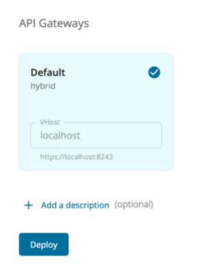

17. Click **Deploy**.

18. Go to **Overview** using the left menu pane. <br/>
    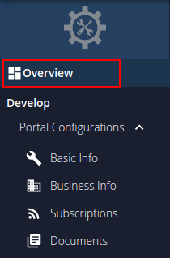
 
19. Click **Publish**. 
    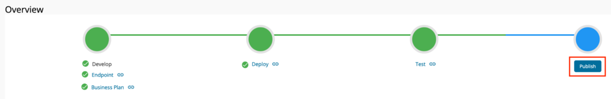

20. The deployed DCR API is now available in the Developer Portal at [https://localhost:9443/devportal](https://localhost:9443/devportal).

### Step 2: Configure WSO2 IS 7.x as a Key Manager

1. Sign in to the Admin Portal of API Manager at <https://localhost:9443/admin>.

2. Go to **Key Managers** on the left main menu. 
    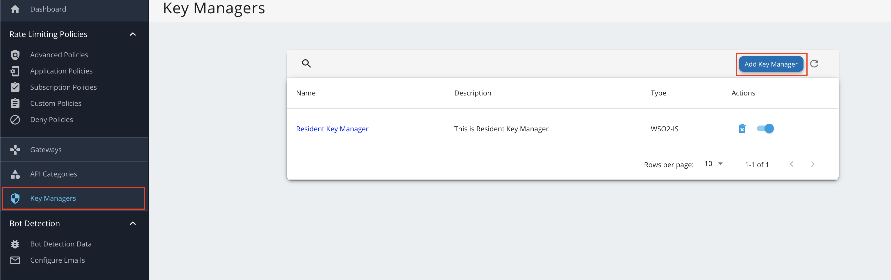

3. Configure [WSO2 IS 7.x as a keymanager](https://apim.docs.wso2.com/en/latest/administer/key-managers/configure-wso2is7-connector/).
    
4. Go to the list of Key Managers and select **Resident Key Manager**. 
    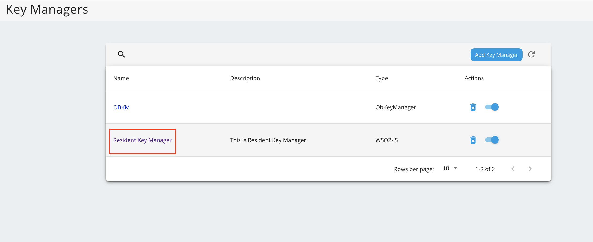

5. Disable the Resident Key Manager.
    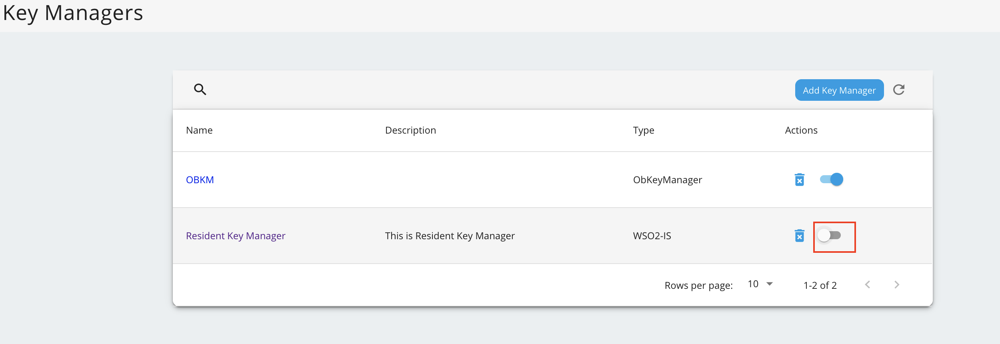

### Step 3: Register an application
The DCR allows the TPP to request the bank to register a new application. The process is as follows:

- The TPP sends a registration request including a Software Statement Assertion (SSA) as a claim in the payload. 
- This SSA contains API consumer's metadata. It is a signed JWT issued by the Open Banking directory and the TPPs need to obtain it before registering with an ASPSP.

A sample request looks as follows:

 For the Transport Layer Security purposes in this sample flow, you can use the attached
 [private key](../../assets/attachments/transport-certs/obtransport.key) and 
 [public certificate](../../assets/attachments/transport-certs/obtransport.pem). 

```
curl -X POST https://localhost:8243/open-banking/v3.3.0/register \
-H 'Accept: application/json' \
--cert <TRANSPORT_PUBLIC_CERT_FILE_PATH> --key <TRANSPORT_PRIVATE_KEY_FILE_PATH> \
-H 'Content-Type: application/json' \
 -d 'eyJraWQiOiJzQ2VrTmdTV0lhdVEzNGtsUmhER3Fmd3BqYzQiLCJ0eXAiOiJKV1QiLCJhbGciOiJQUzI1NiJ9.CiAgICAgICAgICAgICB7CiAgICAgICAgICAgICAgICJpc3MiOiAib1E0S29hYXZwT3VvRTdydlFzWkVPViIsCiAgICAgICAgICAgICAgICAiaWF0IjogMTc1MDkxOTQ5NiwKICAgICAgICAgICAgICAgICJleHAiOiAxNzUwOTIzMDk2LAogICAgICAgICAgICAgICAgImp0aSI6ICIxNzUwOTE5NDk2MDQxIiwKICAgICAgICAgICAgICAgICJhdWQiOiAiaHR0cHM6Ly9sb2NhbGJhbmsuY29tIiwKICAgICAgICAgICAgICAgICJzY29wZSI6ICJhY2NvdW50cyBwYXltZW50cyBmdW5kc2NvbmZpcm1hdGlvbnMiLAogICAgICAgICAgICAgICAgInRva2VuX2VuZHBvaW50X2F1dGhfbWV0aG9kIjogInByaXZhdGVfa2V5X2p3dCIsCiAgICAgICAgICAgICAgICAidG9rZW5fZW5kcG9pbnRfYXV0aF9zaWduaW5nX2FsZyI6ICJQUzI1NiIsCiAgICAgICAgICAgICAgICAiZ3JhbnRfdHlwZXMiOiBbCiAgICAgICAgICAgICAgICAgICAgImF1dGhvcml6YXRpb25fY29kZSIsCiAgICAgICAgICAgICAgICAgICAgImNsaWVudF9jcmVkZW50aWFscyIsCiAgICAgICAgICAgICAgICAgICAgInJlZnJlc2hfdG9rZW4iCiAgICAgICAgICAgICAgICAgICAgXSwKICAgICAgICAgICAgICAgICJyZXNwb25zZV90eXBlcyI6IFsKICAgICAgICAgICAgICAgICAgICAiY29kZSBpZF90b2tlbiIKICAgICAgICAgICAgICAgICAgICBdLAogICAgICAgICAgICAgICAgImlkX3Rva2VuX3NpZ25lZF9yZXNwb25zZV9hbGciOiAiUFMyNTYiLAogICAgICAgICAgICAgICAgImlkX3Rva2VuX2VuY3J5cHRlZF9yZXNwb25zZV9hbGciOiAiUlNBLU9BRVAiLAogICAgICAgICAgICAgICAgImlkX3Rva2VuX2VuY3J5cHRlZF9yZXNwb25zZV9lbmMiOiAiQTI1NkdDTSIsCiAgICAgICAgICAgICAgICAicmVxdWVzdF9vYmplY3Rfc2lnbmluZ19hbGciOiAiUFMyNTYiLCAgICAgICAgICAgICAgICAgICAgICAgICAgICAKICAgICAgICAgICAgICAgICJhcHBsaWNhdGlvbl90eXBlIjogIndlYiIsCiAgICAgICAgICAgICAgICAic29mdHdhcmVfaWQiOiAib1E0S29hYXZwT3VvRTdydlFzWkVPViIsCiAgICAgICAgICAgICAgICAicmVkaXJlY3RfdXJpcyI6IFsKICAgICAgICAgICAgICAgICAgICAiaHR0cHM6Ly93d3cuZ29vZ2xlLmNvbS9yZWRpcmVjdHMvcmVkaXJlY3QxIgogICAgICAgICAgICAgICAgICAgIF0sCiAgICAgICAgICAgICAgICAic29mdHdhcmVfc3RhdGVtZW50IjogImV5SmhiR2NpT2lKUVV6STFOaUlzSW10cFpDSTZJbk5EWld0T1oxTlhTV0YxVVRNMGEyeFNhRVJIY1daM2NHcGpOQ0lzSW5SNWNDSTZJa3BYVkNKOS5leUpwYzNNaU9pSlBjR1Z1UW1GdWEybHVaeUJNZEdRaUxDSnBZWFFpT2pFM05UQTJOakV6TURVc0ltcDBhU0k2SW1KaE5EaGhNR0ppWkRBd1lqUXlaalFpTENKemIyWjBkMkZ5WlY5bGJuWnBjbTl1YldWdWRDSTZJbk5oYm1SaWIzZ2lMQ0p6YjJaMGQyRnlaVjl0YjJSbElqb2lWR1Z6ZENJc0luTnZablIzWVhKbFgybGtJam9pYjFFMFMyOWhZWFp3VDNWdlJUZHlkbEZ6V2tWUFZpSXNJbk52Wm5SM1lYSmxYMk5zYVdWdWRGOXBaQ0k2SW05Uk5FdHZZV0YyY0U5MWIwVTNjblpSYzFwRlQxWWlMQ0p6YjJaMGQyRnlaVjlqYkdsbGJuUmZibUZ0WlNJNklsZFRUeklnVDNCbGJpQkNZVzVyYVc1bklGUlFVRElnS0ZOaGJtUmliM2dwSWl3aWMyOW1kSGRoY21WZlkyeHBaVzUwWDJSbGMyTnlhWEIwYVc5dUlqb2lWMU5QTWlCUGNHVnVJRUpoYm10cGJtY2dWRkJRTWlCbWIzSWdkR1Z6ZEdsdVp5SXNJbk52Wm5SM1lYSmxYM1psY25OcGIyNGlPaUl4TGpVaUxDSnpiMlowZDJGeVpWOWpiR2xsYm5SZmRYSnBJam9pYUhSMGNITTZMeTkzZDNjdVoyOXZaMnhsTG1OdmJTSXNJbk52Wm5SM1lYSmxYM0psWkdseVpXTjBYM1Z5YVhNaU9sc2lhSFIwY0hNNkx5OTNkM2N1WjI5dloyeGxMbU52YlM5eVpXUnBjbVZqZEhNdmNtVmthWEpsWTNReElpd2lhSFIwY0hNNkx5OTNkM2N1WjI5dloyeGxMbU52YlM5eVpXUnBjbVZqZEhNdmNtVmthWEpsWTNReUlsMHNJbk52Wm5SM1lYSmxYM0p2YkdWeklqcGJJbEJKVTFBaUxDSkJTVk5RSWl3aVEwSlFTVWtpWFN3aWIzSm5ZVzVwYzJGMGFXOXVYMk52YlhCbGRHVnVkRjloZFhSb2IzSnBkSGxmWTJ4aGFXMXpJanA3SW1GMWRHaHZjbWwwZVY5cFpDSTZJazlDUjBKU0lpd2ljbVZuYVhOMGNtRjBhVzl1WDJsa0lqb2lWVzVyYm05M2JqQXdNVFU0TURBd01ERklVVkZ5V2tGQldDSXNJbk4wWVhSMWN5STZJa0ZqZEdsMlpTSXNJbUYxZEdodmNtbHpZWFJwYjI1eklqcGJleUp0WlcxaVpYSmZjM1JoZEdVaU9pSkhRaUlzSW5KdmJHVnpJanBiSWxCSlUxQWlMQ0pCU1ZOUUlpd2lRMEpRU1VraVhYMHNleUp0WlcxaVpYSmZjM1JoZEdVaU9pSkpSU0lzSW5KdmJHVnpJanBiSWxCSlUxQWlMQ0pEUWxCSlNTSXNJa0ZKVTFBaVhYMHNleUp0WlcxaVpYSmZjM1JoZEdVaU9pSk9UQ0lzSW5KdmJHVnpJanBiSWxCSlUxQWlMQ0pCU1ZOUUlpd2lRMEpRU1VraVhYMWRmU3dpYzI5bWRIZGhjbVZmYkc5bmIxOTFjbWtpT2lKb2RIUndjem92TDNkM2R5NW5iMjluYkdVdVkyOXRJaXdpYjNKblgzTjBZWFIxY3lJNklrRmpkR2wyWlNJc0ltOXlaMTlwWkNJNklqQXdNVFU0TURBd01ERklVVkZ5V2tGQldDSXNJbTl5WjE5dVlXMWxJam9pVjFOUE1pQW9WVXNwSUV4SlRVbFVSVVFpTENKdmNtZGZZMjl1ZEdGamRITWlPbHQ3SW01aGJXVWlPaUpVWldOb2JtbGpZV3dpTENKbGJXRnBiQ0k2SW5OaFkyaHBibWx6UUhkemJ6SXVZMjl0SWl3aWNHaHZibVVpT2lJck9UUTNOelF5TnpRek56UWlMQ0owZVhCbElqb2lWR1ZqYUc1cFkyRnNJbjBzZXlKdVlXMWxJam9pUW5WemFXNWxjM01pTENKbGJXRnBiQ0k2SW5OaFkyaHBibWx6UUhkemJ6SXVZMjl0SWl3aWNHaHZibVVpT2lJck9UUTNOelF5TnpRek56UWlMQ0owZVhCbElqb2lRblZ6YVc1bGMzTWlmVjBzSW05eVoxOXFkMnR6WDJWdVpIQnZhVzUwSWpvaWFIUjBjSE02THk5clpYbHpkRzl5WlM1dmNHVnVZbUZ1YTJsdVozUmxjM1F1YjNKbkxuVnJMekF3TVRVNE1EQXdNREZJVVZGeVdrRkJXQzh3TURFMU9EQXdNREF4U0ZGUmNscEJRVmd1YW5kcmN5SXNJbTl5WjE5cWQydHpYM0psZG05clpXUmZaVzVrY0c5cGJuUWlPaUpvZEhSd2N6b3ZMMnRsZVhOMGIzSmxMbTl3Wlc1aVlXNXJhVzVuZEdWemRDNXZjbWN1ZFdzdk1EQXhOVGd3TURBd01VaFJVWEphUVVGWUwzSmxkbTlyWldRdk1EQXhOVGd3TURBd01VaFJVWEphUVVGWUxtcDNhM01pTENKemIyWjBkMkZ5WlY5cWQydHpYMlZ1WkhCdmFXNTBJam9pYUhSMGNITTZMeTlyWlhsemRHOXlaUzV2Y0dWdVltRnVhMmx1WjNSbGMzUXViM0puTG5Wckx6QXdNVFU0TURBd01ERklVVkZ5V2tGQldDOXZVVFJMYjJGaGRuQlBkVzlGTjNKMlVYTmFSVTlXTG1wM2EzTWlMQ0p6YjJaMGQyRnlaVjlxZDJ0elgzSmxkbTlyWldSZlpXNWtjRzlwYm5RaU9pSm9kSFJ3Y3pvdkwydGxlWE4wYjNKbExtOXdaVzVpWVc1cmFXNW5kR1Z6ZEM1dmNtY3VkV3N2TURBeE5UZ3dNREF3TVVoUlVYSmFRVUZZTDNKbGRtOXJaV1F2YjFFMFMyOWhZWFp3VDNWdlJUZHlkbEZ6V2tWUFZpNXFkMnR6SWl3aWMyOW1kSGRoY21WZmNHOXNhV041WDNWeWFTSTZJbWgwZEhCek9pOHZkM2QzTG1kdmIyZHNaUzVqYjIwaUxDSnpiMlowZDJGeVpWOTBiM05mZFhKcElqb2lhSFIwY0hNNkx5OTNkM2N1WjI5dloyeGxMbU52YlNJc0luTnZablIzWVhKbFgyOXVYMkpsYUdGc1psOXZabDl2Y21jaU9pSlhVMDh5SUU5d1pXNGdRbUZ1YTJsdVp5SjkuZmVoLUtxTG1sYVROeVdac2szRVc3M0RFTWZlYWZLZ0puUGNvczR2WGdkRi15ZGVPak1wbjQwZVZVMTVwa3oxYllCb3VyNW1acUVzXzVwbDBZa3lHR2lNLWIxX0xyX2RqSmM2akVsWDdXZnpzd1NQcTFTaTJBWmYxa3FXbEZkMXY5cjFHZkdCNE8tTElyY2dIRmhGSlEtMFo1UzVEcUxlNklJS2U1VFVmdTFZb2xHWW1Wc2d2TGVYUGJaQ3pUWFJKVnowckhiUXEtUnJkckJMQ2d4WkZSTy1sSlFTcHVDOXlRMjNqbkRzNzB3dlNNUHRpUG9TdXRHU2toOEhKOEZVMlZlY1JGano4UkZBYXUxay02ZWt4MVQwbmdUS3RxelZtNG5LdFNla1NrRXNENkg2b1dDQkxBNmYxNFlvWm83WUV6V2xWRXA1T050cWN5ZXF5LU1ha0xnIgogICAgICAgICAgICB9CiAgICAgICAgIA.dWyu2VkRAyTkOeT-pQR_6JF9obtVs6QToIEJhPkI8N6cEI9Tj02B_7I7o7TfE_KVJz_i2niit6M-_kd9-ufUmUYZKCQnYLsm3qedEBZBPhShl5kTqZGKuDOkIGgRVB90lWJ6CEjJWvYcnAgFBk8_SRp_guFwxBdMfiQksGLB3BsyoCkPByp1Pxo97V3QcZwi6VzvNwvoE-AMAeuQQkkz07TkUZWa_eripWqYSHFxDkz5oYRee71IKutqFrwjNZ2DLGAOVNJ7QXUxVJEgAewuBJoptCgj_RgJ_em1fvx1NgEanRaCBCBhVXV6Dxe3cta5cFHfLpfs_CWy-1Y5OiAP2Q' 
```

The payload is a signed JWT.

??? tip "Click here to see the decoded format of the payload..."

    ```
    {
        "kid": "sCekNgSWIauQ34klRhDGqfwpjc4",
        "typ": "JWT",
        "alg": "PS256"
    }

    {
        "iss": "oQ4KoaavpOuoE7rvQsZEOV",
        "iat": 1750919496,
        "exp": 1750923096,
        "jti": "1750919496041",
        "aud": "https://localbank.com",
        "scope": "accounts payments fundsconfirmations",
        "token_endpoint_auth_method": "private_key_jwt",
        "token_endpoint_auth_signing_alg": "PS256",
        "grant_types": [
            "authorization_code",
            "client_credentials",
            "refresh_token"
        ],
        "response_types": [
            "code id_token"
        ],
        "id_token_signed_response_alg": "PS256",
        "id_token_encrypted_response_alg": "RSA-OAEP",
        "id_token_encrypted_response_enc": "A256GCM",
        "request_object_signing_alg": "PS256",
        "application_type": "web",
        "software_id": "oQ4KoaavpOuoE7rvQsZEOV",
        "redirect_uris": [
            "https://www.google.com/redirects/redirect1"
        ],
        "software_statement": "eyJhbGciOiJQUzI1NiIsImtpZCI6InNDZWtOZ1NXSWF1UTM0a2xSaERHcWZ3cGpjNCIsInR5cCI6IkpXVCJ9.eyJpc3MiOiJPcGVuQmFua2luZyBMdGQiLCJpYXQiOjE3NTA2NjEzMDUsImp0aSI6ImJhNDhhMGJiZDAwYjQyZjQiLCJzb2Z0d2FyZV9lbnZpcm9ubWVudCI6InNhbmRib3giLCJzb2Z0d2FyZV9tb2RlIjoiVGVzdCIsInNvZnR3YXJlX2lkIjoib1E0S29hYXZwT3VvRTdydlFzWkVPViIsInNvZnR3YXJlX2NsaWVudF9pZCI6Im9RNEtvYWF2cE91b0U3cnZRc1pFT1YiLCJzb2Z0d2FyZV9jbGllbnRfbmFtZSI6IldTTzIgT3BlbiBCYW5raW5nIFRQUDIgKFNhbmRib3gpIiwic29mdHdhcmVfY2xpZW50X2Rlc2NyaXB0aW9uIjoiV1NPMiBPcGVuIEJhbmtpbmcgVFBQMiBmb3IgdGVzdGluZyIsInNvZnR3YXJlX3ZlcnNpb24iOiIxLjUiLCJzb2Z0d2FyZV9jbGllbnRfdXJpIjoiaHR0cHM6Ly93d3cuZ29vZ2xlLmNvbSIsInNvZnR3YXJlX3JlZGlyZWN0X3VyaXMiOlsiaHR0cHM6Ly93d3cuZ29vZ2xlLmNvbS9yZWRpcmVjdHMvcmVkaXJlY3QxIiwiaHR0cHM6Ly93d3cuZ29vZ2xlLmNvbS9yZWRpcmVjdHMvcmVkaXJlY3QyIl0sInNvZnR3YXJlX3JvbGVzIjpbIlBJU1AiLCJBSVNQIiwiQ0JQSUkiXSwib3JnYW5pc2F0aW9uX2NvbXBldGVudF9hdXRob3JpdHlfY2xhaW1zIjp7ImF1dGhvcml0eV9pZCI6Ik9CR0JSIiwicmVnaXN0cmF0aW9uX2lkIjoiVW5rbm93bjAwMTU4MDAwMDFIUVFyWkFBWCIsInN0YXR1cyI6IkFjdGl2ZSIsImF1dGhvcmlzYXRpb25zIjpbeyJtZW1iZXJfc3RhdGUiOiJHQiIsInJvbGVzIjpbIlBJU1AiLCJBSVNQIiwiQ0JQSUkiXX0seyJtZW1iZXJfc3RhdGUiOiJJRSIsInJvbGVzIjpbIlBJU1AiLCJDQlBJSSIsIkFJU1AiXX0seyJtZW1iZXJfc3RhdGUiOiJOTCIsInJvbGVzIjpbIlBJU1AiLCJBSVNQIiwiQ0JQSUkiXX1dfSwic29mdHdhcmVfbG9nb191cmkiOiJodHRwczovL3d3dy5nb29nbGUuY29tIiwib3JnX3N0YXR1cyI6IkFjdGl2ZSIsIm9yZ19pZCI6IjAwMTU4MDAwMDFIUVFyWkFBWCIsIm9yZ19uYW1lIjoiV1NPMiAoVUspIExJTUlURUQiLCJvcmdfY29udGFjdHMiOlt7Im5hbWUiOiJUZWNobmljYWwiLCJlbWFpbCI6InNhY2hpbmlzQHdzbzIuY29tIiwicGhvbmUiOiIrOTQ3NzQyNzQzNzQiLCJ0eXBlIjoiVGVjaG5pY2FsIn0seyJuYW1lIjoiQnVzaW5lc3MiLCJlbWFpbCI6InNhY2hpbmlzQHdzbzIuY29tIiwicGhvbmUiOiIrOTQ3NzQyNzQzNzQiLCJ0eXBlIjoiQnVzaW5lc3MifV0sIm9yZ19qd2tzX2VuZHBvaW50IjoiaHR0cHM6Ly9rZXlzdG9yZS5vcGVuYmFua2luZ3Rlc3Qub3JnLnVrLzAwMTU4MDAwMDFIUVFyWkFBWC8wMDE1ODAwMDAxSFFRclpBQVguandrcyIsIm9yZ19qd2tzX3Jldm9rZWRfZW5kcG9pbnQiOiJodHRwczovL2tleXN0b3JlLm9wZW5iYW5raW5ndGVzdC5vcmcudWsvMDAxNTgwMDAwMUhRUXJaQUFYL3Jldm9rZWQvMDAxNTgwMDAwMUhRUXJaQUFYLmp3a3MiLCJzb2Z0d2FyZV9qd2tzX2VuZHBvaW50IjoiaHR0cHM6Ly9rZXlzdG9yZS5vcGVuYmFua2luZ3Rlc3Qub3JnLnVrLzAwMTU4MDAwMDFIUVFyWkFBWC9vUTRLb2FhdnBPdW9FN3J2UXNaRU9WLmp3a3MiLCJzb2Z0d2FyZV9qd2tzX3Jldm9rZWRfZW5kcG9pbnQiOiJodHRwczovL2tleXN0b3JlLm9wZW5iYW5raW5ndGVzdC5vcmcudWsvMDAxNTgwMDAwMUhRUXJaQUFYL3Jldm9rZWQvb1E0S29hYXZwT3VvRTdydlFzWkVPVi5qd2tzIiwic29mdHdhcmVfcG9saWN5X3VyaSI6Imh0dHBzOi8vd3d3Lmdvb2dsZS5jb20iLCJzb2Z0d2FyZV90b3NfdXJpIjoiaHR0cHM6Ly93d3cuZ29vZ2xlLmNvbSIsInNvZnR3YXJlX29uX2JlaGFsZl9vZl9vcmciOiJXU08yIE9wZW4gQmFua2luZyJ9.feh-KqLmlaTNyWZsk3EW73DEMfeafKgJnPcos4vXgdF-ydeOjMpn40eVU15pkz1bYBour5mZqEs_5pl0YkyGGiM-b1_Lr_djJc6jElX7WfzswSPq1Si2AZf1kqWlFd1v9r1GfGB4O-LIrcgHFhFJQ-0Z5S5DqLe6IIKe5TUfu1YolGYmVsgvLeXPbZCzTXRJVz0rHbQq-RrdrBLCgxZFRO-lJQSpuC9yQ23jnDs70wvSMPtiPoSutGSkh8HJ8FU2VecRFjz8RFAau1k-6ekx1T0ngTKtqzVm4nKtSekSkEsD6H6oWCBLA6f14YoZo7YEzWlVEp5ONtqcyeqy-MakLg"
    }

    <signature>
    ```

??? tip "Click here to see the decoded format of an SSA..."

    ```
    {
        "alg": "PS256",
        "kid": "BkHxeIHKyMKF6SgGwqYzLUvTQfk",
        "typ": "JWT"
    }

    {
        "iss": "OpenBanking Ltd",
        "iat": 1750661305,
        "jti": "ba48a0bbd00b42f4",
        "software_environment": "sandbox",
        "software_mode": "Test",
        "software_id": "oQ4KoaavpOuoE7rvQsZEOV",
        "software_client_id": "oQ4KoaavpOuoE7rvQsZEOV",
        "software_client_name": "WSO2 Open Banking TPP2 (Sandbox)",
        "software_client_description": "WSO2 Open Banking TPP2 for testing",
        "software_version": "1.5",
        "software_client_uri": "https://www.google.com",
        "software_redirect_uris": [
            "https://www.google.com/redirects/redirect1",
            "https://www.google.com/redirects/redirect2"
        ],
        "software_roles": [
            "PISP",
            "AISP",
            "CBPII"
        ],
        "organisation_competent_authority_claims": {
            "authority_id": "OBGBR",
            "registration_id": "Unknown0015800001HQQrZAAX",
            "status": "Active",
            "authorisations": [
            {
                "member_state": "GB",
                "roles": [
                "PISP",
                "AISP",
                "CBPII"
                ]
            },
            {
                "member_state": "IE",
                "roles": [
                "PISP",
                "CBPII",
                "AISP"
                ]
            },
            {
                "member_state": "NL",
                "roles": [
                "PISP",
                "AISP",
                "CBPII"
                ]
            }
            ]
        },
        "software_logo_uri": "https://www.google.com",
        "org_status": "Active",
        "org_id": "0015800001HQQrZAAX",
        "org_name": "WSO2 (UK) LIMITED",
        "org_contacts": [
            {
            "name": "Technical",
            "email": "sachinis@wso2.com",
            "phone": "+94774274374",
            "type": "Technical"
            },
            {
            "name": "Business",
            "email": "sachinis@wso2.com",
            "phone": "+94774274374",
            "type": "Business"
            }
        ],
        "org_jwks_endpoint": "https://keystore.openbankingtest.org.uk/0015800001HQQrZAAX/0015800001HQQrZAAX.jwks",
        "org_jwks_revoked_endpoint": "https://keystore.openbankingtest.org.uk/0015800001HQQrZAAX/revoked/0015800001HQQrZAAX.jwks",
        "software_jwks_endpoint": "https://keystore.openbankingtest.org.uk/0015800001HQQrZAAX/oQ4KoaavpOuoE7rvQsZEOV.jwks",
        "software_jwks_revoked_endpoint": "https://keystore.openbankingtest.org.uk/0015800001HQQrZAAX/revoked/oQ4KoaavpOuoE7rvQsZEOV.jwks",
        "software_policy_uri": "https://www.google.com",
        "software_tos_uri": "https://www.google.com",
        "software_on_behalf_of_org": "WSO2 Open Banking"
    }

    <signature>
    ```

!!! note 
    If you change the payload, use the following certificates to sign the JWT and SSA:
    
    - [signing certificate](../../assets/attachments/signing-certs/obsigning.pem)
    - [private keys](../../assets/attachments/signing-certs/obsigning.key)

- The bank registers the application using the metadata sent in the SSA.

- If an application is successfully created, the bank responds with a JSON payload describing the API consumer that the application was created. 

The API consumer can then use the identifier (`client_id`) to access customers' financial data on the bank's resource server. A sample response is given below:

```
{
    "client_id": "xMdqUr3Xz150dT2ckDVOh7kfk6oa",
    "client_secret": "wOePyibWbH5mBc1UZigX0a8IsDe47MmsYSLSuH0apBIa",
    "client_secret_expires_at": 0,
    "redirect_uris": [
        "https://www.google.com/redirects/redirect1"
    ],
    "grant_types": [
        "authorization_code",
        "client_credentials",
        "refresh_token"
    ],
    "ext_application_version": "v2.0.0",
    "ext_application_owner": "is_admin@wso2.com@carbon.super",
    "ext_application_token_lifetime": 3600,
    "ext_user_token_lifetime": 3600,
    "ext_refresh_token_lifetime": 86400,
    "ext_id_token_lifetime": 3600,
    "ext_pkce_mandatory": false,
    "ext_pkce_support_plain": false,
    "ext_public_client": false,
    "ext_token_type": "Default",
    "token_endpoint_auth_method": "private_key_jwt",
    "token_endpoint_auth_signing_alg": "PS256",
    "id_token_signed_response_alg": "PS256",
    "id_token_encrypted_response_alg": "RSA-OAEP",
    "id_token_encrypted_response_enc": "A256GCM",
    "request_object_signing_alg": "PS256",
    "require_pushed_authorization_requests": false,
    "subject_type": "public",
    "ext_allowed_audience": "organization",
    "software_id": "oQ4KoaavpOuoE7rvQsZEOV",
    "software_statement": "eyJhbGciOiJQUzI1NiIsImtpZCI6InNDZWtOZ1NXSWF1UTM0a2xSaERHcWZ3cGpjNCIsInR5cCI6IkpXVCJ9.eyJpc3MiOiJPcGVuQmFua2luZyBMdGQiLCJpYXQiOjE3NTA2NjEzMDUsImp0aSI6ImJhNDhhMGJiZDAwYjQyZjQiLCJzb2Z0d2FyZV9lbnZpcm9ubWVudCI6InNhbmRib3giLCJzb2Z0d2FyZV9tb2RlIjoiVGVzdCIsInNvZnR3YXJlX2lkIjoib1E0S29hYXZwT3VvRTdydlFzWkVPViIsInNvZnR3YXJlX2NsaWVudF9pZCI6Im9RNEtvYWF2cE91b0U3cnZRc1pFT1YiLCJzb2Z0d2FyZV9jbGllbnRfbmFtZSI6IldTTzIgT3BlbiBCYW5raW5nIFRQUDIgKFNhbmRib3gpIiwic29mdHdhcmVfY2xpZW50X2Rlc2NyaXB0aW9uIjoiV1NPMiBPcGVuIEJhbmtpbmcgVFBQMiBmb3IgdGVzdGluZyIsInNvZnR3YXJlX3ZlcnNpb24iOiIxLjUiLCJzb2Z0d2FyZV9jbGllbnRfdXJpIjoiaHR0cHM6Ly93d3cuZ29vZ2xlLmNvbSIsInNvZnR3YXJlX3JlZGlyZWN0X3VyaXMiOlsiaHR0cHM6Ly93d3cuZ29vZ2xlLmNvbS9yZWRpcmVjdHMvcmVkaXJlY3QxIiwiaHR0cHM6Ly93d3cuZ29vZ2xlLmNvbS9yZWRpcmVjdHMvcmVkaXJlY3QyIl0sInNvZnR3YXJlX3JvbGVzIjpbIlBJU1AiLCJBSVNQIiwiQ0JQSUkiXSwib3JnYW5pc2F0aW9uX2NvbXBldGVudF9hdXRob3JpdHlfY2xhaW1zIjp7ImF1dGhvcml0eV9pZCI6Ik9CR0JSIiwicmVnaXN0cmF0aW9uX2lkIjoiVW5rbm93bjAwMTU4MDAwMDFIUVFyWkFBWCIsInN0YXR1cyI6IkFjdGl2ZSIsImF1dGhvcmlzYXRpb25zIjpbeyJtZW1iZXJfc3RhdGUiOiJHQiIsInJvbGVzIjpbIlBJU1AiLCJBSVNQIiwiQ0JQSUkiXX0seyJtZW1iZXJfc3RhdGUiOiJJRSIsInJvbGVzIjpbIlBJU1AiLCJDQlBJSSIsIkFJU1AiXX0seyJtZW1iZXJfc3RhdGUiOiJOTCIsInJvbGVzIjpbIlBJU1AiLCJBSVNQIiwiQ0JQSUkiXX1dfSwic29mdHdhcmVfbG9nb191cmkiOiJodHRwczovL3d3dy5nb29nbGUuY29tIiwib3JnX3N0YXR1cyI6IkFjdGl2ZSIsIm9yZ19pZCI6IjAwMTU4MDAwMDFIUVFyWkFBWCIsIm9yZ19uYW1lIjoiV1NPMiAoVUspIExJTUlURUQiLCJvcmdfY29udGFjdHMiOlt7Im5hbWUiOiJUZWNobmljYWwiLCJlbWFpbCI6InNhY2hpbmlzQHdzbzIuY29tIiwicGhvbmUiOiIrOTQ3NzQyNzQzNzQiLCJ0eXBlIjoiVGVjaG5pY2FsIn0seyJuYW1lIjoiQnVzaW5lc3MiLCJlbWFpbCI6InNhY2hpbmlzQHdzbzIuY29tIiwicGhvbmUiOiIrOTQ3NzQyNzQzNzQiLCJ0eXBlIjoiQnVzaW5lc3MifV0sIm9yZ19qd2tzX2VuZHBvaW50IjoiaHR0cHM6Ly9rZXlzdG9yZS5vcGVuYmFua2luZ3Rlc3Qub3JnLnVrLzAwMTU4MDAwMDFIUVFyWkFBWC8wMDE1ODAwMDAxSFFRclpBQVguandrcyIsIm9yZ19qd2tzX3Jldm9rZWRfZW5kcG9pbnQiOiJodHRwczovL2tleXN0b3JlLm9wZW5iYW5raW5ndGVzdC5vcmcudWsvMDAxNTgwMDAwMUhRUXJaQUFYL3Jldm9rZWQvMDAxNTgwMDAwMUhRUXJaQUFYLmp3a3MiLCJzb2Z0d2FyZV9qd2tzX2VuZHBvaW50IjoiaHR0cHM6Ly9rZXlzdG9yZS5vcGVuYmFua2luZ3Rlc3Qub3JnLnVrLzAwMTU4MDAwMDFIUVFyWkFBWC9vUTRLb2FhdnBPdW9FN3J2UXNaRU9WLmp3a3MiLCJzb2Z0d2FyZV9qd2tzX3Jldm9rZWRfZW5kcG9pbnQiOiJodHRwczovL2tleXN0b3JlLm9wZW5iYW5raW5ndGVzdC5vcmcudWsvMDAxNTgwMDAwMUhRUXJaQUFYL3Jldm9rZWQvb1E0S29hYXZwT3VvRTdydlFzWkVPVi5qd2tzIiwic29mdHdhcmVfcG9saWN5X3VyaSI6Imh0dHBzOi8vd3d3Lmdvb2dsZS5jb20iLCJzb2Z0d2FyZV90b3NfdXJpIjoiaHR0cHM6Ly93d3cuZ29vZ2xlLmNvbSIsInNvZnR3YXJlX29uX2JlaGFsZl9vZl9vcmciOiJXU08yIE9wZW4gQmFua2luZyJ9.feh-KqLmlaTNyWZsk3EW73DEMfeafKgJnPcos4vXgdF-ydeOjMpn40eVU15pkz1bYBour5mZqEs_5pl0YkyGGiM-b1_Lr_djJc6jElX7WfzswSPq1Si2AZf1kqWlFd1v9r1GfGB4O-LIrcgHFhFJQ-0Z5S5DqLe6IIKe5TUfu1YolGYmVsgvLeXPbZCzTXRJVz0rHbQq-RrdrBLCgxZFRO-lJQSpuC9yQ23jnDs70wvSMPtiPoSutGSkh8HJ8FU2VecRFjz8RFAau1k-6ekx1T0ngTKtqzVm4nKtSekSkEsD6H6oWCBLA6f14YoZo7YEzWlVEp5ONtqcyeqy-MakLg",
    "application_type": "web",
    "scope": "accounts payments fundsconfirmations",
    "response_types": [
        "code id_token"
    ]
}
```
